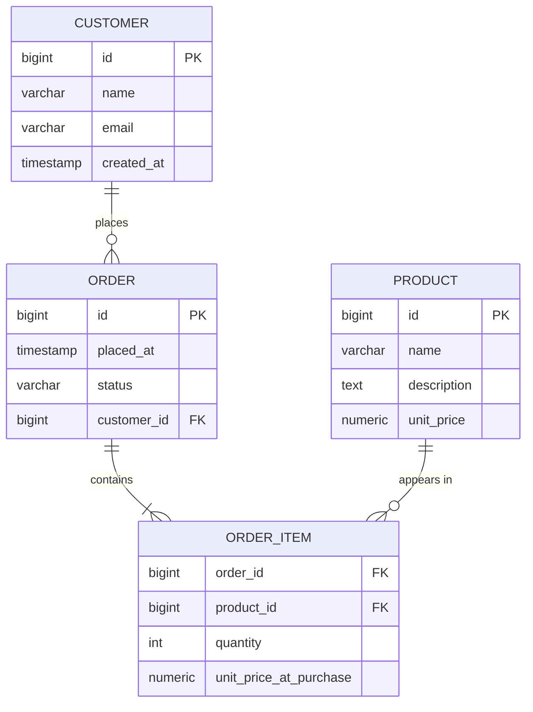

# [BEE-7001] Entity-Relationship Modeling

:::info
Model your domain before you model your tables. ER diagrams are a communication tool first, an implementation blueprint second.
:::

## Context

In 1976, Peter Chen published "The Entity-Relationship Model: Toward a Unified View of Data" in ACM Transactions on Database Systems ([Chen 1976](https://dl.acm.org/doi/10.1145/320434.320440)). His core insight was that a single conceptual model could bridge the gap between how humans think about a business domain and how machines store data. Nearly fifty years later, the ER model remains the standard language for communicating data structure across teams, regardless of the underlying storage technology.

The failure mode Chen was solving is still common: engineers jump straight from a business requirement to CREATE TABLE statements, skipping the step of explicitly modeling the domain. The resulting schema reflects how one developer happened to think about the problem on a given afternoon — not the shared understanding of product managers, domain experts, and engineers together.

Entity-relationship modeling is the discipline of capturing that shared understanding before any physical decisions are made.

:::tip Deep Dive
For database-level relationship implementation details, see [DEE-106: Relationships](https://alivedise.github.io/database-engineering-essentials/103).
:::

## Principle

**Model the domain in terms of entities, attributes, and relationships — then translate that model into a physical schema.**

The conceptual ER model is independent of technology. It does not contain primary keys, indexes, or storage engines. It answers the question: what things exist in this domain, what do we know about them, and how do they relate to each other?

Only after the conceptual model is agreed upon should you begin the physical design.


## Core Concepts

### Entities

An entity is a distinguishable thing about which the business cares enough to store information. In Chen's original definition, entities can be physical objects (a product, a warehouse), events (a purchase, a login), or concepts (an account, a subscription).

The test for whether something should be an entity: does it need a unique identity that persists over time and can be referenced from multiple places? If yes, it is an entity. If it is merely a description of something else, it is probably an attribute.

### Attributes

Attributes are properties that describe an entity or relationship. An `Order` entity has attributes like `placed_at` (timestamp), `status`, and `total_amount`. An attribute does not have an identity independent of its owning entity — you do not look up a `placed_at` by itself; you look up an `Order`.

The entity-vs-attribute decision matters: `email` is an attribute of `Customer` when every customer has exactly one email and you never need to model email addresses independently. It becomes a candidate for its own entity if customers can have multiple emails, or if email addresses have their own lifecycle (verified, bounced, primary, backup).

### Relationships

A relationship captures how entities associate. Following Chen, relationships are verbs: a Customer *places* an Order, an Order *contains* a Product, an Employee *reports to* a Manager.

Relationships have three properties that must be explicitly modeled:

**Cardinality** — how many instances of each entity participate:
- One-to-one (1:1): one entity instance relates to exactly one of the other
- One-to-many (1:N): one entity instance relates to many of the other
- Many-to-many (M:N): many instances on both sides

**Participation** — whether every instance must participate:
- Total (mandatory): every instance of the entity must appear in at least one relationship instance (double line in Chen notation)
- Partial (optional): some instances may not participate (single line)

**Identifying vs. non-identifying**: an identifying relationship means the child entity's existence depends on the parent — its primary key includes the parent's key. A non-identifying relationship means the child can exist independently.

### Weak Entities

A weak entity cannot be uniquely identified by its own attributes alone; it depends on a parent entity. An `OrderItem` line without its parent `Order` has no meaning. The weak entity's partial key (e.g., `line_number`) becomes meaningful only when combined with the parent's key. Weak entities are always in an identifying relationship with their owner.


## ER Diagrams as Communication Tools

Martin Fowler distinguishes domain models from ER diagrams on an important axis: a domain model captures *behavior and structure* together, while a traditional ER diagram is data-centric ([Fowler, Analysis Patterns](https://martinfowler.com/books/ap.html)). Both agree on a foundational point: the conceptual model must be built collaboratively with domain experts and must be legible to non-engineers.

An ER diagram drawn on a whiteboard during a product requirements session is more valuable than one reverse-engineered from a finished schema. Its purpose is to make implicit domain knowledge explicit and to surface disagreements early — before they are encoded in migrations.

Use ER diagrams to:
- Align product, engineering, and QA on what "entities" the system manages
- Identify M:N relationships early (they require junction tables that affect API shape)
- Decide the entity-vs-attribute boundary for contested concepts (is `Address` an attribute or an entity?)
- Document time-sensitive relationships ("when did this relationship exist?")


## Worked Example: E-Commerce Domain

### Step 1 — Business Requirement

> A customer can place many orders. Each order contains multiple products with a quantity and unit price per line. A product can appear in many orders.

### Step 2 — Identify Entities and Attributes

| Entity | Key Attributes |
|--------|----------------|
| Customer | id, name, email, created_at |
| Order | id, placed_at, status, customer_id |
| Product | id, name, description, unit_price |
| OrderItem | order_id, product_id, quantity, unit_price_at_purchase |

`OrderItem` is a weak entity (junction entity) that resolves the M:N between `Order` and `Product`. It also carries attributes *of the relationship itself* — the quantity and the price at the time of purchase. These cannot live on `Order` or `Product` alone.

### Step 3 — ER Diagram



Notation:
- `||--o{` : one (mandatory) to zero-or-many
- `||--|{` : one (mandatory) to one-or-many (an order must have at least one item)

### Step 4 — Translate to DDL

```sql
CREATE TABLE customers (
    id         BIGSERIAL PRIMARY KEY,
    name       VARCHAR(255) NOT NULL,
    email      VARCHAR(255) NOT NULL UNIQUE,
    created_at TIMESTAMPTZ  NOT NULL DEFAULT now()
);

CREATE TABLE orders (
    id          BIGSERIAL PRIMARY KEY,
    customer_id BIGINT      NOT NULL REFERENCES customers(id),
    placed_at   TIMESTAMPTZ NOT NULL DEFAULT now(),
    status      VARCHAR(50) NOT NULL DEFAULT 'pending'
);

CREATE TABLE products (
    id          BIGSERIAL PRIMARY KEY,
    name        VARCHAR(255)   NOT NULL,
    description TEXT,
    unit_price  NUMERIC(12, 2) NOT NULL
);

CREATE TABLE order_items (
    order_id              BIGINT         NOT NULL REFERENCES orders(id),
    product_id            BIGINT         NOT NULL REFERENCES products(id),
    quantity              INT            NOT NULL CHECK (quantity > 0),
    unit_price_at_purchase NUMERIC(12, 2) NOT NULL,
    PRIMARY KEY (order_id, product_id)
);
```

The translation is mechanical once the ER model is clear:
1. Each entity becomes a table.
2. 1:N relationships become a foreign key on the "many" side.
3. M:N relationships become a junction table whose composite PK is the two foreign keys plus any surrogate key if rows are not unique per pair.
4. Relationship attributes (quantity, unit_price_at_purchase) live on the junction table, not on either parent.


## Common Mistakes

### 1. Jumping to tables without modeling relationships first

The most common error. Developers open a SQL editor and start writing CREATE TABLE before drawing any diagram. The resulting schema tends to miss relationships entirely or model them inconsistently, because the M:N structure was never made explicit.

**Fix:** Sketch the ER diagram first, even informally. Identify all M:N relationships before writing any DDL.

### 2. Missing M:N relationships (no junction table)

A schema that has `orders.product_id` (a single FK) can only represent one product per order. The developer knew orders had multiple products but modeled it as 1:N by accident.

**Fix:** Any time you hear "an X can have many Ys, and a Y can belong to many Xs" in a business requirement, flag it immediately as M:N and plan a junction table.

### 3. Confusing entities with attributes — address as the canonical example

An `address` field stored as a single VARCHAR on `customers` is fine when addresses are immutable descriptions. It breaks when:
- A customer can have multiple addresses (billing, shipping, historical)
- Orders must record the shipping address *at the time of the order*, not the current address
- You need to query by city or country

In those cases, `Address` is an entity with its own table, and `Order` has a FK to the address snapshot used at purchase time.

**Fix:** Ask whether the concept needs its own identity, history, or multiple instances. If any answer is yes, make it an entity.

### 4. Not modeling time — when did this relationship exist?

A bare M:N junction table with `customer_id` and `product_id` cannot answer "which products was this customer subscribed to in Q3 2024?" Adding `valid_from` and `valid_to` (or `created_at` and `deleted_at`) to the junction table transforms it from a current-state snapshot into a temporal record.

**Fix:** For every relationship, ask whether historical state matters. If yes, add temporal columns to the junction or relationship table.

### 5. Over-modeling — every noun becomes an entity

The opposite failure: a `StatusEntity` table with one column and five rows instead of a simple `VARCHAR` with a CHECK constraint, or a `CountryEntity` table for a two-letter ISO code that never changes. Over-modeling creates join overhead with no semantic benefit.

**Fix:** Apply the identity test strictly. If the concept has no independent identity, no attributes beyond its name, and is never referenced from more than one place, keep it as an attribute or an enum.


## Related BEPs

- [BEE-5002: Domain-Driven Design](101.md) — Bounded contexts and aggregates shape which entities belong to the same model.
- [BEE-6001: SQL vs NoSQL](./120.md) — The ER model applies to relational databases; document stores require different modeling strategies.
- [BEE-7002: Normalization](./141.md) — After translating ER to tables, normalization rules refine the physical design.
- [BEE-7006: Polymorphism in Schema Design](./145.md) — When an entity has subtypes, ER modeling must decide between table-per-type, table-per-hierarchy, and other strategies.


## References

- Chen, P.P.S. (1976). [The Entity-Relationship Model — Toward a Unified View of Data.](https://dl.acm.org/doi/10.1145/320434.320440) *ACM Transactions on Database Systems*, 1(1), 9–36.
- Fowler, M. (1996). [Analysis Patterns: Reusable Object Models.](https://martinfowler.com/books/ap.html) Addison-Wesley.
- Fowler, M. [Domain Model.](https://martinfowler.com/eaaCatalog/domainModel.html) *Patterns of Enterprise Application Architecture* catalog.
- GeeksforGeeks. [Structural Constraints of Relationships in ER Model.](https://www.geeksforgeeks.org/dbms/structural-constraints-of-relationships-in-er-model/)
- Miro. [How to Represent Many-to-Many Relationships in ER Diagrams.](https://miro.com/diagramming/er-diagram-many-to-many-relationship/)
