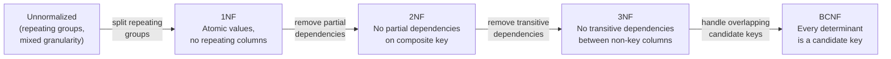

# [BEE-141] Normalization and Denormalization

:::tip Deep Dive
For database-level normalization theory and formal definitions, see [DEE-100: Normalization](https://alivedise.github.io/database-engineering-essentials/100).
:::

## Context

Every relational schema starts with a choice: how decomposed should the data be? Normalization eliminates redundancy and prevents anomalies by splitting data into focused tables. Denormalization intentionally reintroduces redundancy to reduce join cost at read time. Neither is universally correct — the right answer depends on your read/write ratio, query patterns, and tolerance for consistency overhead.

**References:**
- [Database Normalization: 1NF, 2NF, 3NF & BCNF Examples](https://www.digitalocean.com/community/tutorials/database-normalization) — DigitalOcean
- [Use The Index, Luke](https://use-the-index-luke.com/) — SQL indexing and performance guide for developers
- [Designing Data-Intensive Applications](https://dataintensive.net/) — Martin Kleppmann (DDIA), on derived data and denormalization tradeoffs

## Normal Forms Explained

### Normalization Progression



### First Normal Form (1NF)

Each column contains a single atomic value. No repeating column groups (e.g., `phone1`, `phone2`, `phone3`), no comma-separated lists stored in one field.

**Violation:** A `tags` column holding `"postgres,performance,indexing"` as a single string.

**Fix:** Move tags to a separate `article_tags(article_id, tag)` table, or use a proper array type if the database supports it and you never filter by individual tag.

### Second Normal Form (2NF)

Applies only when the primary key is composite. Every non-key column must depend on the *whole* key, not just part of it.

**Violation:** Table `order_items(order_id, product_id, product_name, quantity)`. `product_name` depends only on `product_id`, not on the full `(order_id, product_id)` key — a partial dependency.

**Fix:** Move `product_name` to a `products(product_id, product_name, ...)` table.

### Third Normal Form (3NF)

No non-key column may depend on another non-key column (transitive dependency).

**Violation:** Table `employees(emp_id, dept_id, dept_name)`. `dept_name` depends on `dept_id`, which in turn depends on `emp_id`. A change to a department name requires updating every employee row.

**Fix:** Extract `departments(dept_id, dept_name)` and reference it from `employees`.

### Boyce-Codd Normal Form (BCNF)

A stricter variant of 3NF: for every functional dependency `X → Y`, `X` must be a superkey. BCNF handles edge cases involving overlapping candidate keys that 3NF misses. In practice, **3NF is sufficient for most OLTP schemas**; pursuing BCNF or higher is rarely worth the complexity unless the problem is well-understood.

## Why Normalize First

Normalization delivers concrete engineering benefits:

- **Eliminates update anomalies.** A customer's email stored once cannot drift: there is no "which copy is correct?" problem.
- **Eliminates insertion anomalies.** You can add a product without needing a dummy order.
- **Eliminates deletion anomalies.** Deleting the last order for a customer does not silently delete the customer.
- **Reduces storage.** Repeated strings (city names, status labels) are stored once.
- **Simplifies writes.** Inserts and updates touch one row, not many.

The canonical example: an unnormalized `orders` table that embeds customer data.

```sql
-- Unnormalized: customer data duplicated in every order row
CREATE TABLE orders_bad (
    order_id      BIGINT PRIMARY KEY,
    customer_id   BIGINT,
    customer_name VARCHAR(100),   -- duplicated
    customer_email VARCHAR(100),  -- duplicated
    customer_city  VARCHAR(100),  -- duplicated
    ordered_at    TIMESTAMPTZ,
    total_cents   INT
);
```

If Alice changes her email, every one of her order rows must be updated. If one update fails, the data is inconsistent.

**Normalized:**

```sql
CREATE TABLE customers (
    customer_id   BIGINT PRIMARY KEY,
    name          VARCHAR(100) NOT NULL,
    email         VARCHAR(100) NOT NULL,
    city          VARCHAR(100)
);

CREATE TABLE orders (
    order_id     BIGINT PRIMARY KEY,
    customer_id  BIGINT NOT NULL REFERENCES customers(customer_id),
    ordered_at   TIMESTAMPTZ NOT NULL,
    total_cents  INT NOT NULL
);
```

Alice's email lives in exactly one row. Joins retrieve it on demand.

## When to Denormalize

Normalization optimizes for write correctness. Denormalization trades some of that correctness insurance for read performance. Consider it when:

1. **Joins are the bottleneck.** A query joins 6 tables to build a product listing page and profiling confirms the join cost dominates.
2. **Aggregates are expensive to recompute.** A dashboard counts all-time revenue per seller on every page load.
3. **Read volume vastly exceeds write volume.** A reporting database or analytics pipeline where data is written in bulk and queried thousands of times.
4. **Latency requirements are strict.** Real-time APIs where a 20ms join budget cannot be met through indexing alone.

**The rule:** normalize first, then measure, then denormalize the specific bottleneck. Denormalization before profiling is premature optimization.

## Denormalization Strategies

### Duplicate a Column

Copy a frequently read value from a parent table into a child table to avoid the join.

```sql
-- Denormalized: customer_name copied into orders for fast display
ALTER TABLE orders ADD COLUMN customer_name VARCHAR(100);
```

The join to `customers` is no longer needed for order list queries. The cost: when Alice changes her name, the application (or a trigger) must also update `orders.customer_name`.

**Document it.** Add a comment or migration note explaining why the column is duplicated and who is responsible for keeping it in sync.

### Materialized Views

Let the database maintain the denormalized copy automatically.

```sql
CREATE MATERIALIZED VIEW order_summaries AS
SELECT
    c.customer_id,
    c.name            AS customer_name,
    COUNT(o.order_id) AS order_count,
    SUM(o.total_cents) AS lifetime_value_cents
FROM customers c
JOIN orders o ON o.customer_id = c.customer_id
GROUP BY c.customer_id, c.name;

CREATE UNIQUE INDEX ON order_summaries(customer_id);
```

Refresh strategies:
- `REFRESH MATERIALIZED VIEW CONCURRENTLY order_summaries;` — refresh without blocking reads (PostgreSQL).
- Schedule refreshes via a background job or trigger-based incremental update.

Materialized views are a clean denormalization boundary: the normalized source tables remain authoritative; the view is an explicitly derived read cache.

### Summary Tables

Pre-aggregate data into a dedicated table updated on write.

```sql
CREATE TABLE seller_stats (
    seller_id       BIGINT PRIMARY KEY,
    total_orders    INT     NOT NULL DEFAULT 0,
    total_revenue_cents BIGINT NOT NULL DEFAULT 0,
    last_updated_at TIMESTAMPTZ NOT NULL
);
```

The application increments `total_orders` and `total_revenue_cents` atomically when an order is placed. Dashboard queries hit `seller_stats` directly instead of scanning the full orders table.

### CQRS Read Models

For complex read workloads, consider separating the write model (normalized) from the read model (denormalized and query-shaped). This is covered in depth in [BEE-102: CQRS](./102.md).

## The Consistency Cost

Every denormalization creates a synchronization problem. The duplicated data will go out of sync unless something maintains it. Your options:

| Mechanism | Consistency | Complexity | Notes |
|---|---|---|---|
| Application code | Eventual | Low–Medium | Error-prone if update path is missed |
| Database trigger | Near-real-time | Medium | Hard to test, couples schema to logic |
| Materialized view | Periodic or on-demand | Low | Clear contract, some staleness |
| Event-driven consumer | Eventual | High | Scales well, requires infrastructure |

Choose the simplest mechanism that meets your staleness tolerance. A dashboard showing yesterday's totals can use a nightly refresh; a checkout page showing inventory must be near-real-time.

## Worked Example: Order History Page

**Problem:** An order history page query takes 180ms because it joins `orders`, `customers`, `order_items`, `products`, and `shipping_addresses`.

**Step 1 — Profile first.** Confirm the join is actually the bottleneck, not a missing index. Add an index on `orders.customer_id` and measure again. Say it drops to 90ms, still too slow.

**Step 2 — Identify the minimal denormalization.** The page only needs `customer_name` and `shipping_city`; it does not need the full customer or address record.

**Step 3 — Add a denormalized column with a comment.**

```sql
ALTER TABLE orders
    ADD COLUMN shipping_snapshot JSONB;
-- Stores {customer_name, shipping_city} at time of order.
-- Intentionally denormalized: order history shows state at order time,
-- not current customer state. Updated only at order creation.
```

**Step 4 — Document the invariant.** The snapshot is set once at order creation and never updated. This is deliberate: order history should reflect what was true when the order was placed, not today's customer address.

This is actually *semantically correct* denormalization: historical records often *should* capture the state at the time of the event, not a live foreign-key reference.

## Related BEPs

- [BEE-102: CQRS](./102.md) — separate read models as a structured denormalization pattern
- [BEE-120: SQL vs NoSQL](./120.md) — when document databases are a natural fit for denormalized data
- [BEE-140: Entity-Relationship Modeling](./140.md) — how to identify entities before normalizing

## Common Mistakes

1. **Denormalizing before measuring.** Adding redundant columns because a query "feels slow" before profiling is premature optimization. Always measure first.

2. **Over-normalizing to 4NF or 5NF.** Higher normal forms address multi-valued dependencies and join dependencies that rarely appear in typical OLTP schemas. Normalizing beyond 3NF usually adds joins without delivering meaningful integrity benefits.

3. **Denormalized columns drifting out of sync.** The most common failure mode. The update path is added to one code branch but missed in another (e.g., an admin panel that bypasses the normal API). Mitigation: use database triggers or materialized views so the database enforces consistency, not the application.

4. **Not documenting the reason for denormalization.** Future maintainers who see a duplicated column without explanation will either treat it as a bug, delete it, or duplicate it further. Always leave a comment or migration note explaining the intent, the performance target it was meeting, and the synchronization mechanism.

5. **Treating normalization as all-or-nothing.** A schema can and should be normalized in some areas and denormalized in others. Normalize your core transactional tables; denormalize the read-optimized reporting tables. The boundary between them is the important design decision.

## Principle

**Normalize by default to 3NF. Denormalize deliberately, with measurement, documentation, and an explicit synchronization contract.**

Start with a normalized schema. Let query profiles tell you where the cost is. Apply the narrowest denormalization that solves the bottleneck. Document what was duplicated, why, and how it stays consistent. Treat denormalized data as derived data — it is always secondary to the normalized source of truth.
