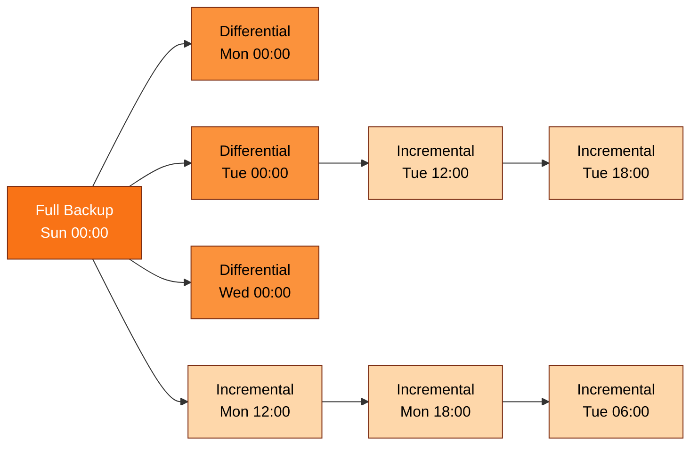

# [BEE-6009] Database Backup Strategies and Point-in-Time Recovery

:::info
Database backup strategy resolves into two operator-facing numbers: how much data the business will tolerate losing (RPO) and how long it will wait for restore to finish (RTO), as defined by the AWS Well-Architected Reliability Pillar (2026). PostgreSQL and MySQL converge on the same architecture for hitting tight RPOs — a periodic base or full backup plus a continuous log stream (PostgreSQL WAL, MySQL binary log) that can be replayed forward to a chosen target. This article covers the three PostgreSQL backup approaches, how `pg_basebackup` and `mysqlbinlog` cooperate to land Point-in-Time Recovery on a wall-clock target, what the full/differential/incremental chain costs at restore time, and why a passing `pg_verifybackup` check is necessary but does not constitute a tested restore.
:::

## Context

PostgreSQL maintains a write-ahead log in `pg_wal/` that "records every change made to the database's data files," per the PostgreSQL 18 Documentation on continuous archiving. That log is the substrate that lets a base backup plus archived WAL be replayed forward to a target time, which is the essence of Point-in-Time Recovery (PITR).

The PostgreSQL 18 Documentation enumerates "three fundamentally different approaches to backing up PostgreSQL data: SQL dump; File system level backup; Continuous archiving." Each maps to different recovery semantics. A logical dump produced by `pg_dump` is portable across PostgreSQL versions and CPU architectures, including 32-bit to 64-bit transitions, and is the only method that survives a major-version upgrade or a cross-architecture move (PostgreSQL 18 Documentation, "25.1. SQL Dump"). It also cannot be played forward to an arbitrary point in time. A file-system-level backup is server-version-specific and demands consistency. Continuous archiving is the approach that supports PITR.

MySQL exposes the same pattern under different names. The MySQL 8.4 Reference Manual describes Point-in-Time Recovery as "recovery of data changes up to a given point in time. Typically, this type of recovery is performed after restoring a full backup that brings the server to its state as of the time the backup was made... Point-in-time recovery then brings the server up to date incrementally from the time of the full backup to a more recent time." The full backup is taken with a hot-backup tool such as Percona XtraBackup, which Percona LLC describes as "the world's only open-source, free MySQL hot backup software that performs non-blocking backups for InnoDB and XtraDB databases." Binary logs replace WAL as the forward-replay log.

The reason both engines invest in this architecture is the contract with the business. The AWS Well-Architected Reliability Pillar defines RTO as "the maximum acceptable delay between the interruption of service and restoration of service" and RPO as "the maximum acceptable amount of time since the last data recovery point." Every choice downstream — base-backup cadence, archive cadence, repository encryption, restore drill frequency — is calibrated against those two numbers.

## Visual

The full / differential / incremental backup chain governs both restore time and storage cost. Per the pgBackRest User Guide: a full backup copies the entire cluster, a differential copies "only those database cluster files that have changed since the last full backup," and an incremental copies "only those database cluster files that have changed since the last backup" of any kind. Differentials always point at the last full; incrementals form a chain back to whichever backup most recently preceded them.

Restoring to a point covered by `I5` requires `F1 + D2 + I4 + I5`. Restoring from `I3` requires `F1 + I1 + I2 + I3`. The chain length is the operator-visible cost of choosing incremental over differential.

## Example

Walk through a realistic PITR scenario on PostgreSQL: at 14:32 a junior operator runs `DELETE FROM orders WHERE created_at < '2026-05-01';` without a `WHERE id IN (...)` filter, wiping six months of history. The team needs to restore to 14:31:59.

Step 1: take or locate a base backup. `pg_basebackup` is the canonical online backup tool. The PostgreSQL 18 Documentation notes that it "is used to take a base backup of a running PostgreSQL database cluster. The backup is taken without affecting other clients of the database, and can be used both for point-in-time recovery (see Section 25.3) and as the starting point for a log-shipping or streaming-replication standby server." By default it streams WAL alongside the data files, so the resulting directory is a self-contained recovery starting point. Assume the most recent base backup ran at Sunday 00:00.

Step 2: pick the recovery target. Per the PostgreSQL 18 Documentation, "If you want to recover to some previous point in time (say, right before the junior DBA dropped your main transaction table), just specify the required stopping point. You can specify the stop point, known as the 'recovery target', either by date/time, named restore point or by completion of a specific transaction ID." The operator sets `recovery_target_time = '2026-05-07 14:31:59 UTC'`.

Step 3: replay forward. PostgreSQL applies WAL from the start of the base backup, stopping at the target. The same operation on MySQL uses `mysqlbinlog` over binary logs after restoring an XtraBackup full backup. The MySQL 8.4 Reference Manual gives the operator-facing form directly: `mysqlbinlog --start-datetime="2005-12-25 11:25:56" binlog.000003`, with `--start-datetime` reading "the first event having a timestamp equal to or later than the datetime argument" and `--stop-datetime` providing the symmetric upper bound. "This option is useful for point-in-time recovery."

Step 4: the restored cluster comes up containing every transaction that committed before 14:31:59 and none that committed after. The bad `DELETE` is gone. Sessions that had been mid-transaction at the cut have been rolled back as part of crash recovery on the WAL stream.

The symmetry is direct. PostgreSQL `pg_basebackup` plus archived WAL maps onto MySQL Percona XtraBackup plus binary log replay. The recovery-target knobs differ in name. The mental model is identical.

## Best Practices

- **MUST** keep a continuous, gap-free WAL or binlog archive that extends back at least to the start of the oldest base backup you intend to restore from. Per the PostgreSQL 18 Documentation, "to recover successfully using continuous archiving (also called 'online backup' by many database vendors), you need a continuous sequence of archived WAL files that extends back at least as far as the start time of your backup." A single missing segment breaks PITR even when the base backup is intact.
- **MUST** wire the `archive_command` exit code correctly and monitor archiver lag. The PostgreSQL 18 Documentation is explicit: "It is important that the archive command return zero exit status if and only if it succeeds. Upon getting a zero result, PostgreSQL will assume that the file has been successfully archived, and will remove or recycle it. However, a nonzero status tells PostgreSQL that the file was not archived; it will try again periodically until it succeeds." A script that returns zero on a silent S3 upload failure causes the server to recycle WAL that never made it to archive.
- **MUST NOT** `tar` `$PGDATA` while the server is running unless the underlying file system gives an atomic snapshot. The PostgreSQL 18 Documentation warns that "the database server must be shut down in order to get a usable backup. Half-way measures such as disallowing all connections will not work (in part because tar and similar tools do not take an atomic snapshot of the state of the file system, but also because of internal buffering within the server)." Use `pg_basebackup` or a snapshot-capable file system instead.
- **SHOULD** encrypt backup repositories client-side rather than relying on storage-side encryption alone. The pgBackRest Configuration Reference notes that pgBackRest supports `aes-256-cbc` and that "encryption is always performed client-side even if the repository type (e.g. S3) supports encryption." A leaked S3 bucket should not equal a leaked database; client-side encryption enforces that property.
- **SHOULD** prefer `pg_dump` for cross-version or cross-architecture moves and continuous archiving for production PITR. Per the PostgreSQL 18 Documentation, "pg_dump's output can generally be re-loaded into newer versions of PostgreSQL, whereas file-level backups and continuous archiving are both extremely server-version-specific." Use the right tool for the migration class.
- **SHOULD** size base-backup interval against your RTO budget rather than your storage budget alone. The PostgreSQL 18 Documentation states: "Since you have to keep around all the archived WAL files back to your last base backup, the interval between base backups should usually be chosen based on how much storage you want to expend on archived WAL files." Longer intervals mean more retained WAL and longer replay during PITR; the cadence is set by how long you can wait for restore.
- **MAY** layer differential and incremental backups underneath full backups when storage cost dominates. The pgBackRest User Guide defines the three modes; chains of incrementals reduce nightly bytes shipped at the cost of restore-time chain length, as the Visual section illustrates.

## Restore Drill Playbook

Backup verification tools catch storage corruption and missing files. They do not catch logical incompatibilities, missing extensions, missing tablespaces, or operator process gaps. The PostgreSQL 18 Documentation on `pg_verifybackup` says this directly: "It is important to note that the validation which is performed by pg_verifybackup does not and cannot include every check which will be performed by a running server when attempting to make use of the backup. Even if you use this tool, you should still perform test restores and verify that the resulting databases work as expected and that they appear to contain the correct data."

Treat `pg_verifybackup` as the cheap continuous gate and a real restore against a sandbox cluster as the periodic acceptance test. A workable cadence:

1. **Continuous, per backup:** run `pg_verifybackup` against every freshly produced base backup. Fail the pipeline on any non-zero exit.
2. **Weekly:** restore the most recent full backup plus a differential plus the latest WAL/binlog segments to a sandbox cluster. Run smoke queries that cover the largest tables and any extension-backed objects (PostGIS, pgvector, partitioning extensions). Time the restore end-to-end and record the number against your RTO.
3. **Quarterly:** rehearse a full PITR to a chosen wall-clock target. Use a target inside the WAL retention window but at least 24 hours stale to exercise log replay. Confirm that the chosen recovery target lands on the expected post-recovery row counts.
4. **On schema migration:** re-run the weekly drill on the post-migration schema before declaring the migration complete. Migrations that add tablespaces, extensions, or large indexes change restore-time characteristics.

The base-backup interval is the operator's RTO knob. The PostgreSQL 18 Documentation makes the trade-off explicit: longer intervals retain more WAL and lengthen replay; shorter intervals shorten replay at the cost of more frequent base-backup I/O and storage. Set the interval so that the worst-case restore — most stale base backup plus longest WAL replay — fits inside the RTO declared to the business.

A drill that is rehearsed once and never repeated is worse than no drill, because it grants false confidence. Bake the drill cadence into the on-call rotation so that every operator has restored at least once before they are paged at 03:00 to do it for real.

## Related Topics

- [Replication Strategies](/en/data-storage/replication-strategies)
- [Database Migrations](/en/data-storage/database-migrations)
- [Storage Engines](/en/data-storage/storage-engines)
- [Write-Ahead Logging](/en/distributed-systems/write-ahead-logging)
- [Audit Logging Architecture](/en/distributed-systems/audit-logging-architecture)

## References

- PostgreSQL Global Development Group, "Chapter 25. Backup and Restore," PostgreSQL 18 Documentation (2026). https://www.postgresql.org/docs/current/backup.html
- PostgreSQL Global Development Group, "25.1. SQL Dump," PostgreSQL 18 Documentation (2026). https://www.postgresql.org/docs/current/backup-dump.html
- PostgreSQL Global Development Group, "25.2. File System Level Backup," PostgreSQL 18 Documentation (2026). https://www.postgresql.org/docs/current/backup-file.html
- PostgreSQL Global Development Group, "25.3. Continuous Archiving and Point-in-Time Recovery (PITR)," PostgreSQL 18 Documentation (2026). https://www.postgresql.org/docs/current/continuous-archiving.html
- PostgreSQL Global Development Group, "pg_basebackup," PostgreSQL 18 Documentation (2026). https://www.postgresql.org/docs/current/app-pgbasebackup.html
- PostgreSQL Global Development Group, "pg_verifybackup," PostgreSQL 18 Documentation (2026). https://www.postgresql.org/docs/current/app-pgverifybackup.html
- Crunchy Data / pgBackRest project, "pgBackRest User Guide" (2026). https://pgbackrest.org/user-guide.html
- Crunchy Data / pgBackRest project, "pgBackRest Configuration Reference" (2026). https://pgbackrest.org/configuration.html
- Oracle Corporation, "9.5 Point-in-Time (Incremental) Recovery," MySQL 8.4 Reference Manual (2026). https://dev.mysql.com/doc/refman/8.4/en/point-in-time-recovery.html
- Oracle Corporation, "6.6.9 mysqlbinlog — Utility for Processing Binary Log Files," MySQL 8.4 Reference Manual (2026). https://dev.mysql.com/doc/refman/8.4/en/mysqlbinlog.html
- Percona LLC, "About Percona XtraBackup," Percona XtraBackup Documentation (2026). https://docs.percona.com/percona-xtrabackup/2.4/intro.html
- Amazon Web Services, "Disaster Recovery (DR) objectives," AWS Well-Architected Framework — Reliability Pillar (2026). https://docs.aws.amazon.com/wellarchitected/latest/reliability-pillar/disaster-recovery-dr-objectives.html
