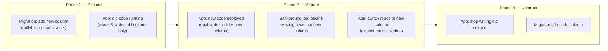

# [BEE-126] Database Migrations

:::info
Schema evolution without downtime and backward-compatible changes.
:::

## Context

Every production system evolves. Business requirements change, data models need correction, and performance problems demand structural fixes. A **database migration** is a versioned, repeatable change to a database schema or its data. Migrations are the controlled mechanism by which a live database moves from one state to another.

The challenge is that databases are shared, stateful infrastructure. Unlike application code — which can be swapped out during a deployment — the schema and data must be transformed while the system is running, with old and new application code potentially reading and writing simultaneously.

Done carelessly, a migration can lock tables for minutes, corrupt data, or crash running services. Done well, migrations are invisible to end users.

**Key references:**

- [Stripe: Online migrations at scale](https://stripe.com/blog/online-migrations) — Stripe's four-phase dual-write approach for migrating live data stores without downtime
- [Prisma Data Guide: Expand and Contract Pattern](https://www.prisma.io/dataguide/types/relational/expand-and-contract-pattern) — canonical description of the expand-contract technique
- [Martin Fowler: Parallel Change (bliki)](https://martinfowler.com/bliki/ParallelChange.html) — the underlying interface-change pattern that expand-contract is based on

## Principle

> Treat schema changes as backward-compatible, incremental steps. Every migration must leave the database in a state that both the old and new version of the application can use safely.

## Migration Tools and Version Tracking

Migration tools (Flyway, Liquibase, golang-migrate, Alembic, Rails Active Record migrations, etc.) solve two problems:

1. **Ordering** — migrations run in a deterministic sequence, usually by timestamp or sequential integer.
2. **Tracking** — a `schema_migrations` (or equivalent) table records which migrations have been applied, so the tool never runs the same migration twice.

Each migration has two halves:

| Direction | Purpose |
|-----------|---------|
| **up** | Apply the change (e.g., `ALTER TABLE ... ADD COLUMN`) |
| **down** | Revert the change (e.g., `ALTER TABLE ... DROP COLUMN`) |

The `down` migration is your emergency exit. Always write it, even if you never expect to use it.

:::tip Deep Dive
For database-level schema evolution patterns and backward compatibility, see [DEE Schema Evolution series](https://alivedise.github.io/database-engineering-essentials/300).
:::

## Safe vs. Dangerous Operations

Not all schema changes carry the same risk. The table below summarizes common operations:

| Operation | Risk | Notes |
|-----------|------|-------|
| Add nullable column | Low | Old code ignores it; new code can write to it |
| Add column with default | Medium | PostgreSQL 11+ handles this efficiently; older versions rewrite the table |
| Add index `CONCURRENTLY` | Low | Does not lock the table for reads/writes |
| Add index (standard) | High | Acquires `ShareLock`, blocks writes on large tables |
| Rename column | High | Old code breaks immediately — use expand-contract instead |
| Drop column | High | Old code referencing the column breaks |
| Add `NOT NULL` constraint without default | High | Requires full table scan and lock |
| Change column type | High | May require rewrite of every row |
| Drop table | Irreversible | Old code breaks immediately |

### Creating Indexes Safely (PostgreSQL example)

```sql
-- UNSAFE: locks the table during index build
CREATE INDEX idx_orders_user_id ON orders(user_id);

-- SAFE: does not block reads or writes
CREATE INDEX CONCURRENTLY idx_orders_user_id ON orders(user_id);
```

`CONCURRENTLY` takes longer, but it is the only safe option on a large production table.

## Zero-Downtime Migrations: The Expand-Contract Pattern

The **expand-contract pattern** (also called *parallel change*) breaks any breaking schema change into three separate deployment phases, ensuring that at every point both the old and new application code can operate against the schema.



At the boundary between Phase 1 and Phase 2, you deploy new application code. The schema already has both columns, so old instances (still running during the rolling deploy) continue to work. At the boundary between Phase 2 and Phase 3, you are certain no running code reads the old column, so dropping it is safe.

## Worked Example: Renaming a Column Safely

**Goal:** rename `users.full_name` → `users.display_name`

### Step 1 — Expand: add the new column

```sql
-- Migration: add_display_name_to_users (up)
ALTER TABLE users ADD COLUMN display_name VARCHAR(255);

-- down
ALTER TABLE users DROP COLUMN display_name;
```

Old code keeps reading and writing `full_name`. New column is `NULL` for existing rows.

### Step 2 — Deploy: dual-write in application code

```python
# New application code writes to both columns
def update_user_name(user_id, name):
    db.execute(
        "UPDATE users SET full_name = %s, display_name = %s WHERE id = %s",
        (name, name, user_id)
    )
```

### Step 3 — Backfill: populate the new column for existing rows

```sql
-- Run as a separate data migration, NOT inside the schema migration transaction
-- Process in batches to avoid long-running locks
UPDATE users
SET display_name = full_name
WHERE display_name IS NULL
  AND id BETWEEN :start_id AND :end_id;
```

After backfill is complete, add the `NOT NULL` constraint:

```sql
ALTER TABLE users ALTER COLUMN display_name SET NOT NULL;
```

### Step 4 — Switch reads to the new column

Deploy a new version that reads `display_name` but still writes both columns. Monitor for errors.

### Step 5 — Contract: stop writing the old column

Deploy application code that writes only `display_name`. At this point `full_name` receives no new data.

### Step 6 — Contract: drop the old column

```sql
-- Migration: drop_full_name_from_users (up)
ALTER TABLE users DROP COLUMN full_name;

-- down (data is gone; this is a point of no return)
ALTER TABLE users ADD COLUMN full_name VARCHAR(255);
```

This six-step process spans multiple deployments and potentially days of operation. That is the cost of zero-downtime migration. The reward is that at no point does any running code encounter a missing column.

## Data Migrations vs. Schema Migrations

Schema migrations and data migrations are different in character and must be kept separate:

| | Schema Migration | Data Migration |
|--|----------------|---------------|
| What changes | Table structure (columns, indexes, constraints) | Row data |
| Transaction scope | Short DDL statement | Potentially millions of rows |
| Run inside migration file? | Yes | **No** — run as a separate job |
| Rollback | Drop the added object | May require reverse data transformation |

Running a large data migration inside a schema migration transaction is a common mistake. The transaction holds locks for the duration. On a large table, that can be minutes or hours, causing cascading failures across the application.

**Rule:** backfills and data transformations run as background jobs with explicit batching, not inside `BEGIN ... COMMIT` blocks in migration files.

## Migration Ordering in CI/CD

A safe migration pipeline for a rolling-deploy environment follows this sequence:

```
1. Pre-deploy migrations   (expand: add columns, add indexes CONCURRENTLY)
      ↓
2. Deploy new application code (rolling, instances of old + new run simultaneously)
      ↓
3. Verify deployment health
      ↓
4. Post-deploy migrations  (contract: drop old columns, remove old constraints)
```

Pre-deploy migrations must be backward-compatible — old code must still work after they run. Post-deploy migrations run only after the new code is fully live and verified.

## Common Mistakes

### 1. Renaming a column in one step

```sql
-- WRONG: this breaks any running code that references old_column_name
ALTER TABLE orders RENAME COLUMN status TO order_status;
```

Use expand-contract instead. Six steps, multiple deploys, zero downtime.

### 2. Adding a NOT NULL column without a default

```sql
-- WRONG on a large table: acquires an exclusive lock and rewrites every row
ALTER TABLE payments ADD COLUMN processed_at TIMESTAMP NOT NULL;
```

Correct approach: add the column as nullable first, backfill, then add the constraint.

### 3. Running data migration inside a schema migration transaction

```python
# WRONG
def up():
    op.add_column('orders', sa.Column('new_status', sa.String))
    # This UPDATE runs inside the same transaction as the DDL above
    op.execute("UPDATE orders SET new_status = status")  # millions of rows
```

The lock held during the DDL is now held for the duration of the UPDATE.

### 4. No rollback plan for irreversible operations

Dropping a column destroys data. Once the `down` migration runs, the data is gone unless you have a backup. Always:

- Take a snapshot before destructive migrations.
- Make `DROP` migrations a separate deployment step after a waiting period.
- Keep the contract phase behind a feature flag until you are confident.

### 5. Not testing migrations against production-size data

A migration that runs in 50 ms on a development database with 500 rows may take 45 minutes on a production table with 200 million rows. Always:

- Test against a recent anonymized copy of production data.
- Measure lock duration, not just total runtime.
- Use `EXPLAIN ANALYZE` to confirm index usage before and after.

## Related BEPs

- **[BEE-104] Strangler Fig** — the same incremental, parallel-operation philosophy applied to service decomposition; expand-contract is its database equivalent.
- **[BEE-142] Schema Evolution** — deeper treatment of schema versioning contracts between services.
- **[BEE-361] Deployment Strategies** — rolling deploys, blue-green, and canary patterns that interact with migration sequencing.
