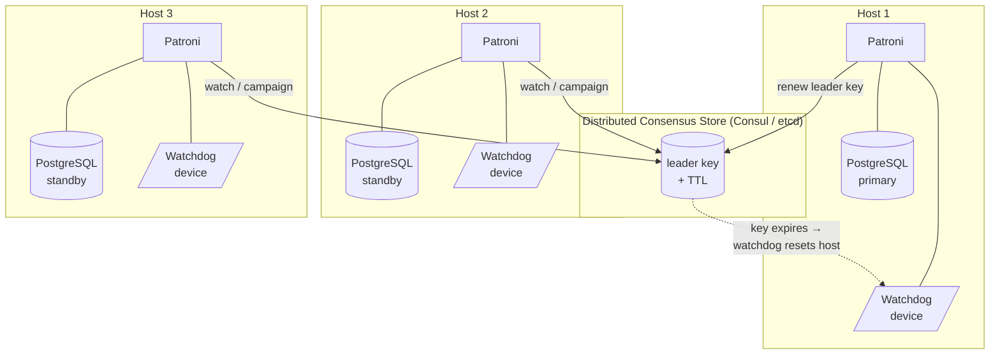

# [BEE-6012] Hot Standby, Failover, and Switchover Operations

:::info
A hot standby is a PostgreSQL replica that accepts read-only queries while it is still applying WAL from a primary, and turning that standby into the new primary is the operational core of every replica-promotion event. Operators face two distinct flows for triggering that promotion: a planned switchover on a healthy cluster, and an unplanned failover after the primary has already failed. This article walks through the mechanical primitives PostgreSQL exposes (`pg_promote`, `pg_rewind`), the orchestration layer that wraps them (Patroni, repmgr, GitLab's PgBouncer cutover), and the constraints operators must respect to avoid split-brain, data loss, and pinned WAL after the topology changes.
:::

## Context

The PostgreSQL Documentation defines hot standby as the mode in which the server accepts read-only queries while it is in archive recovery or standby mode, and it frames hot standby as useful both for replication and for restoring a backup to a desired state with great precision (PostgreSQL Documentation, "Hot Standby"). Hot standby is therefore the substrate that makes both read-offload and replica-promotion possible from the same physical replica.

Failover is the response to primary failure. Once failover to the standby occurs, there is only a single server in operation, which the PostgreSQL Documentation calls a degenerate state: the former standby is now the primary, the former primary is down and might stay down, and the cluster has lost its redundancy until a new standby is rebuilt (PostgreSQL Documentation, "Failover"). The operational implication is that a failover event ends when the cluster is back to N replicas.

Replication topology determines the data-loss envelope of that promotion. PostgreSQL streaming replication is asynchronous by default, and if the primary crashes some transactions that were committed may not have reached the standby, causing data loss. Synchronous replication eliminates that window by requiring each commit of a write transaction to wait until confirmation that the commit has been written to the WAL on disk of both the primary and the standby (PostgreSQL Documentation, "Log-Shipping Standby Servers"). Operators choosing a replication mode are choosing an RPO at the same time.

Read-offload onto a hot standby has its own failure mode that is independent of promotion. The PostgreSQL Documentation specifies that the cancel mechanism has two parameters, `max_standby_archive_delay` and `max_standby_streaming_delay`, that define the maximum allowed delay in WAL application; conflicting queries will be canceled once it has taken longer than the relevant delay setting to apply any newly-received WAL data (PostgreSQL Documentation, "Hot Standby"). Tuning those knobs is the read-offload tradeoff: raise them and replay falls behind, lower them and long analytical queries on the standby get canceled.

## Visual

Patroni stores cluster state and elects a leader through a distributed consensus store (DCS) such as etcd, Consul, ZooKeeper, or Kubernetes. GitLab Documentation states plainly that Patroni heavily relies on Consul to store the state of the cluster and elect a leader, so leader election is a property of the DCS rather than of PostgreSQL itself (GitLab Documentation, "Configure PostgreSQL replication and failover"). The watchdog device sits below Patroni on each host and resets the host if the leader key cannot be kept alive (Patroni Documentation, "Watchdog support").

## Example

The mechanical core of every promotion event is small. The PostgreSQL Documentation states that standby mode is exited and the server switches to normal operation when `pg_ctl promote` is run, or `pg_promote()` is called (PostgreSQL Documentation, "Log-Shipping Standby Servers"). Every higher-level tool ultimately calls one of these.

For a planned role swap, repmgr exposes the operation as a single command. The repmgr Documentation describes the use case as: "in some cases however it's desirable to promote the standby in a planned way, e.g. so maintenance can be performed on the primary; this kind of switchover is supported by the `repmgr standby switchover` command" (repmgr Documentation, "Performing a Switchover with repmgr"). The command sequences a clean shutdown of the current primary, promotion of the chosen standby, and reconfiguration of the remaining nodes to follow the new primary.

Promotion alone does not move client traffic. The GitLab reference architecture solves the client-cutover problem by having Consul watch the Patroni leader key: GitLab Documentation states that "if that status changes, Consul runs a script which updates the PgBouncer configuration to point to the new PostgreSQL leader node and reloads the PgBouncer service" (GitLab Documentation, "Configure PostgreSQL replication and failover"). The DCS leader-key change is the trigger; the PgBouncer reload is the data-plane effect that makes the cutover visible to applications.

## Best Practices

- **MUST** provide a fencing mechanism that guarantees a returning former primary cannot accept writes. The PostgreSQL Documentation requires that "if the primary server fails and the standby server becomes the new primary, and then the old primary restarts, you must have a mechanism for informing the old primary that it is no longer the primary," referring to STONITH (Shoot The Other Node In The Head) and warning that without it both systems can think they are the primary, leading to data loss (PostgreSQL Documentation, "Failover").
- **MUST** configure a watchdog device when running Patroni, because Patroni needs to ensure PostgreSQL will not accept any transaction commits after the leader key expires in the DCS, and the watchdog resets the whole system when it does not get a keepalive heartbeat within a specified timeframe (Patroni Documentation, "Watchdog support"). The watchdog is the software-fencing layer that converts a DCS partition into a host reset before split-brain can manifest.
- **MUST** quiesce the current primary before a planned switchover. The repmgr Documentation states: "you should be sure that the current primary can be shut down quickly and cleanly. In particular, access from applications should be minimalized or preferably blocked completely. Also be aware that if there is a backlog of files waiting to be archived, PostgreSQL will not shut down until archiving completes" (repmgr Documentation, "Performing a Switchover with repmgr"). An archive backlog will turn a "30-second maintenance window" into an unbounded one.
- **MUST** drop replication slots that no longer have a consumer, or bound them with `max_slot_wal_keep_size`. The PostgreSQL Documentation warns that "replication slots can cause the server to retain so many WAL segments that they fill up the space allocated for `pg_wal`" and that `max_slot_wal_keep_size` can be used to limit the size of WAL files retained by replication slots (PostgreSQL Documentation, "Log-Shipping Standby Servers").
- **MUST** treat a removed standby as also requiring slot cleanup on the primary, because the PostgreSQL Documentation states that unused slots "will prevent removal of required resources even when there is no connection using them… in extreme cases this could cause the database to shut down to prevent transaction ID wraparound… so if a slot is no longer required it should be dropped" (PostgreSQL Documentation, "Logical Decoding Concepts"). Slot hygiene is operator hygiene after every topology change.
- **SHOULD** prefer synchronous replication when the application's RPO is zero. Synchronous replication eliminates the failover-window data-loss risk of asynchronous streaming, accepting that each commit waits for the standby's WAL durability (PostgreSQL Documentation, "Log-Shipping Standby Servers").
- **SHOULD** automate client cutover at the connection-pooler layer, following the GitLab reference pattern of Consul-watching the leader key and reloading PgBouncer (GitLab Documentation, "Configure PostgreSQL replication and failover").

## Switchover vs Failover Decision Matrix

Patroni encodes the operational distinction directly into its REST API. The Patroni Documentation specifies that the `/switchover` endpoint only works when the cluster is healthy (there is a leader), while the `/failover` endpoint can be used to perform a manual failover when there are no healthy nodes (Patroni Documentation, "REST API"). repmgr draws the same line by exposing `repmgr standby switchover` as a planned operation distinct from the unplanned-failure path handled by repmgrd (repmgr Documentation, "Performing a Switchover with repmgr").

| Dimension | Switchover | Failover |
| --- | --- | --- |
| Precondition | Healthy cluster, current leader reachable (Patroni `/switchover`). | Cluster is unhealthy, primary is unreachable or failed (Patroni `/failover`). |
| Trigger | Operator command during a maintenance window (`repmgr standby switchover`, Patroni `/switchover`). | Loss of primary detected; operator or orchestrator initiates emergency promotion. |
| Candidate selection | Operator-chosen target standby; current primary is shut down cleanly first. | Patroni `/failover` requires an explicit candidate; orchestrator picks the most-current standby. |
| Expected duration | Bounded by clean shutdown + WAL archive drain + promotion. | Bounded by leader-key expiry + promotion; longer if fencing is needed. |
| Data-loss expectation | Zero — primary is quiesced before role swap. | Up to the unreplicated-WAL window for asynchronous replication; zero for synchronous (PostgreSQL Documentation, "Log-Shipping Standby Servers"). |
| Cluster state after | Symmetric topology, same N nodes, roles swapped. | Degenerate single-server state until a new standby is rebuilt (PostgreSQL Documentation, "Failover"). |
| Ops mode | Planned, scheduled, reversible. | Unplanned, time-pressured, may require pg_rewind to re-attach the former primary. |

## Re-attaching a Former Primary with pg_rewind

After an unplanned failover, the former primary often holds WAL on a timeline that has diverged from the new primary's. Taking a fresh base backup of a multi-terabyte cluster is expensive, so PostgreSQL ships a tool that rewinds the divergent server in place. The PostgreSQL Documentation describes pg_rewind as "a tool for synchronizing a PostgreSQL cluster with another copy of the same cluster, after the clusters' timelines have diverged… A typical scenario is to bring an old primary server back online after failover as a standby that follows the new primary" (PostgreSQL Documentation, "pg_rewind").

pg_rewind has a hard prerequisite that must be satisfied at cluster initialization or in `postgresql.conf` before the divergence happens. The PostgreSQL Documentation states: "pg_rewind requires that the target server either has the `wal_log_hints` option enabled in `postgresql.conf` or data checksums enabled when the cluster was initialized with `initdb` (the default)" (PostgreSQL Documentation, "pg_rewind"). A cluster initialized without checksums and running without `wal_log_hints` cannot use pg_rewind retroactively after a failover; the only path back is a full base backup. Operators who want a recoverable post-failover topology MUST set one of these two flags before they need them.

The correctness model is that pg_rewind copies blocks from the source (the new primary) over blocks on the target (the former primary) only for blocks that changed on the divergent timeline, then replays WAL from the divergence point forward on the new timeline. The target then starts as a standby of the source. This is the operational complement of failover: failover restores availability, pg_rewind restores redundancy without a full re-image.

## Related Topics

- [Replication Strategies](/data-storage/replication-strategies)
- [Database Backup Strategies and Point-in-Time Recovery](/data-storage/database-backup-strategies-and-point-in-time-recovery)
- [Durability, fsync, and the Crash-Safety Contract](/data-storage/durability-fsync-and-the-crash-safety-contract)
- [VACUUM, Bloat, and Transaction ID Wraparound](/data-storage/vacuum-bloat-and-transaction-id-wraparound)
- [Distributed Locking](/distributed-systems/distributed-locking)
- [Service Discovery](/distributed-systems/service-discovery)

## References

- PostgreSQL Global Development Group, "Hot Standby," PostgreSQL Documentation (current). https://www.postgresql.org/docs/current/hot-standby.html
- PostgreSQL Global Development Group, "Log-Shipping Standby Servers," PostgreSQL Documentation (current). https://www.postgresql.org/docs/current/warm-standby.html
- PostgreSQL Global Development Group, "Failover," PostgreSQL Documentation (current). https://www.postgresql.org/docs/current/warm-standby-failover.html
- PostgreSQL Global Development Group, "pg_rewind," PostgreSQL Documentation (current). https://www.postgresql.org/docs/current/app-pgrewind.html
- PostgreSQL Global Development Group, "Logical Decoding Concepts," PostgreSQL Documentation (current). https://www.postgresql.org/docs/current/logicaldecoding-explanation.html
- Patroni Authors, "REST API," Patroni Documentation (current). https://patroni.readthedocs.io/en/latest/rest_api.html
- Patroni Authors, "Watchdog support," Patroni Documentation (current). https://patroni.readthedocs.io/en/latest/watchdog.html
- 2ndQuadrant / EnterpriseDB, "Performing a Switchover with repmgr," repmgr Documentation (current). https://repmgr.org/docs/current/performing-switchover.html
- GitLab Inc., "Configure PostgreSQL replication and failover for Linux package installations," GitLab Documentation (current). https://docs.gitlab.com/administration/postgresql/replication_and_failover/
