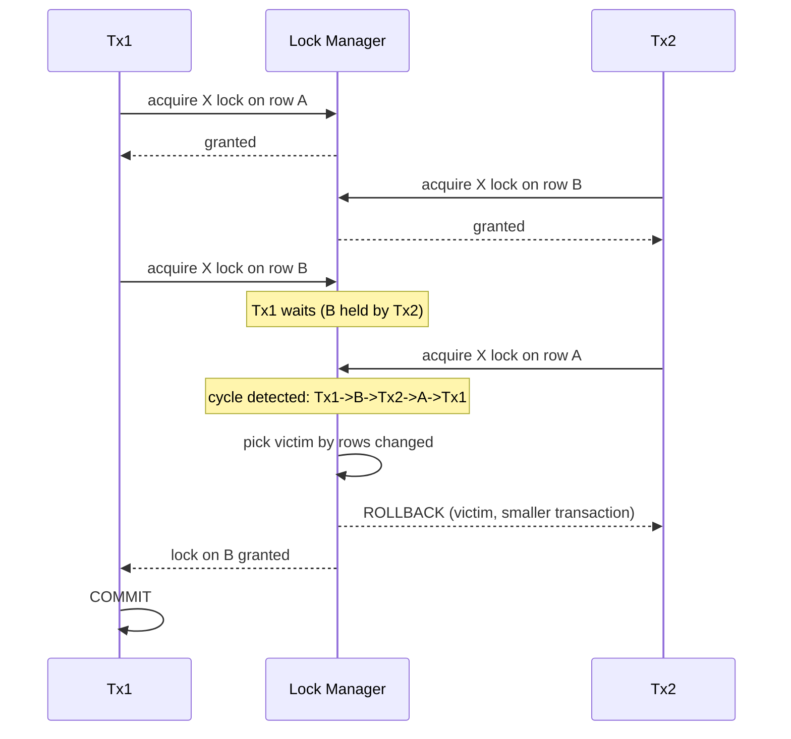

# [BEE-6013] Lock Contention and Deadlocks in Production

:::info
PostgreSQL and InnoDB both treat deadlocks as an expected operating condition. The engine detects the cycle, picks one transaction as the victim, and rolls it back; the survivors keep going. This article walks the operator path from understanding why retries are mandatory, through the engine instrumentation that exposes lock waits and deadlock cycles, to the timeout knobs and migration patterns that bound contention in production. Sources are PostgreSQL Documentation, MySQL 8.4 and 9.7 Reference Manuals, the PostgreSQL Wiki, Christensen at Crunchy Data (2022), Oda at pganalyze (2022), and Samokhvalov at postgres.ai (2021).
:::

## Context

The MySQL 8.4 Reference Manual states the operator contract bluntly: "When deadlock detection is enabled (the default) and a deadlock does occur, InnoDB detects the condition and rolls back one of the transactions (the victim). ... Thus, even if your application logic is correct, you must still handle the case where a transaction must be retried" (Oracle Corporation, "Deadlocks in InnoDB," MySQL 8.4 Reference Manual). Application code therefore MUST handle deadlock errors as a retryable signal rather than a permanent failure.

The MySQL 9.7 Reference Manual reinforces the framing: "Deadlocks are not dangerous unless they are so frequent that you cannot run certain transactions at all. Normally, you must write your applications so that they are always prepared to re-issue a transaction if it gets rolled back because of a deadlock" (Oracle Corporation, "How to Minimize and Handle Deadlocks," MySQL 9.7 Reference Manual). The operational threshold is frequency. A system that produces zero deadlocks under concurrent multi-row writes is either lightly loaded or has serialized everything behind a single lock.

The rest of this article assumes that baseline. Sections progress from (1) deadlocks as a normal event, to (2) the engine output that lets operators read them, to (3) the timeout knobs that bound contention, to (4) forensic walkthroughs, to (5) migration-time patterns where lock queues amplify damage.

## Visual



The detector resolves the cycle by aborting one transaction (claim 1, MySQL 8.4 Reference Manual). InnoDB's selection rule picks the smaller transaction by rows inserted, updated, or deleted (claim 11, MySQL 8.4 Reference Manual, "Deadlock Detection").

## Example

This section walks three concrete patterns: a queue worker built on `SELECT FOR UPDATE SKIP LOCKED`, a PostgreSQL incident reading `pg_locks`, and a MySQL incident reading the InnoDB engine status output.

### (a) Queue worker with `SELECT FOR UPDATE SKIP LOCKED`

The PostgreSQL Documentation for `SELECT` describes the primitive: "With SKIP LOCKED, any selected rows that cannot be immediately locked are skipped. Skipping locked rows provides an inconsistent view of the data, so this is not suitable for general purpose work, but can be used to avoid lock contention with multiple consumers accessing a queue-like table" (PostgreSQL Documentation, "SELECT").

A worker pulling jobs from a queue table:

```sql
BEGIN;
SELECT id, payload
FROM jobs
WHERE state = 'pending'
ORDER BY enqueued_at
LIMIT 1
FOR UPDATE SKIP LOCKED;

-- worker processes the row, then:
UPDATE jobs SET state = 'done' WHERE id = :id;
COMMIT;
```

`SKIP LOCKED` lets N workers run the same statement concurrently and each one claims a different row instead of serializing on the head of the queue. The trade-off named by the documentation is that the read view is deliberately inconsistent: a worker does not see rows locked by its peers, so the result set is not a snapshot of all eligible jobs (PostgreSQL Documentation, "SELECT"). For queue dispatch, the inconsistency is the point.

### (b) PostgreSQL incident: querying `pg_locks` joined with `pg_stat_activity`

The PostgreSQL Wiki page on Lock Monitoring is the canonical reference: "Looking at pg_locks shows you what locks are granted and what processes are waiting for locks to be acquired. ... This query may be helpful to see what processes are blocking SQL statements (these only find row-level locks, not object-level locks)" (PostgreSQL Wiki, "Lock Monitoring").

During an incident, the operator queries `pg_locks` for `granted = false` rows and joins against `pg_stat_activity` to identify the waiter and its blocker:

```sql
SELECT
    blocked.pid       AS blocked_pid,
    blocked.query     AS blocked_query,
    blocking.pid      AS blocking_pid,
    blocking.query    AS blocking_query,
    blocking.state    AS blocking_state
FROM pg_stat_activity AS blocked
JOIN pg_locks AS bl_lock
       ON bl_lock.pid = blocked.pid AND NOT bl_lock.granted
JOIN pg_locks AS bk_lock
       ON bk_lock.locktype = bl_lock.locktype
      AND bk_lock.database IS NOT DISTINCT FROM bl_lock.database
      AND bk_lock.relation IS NOT DISTINCT FROM bl_lock.relation
      AND bk_lock.granted
JOIN pg_stat_activity AS blocking
       ON blocking.pid = bk_lock.pid;
```

Christensen at Crunchy Data (2022) gives the operator the right reading rule: "An ungranted lock for any significant length of time indicates an issue and is something that should be looked into" (Christensen, "Postgres Locking — When Is It Concerning?," Crunchy Data Blog, 2022). The volume of granted locks is normal; an ungranted lock that persists is the signal.

### (c) MySQL incident: reading `SHOW ENGINE INNODB STATUS`

The MySQL 8.4 Reference Manual page "An InnoDB Deadlock Example" shows the verbatim shape of the `LATEST DETECTED DEADLOCK` block:

```text
*** (1) HOLDS THE LOCK(S):
RECORD LOCKS space id 28 page no 4 ... lock mode S locks rec but not gap
*** (1) WAITING FOR THIS LOCK TO BE GRANTED:
RECORD LOCKS space id 27 page no 4 ... lock_mode X locks rec but not gap waiting
*** WE ROLL BACK TRANSACTION (2)
```

The four landmarks an operator reads, in order, are: each participant's `TRANSACTION` header, the `HOLDS THE LOCK(S)` line that names what each side already owns, the `WAITING FOR THIS LOCK TO BE GRANTED` line that names what each side wanted, and the final `WE ROLL BACK TRANSACTION (N)` line that identifies the victim (Oracle Corporation, "An InnoDB Deadlock Example," MySQL 8.4 Reference Manual). The same record repeats for every participant in the cycle.

## Best Practices

- **MUST** acquire locks on multiple objects in a consistent order across every code path: PostgreSQL Documentation states that "The best defense against deadlocks is generally to avoid them by being certain that all applications using a database acquire locks on multiple objects in a consistent order" (PostgreSQL Documentation, "Explicit Locking"). The rule applies application-wide, including code paths that touch the same tables in different transactions.
- **MUST** treat `pg_locks` rows with `granted = false` that persist as the operational alert, not raw lock counts: Christensen at Crunchy Data (2022) writes that "An ungranted lock for any significant length of time indicates an issue and is something that should be looked into."
- **SHOULD** set `lock_timeout` on production sessions: PostgreSQL Documentation defines it as "Abort any statement that waits longer than the specified amount of time while attempting to acquire a lock on a table, index, row, or other database object. The time limit applies separately to each lock acquisition attempt" (PostgreSQL Documentation, "Client Connection Defaults — Statement Behavior"). The per-attempt scope means a statement that retries internally each gets its own budget.
- **SHOULD** set `idle_in_transaction_session_timeout` to bound how long an idle transaction can hold locks and block vacuum: PostgreSQL Documentation states "This option can be used to ensure that idle sessions do not hold locks for an unreasonable amount of time. Even when no significant locks are held, an open transaction prevents vacuuming away recently-dead tuples that may be visible only to this transaction; so remaining idle for a long time can contribute to table bloat" (PostgreSQL Documentation, "Client Connection Defaults — Statement Behavior").
- **SHOULD** prefer `NOWAIT` when the application has a defined fallback for contended rows: MySQL 8.4 Reference Manual describes the semantic as "A locking read that uses NOWAIT never waits to acquire a row lock. The query executes immediately, failing with an error if a requested row is locked" (Oracle Corporation, "Locking Reads," MySQL 8.4 Reference Manual). The error is the application's cue to back off or pick another row.
- **MAY** disable `innodb_deadlock_detect` on very high-concurrency workloads and rely on `innodb_lock_wait_timeout` instead: MySQL 8.4 Reference Manual states "On high concurrency systems, deadlock detection can cause a slowdown when numerous threads wait for the same lock. At times, it may be more efficient to disable deadlock detection and rely on the innodb_lock_wait_timeout setting for transaction rollback when a deadlock occurs" (Oracle Corporation, "Deadlock Detection," MySQL 8.4 Reference Manual). This option moves resolution from cycle detection to wall-clock timeout.

## Deadlock Forensics

Deadlock forensics begins after the engine has already chosen a victim and rolled it back. The operator's job is to reconstruct the cycle from engine-emitted evidence and identify the root holder.

**Walking the lock chain on PostgreSQL.** Oda at pganalyze (2022) describes `pg_blocking_pids(pid)` as the function that "returns 'the list of PIDs a particular query is waiting for (is blocked by).' ... follow the whole story, from queries that are waiting to the connection that is causing the lock waits in the first place" (Oda, "Postgres Lock Monitoring," pganalyze blog, 2022). The function returns an array of PIDs, so the operator can recursively call it on each blocker to walk back to the root holder rather than stopping at the immediate blocker.

**Reading the InnoDB victim selection.** The MySQL 8.4 Reference Manual states the rule: "InnoDB tries to pick small transactions to roll back, where the size of a transaction is determined by the number of rows inserted, updated, or deleted" (Oracle Corporation, "Deadlock Detection," MySQL 8.4 Reference Manual). When forensic output shows transaction (2) rolled back, the implication is that transaction (2) had touched fewer rows at the moment the cycle closed. Long-running batch writes therefore tend to win against short interactive ones, which can keep an OLTP retry path looping if it competes with a steady batch worker.

**Reading the engine status block.** The `LATEST DETECTED DEADLOCK` block from `SHOW ENGINE INNODB STATUS` (claim 12, MySQL 8.4 Reference Manual, "An InnoDB Deadlock Example") names, for each participant: which locks it `HOLDS THE LOCK(S)`, which lock it was `WAITING FOR THIS LOCK TO BE GRANTED`, and at the bottom, `WE ROLL BACK TRANSACTION (N)`. The operator reads the lock mode (`S` for shared, `X` for exclusive, `locks rec but not gap` versus other variants) on each side to reconstruct the conflict matrix.

**Logging every deadlock.** MySQL 9.7 Reference Manual notes that `SHOW ENGINE INNODB STATUS` "only retains the most recent deadlock" and recommends that "If frequent deadlock warnings cause concern, collect more extensive debugging information by enabling the innodb_print_all_deadlocks variable. Information about each deadlock, not just the latest one, is recorded in the MySQL error log" (Oracle Corporation, "How to Minimize and Handle Deadlocks," MySQL 9.7 Reference Manual). On any production system where the deadlock rate is non-trivial, operators SHOULD enable `innodb_print_all_deadlocks` so that each event is preserved in the error log instead of being overwritten by the next one.

## Lock-Aware Migration Patterns

Schema migrations are where lock contention turns into outages. Samokhvalov at postgres.ai (2021) describes the failure mode: "when DDL attempts to acquire locks, 'it starts blocking others' even while waiting for earlier transactions to complete. ... The solution avoids this by failing fast — timing out quickly allows other transactions to proceed unobstructed while retry loops handle the eventual lock acquisition" (Samokhvalov, "Zero-Downtime Postgres Schema Migrations Need This: Lock Timeout and Retries," postgres.ai blog, 2021).

The mechanism is the FIFO PostgreSQL lock queue: a DDL statement that wants `ACCESS EXCLUSIVE` queues behind any existing holders, and every subsequent reader and writer that conflicts with `ACCESS EXCLUSIVE` queues behind the DDL. A DDL waiting on a long-running transaction therefore holds up traffic that would otherwise be unaffected by either the DDL or the long transaction individually.

The pattern Samokhvalov prescribes wraps each DDL attempt in a short `lock_timeout` and an outer retry loop:

```sql
SET lock_timeout = '100ms';
ALTER TABLE orders ADD COLUMN priority INT NOT NULL DEFAULT 0;
-- on lock_timeout error: sleep, then retry
```

If the DDL cannot acquire its lock within 100ms, it aborts; queued readers and writers proceed; a retry runs at the next quiet moment. The application stays available because no single migration attempt blocks unrelated traffic for more than the timeout window.

## Related Topics

- [Durability, fsync, and the Crash-Safety Contract](/en/data-storage/durability-fsync-and-the-crash-safety-contract)
- [Vacuum, Bloat, and Transaction ID Wraparound](/en/data-storage/vacuum-bloat-and-transaction-id-wraparound)
- [Hot Standby, Failover, and Switchover Operations](/en/data-storage/hot-standby-failover-and-switchover-operations)
- [Database Migrations](/en/data-storage/database-migrations)
- [Two-Phase Locking](/en/distributed-systems/two-phase-locking)
- [Optimistic vs Pessimistic Concurrency Control](/en/concurrency/optimistic-vs-pessimistic-concurrency-control)
- [Locks, Mutexes, and Semaphores](/en/concurrency/locks-mutexes-and-semaphores)

## References

- PostgreSQL Global Development Group, "Explicit Locking," PostgreSQL Documentation (current). https://www.postgresql.org/docs/current/explicit-locking.html
- PostgreSQL Global Development Group, "SELECT," PostgreSQL Documentation (current). https://www.postgresql.org/docs/current/sql-select.html
- PostgreSQL Global Development Group, "Client Connection Defaults — Statement Behavior," PostgreSQL Documentation (current). https://www.postgresql.org/docs/current/runtime-config-client.html
- PostgreSQL Wiki, "Lock Monitoring" (current). https://wiki.postgresql.org/wiki/Lock_Monitoring
- Oracle Corporation, "Deadlocks in InnoDB," MySQL 8.4 Reference Manual (current). https://dev.mysql.com/doc/refman/8.4/en/innodb-deadlocks.html
- Oracle Corporation, "How to Minimize and Handle Deadlocks," MySQL 9.7 Reference Manual (current). https://dev.mysql.com/doc/refman/9.7/en/innodb-deadlocks-handling.html
- Oracle Corporation, "Deadlock Detection," MySQL 8.4 Reference Manual (current). https://dev.mysql.com/doc/refman/8.4/en/innodb-deadlock-detection.html
- Oracle Corporation, "An InnoDB Deadlock Example," MySQL 8.4 Reference Manual (current). https://dev.mysql.com/doc/refman/8.4/en/innodb-deadlock-example.html
- Oracle Corporation, "Locking Reads," MySQL 8.4 Reference Manual (current). https://dev.mysql.com/doc/refman/8.4/en/innodb-locking-reads.html
- David Christensen, "Postgres Locking — When Is It Concerning?," Crunchy Data Blog (2022). https://www.crunchydata.com/blog/postgres-locking-when-is-it-concerning
- Keiko Oda, "Postgres Lock Monitoring," pganalyze blog (2022). https://pganalyze.com/blog/postgres-lock-monitoring
- Nikolay Samokhvalov, "Zero-Downtime Postgres Schema Migrations Need This: Lock Timeout and Retries," postgres.ai blog (2021). https://postgres.ai/blog/20210923-zero-downtime-postgres-schema-migrations-lock-timeout-and-retries
