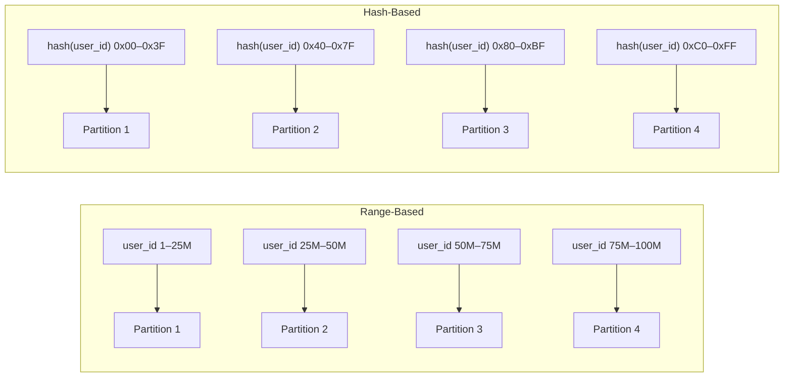
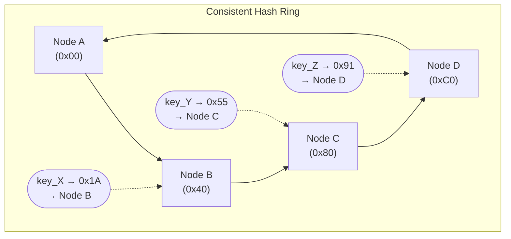

# [BEE-6004] Partitioning and Sharding

:::info
Range-based, hash-based, and consistent hashing partitioning — partition key selection, hotspot mitigation, and resharding tradeoffs.
:::

## Context

A single database node has a finite capacity for storage and write throughput. When a dataset outgrows one machine — or when write volume saturates a single leader — the only path forward is to split the data across multiple nodes. This is partitioning (also called sharding in most application-layer contexts).

Partitioning is conceptually simple: assign each record to exactly one partition, route each query to the correct partition(s), and let each partition operate on its subset of data. The complexity lies in choosing how to assign records, selecting the right partition key, keeping data balanced as it grows, and managing the operational overhead when the partition topology changes.

This article covers the two fundamental partitioning strategies, consistent hashing as a practical technique for minimizing data movement, partition key selection, and the cross-cutting concerns — hotspots, cross-partition queries, and resharding — that dominate real-world sharding work.

**References:**
- [Designing Data-Intensive Applications, Chapter 6: Partitioning](https://www.oreilly.com/library/view/designing-data-intensive-applications/9781491903063/ch06.html) — Martin Kleppmann
- [Vitess Sharding Reference](https://vitess.io/docs/22.0/reference/features/sharding/) — vitess.io
- [Consistent Hashing Explained](https://blog.algomaster.io/p/consistent-hashing-explained) — Ashish Pratap Singh, AlgoMaster

## Partitioning vs. Sharding

The two terms are often used interchangeably, but there is a conventional distinction:

**Partitioning** is the general concept of dividing a dataset into disjoint subsets. It includes both vertical partitioning (splitting columns across tables) and horizontal partitioning (splitting rows across storage units).

**Sharding** typically refers specifically to horizontal partitioning across separate database nodes (physical or logical). Each shard is an independent database instance containing a subset of the rows. Sharding implies network boundaries between partitions — reads and writes must be routed to the correct node.

This article focuses on horizontal partitioning. When the word "shard" appears, it means a partition that lives on a distinct database node.

## Partitioning Strategies

Two strategies dominate practical use. They differ in how keys are assigned to partitions and in what query patterns they support.



### Range-Based Partitioning

Records are assigned to partitions based on contiguous ranges of the partition key. All users with `user_id` between 1 and 25 million go to Partition 1; 25M–50M go to Partition 2; and so on. HBase and the pre-sharding configuration of MongoDB use range-based partitioning.

**Advantages:**
- Range scans are efficient. A query for users 1,000–2,000 hits exactly one partition.
- Partition boundaries are human-readable and operationally transparent.
- Sorted storage within a partition (e.g., LSM-tree or B-tree) makes range queries fast at the storage layer.

**Disadvantages:**
- Hotspots form easily. If recent records are always written with monotonically increasing keys (timestamps, auto-increment IDs), all writes land on the last partition. The other partitions sit idle.
- Rebalancing is manual or requires careful boundary selection. If the key distribution shifts, ranges must be split and data moved.

The standard mitigation for write hotspots in range-partitioned systems is to prefix or transform keys so that writes scatter across ranges. Cassandra's approach: partition on a derived hash, preserve sort order only within a partition.

### Hash-Based Partitioning

A hash function is applied to the partition key and the result determines the partition. A common approach maps the hash output to a fixed number of buckets. Cassandra, Vitess, and DynamoDB all use hash-based partitioning as their default.

**Advantages:**
- Even distribution. A good hash function spreads keys uniformly across partitions regardless of the underlying key distribution.
- No hotspot risk from monotonically increasing keys.

**Disadvantages:**
- Range queries require a scatter-gather. There is no way to know which partition holds keys in a given range, so the query must be sent to all partitions and the results merged.
- Sorted access patterns are not supported at the partition-routing level.

## Consistent Hashing

Naive hash partitioning with `hash(key) mod N` has a catastrophic property: changing N (adding or removing a node) causes approximately all keys to be reassigned. For a live system, this means a near-total data migration.

Consistent hashing solves this. Both nodes and keys are placed on a conceptual ring (a circular hash space from 0 to 2^32 - 1). A key is assigned to the first node encountered by walking clockwise from the key's position on the ring.

When a node is added, it takes over only the keys that fall between it and its predecessor — approximately `1/N` of all keys, where N is the number of nodes. When a node is removed, its keys move to its successor. All other nodes are unaffected.



**Virtual nodes (vnodes).** A plain ring with one position per physical node distributes keys unevenly when node counts are small or nodes have heterogeneous capacity. Virtual nodes solve this: each physical node is assigned many positions on the ring (typically 100–1,000). Cassandra defaults to 256 virtual nodes per physical node. The result is that when any node is added or removed, its load is redistributed across all other nodes rather than onto a single neighbor.

In a benchmark with 100 nodes and 10 million keys, adding one node with 1,000 virtual nodes moved only ~0.9% of keys. Naive modular hashing would move ~99%.

Consistent hashing is used by Cassandra, DynamoDB, and distributed caching systems (see [BEE-20](20.md)3). Vitess uses a variant: it defines explicit key ranges (hex-encoded binary strings) per shard and adjusts ranges during resharding operations.

## Partition Key Selection

The partition key is the single most consequential architectural decision in a sharded system. A poor choice cannot be undone without a full re-shard. Evaluate candidates against four criteria:

**High cardinality.** The key must have enough distinct values to support the number of partitions you need now and in the future. A boolean field (`active/inactive`) cannot be a partition key. A GUID or numeric user ID typically has sufficient cardinality.

**Even distribution.** The key's value distribution must spread records roughly uniformly across partitions. `user_id` is usually good. `country` is usually bad — the US and China would dominate, causing massive hotspots on those partitions.

**Query alignment.** The most frequent queries should be serviceable by routing to a single partition. If your most common query is "get all records for user X," partition on `user_id`. If your most common query is "get all orders for tenant Y," partition on `tenant_id`. Cross-partition queries are expensive.

**Write pattern awareness.** Avoid keys that cause sequential writes to cluster on a single partition. Timestamps and auto-increment IDs are the classic trap in range-partitioned systems. Hash-based partitioning handles monotonic keys safely; range-based partitioning does not.

## Worked Example: User Data Across 4 Shards

Schema: `users(user_id BIGINT PRIMARY KEY, name TEXT, country VARCHAR, created_at TIMESTAMP)`

Partition strategy: hash-based on `user_id`, 4 shards. Each shard covers a quarter of the hash space.

| Shard | Key range |
|-------|-----------|
| shard-0 | 0x0000000000000000 – 0x3FFFFFFFFFFFFFFF |
| shard-1 | 0x4000000000000000 – 0x7FFFFFFFFFFFFFFF |
| shard-2 | 0x8000000000000000 – 0xBFFFFFFFFFFFFFFF |
| shard-3 | 0xC000000000000000 – 0xFFFFFFFFFFFFFFFF |

**Write: insert user_id = 8472910**

```
hash(8472910) → 0x6A3F...  → shard-1
Route INSERT to shard-1 only.
```

**Read by primary key: `SELECT * FROM users WHERE user_id = 8472910`**

```
hash(8472910) → 0x6A3F...  → shard-1
Route SELECT to shard-1 only.
Cost: single-shard lookup, O(log n) within shard.
```

**Read by non-partition key: `SELECT * FROM users WHERE country = 'DE'`**

```
country is not the partition key.
No hash can determine which shards hold German users.
→ Scatter-gather: send query to all 4 shards in parallel.
→ Merge results at the application or query router layer.
Cost: 4x the I/O of a single-shard query. Scales linearly with shard count.
```

The scatter-gather pattern is not inherently wrong — it is the correct answer for queries that genuinely span all partitions. The problem arises when scatter-gather becomes the default for frequent queries that should have been aligned with the partition key.

## Cross-Partition Queries

Cross-partition queries (scatter-gather) occur whenever the query predicate does not include the partition key. The query router sends the query to every shard, each shard executes it locally, and the router merges the results — including any ordering, grouping, or aggregation.

The cost of scatter-gather scales with shard count. With 4 shards, a cross-partition query reads 4x the data of an equivalent single-partition query. With 128 shards, it reads 128x.

Strategies for managing cross-partition query costs:

**Secondary indexes.** Some databases (DynamoDB Global Secondary Indexes, Cassandra materialized views) maintain a secondary index that maps non-partition-key attributes to the partitions that contain matching rows. This trades storage and write amplification for read efficiency.

**Denormalization.** If `country` queries are frequent, maintain a separate `users_by_country` table partitioned on `country`. Write to both tables. This is the standard Cassandra pattern.

**CQRS / read models.** Maintain a separate read-optimized store (e.g., Elasticsearch, a reporting database) that is not sharded by the same key. Use it for cross-cutting queries. Write to the sharded store for transactional workloads.

**Accept the cost.** For infrequent analytics queries, scatter-gather across all shards is acceptable if query volume is low. Do not over-engineer for a query that runs once per hour.

## Hotspots and Mitigation

A hotspot is a partition that receives a disproportionate share of reads or writes. It is the most common operational problem in sharded systems.

**Causes:**

- Non-uniform key distribution (using `country` as partition key; one country is 60% of traffic).
- Monotonically increasing keys with range partitioning (all writes hit the latest partition).
- Celebrity rows: a single key (a viral post, a famous user) receives traffic orders of magnitude above average.

**Mitigations:**

For skewed key distributions: switch to hash-based partitioning, or choose a higher-cardinality partition key.

For monotonic keys with range partitioning: prepend a random salt or use a hash prefix. `shard_id = hash(created_at) mod N` instead of `shard_id = range(created_at)`. This breaks range scans but eliminates write hotspots.

For celebrity rows: the partition key approach cannot fully solve this — a single key is still a single partition. Mitigations include application-level caching (BEE-9004), read replicas on the hot partition, or splitting the celebrity record into multiple virtual records with different keys (requires application logic to merge on read).

## Resharding

Resharding is the process of changing the partition topology — typically increasing the number of shards as data grows. It is one of the most operationally expensive operations in a sharded system and should be planned for at design time.

**Why resharding is hard:**

- Data must be physically moved from old partitions to new partitions.
- Writes must be paused or dual-written during migration to avoid losing data.
- Secondary indexes, foreign key references, and caches must all be updated.
- The migration must be verified before old shards are decommissioned.

**Approaches:**

*Precautionary over-sharding.* Start with more shards than you currently need (e.g., 256 logical shards mapped to 4 physical nodes). As data grows, move logical shards to new physical nodes without changing the logical partition topology. Vitess and Cassandra both support this: the logical shard count is fixed, but physical node count scales. This defers the need for a true re-shard.

*Double-write migration.* Begin writing to both old and new shard topologies simultaneously. Backfill historical data to new shards. When backfill is complete and verified, switch reads to new topology. Decommission old topology.

*Online resharding.* Some databases (CockroachDB, Vitess) support online range splitting and merging. A hot range is split in two; an underloaded range is merged with a neighbor. The database handles data movement internally, with no application downtime. This requires the system to be built for it from the start.

## Application-Level vs. Database-Level Sharding

**Application-level sharding:** The application (or an intermediate proxy) contains the routing logic. It computes the shard for each key and connects directly to the appropriate database node. Examples: manually sharded MySQL, legacy e-commerce systems with per-tenant databases.

*Advantages:* Full control over routing logic. No dependency on a specific database vendor feature.

*Disadvantages:* Every application service must implement routing. Cross-shard transactions require application-level coordination. Schema changes must be applied to every shard independently. Operational complexity is borne entirely by the engineering team.

**Database-level sharding:** A middleware layer or native database feature handles routing transparently. Vitess provides a MySQL-compatible proxy (vtgate) that routes queries based on a VSchema. CockroachDB and Google Spanner handle partitioning internally and expose a single SQL endpoint.

*Advantages:* Application sees a single logical database. Cross-shard query execution, connection pooling, and failover are handled by the layer.

*Disadvantages:* Introduces an additional component to operate. Debugging query routing requires understanding the middleware layer. Vendor lock-in if using a managed service.

For most new systems at scale, database-level sharding (via Vitess, CockroachDB, or a cloud-managed distributed database) is the preferred approach. Application-level sharding is usually the result of organic growth in systems that predate good database-level solutions.

## Principle

Partition on the key that aligns with your most frequent access pattern and has high cardinality with even value distribution. Any query that does not include the partition key in its predicate will scatter-gather across all shards — design your schema so that common queries do not trigger this path.

Use hash-based partitioning unless you have a strong requirement for range scans across partition boundaries. Hash partitioning eliminates write hotspots and distributes load evenly. If you need range scans, use range partitioning and explicitly mitigate hotspot risk in your key design.

Do not shard prematurely. A single well-tuned PostgreSQL or MySQL instance can handle datasets in the hundreds of gigabytes and tens of thousands of QPS with proper indexing (BEE-6002). Sharding adds significant operational overhead. Reach for it when you have a concrete capacity problem that cannot be solved by vertical scaling, read replicas, or caching.

When you do shard, plan for resharding from day one. Use logical over-sharding so that adding physical nodes does not require re-keying data. Document the resharding procedure before you need it.

## Common Mistakes

1. **Using a low-cardinality or skewed key as the partition key.** `country`, `status`, `boolean_flag` — all produce massive hotspots immediately. The partition key must have enough distinct values and even distribution to fill all current and future shards.

2. **Building cross-partition joins into the hot path.** A join across two tables with different partition keys requires scatter-gather on at least one side. In a high-QPS system this becomes the bottleneck. Denormalize, co-locate related tables by the same partition key, or accept that the join must live in an offline store.

3. **Not planning for resharding.** "We'll deal with that later" is a common stance. Later, the system has 10 billion rows with no online resharding capability, and the migration requires weeks of double-writes, shadow traffic, and verification. Design for resharding before you have data.

4. **Sharding too early.** Adding sharding to a system that does not need it imports all the operational complexity — routing, cross-shard queries, resharding risk — for no capacity gain. Exhaust vertical scaling, read replicas, and caching first.

5. **Ignoring secondary index challenges.** In a sharded system, a global secondary index (an index on a non-partition-key column across all shards) is expensive to maintain and query. Either accept scatter-gather reads for secondary key queries, maintain a denormalized secondary table, or use a separate search index. Do not assume a secondary index in a sharded database behaves like one in a single-node database.

## Related BEPs

- [BEE-6001: SQL vs NoSQL](./120.md) — storage engine choice often determines sharding model options
- [BEE-6002: Indexing Deep Dive](./121.md) — secondary index behavior in sharded systems
- [BEE-6002: Replication Strategies](./121.md) — shards are typically replicated; partitioning and replication compose
- [BEE-9004: Distributed Caching](203.md) — consistent hashing is used in cache cluster routing with the same principles
