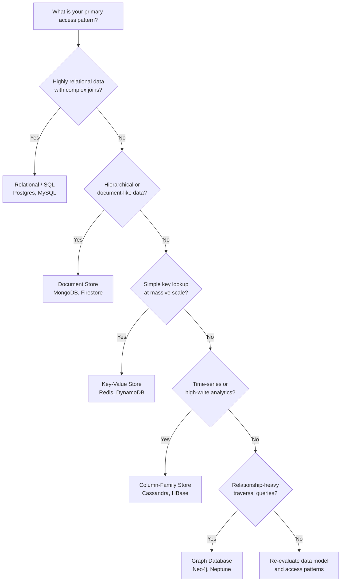

# [BEE-6001] SQL vs NoSQL Tradeoffs

:::info
Relational, document, key-value, column-family, graph -- choose based on data shape and access patterns, not trend.
:::

## Context

Every application stores data, and the choice of database shapes everything downstream: query complexity, consistency guarantees, operational burden, and how naturally the data model maps to the problem domain. The term "NoSQL" (coined as a Twitter hashtag for a 2009 meetup on open-source distributed databases) covers a wide range of systems that trade away some relational guarantees in exchange for schema flexibility, horizontal scalability, or specialized access patterns.

The core insight from Martin Kleppmann's *Designing Data-Intensive Applications* (DDIA, Chapter 2) and Pramod Sadalage & Martin Fowler's *NoSQL Distilled* is that no single database type is universally superior. Each family of databases excels at a different data shape, and real systems increasingly use several database types together — a practice called **polyglot persistence**.

**References:**
- [DDIA Chapter 2 — Data Models and Query Languages](https://www.oreilly.com/library/view/designing-data-intensive-applications/9781491903063/ch02.html)
- [Martin Fowler: NoSQL Distilled](https://martinfowler.com/books/nosql.html)
- [AWS: MongoDB vs PostgreSQL](https://aws.amazon.com/compare/the-difference-between-mongodb-and-postgresql/)
- [Bytebase: Postgres vs MongoDB — a Complete Comparison](https://www.bytebase.com/blog/postgres-vs-mongodb/)


:::tip Deep Dive
For database-level implementation details on relational vs non-relational design, see [DEE-14: Relational vs Non-Relational](https://alivedise.github.io/database-engineering-essentials/12).
:::


## Principle

**Match the database to the data model and access pattern, not to hype or familiarity alone.**

Choose based on:
1. The natural shape of your data (tabular, hierarchical, graph, time-series).
2. The queries you run most often (complex joins, key lookups, traversals, aggregations).
3. Consistency and durability requirements (ACID transactions vs eventual consistency).
4. Scale requirements and operational maturity of the team.


## Database Families

### Relational (SQL)

Relational databases (PostgreSQL, MySQL, Oracle, SQL Server) store data in normalized tables linked by foreign keys. They enforce schema on write and provide ACID transactions spanning multiple tables.

**Strengths:**
- ACID transactions — atomicity, consistency, isolation, durability across arbitrary rows and tables.
- Powerful JOIN semantics — query across normalized tables without duplicating data.
- Schema enforcement catches bad data at the boundary.
- Decades of tooling: migrations, backups, monitoring, replication, ORMs.
- SQL is a universal, well-understood query language.

**Weaknesses:**
- Schema changes require migrations, which can be costly on large tables.
- Object-relational impedance mismatch: hierarchical application objects must be "shredded" into multiple tables (DDIA Ch. 2).
- Vertical scaling has limits; horizontal sharding is possible but adds complexity (see [BEE-1003](../auth/oauth-openid-connect.md)3).

**Reach for SQL when:** your data is naturally relational with many-to-many relationships, you need multi-row/multi-table transactions, or compliance mandates strong consistency.


### Document Stores

Document databases (MongoDB, CouchDB, Firestore) store self-contained JSON/BSON documents. Related data is often embedded within the document rather than normalized across tables.

**Strengths:**
- Schema flexibility — documents in the same collection can have different fields (schema on read).
- Locality — loading a document loads all its embedded sub-objects in a single read.
- Natural fit for hierarchical or tree-shaped data.
- Easier initial iteration; no migration required to add fields.

**Weaknesses:**
- Weak support for joins. Many-to-many relationships require application-level joins or denormalization.
- Denormalization leads to data duplication; updates must touch multiple documents.
- Transactions spanning multiple documents are supported in some systems (MongoDB 4.0+) but with overhead.

**Reach for document stores when:** your data looks like a tree of one-to-many relationships, you load the whole tree at once, and the top-level entity (e.g. a blog post with its comments) is a natural aggregate boundary.


### Key-Value Stores

Key-value databases (Redis, DynamoDB in pure KV mode, Memcached) store opaque values accessed by a single primary key.

**Strengths:**
- Extremely fast reads and writes — O(1) lookup by key.
- Simple mental model; easy to scale horizontally.
- Excellent for caching, sessions, rate-limiting, and feature flags.

**Weaknesses:**
- No secondary indexes in their pure form; querying by anything other than the key requires a full scan.
- Values are opaque blobs to the database — no server-side filtering.
- Limited transaction support.

**Reach for key-value stores when:** access is almost always a single-key lookup at high throughput, or as a caching layer in front of a primary database.


### Column-Family Stores

Column-family databases (Apache Cassandra, HBase, Google Bigtable) store data in wide rows where columns can vary per row. They are optimized for high-throughput sequential writes and time-series patterns.

**Strengths:**
- Extremely high write throughput — appends to an immutable log.
- Data is naturally partitioned and replicated across nodes.
- Efficient range scans over a sorted row key (e.g. time-series by `(user_id, timestamp)`).

**Weaknesses:**
- Query flexibility is severely limited; data must be modeled around the queries you plan to run.
- No JOIN support; denormalization is mandatory.
- Eventual consistency by default in many configurations.

**Reach for column-family stores when:** you have high-volume write workloads, time-series data, or append-heavy event logs where queries are predictable and access patterns are designed up front.


### Graph Databases

Graph databases (Neo4j, Amazon Neptune, ArangoDB) model data as nodes and edges. They are optimized for traversals: "find all friends of friends who work at the same company."

**Strengths:**
- Relationship traversal is a first-class operation — no expensive JOIN chains.
- Naturally represents social networks, recommendation engines, fraud detection, and knowledge graphs.
- Queries stay performant even as the depth of traversal increases.

**Weaknesses:**
- Poor fit for aggregate/bulk data operations.
- Smaller ecosystem and fewer operational options than relational databases.
- Overkill unless relationship traversal is a core access pattern.

**Reach for graph databases when:** the primary query is "traverse relationships to N degrees," such as social graphs, dependency graphs, or access control hierarchies.


## Decision Tree




## Concrete Example: User with Orders

The same domain modeled in two ways illustrates the core tradeoff.

### Relational Model (Normalized)

```sql
-- Two tables, linked by foreign key
CREATE TABLE users (
  id         SERIAL PRIMARY KEY,
  name       TEXT NOT NULL,
  email      TEXT UNIQUE NOT NULL
);

CREATE TABLE orders (
  id         SERIAL PRIMARY KEY,
  user_id    INTEGER REFERENCES users(id),
  total      NUMERIC(10,2),
  created_at TIMESTAMPTZ DEFAULT now()
);

-- Query: fetch user with their last 10 orders
SELECT u.name, u.email, o.id, o.total, o.created_at
FROM   users u
JOIN   orders o ON o.user_id = u.id
WHERE  u.id = 42
ORDER  BY o.created_at DESC
LIMIT  10;
```

**Tradeoff:** Data is not duplicated. Adding a field to `users` does not touch `orders`. Multi-row transactions are trivial. But every query that touches both tables requires a JOIN.

### Document Model (Embedded)

```json
// Single document in the "users" collection
{
  "_id": "usr_42",
  "name": "Alice",
  "email": "alice@example.com",
  "orders": [
    { "id": "ord_1", "total": 49.99, "created_at": "2025-03-01T10:00:00Z" },
    { "id": "ord_2", "total": 120.00, "created_at": "2025-03-15T14:30:00Z" }
  ]
}
```

```js
// Query: fetch user with their last 10 orders — no join needed
db.users.findOne(
  { _id: "usr_42" },
  { name: 1, email: 1, orders: { $slice: -10 } }
);
```

**Tradeoff:** One round-trip, no join. But if `orders` must also be queried independently (e.g., "all orders over $100 across all users"), the embedded model makes that difficult. Updates to shared order data must touch every parent document.

**Rule of thumb:** embed when you always load the parent and child together, and the child data is owned exclusively by the parent. Reference (normalize) when the child has independent identity or is shared across multiple parents.


## Polyglot Persistence

Real production systems rarely use a single database for everything. A mature architecture might combine:

| Store | Role |
|---|---|
| PostgreSQL | Source of truth for users, accounts, billing (ACID required) |
| MongoDB | Content management, catalog data with flexible schema |
| Redis | Session cache, rate limiting, real-time leaderboards |
| Cassandra | Event logs, click-stream data, IoT telemetry |
| Neo4j | Recommendation engine, social graph |

The key discipline in polyglot persistence is defining clear **aggregate boundaries** — which system owns each piece of data — and synchronizing across stores via events or background jobs rather than cross-database joins.


## Common Mistakes

**1. Choosing NoSQL because "SQL doesn't scale"**

SQL databases do scale — PostgreSQL handles millions of queries per second with proper indexing, read replicas, and connection pooling. Horizontal sharding is complex but possible (see [BEE-1003](../auth/oauth-openid-connect.md)3). Choosing NoSQL to "avoid scaling problems" without benchmarking the actual bottleneck is premature optimization.

**2. Using a document store but doing joins in application code**

If you find yourself loading multiple documents and assembling relationships in Python or Java, you have traded the database's optimized JOIN engine for an unoptimized application-level join. This is typically slower, harder to reason about, and does not benefit from query planner optimizations. Consider whether a relational model fits better.

**3. Choosing based on hype instead of data access patterns**

"We're a startup, everyone uses MongoDB" is not a data model decision. Evaluate what your data actually looks like and which queries you need most. The wrong database choice is expensive to undo.

**4. One database for everything (ignoring polyglot persistence)**

Forcing all data into a single database type leads to awkward modeling. User session data does not belong in a relational table any more than financial transactions belong in a document store without ACID guarantees. Use the right tool for each data type.

**5. Ignoring operational maturity**

A database your team cannot operate safely in production is a liability. Consider: Does your team have backup and restore procedures tested? Can you monitor slow queries? Do you understand the replication lag characteristics? Newer or exotic databases often lack the depth of tooling, documentation, and community knowledge that PostgreSQL or MySQL have accumulated over decades.


## Related BEPs

- [BEE-6002](indexing-deep-dive.md) — Indexing Deep Dive: how indexes work across SQL and NoSQL systems
- [BEE-6003](replication-strategies.md) — Replication Strategies: primary-replica, multi-primary, eventual consistency
- [BEE-6004](partitioning-and-sharding.md) — Partitioning and Sharding: horizontal scaling strategies for large datasets
- [BEE-7001](../data-modeling/entity-relationship-modeling.md) — Data Modeling: translating domain concepts to database structures
