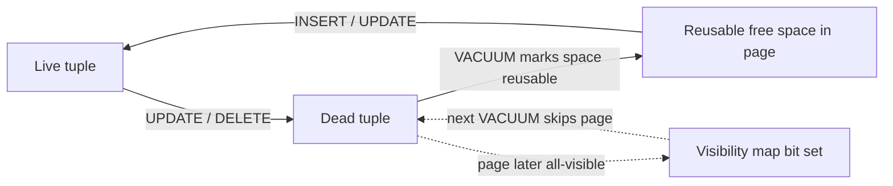
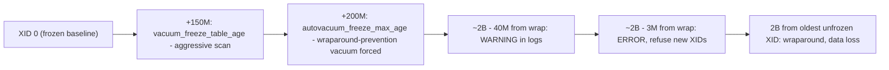

# [BEE-6011] VACUUM, Bloat, and Transaction-ID Wraparound

:::info
PostgreSQL's MVCC design leaves dead row versions behind on every `UPDATE` and `DELETE`, and the cluster relies on `VACUUM` to reclaim that space and to freeze old transaction IDs before the 32-bit XID counter wraps. When autovacuum falls behind on a large table, the database accumulates bloat and eventually refuses writes to prevent catastrophic data loss. This article walks the operator path from why `VACUUM` exists, through the autovacuum defaults, into the wraparound emergency state, and out through bloat remediation choices. Tune `autovacuum_vacuum_scale_factor` down on large tables and monitor `pg_stat_user_tables` so the cluster never meets the 3-million-XID write-refusal threshold in production.
:::

## Context

PostgreSQL implements multi-version concurrency control by writing new row versions in place of in-place updates. The PostgreSQL Documentation, "Routine Vacuuming," states: "In PostgreSQL, an `UPDATE` or `DELETE` of a row does not immediately remove the old version of the row... The space it occupies must then be reclaimed for reuse by new rows, to avoid unbounded growth of disk space requirements. This is done by running `VACUUM`." Every write workload accumulates dead tuples, and every cluster therefore depends on a working vacuum loop.

A standard `VACUUM` reclaims dead-tuple space for reuse inside the same table file. The PostgreSQL Documentation, "VACUUM," is explicit: "Plain `VACUUM` (without `FULL`) simply reclaims space and makes it available for re-use... However, extra space is not returned to the operating system (in most cases); it's just kept available for re-use within the same table." An operator who expects disk usage to drop after a regular vacuum will be surprised; the file stays the same size, with internal free space available for future inserts.

The second pressure that VACUUM relieves is the 32-bit transaction ID counter. Per the PostgreSQL Documentation, "Routine Vacuuming": "since transaction IDs have limited size (32 bits) a cluster that runs for a long time (more than 4 billion transactions) would suffer _transaction ID wraparound_: the XID counter wraps around to zero, and all of a sudden transactions that were in the past appear to be in the future — which means their output become invisible. In short, catastrophic data loss." The same documentation page sets the operator's hard requirement: "To avoid this, it is necessary to vacuum every table in every database at least once every two billion transactions."

Together these two responsibilities, dead-tuple reclamation and XID freezing, are why a PostgreSQL operator must treat `VACUUM` as a first-class component of the storage stack.

## Visual

Two diagrams anchor the mechanics: the dead-tuple lifecycle that justifies routine vacuuming, and the XID space with its successive thresholds.

The first diagram traces a single row through its life as live data, dead tuple, and reusable free space:

The visibility map sits beside this lifecycle as an optimization layer. Per the PostgreSQL Documentation, "Routine Vacuuming": "Vacuum maintains a visibility map for each table to keep track of which pages contain only tuples that are known to be visible to all active transactions... vacuum itself can skip such pages on the next run, since there is nothing to clean up." Without this map a vacuum on a large append-only table would have to re-walk every page on every pass.

The second diagram lays out the XID space horizontally, marking the four thresholds an operator has to recognize:

Threshold sources: the warning at 40 million and the write-refusal at fewer than 3 million remaining XIDs come from PostgreSQL Documentation, "Routine Vacuuming": "the system will refuse to assign new XIDs once there are fewer than three million transactions left until wraparound." The 200 million `autovacuum_freeze_max_age` default and the 150 million aggressive-scan trigger come from PostgreSQL Documentation, "Automatic Vacuuming." Autovacuum itself wakes up on a default `autovacuum_naptime` of one minute per the same documentation page: "Specifies the minimum delay between autovacuum runs on any given database... The default is one minute (`1min`)." A worker is launched against a database every naptime divided by the number of databases, which means a cluster of many databases gives each database fewer wake-ups per minute.

## Example

The Sentry Engineering Blog, "Transaction ID Wraparound in Postgres" (David Cramer, 2015), describes a textbook outage. Sentry's writes were concentrated on one massive event-rollup table. Autovacuum repeatedly attempted wraparound-prevention vacuums on that single table while the rest of the database stayed healthy, and the ingest workload kept advancing the XID counter faster than the vacuum could freeze rows. From the postmortem: "By querying Postgres' internal statistics we identified that the autovacuums actually had finished on all of the relations except one... Our only choice at this point was to shut down the database and restart in single-user mode... we made the call to truncate the table. Five minutes later, the system was fully restored."

Walked from an operator's seat, the recovery sequence was:

1. The cluster crossed the warning threshold and then the write-refusal threshold; new XID-assigning transactions began to fail with the wraparound error.
2. Diagnostic queries against internal statistics confirmed that one specific large table's autovacuum could never complete within the available window.
3. Standard remediation (waiting for autovacuum to finish, raising cost limits) was insufficient because the table's vacuum cost exceeded the rate at which writes were advancing the XID horizon.
4. The team shut the cluster down and restarted in single-user mode, where wraparound restrictions are bypassed for the operator.
5. Truncating the offending table eliminated the unfrozen XIDs in one operation, after which the cluster could be restarted normally and accept writes again.

The Sentry incident is the canonical real-world case study for why every PostgreSQL operator should know what the wraparound-prevention error message means before they see it.

## Best Practices

The default autovacuum configuration is calibrated for small clusters and small tables. Operators running production workloads at scale should adjust the defaults and observe the running cleanup loop directly.

- **MUST** monitor every table's `last_autovacuum` and `n_dead_tup` so that a falling-behind table is visible before it becomes a wraparound emergency. AWS Prescriptive Guidance, "Vacuuming and analyzing tables automatically," recommends the query `SELECT relname AS TableName, n_live_tup AS LiveTuples, n_dead_tup AS DeadTuples, last_autovacuum AS Autovacuum, last_autoanalyze AS Autoanalyze FROM pg_stat_user_tables;` and explains the rationale: "Monitoring the number of dead tuples in each table, especially in frequently updated tables, helps you determine if the autovacuum processes are periodically removing the dead tuples so their disk space can be reused for better performance."
- **MUST** vacuum every table in every database at least once every two billion transactions, per the hard limit stated in PostgreSQL Documentation, "Routine Vacuuming." Allowing a table to drift past that horizon causes wraparound and data loss.
- **SHOULD** lower `autovacuum_vacuum_scale_factor` from its 0.2 default on large tables. The PostgreSQL Documentation, "Automatic Vacuuming," documents the default: "Specifies a fraction of the table size to add to `autovacuum_vacuum_threshold` when deciding whether to trigger a `VACUUM`. The default is `0.2` (20% of table size)." Tomas Vondra, "Autovacuum Tuning Basics," EnterpriseDB blog (2024), works the consequence: "for a 1TB table this means we can accumulate up to 200GB of dead rows, and then when the cleanup finally happens it will have to do a lot of work at once... The proper solution is to trigger the cleanup more often. This can be done by significantly decreasing the scale factor, perhaps like this: `autovacuum_vacuum_scale_factor = 0.01`."
- **SHOULD** inspect live autovacuum activity with `SELECT pid, query FROM pg_stat_activity WHERE query LIKE 'autovacuum: %';` as recommended by Lukas Fittl, "Visualizing and tuning Postgres autovacuum," pganalyze blog. Repeated back-to-back vacuums on the same relation indicate the autovacuum cannot keep up with the table's write rate, and that the per-table autovacuum settings need to be tightened.
- **SHOULD** treat any query string ending with `(to prevent wraparound)` as a high-severity signal. Per PostgreSQL Documentation, "Routine Vacuuming," such an autovacuum "is not automatically interrupted" by lock conflicts and will block other operations until it finishes. Operators who routinely cancel long-running vacuums should adjust their tooling to skip wraparound-prevention runs.
- **MAY** rely on the autovacuum-disabled escape hatch with caution: per PostgreSQL Documentation, "Automatic Vacuuming," "the system will launch autovacuum processes to prevent wraparound even when autovacuum is otherwise disabled." Disabling autovacuum suppresses normal cleanup while still permitting forced wraparound runs, which yields a workload pattern of long quiet periods punctuated by emergency freeze passes.

## Wraparound Incident Playbook

Three thresholds define the wraparound state machine, and an operator's response depends on which one the cluster has crossed.

### Threshold 1: `autovacuum_freeze_max_age` reached (default 200 million)

PostgreSQL Documentation, "Automatic Vacuuming," states: "Specifies the maximum age (in transactions) that a table's `pg_class`.`relfrozenxid` field can attain before a `VACUUM` operation is forced to prevent transaction ID wraparound within the table. Note that the system will launch autovacuum processes to prevent wraparound even when autovacuum is otherwise disabled."

Crossing this threshold is normal background behaviour; the cluster forces a wraparound-prevention vacuum on the relation. The operator action is to verify the run is making progress through `pg_stat_progress_vacuum` (where instrumented) and to ensure no manual cancel is issued. Wraparound autovacuums run to completion through lock conflicts that would interrupt ordinary autovacuums. Per "Routine Vacuuming": "if the autovacuum is running to prevent transaction ID wraparound (i.e., the autovacuum query name in the `pg_stat_activity` view ends with `(to prevent wraparound)`), the autovacuum is not automatically interrupted."

### Threshold 2: warning logs at 40 million XIDs from wraparound

PostgreSQL Documentation, "Routine Vacuuming," establishes the warning tier and the write-refusal tier in one passage: "the system will refuse to assign new XIDs once there are fewer than three million transactions left until wraparound." The warning tier precedes that horizon.

Operator action: identify which relation has the oldest `relfrozenxid`, escalate vacuum priority on that relation, and consider raising `vacuum_cost_limit` on the autovacuum worker so the freeze pass completes before the 3-million horizon is reached.

### Threshold 3: write-refusal at fewer than 3 million XIDs from wraparound

The cluster emits `ERROR: database is not accepting commands that assign new XIDs to avoid wraparound data loss in database "mydb"`. Per the same documentation: "In this condition any transactions already in progress can continue, but only read-only transactions can be started. Operations that modify database records or truncate relations will fail."

The Sentry 2015 incident reached this state on one table. The recovery options at this point are constrained:

1. Shut the cluster down and restart in single-user mode, where the wraparound restriction is lifted for the operator.
2. Run the wraparound-prevention `VACUUM` on the offending relation to completion offline. This is the default recovery path when the relation's data must be preserved.
3. If the unfrozen XIDs are concentrated in one disposable relation, `TRUNCATE` that relation as Sentry did. This is a last-resort move on tables whose data is reconstructible.

Plan capacity and downtime expectations around option 2 as the default path. Option 3 cleared Sentry's wraparound state in five minutes, but only because the rollup table's contents were rebuildable from upstream data.

## Bloat Remediation: VACUUM FULL vs. pg_repack

Standard `VACUUM` does not return space to the operating system. When a table has bloated to the point where reclaiming disk back to the OS matters, typically after a large historical purge, the operator chooses between two reorg paths.

### `VACUUM FULL`

`VACUUM FULL` rewrites the entire table to a new file. Per PostgreSQL Documentation, "VACUUM": "Selects 'full' vacuum, which can reclaim more space, but takes much longer and exclusively locks the table. This method also requires extra disk space, since it writes a new copy of the table and doesn't release the old copy until the operation is complete."

Two costs are load-bearing for capacity planning:

- An `ACCESS EXCLUSIVE` lock on the table for the duration of the rewrite, blocking concurrent reads and writes.
- Free disk space at least equal to the table's live size during the rewrite, because the original file is held until the new file is complete.

### `pg_repack`

`pg_repack` is the online alternative. Per the project README at github.com/reorg/pg_repack: "pg_repack is a PostgreSQL extension which lets you remove bloat from tables and indexes... Unlike CLUSTER and VACUUM FULL it works online, without holding an exclusive lock on the processed tables during processing."

An operator running `pg_repack` keeps the table available for reads and writes throughout the reorg, at the cost of installing an extension, accepting trigger-based change tracking during the rebuild, and still needing comparable disk-space headroom for the duplicate table file.

### Choosing between them

Choose `VACUUM FULL` when a maintenance window is available and the simplicity of an in-tree operation outweighs the lock cost. Choose `pg_repack` when the table is in the hot path of a 24x7 workload and an `ACCESS EXCLUSIVE` lock for the rewrite duration is unacceptable.

## Related Topics

- [Storage Engines](/data-storage/storage-engines)
- [Database Backup Strategies and Point-in-Time Recovery](/data-storage/database-backup-strategies-and-point-in-time-recovery)
- [Durability, fsync, and the Crash-Safety Contract](/data-storage/durability-fsync-and-the-crash-safety-contract)
- [MVCC: Multi-Version Concurrency Control](/distributed-systems/mvcc-multi-version-concurrency-control)
- [B-Tree Internals](/distributed-systems/b-tree-internals)

## References

- PostgreSQL Global Development Group, "Routine Vacuuming," PostgreSQL Documentation (current). https://www.postgresql.org/docs/current/routine-vacuuming.html
- PostgreSQL Global Development Group, "Automatic Vacuuming," PostgreSQL Documentation (current). https://www.postgresql.org/docs/current/runtime-config-autovacuum.html
- PostgreSQL Global Development Group, "VACUUM," PostgreSQL Documentation (current). https://www.postgresql.org/docs/current/sql-vacuum.html
- Daniele Varrazzo et al., "pg_repack — Reorganize tables in PostgreSQL databases with minimal locks," GitHub project README. https://github.com/reorg/pg_repack
- Tomas Vondra, "Autovacuum Tuning Basics," EnterpriseDB blog (2024). https://www.enterprisedb.com/blog/autovacuum-tuning-basics
- Lukas Fittl, "Visualizing and tuning Postgres autovacuum," pganalyze blog. https://pganalyze.com/blog/visualizing-and-tuning-postgres-autovacuum
- AWS Prescriptive Guidance, "Vacuuming and analyzing tables automatically," AWS Documentation. https://docs.aws.amazon.com/prescriptive-guidance/latest/postgresql-maintenance-rds-aurora/autovacuum.html
- David Cramer, "Transaction ID Wraparound in Postgres," Sentry Engineering Blog (2015). https://blog.sentry.io/transaction-id-wraparound-in-postgres/
