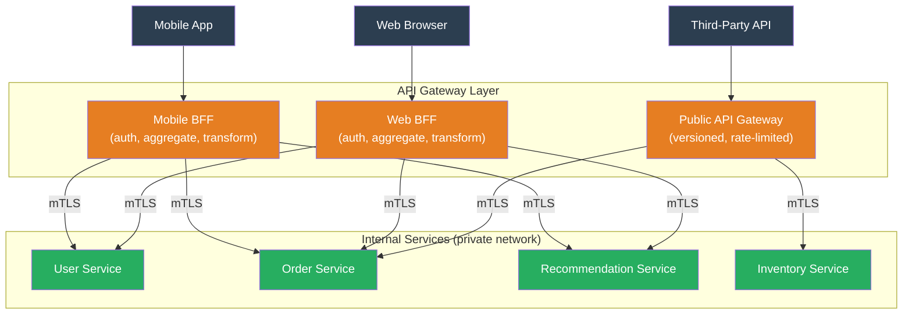

# [BEE-19036] API Gateway Patterns

:::info
An API gateway is the single entry point for client traffic into a microservice architecture — a reverse proxy that operates at Layer 7 to enforce authentication, rate limiting, routing, and observability in one place rather than duplicating that logic in every service.
:::

## Context

As systems decompose into multiple services, a class of cross-cutting concerns appears: every service needs to authenticate callers, every service needs to handle CORS headers, every service should emit metrics, every service needs TLS termination. Implementing these in each service individually causes duplication, inconsistency, and drift — a service that went live six months ago may have an older version of the auth library while a new service has the current one.

The API gateway pattern addresses this by extracting the cross-cutting concerns into a single intermediary. Netflix was among the first large internet companies to formalize this architecture. Their Zuul gateway (open-sourced in 2013) handled routing, authentication, dynamic scripting, and insight/monitoring for all API traffic at Netflix, replacing a spaghetti of service-to-service client libraries with a single policy enforcement point. The pattern became canonical in microservices literature after Chris Richardson included it in the microservices.io pattern language.

Sam Newman named a complementary pattern in 2015: the **Backend for Frontend (BFF)**. Rather than a single monolithic gateway serving all clients, each type of client — mobile app, web browser, third-party API consumer — gets its own dedicated gateway instance, owned by the team building that client. The mobile BFF aggregates and transforms data the way the mobile app needs it; the web BFF does the same for the web frontend. This avoids the "frozen in place" problem where a general-purpose gateway accumulates conflicting requirements from different clients and becomes impossible to evolve.

The alternative to a gateway — having clients call services directly — is called "client-side discovery" or "direct service access." It is appropriate when there are few services, all on a trusted network, accessed by a single type of client. As the system grows in service count, client diversity, and regulatory surface area (who can call what), the gateway becomes the right tradeoff.

## Design Thinking

### What the Gateway Owns vs. What Services Own

The gateway should enforce policies that are universal and client-visible:

| Concern | Gateway | Service |
|---|---|---|
| TLS termination | Yes | No (internal traffic can be plaintext or mTLS) |
| Authentication (JWT/OAuth validation) | Yes | SHOULD verify propagated identity header |
| Coarse-grained authorization (scope checks) | Yes | Fine-grained authz (row-level permissions) |
| Rate limiting per client | Yes | Per-resource rate limits |
| Request routing | Yes | Service-internal routing |
| Observability (access log, metrics, traces) | Yes | Business-logic metrics |
| Payload business logic | No | Yes |
| Data aggregation across services | BFF only | No |

**Resist the urge to put business logic in the gateway.** The moment the gateway needs to understand the domain — "if the user is a premium subscriber, route to the premium service" — the gateway becomes a bottleneck for business changes and starts coupling the edge to the domain model. Route on technical criteria (path prefix, header value, JWT claim); leave domain rules to the services.

### Single Gateway vs. BFF vs. Direct

Three architectures exist along a spectrum:

**Single gateway** is a good starting point: one gateway routes all traffic, enforces all policies. Simple to operate. The limitation is that different clients (mobile, web, third-party) have conflicting requirements — mobile needs smaller payloads, web needs richer data, third-party needs a stable versioned contract — and the single gateway accumulates these requirements until it becomes rigid.

**BFF (Backend for Frontend)** creates one gateway per client type, each owned by the team building that client surface. Allows each surface to evolve independently. The cost is operational: N gateways to deploy, monitor, and secure.

**Direct service access** skips the gateway entirely for internal services that communicate service-to-service. Internal traffic between services on a private network typically goes directly, without passing through the public API gateway. The gateway handles only external, client-originated traffic.

### When the Gateway Adds More Cost Than Value

A gateway is unnecessary when: the system is a single service or a monolith; all clients are internal and trusted; there is no diversity of client types; rate limiting and auth are handled at a higher level (CDN, load balancer). Adding a gateway to a simple system adds a network hop, a deployment dependency, and an operational burden for little benefit.

## Best Practices

**MUST enforce authentication at the gateway, not just in individual services.** JWT validation — verifying signature, expiration, issuer, audience, and token not revoked — should happen once at the gateway boundary. Services SHOULD trust a propagated identity header (e.g., `X-User-ID`, `X-User-Roles`) injected by the gateway after successful validation, rather than re-validating the token. Services MUST NOT accept direct external traffic that bypasses the gateway, enforced by network policy (security groups, Kubernetes NetworkPolicy).

**MUST NOT put domain business logic in the gateway.** The gateway is infrastructure, not application code. Routing rules in the gateway should be based on: URL path prefix, HTTP method, header values, JWT claims (for routing to different service tiers), and traffic percentage (for canary releases). If a routing decision requires a database lookup or a domain model evaluation, that logic belongs in a service, not the gateway.

**SHOULD use the BFF pattern when serving multiple client types with meaningfully different data requirements.** Mobile clients on constrained connections benefit from smaller, pre-aggregated responses. Browser clients may need richer data with nested objects. Third-party API consumers need stable, versioned contracts. A separate BFF per client type allows each to be tailored without coupling. Each BFF should be owned by the same team that owns the client it serves.

**SHOULD implement request aggregation at the BFF layer to reduce client round trips.** A page that requires data from three services — user profile, recent orders, and recommendations — should receive one API response, not make three serial API calls from the client. The BFF fans out the three requests in parallel, waits for all three, and returns a composed response. This is appropriate in the BFF; it is NOT appropriate in a general-purpose gateway (which should stay thin).

**MUST apply rate limiting at the gateway by authenticated identity, not by IP.** IP-based rate limiting is trivially bypassed (VPNs, rotating proxies, shared corporate NAT addresses) and penalizes users sharing an IP. Rate limiting keyed on JWT `sub` (subject), API key, or OAuth client ID enforces the correct semantic: limit the authenticated principal, not the network address. Gateway rate limits should be coarse (per client, per time period); service-level rate limits handle fine-grained per-resource protection.

**SHOULD configure circuit breaking at the gateway for all upstream services.** When a backend service becomes slow or unavailable, the gateway should fail fast rather than queuing requests indefinitely. A circuit breaker at the gateway detects failure rates and, when the threshold is exceeded, returns immediate error responses to clients without hitting the failing backend. This prevents latency cascade: a slow backend makes the gateway queue connections, which exhausts the gateway's connection pool, which makes the gateway slow for all clients, not just those hitting the failing backend.

**MUST apply TLS termination at the gateway; SHOULD enforce mTLS on internal traffic.** External traffic from clients should always be HTTPS. The gateway terminates TLS and may forward to services over plaintext (if the internal network is trusted) or over TLS (if zero-trust internal networking is required). For zero-trust environments, mutual TLS (mTLS) between the gateway and each service authenticates both parties — the service knows the request came from the gateway, not from a rogue internal process.

## Visual



## Example

**JWT validation and identity propagation at the gateway (pseudocode):**

```python
import httpx
from jose import jwt, JWTError
from functools import lru_cache

JWKS_URL = "https://auth.example.com/.well-known/jwks.json"
AUDIENCE = "api.example.com"
ISSUER = "https://auth.example.com/"

@lru_cache(maxsize=1)  # Cache JWKS to avoid fetching on every request
def get_jwks():
    return httpx.get(JWKS_URL).json()

def gateway_middleware(request, upstream_call):
    """
    Validate JWT, inject identity headers, then forward to upstream service.
    Services trust these headers without re-validating the token.
    """
    auth_header = request.headers.get("Authorization", "")
    if not auth_header.startswith("Bearer "):
        return Response(401, "Missing or malformed Authorization header")

    token = auth_header[len("Bearer "):]
    try:
        claims = jwt.decode(
            token,
            get_jwks(),
            algorithms=["RS256"],
            audience=AUDIENCE,
            issuer=ISSUER,
        )
    except JWTError as e:
        return Response(401, f"Invalid token: {e}")

    # Inject verified identity as trusted headers for downstream services
    # Services receive pre-validated identity — they do NOT re-validate the token
    request.headers["X-User-ID"] = claims["sub"]
    request.headers["X-User-Roles"] = ",".join(claims.get("roles", []))
    request.headers["X-Oauth-Scopes"] = " ".join(claims.get("scope", "").split())

    # Rate limit by authenticated identity, not IP
    if not rate_limiter.allow(key=claims["sub"], limit=1000, window_seconds=60):
        return Response(429, "Rate limit exceeded", headers={"Retry-After": "60"})

    return upstream_call(request)
```

**BFF aggregation — one client request, multiple upstream calls:**

```python
import asyncio
import httpx

async def get_dashboard(user_id: str, auth_token: str) -> dict:
    """
    Aggregate data from three services in parallel.
    Client makes one call; BFF fans out three.
    """
    headers = {"Authorization": f"Bearer {auth_token}"}

    async with httpx.AsyncClient() as client:
        # Fan out all three requests in parallel
        profile_task = client.get(f"http://user-svc/users/{user_id}", headers=headers)
        orders_task = client.get(f"http://order-svc/users/{user_id}/orders?limit=5", headers=headers)
        recs_task = client.get(f"http://rec-svc/users/{user_id}/recommendations", headers=headers)

        profile_res, orders_res, recs_res = await asyncio.gather(
            profile_task, orders_task, recs_task,
            return_exceptions=True  # don't let one failure abort the others
        )

    # Return partial results if some services are unavailable
    return {
        "profile": profile_res.json() if not isinstance(profile_res, Exception) else None,
        "recent_orders": orders_res.json() if not isinstance(orders_res, Exception) else [],
        "recommendations": recs_res.json() if not isinstance(recs_res, Exception) else [],
    }
```

**Kong declarative route configuration (kong.yaml):**

```yaml
# Kong Gateway declarative config — routes, plugins, services
services:
  - name: order-service
    url: http://order-svc:8080
    routes:
      - name: orders-api
        paths: ["/api/v1/orders"]
        methods: ["GET", "POST"]
    plugins:
      - name: jwt          # Validate JWT at gateway; downstream trusts X-Consumer headers
      - name: rate-limiting
        config:
          minute: 1000      # per authenticated consumer
          policy: local
      - name: prometheus    # Expose metrics for Prometheus scraping
      - name: correlation-id  # Inject X-Correlation-ID for distributed tracing
```

## Related BEEs

- [BEE-3006](../networking-fundamentals/proxies-and-reverse-proxies.md) -- Proxies and Reverse Proxies: the gateway is a specialized reverse proxy; BEE-3006 covers the networking layer; this article covers the application-layer concerns built on top
- [BEE-1001](../auth/authentication-vs-authorization.md) -- Authentication vs Authorization: the gateway enforces coarse-grained authentication (valid JWT?) and scope-level authorization; fine-grained authorization (can this user read this record?) remains in the service
- [BEE-12007](../resilience/rate-limiting-and-throttling.md) -- Rate Limiting and Throttling: gateway rate limiting applies at the edge; BEE-12007 covers the algorithms behind it
- [BEE-12001](../resilience/circuit-breaker-pattern.md) -- Circuit Breaker Pattern: circuit breakers at the gateway prevent upstream failures from cascading to all gateway clients
- [BEE-5006](../architecture-patterns/sidecar-and-service-mesh-concepts.md) -- Sidecar and Service Mesh Concepts: a service mesh handles East-West (service-to-service) traffic with mTLS and observability; the API gateway handles North-South (client-to-service) traffic; they are complementary, not alternatives

## References

- [API Gateway Pattern -- microservices.io (Chris Richardson)](https://microservices.io/patterns/apigateway.html)
- [Backends for Frontends -- Sam Newman (2015)](https://samnewman.io/patterns/architectural/bff/)
- [Amazon API Gateway Documentation -- AWS](https://docs.aws.amazon.com/apigateway/latest/developerguide/welcome.html)
- [Envoy Gateway Documentation -- envoyproxy.io](https://gateway.envoyproxy.io/)
- [Kong Gateway Documentation -- Kong Inc.](https://developer.konghq.com/gateway/)
- [Backends for Frontends Pattern -- Azure Architecture Center](https://learn.microsoft.com/en-us/azure/architecture/patterns/backends-for-frontends)
