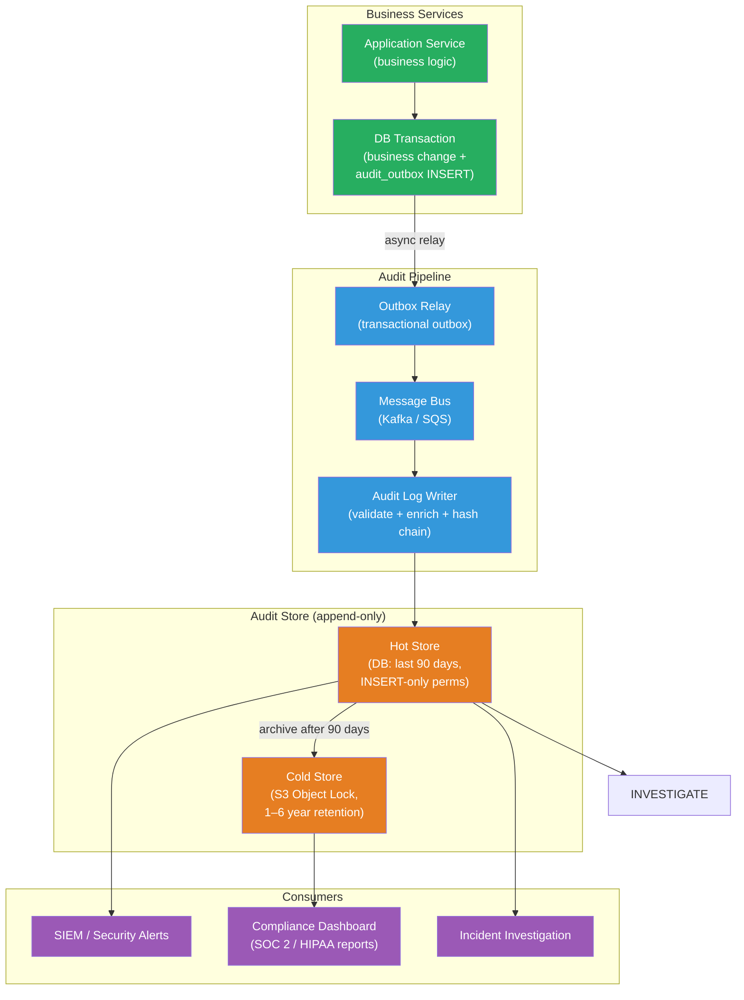

# [BEE-462] Audit Logging Architecture

:::info
An audit log is an append-only, tamper-evident record of who performed what action on which resource and when — serving compliance, security investigation, and accountability rather than operational observability.
:::

## Context

Operational logs (structured logs, traces, metrics) answer: "Is the system healthy? Where is the slowdown?" Audit logs answer a different question: "Who accessed this patient record? Who approved that payment? Who deleted that account?" These are fundamentally different consumers — developers and SREs read operational logs; compliance officers, security teams, and auditors read audit logs — and the engineering requirements follow from that difference.

NIST Special Publication 800-92 ("Guide to Computer Security Log Management," 2006) established the foundational framework: audit logs must capture the actor (who), the action (what), the resource (on what), the timestamp (when), and the outcome (success or failure). The OWASP Logging Cheat Sheet builds on this with application-level guidance: log all authentication events (success and failure), all authorization failures, all high-value transactions, and all administrative actions.

Compliance frameworks formalize retention and protection requirements. PCI-DSS Requirement 10 mandates that audit logs be retained for 12 months with the most recent 3 months immediately available for analysis. HIPAA 164.312(b) requires audit controls and 6-year retention. GDPR Article 5's accountability principle requires that controllers be able to demonstrate compliance, which in practice means retaining audit evidence for the duration of regulatory exposure. SOC 2 CC7 requires centralized logging and monitoring of security events.

The 2011 incident at HBGary Federal — where attackers covered their tracks by deleting server logs after exfiltrating data — became a textbook case for why audit logs must be stored separately from the systems they monitor, protected against modification, and ideally signed or hash-chained so tampering is detectable even if not preventable.

## Design Thinking

### Audit Logs vs. Operational Logs vs. Application Logs

The three are often stored together but serve distinct purposes and have different requirements:

| Property | Operational logs | Audit logs |
|---|---|---|
| Primary consumer | Developers, SREs | Compliance, security, auditors |
| Primary question | "Is it working?" | "Who did what, when?" |
| Retention | Days to weeks (hot) | Months to years (compliance-driven) |
| Mutability | Append-only (practical) | Append-only (required) |
| Tamper evidence | Not required | Required |
| PII | Minimize | Include what accountability requires |
| Search pattern | Time-window, error rate | Actor, resource, action, time range |

Storing audit logs in the same Elasticsearch cluster as operational logs is dangerous: Elasticsearch allows document updates and deletes, which undercuts the append-only guarantee. Audit logs belong in an append-only store: an immutable S3 bucket (with Object Lock), a Kafka topic with indefinite retention and controlled consumer groups, or a write-once database table with revocation of UPDATE/DELETE permissions.

### What Constitutes a Complete Audit Event

A complete audit event contains:

```json
{
  "event_id":    "uuid-v4",               // globally unique, idempotency key
  "timestamp":   "2024-03-15T10:23:45Z",  // RFC 3339 UTC; server clock, not client
  "actor": {
    "id":        "user-42",               // authenticated identity
    "type":      "user",                  // user | service | system
    "ip":        "203.0.113.7",           // source IP (IPv4 or IPv6)
    "session_id":"sess-abc123"            // for correlating a session's actions
  },
  "action":      "document.delete",       // namespace:verb form
  "resource": {
    "type":      "document",
    "id":        "doc-789",
    "tenant_id": "tenant-5"              // for multi-tenant systems
  },
  "outcome":     "success",              // success | failure | error
  "context": {
    "request_id": "req-xyz",             // distributed trace correlation
    "user_agent": "Mozilla/5.0 ...",
    "reason":     "user initiated"       // optional; used for admin impersonation
  },
  "diff": {                              // for update actions: before/after state
    "before": {"status": "active"},
    "after":  {"status": "archived"}
  }
}
```

The `diff` field records what changed, not just that a change happened. Without it, auditors can establish that user-42 updated document-789 at 10:23 but cannot determine what changed — which makes the log insufficient for forensic investigation.

### Hash Chaining for Tamper Evidence

Hash chaining makes retroactive tampering detectable. Each audit event includes the SHA-256 hash of the previous event. An auditor verifying the chain recomputes each hash and checks continuity: a gap, mismatch, or out-of-order timestamp indicates insertion, deletion, or modification.

AWS CloudTrail implements this in production: each hourly digest file contains a SHA-256 hash of every log file in the period plus the hash of the previous digest. Digest files are signed with RSA. This construction makes it cryptographically verifiable that no log files were deleted or modified between delivery and verification.

RFC 6962 (Certificate Transparency, 2013) takes the idea further with a Merkle tree: individual certificates can be proven present in the log (inclusion proof) and the tree's consistency can be verified without downloading every entry (consistency proof). The same construction can be applied to application audit logs.

## Best Practices

**MUST store audit logs in an append-only store with revoked write-update-delete permissions.** The application account that writes audit events MUST have only INSERT permission on the audit table, not UPDATE or DELETE. For object storage, use immutable bucket policies (AWS S3 Object Lock in Compliance mode, GCS retention policies). For Kafka, set `cleanup.policy=delete` with a long retention period and remove consumer group admin access from application accounts.

**MUST NOT log sensitive values.** Passwords, secret keys, session tokens, and credit card numbers MUST NOT appear in audit logs — they cannot be redacted after the fact if the log is immutable. When the audit event involves a credential change, log the action and the affected credential identifier (e.g., `api_key_id: "key-123"`) but not the credential value. PII beyond what accountability requires (actor identity, resource identity) SHOULD be minimized: log user IDs, not names or email addresses, when the ID suffices for accountability.

**MUST emit audit events from business logic, not database triggers.** Database triggers on `INSERT/UPDATE/DELETE` produce change records but lack business context: they capture what changed at the data layer without knowing which business action caused it, which user initiated it, or what the intended outcome was. Business logic has this context; emit the audit event at the point of action. Use an event bus (Kafka, SQS, an outbox table) to decouple emission from storage — the service records what happened; a separate audit log service stores it durably.

**MUST implement hash chaining for high-compliance contexts.** For systems subject to SOC 2, HIPAA, or financial regulations, compute `hash = SHA256(event_id + timestamp + actor + action + resource + outcome + prev_hash)` and store it with each event. The `prev_hash` of the first event is a known constant (e.g., all zeros). A periodic offline verification job checks chain continuity. This does not prevent compromise of the store, but it makes tampering detectable.

**SHOULD fan out audit events through a message bus rather than writing directly to the audit store.** Direct writes from application code to the audit database create a coupling and a synchronous failure mode: if the audit database is unavailable, the application must decide whether to fail the business operation or silently drop the audit event. The outbox pattern (write audit events to an `audit_outbox` table in the same transaction as the business event, then relay them asynchronously) provides at-least-once delivery without synchronous coupling.

**MUST define retention periods per compliance requirement and enforce automated expiry.** Mixing audit events with different retention requirements in a single store complicates purging. Partition by retention class: security audit events (authentication, authorization failures) at 1 year; administrative actions at 6 years for HIPAA environments; high-value transaction events at whatever the applicable financial regulation requires. Implement automated purging as a scheduled job — manual purging is operationally unreliable and creates audit gaps.

**SHOULD make audit logs searchable by actor, resource, and time range.** The primary query patterns are: "All actions by user X in the last 30 days", "All accesses to document Y", "All failed login attempts from IP Z in the last hour". Index on `(actor_id, timestamp)`, `(resource_type, resource_id, timestamp)`, and `(action, outcome, timestamp)`. Do not index on free-text fields (reason, user_agent) without a full-text search engine; these are low-cardinality accessors.

## Visual



## Example

**Audit event emission with outbox pattern (Python):**

```python
import hashlib
import json
import uuid
from datetime import datetime, timezone
from dataclasses import dataclass, asdict

@dataclass
class AuditEvent:
    actor_id: str
    actor_type: str          # "user" | "service" | "system"
    actor_ip: str
    action: str              # namespace:verb, e.g. "document.delete"
    resource_type: str
    resource_id: str
    outcome: str             # "success" | "failure"
    tenant_id: str | None = None
    diff: dict | None = None # before/after for update actions
    request_id: str | None = None

def emit_audit_event(db_conn, event: AuditEvent, prev_hash: str) -> str:
    """
    Write audit event to the outbox table within the caller's transaction.
    The outbox relay delivers it asynchronously to the audit store.
    prev_hash links this event to the previous one for chain verification.
    """
    event_id = str(uuid.uuid4())
    timestamp = datetime.now(timezone.utc).isoformat()

    # Hash covers all accountability fields; prev_hash links the chain
    payload = json.dumps({
        "event_id": event_id,
        "timestamp": timestamp,
        "actor_id": event.actor_id,
        "action": event.action,
        "resource_type": event.resource_type,
        "resource_id": event.resource_id,
        "outcome": event.outcome,
        "prev_hash": prev_hash,
    }, sort_keys=True)
    event_hash = hashlib.sha256(payload.encode()).hexdigest()

    db_conn.execute(
        """INSERT INTO audit_outbox
               (event_id, timestamp, actor_id, actor_type, actor_ip,
                action, resource_type, resource_id, tenant_id,
                outcome, diff, request_id, event_hash, prev_hash)
           VALUES (%s,%s,%s,%s,%s,%s,%s,%s,%s,%s,%s,%s,%s,%s)""",
        (event_id, timestamp, event.actor_id, event.actor_type, event.actor_ip,
         event.action, event.resource_type, event.resource_id, event.tenant_id,
         event.outcome, json.dumps(event.diff), event.request_id,
         event_hash, prev_hash)
    )
    # Return hash so caller can pass it as prev_hash for the next event
    return event_hash

# Usage: inside a business transaction
def delete_document(conn, user_id: str, doc_id: str, request_id: str):
    with conn.transaction():
        # 1. Record before-state for diff
        doc = conn.fetchone("SELECT * FROM documents WHERE id = %s", (doc_id,))

        # 2. Business operation
        conn.execute("DELETE FROM documents WHERE id = %s", (doc_id,))

        # 3. Audit event in the same transaction — atomic with the business change
        prev_hash = get_latest_audit_hash(conn)  # from audit_outbox or audit_log
        emit_audit_event(conn, AuditEvent(
            actor_id=user_id, actor_type="user", actor_ip=get_request_ip(),
            action="document.delete",
            resource_type="document", resource_id=doc_id,
            outcome="success",
            diff={"before": dict(doc), "after": None},
            request_id=request_id,
        ), prev_hash=prev_hash)
```

**Audit log table schema (INSERT-only access for application role):**

```sql
CREATE TABLE audit_log (
    event_id      UUID PRIMARY KEY,
    timestamp     TIMESTAMPTZ NOT NULL,
    actor_id      TEXT NOT NULL,
    actor_type    TEXT NOT NULL,
    actor_ip      INET,
    action        TEXT NOT NULL,
    resource_type TEXT NOT NULL,
    resource_id   TEXT NOT NULL,
    tenant_id     TEXT,
    outcome       TEXT NOT NULL CHECK (outcome IN ('success', 'failure', 'error')),
    diff          JSONB,
    request_id    TEXT,
    event_hash    TEXT NOT NULL,  -- SHA-256 of this event's fields + prev_hash
    prev_hash     TEXT NOT NULL,  -- SHA-256 of the previous event (chain link)
    created_at    TIMESTAMPTZ NOT NULL DEFAULT now()
);

-- Indexes for the three primary query patterns
CREATE INDEX idx_audit_actor    ON audit_log (actor_id, timestamp DESC);
CREATE INDEX idx_audit_resource ON audit_log (resource_type, resource_id, timestamp DESC);
CREATE INDEX idx_audit_action   ON audit_log (action, outcome, timestamp DESC);

-- Revoke UPDATE and DELETE from the application role
REVOKE UPDATE, DELETE ON audit_log FROM app_role;
```

## Compliance Reference

| Framework | What to log | Retention | Review cadence |
|---|---|---|---|
| GDPR Art. 5 | Accountability for processing activities | Proportionate to purpose | As needed |
| PCI-DSS Req. 10 | User actions, privileged access, auth events, changes | 12 months (3 months hot) | Daily |
| HIPAA 164.312(b) | System activity on ePHI | 6 years | As needed |
| SOC 2 CC7 | Security events, access, changes | Commonly 1 year | Continuous (SIEM) |
| NIST 800-92 | Per AU-2 control selection | Per AU-11 (risk-based) | Per AU-6 |

## Related BEEs

- [BEE-14002](../observability/structured-logging.md) -- Structured Logging: operational structured logs use the same JSON format and tooling as audit logs, but serve different consumers and have different retention and mutability requirements
- [BEE-7005](../data-modeling/designing-for-time-series-and-audit-data.md) -- Designing for Time-Series and Audit Data: covers the append-only schema pattern and time-based partitioning that underlie the audit log table design
- [BEE-19041](soft-deletes-and-data-retention.md) -- Soft Deletes and Data Retention: soft deletes are one alternative to hard deletes when audit trail of deleted records is needed; audit logging complements both approaches
- [BEE-19018](change-data-capture.md) -- Change Data Capture: CDC streams can feed the audit pipeline, but lack the business-layer context (which user, which business action) that application-level audit emission captures

## References

- [Logging Cheat Sheet -- OWASP](https://cheatsheetseries.owasp.org/cheatsheets/Logging_Cheat_Sheet.html)
- [Article 5: Principles Relating to Processing of Personal Data -- GDPR](https://gdpr-info.eu/art-5-gdpr/)
- [Guide to Computer Security Log Management (SP 800-92) -- NIST (2006)](https://nvlpubs.nist.gov/nistpubs/legacy/sp/nistspecialpublication800-92.pdf)
- [Log File Integrity Validation -- AWS CloudTrail Documentation](https://docs.aws.amazon.com/awscloudtrail/latest/userguide/cloudtrail-log-file-validation-intro.html)
- [RFC 6962: Certificate Transparency -- IETF (2013)](https://www.rfc-editor.org/rfc/rfc6962.html)
