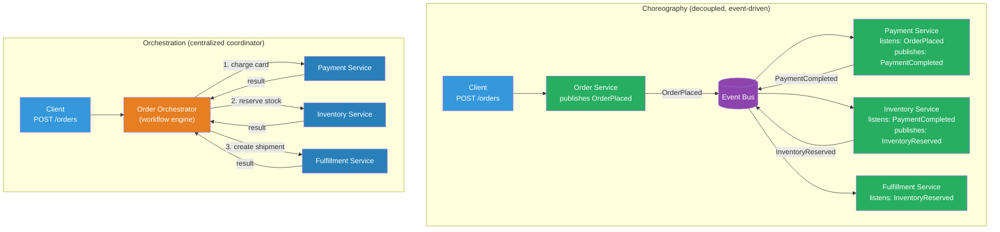

# [BEE-19052] Choreography vs Orchestration in Distributed Workflows

:::info
Choreography and orchestration are two models for coordinating work across distributed services: in choreography, each service reacts to events and decides its own next action; in orchestration, a central coordinator explicitly directs each service step-by-step.
:::

## Context

When an order is placed in an e-commerce system, a sequence of work must happen across multiple services: payment is charged, inventory is reserved, a fulfillment job is created, and a confirmation email is sent. The services that do this work are independently deployable, possibly owned by different teams. The question of *how they coordinate* is one of the most consequential architectural decisions in a distributed system.

Martin Fowler identified four styles of event-driven architecture in a 2017 article — event notification, event-carried state transfer, event sourcing, and CQRS — and noted that choreography and orchestration are orthogonal concerns that appear across all of them. The terms predate microservices: workflow orchestration engines like TIBCO and BEA BPEL servers existed in the early 2000s, and the choreography model was formalized in the WS-CDL (Web Services Choreography Description Language) specification. Sam Newman's "Building Microservices" (2nd ed., 2021) treats the choice as a core architectural decision, not an implementation detail.

In choreography, services communicate by publishing events. The payment service publishes `PaymentCompleted`; the inventory service listens and responds by publishing `InventoryReserved`; the fulfillment service listens and creates a shipment job. No service knows about the others — each only knows the events it consumes and produces. The system's behavior emerges from the sum of these reactions.

In orchestration, a coordinator service (the orchestrator) knows the full workflow: call payment service, then call inventory service, then call fulfillment service. The orchestrator explicitly invokes each participant and handles the results. The workflow's logic is centralized; participants are passive executors.

Neither model is universally superior. Choreography scales well and keeps services decoupled but makes the overall workflow invisible — it is distributed across event handlers in multiple services. Orchestration makes the workflow explicit and observable but introduces a coordinator that becomes a coupling point and single point of failure if not designed carefully.

## Design Thinking

### The Core Trade-off

| Dimension | Choreography | Orchestration |
|---|---|---|
| Coupling | Low — services only know events | Higher — orchestrator knows all participants |
| Workflow visibility | Implicit — reconstructed from event logs | Explicit — defined in one place |
| Error handling | Distributed — each service handles its own failures | Centralized — orchestrator implements retry/rollback logic |
| Testing | Hard — requires end-to-end event simulation | Easier — orchestrator logic is unit-testable |
| Debugging | Hard — distributed causality tracing | Easier — workflow state is centralized |
| Adding a new step | Low risk — add a listener, nothing changes | Requires updating the orchestrator |
| Long-running workflows | Complex — state scattered across services | Natural — orchestrator holds state |
| Team autonomy | High — teams publish events, consumers are independent | Lower — adding a step requires orchestrator change |

### When to Choose Choreography

Choreography fits when:
- Services are owned by independent teams who need to evolve without coordinating changes
- Workflows are short (2–3 steps) or acyclic with simple error cases
- The primary concern is decoupling: a new consumer should be able to react to an event without changing the producer
- Events have value to multiple consumers (fan-out): `OrderPlaced` triggers payment, inventory, analytics, and email simultaneously

### When to Choose Orchestration

Orchestration fits when:
- Workflows are long-running (minutes to days) with complex branching, retries, and compensating transactions
- The business process must be visible as a unit: "what is the current state of order #1234?"
- Error handling is complex: rollback logic that must coordinate across multiple participants
- Steps have strong ordering guarantees or dependencies that are difficult to express as event sequences
- Compliance requires a durable audit trail of which workflow step ran when and with what result

### The Saga Connection

The Saga pattern (BEE-8004) can be implemented with either model. A choreography-based saga uses events: `PaymentCompleted` triggers inventory reservation, `InventoryReserved` triggers fulfillment, and compensating events (`PaymentRefunded`, `InventoryReleased`) flow in reverse on failure. An orchestration-based saga uses an orchestrator that explicitly calls each step and issues compensating calls on failure. The orchestration-based saga is simpler to reason about and is the model used by systems like Temporal and Netflix Conductor.

### Hybrid Approaches

Large systems rarely use one model exclusively. A common pattern: use orchestration for critical, long-running business workflows (order fulfillment, user onboarding) where visibility and error handling are paramount; use choreography for loose integrations where new consumers are expected (analytics, notifications, audit logging). The boundary is usually the workflow's primary path (orchestrated) vs its side effects (choreographed).

## Best Practices

**MUST make the workflow visible regardless of model chosen.** In choreography, reconstruct workflow state from a correlation ID in the event log. In orchestration, use a workflow state table or engine that exposes current step, history, and error. A workflow that cannot be inspected cannot be debugged in production.

**MUST implement compensating transactions for every step that has observable side effects.** In a distributed workflow, partial failure is the norm: payment may succeed and inventory reservation may fail. Every step that commits external state (charged a card, sent an email, reserved stock) must have a defined compensation (refund, acknowledge duplicate, release reservation). This applies to both choreography and orchestration but is significantly easier to implement and verify in an orchestration model.

**MUST NOT implement long-running workflow state in the event handlers themselves.** In choreography, a service that receives an event and needs to "remember" what it did for a correlation ID is building an orchestrator disguised as an event handler. If your event handlers are accumulating per-workflow state, the workflow has outgrown choreography.

**SHOULD use a durable workflow engine (Temporal, Conductor, AWS Step Functions) for orchestration of critical workflows rather than building a custom state machine.** A custom orchestrator must handle process crashes, retries, timeouts, and exactly-once execution — problems that durable workflow engines solve. The code overhead of framework-specific SDK is worth it for workflows that must never silently fail.

**SHOULD assign a correlation ID to every distributed workflow and propagate it through all events and service calls.** The correlation ID ties together all the events, logs, and traces for a single workflow instance. Without it, debugging a choreography-based failure requires joining across multiple service logs with timestamps — a painful exercise at 3 AM.

**SHOULD define event contracts explicitly and version them.** In choreography, an event is a public API consumed by unknown listeners. Changing its schema is a breaking change. Apply the same schema evolution discipline to events that you apply to REST APIs (BEE-4002) and Protocol Buffers (BEE-19049): add fields, never remove or rename them without a versioned migration path.

**MAY use choreography for side-effect fan-out and orchestration for the primary workflow path.** When an order is confirmed, the primary path (payment → inventory → fulfillment) can be orchestrated; the side effects (analytics event, notification email, fraud signal) can be choreographed listeners on the `OrderConfirmed` event. This gives visibility where it matters and extensibility where teams need autonomy.

## Visual



## Example

**Choreography — event-driven order workflow:**

```python
# Each service independently subscribes to events; no service knows the others exist

# payment_service/handlers.py
@event_handler("OrderPlaced")
def on_order_placed(event: OrderPlaced) -> None:
    result = charge_card(event.payment_method, event.amount)
    if result.success:
        publish("PaymentCompleted", {
            "order_id": event.order_id,
            "correlation_id": event.correlation_id,
            "amount": event.amount,
        })
    else:
        publish("PaymentFailed", {
            "order_id": event.order_id,
            "correlation_id": event.correlation_id,
            "reason": result.error,
        })

# inventory_service/handlers.py
@event_handler("PaymentCompleted")
def on_payment_completed(event: PaymentCompleted) -> None:
    reserved = reserve_items(event.order_id)
    if reserved:
        publish("InventoryReserved", {
            "order_id": event.order_id,
            "correlation_id": event.correlation_id,
        })
    else:
        # Trigger compensation: refund the payment
        publish("InventoryReservationFailed", {
            "order_id": event.order_id,
            "correlation_id": event.correlation_id,
        })

# payment_service/handlers.py (compensating handler)
@event_handler("InventoryReservationFailed")
def on_inventory_failed(event: InventoryReservationFailed) -> None:
    refund_charge(event.order_id)
    publish("PaymentRefunded", {"order_id": event.order_id})
```

**Orchestration — Temporal workflow for the same process:**

```python
# workflows/order_workflow.py
# The full business process is defined in one place; each step is explicit

from temporalio import workflow, activity
from datetime import timedelta

@workflow.defn
class OrderWorkflow:
    @workflow.run
    async def run(self, order: Order) -> OrderResult:
        # Step 1: Charge payment — retry automatically on transient failures
        payment = await workflow.execute_activity(
            charge_payment,
            args=[order.payment_method, order.total_amount],
            start_to_close_timeout=timedelta(seconds=30),
            retry_policy=RetryPolicy(maximum_attempts=3),
        )

        # Step 2: Reserve inventory — compensate on failure
        try:
            reservation = await workflow.execute_activity(
                reserve_inventory,
                args=[order.items],
                start_to_close_timeout=timedelta(seconds=30),
            )
        except ActivityError:
            # Compensation: refund the charge before propagating failure
            await workflow.execute_activity(
                refund_payment,
                args=[payment.charge_id],
                start_to_close_timeout=timedelta(seconds=30),
            )
            raise

        # Step 3: Create fulfillment job
        shipment = await workflow.execute_activity(
            create_shipment,
            args=[order.id, reservation.items, order.shipping_address],
            start_to_close_timeout=timedelta(seconds=30),
        )

        return OrderResult(
            order_id=order.id,
            charge_id=payment.charge_id,
            shipment_id=shipment.id,
        )

# Activities are just regular functions — they can be in any service
@activity.defn
async def charge_payment(method: PaymentMethod, amount: Money) -> PaymentResult:
    return await payment_client.charge(method, amount)

@activity.defn
async def reserve_inventory(items: list[OrderItem]) -> ReservationResult:
    return await inventory_client.reserve(items)
```

**Correlation ID propagation (applies to both models):**

```python
import uuid

# On workflow initiation: assign a correlation ID
def place_order(request: OrderRequest) -> str:
    correlation_id = str(uuid.uuid4())
    publish("OrderPlaced", {
        **request.dict(),
        "correlation_id": correlation_id,  # propagated through all events
    })
    return correlation_id

# In all event handlers: log with correlation ID for traceability
@event_handler("PaymentCompleted")
def on_payment_completed(event: PaymentCompleted) -> None:
    logger.info("payment completed",
        order_id=event.order_id,
        correlation_id=event.correlation_id,  # enables log correlation across services
    )
```

## Implementation Notes

**Temporal / Cadence**: Purpose-built durable execution engines for orchestration. Workflows survive process crashes — state is persisted as an event history and replayed on restart. The programming model uses regular async/await code; the framework makes it durable. Temporal is the recommended choice for new orchestration workflows; Cadence is its predecessor at Uber.

**Netflix Conductor**: A REST-based workflow orchestration engine. Workflows are defined as JSON task graphs; workers poll for tasks. More language-agnostic than Temporal (which uses language-specific SDKs) but more operational overhead.

**AWS Step Functions**: Managed orchestration service. State machines defined in Amazon States Language (JSON). Integrates natively with Lambda, ECS, and other AWS services. Standard vs Express workflows differ in durability and pricing model.

**Apache Kafka / RabbitMQ / SQS**: The event buses that enable choreography. Events are published to topics/queues; consumers subscribe. The choreography pattern has no special framework — it is a design convention enforced by code review and schema registries (Confluent Schema Registry, AWS Glue).

**BPMN (Business Process Model and Notation)**: A graphical standard for workflow definitions, maintained by OMG. Implemented by Camunda (open-source BPM engine), Zeebe (Camunda's cloud-native engine), and others. BPMN workflows can be directly imported into Camunda and executed. Heavier than Temporal's code-based approach but business-readable.

## Related BEEs

- [BEE-8004](../transactions/saga-pattern.md) -- Saga Pattern: Sagas are the distributed transaction pattern that requires either choreography or orchestration to coordinate compensating transactions across services
- [BEE-10002](../messaging/publish-subscribe-pattern.md) -- Publish-Subscribe Pattern: choreography is built on pub/sub; understanding fan-out, consumer groups, and event ordering is prerequisite for choreography-based workflows
- [BEE-5003](../architecture-patterns/cqrs.md) -- CQRS: orchestrators are a natural fit for the command side of CQRS; the orchestrator handles commands and produces events that update read models
- [BEE-10003](../messaging/delivery-guarantees.md) -- Delivery Guarantees: in choreography, event delivery guarantees (at-least-once, exactly-once) determine whether event handlers must be idempotent — they must

## References

- [What do you mean by "Event-Driven"? — Martin Fowler](https://martinfowler.com/articles/201701-event-driven.html)
- [Building Microservices, 2nd Edition — Sam Newman (O'Reilly, 2021)](https://www.oreilly.com/library/view/building-microservices-2nd/9781492034018/)
- [Practical Process Automation — Bernd Ruecker (O'Reilly, 2021)](https://www.oreilly.com/library/view/practical-process-automation/9781492061441/)
- [Temporal Documentation — Workflows and Activities](https://temporal.io/)
- [BPMN 2.0 Specification — Object Management Group](https://www.omg.org/spec/BPMN/2.0.2/About-BPMN)
