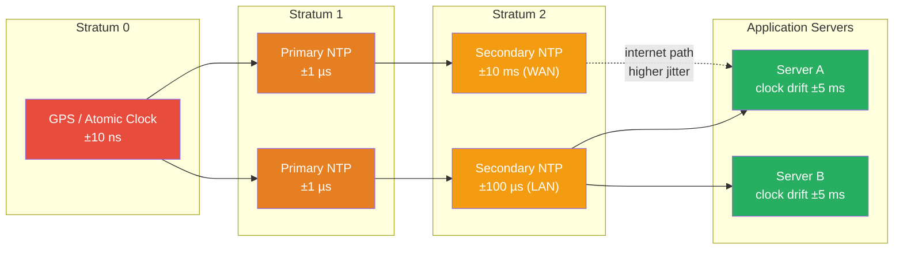

# [BEE-19008] Clock Synchronization and Physical Time

:::info
Physical clocks in distributed systems drift independently and cannot be perfectly synchronized — forcing engineers to choose between accepting bounded uncertainty (NTP, PTP), bounding and exposing uncertainty explicitly (TrueTime), or combining physical and logical clocks to get both causality and time semantics (Hybrid Logical Clocks).
:::

## Context

Every computer has a crystal oscillator that drives its clock. Crystal oscillators drift — a typical server-grade quartz crystal drifts 20–50 ppm (parts per million), which translates to 1.7–4.3 seconds of divergence per day. Two servers that never communicate will have clocks that diverge by seconds within weeks. This is not a failure condition — it is the physical baseline.

Leslie Lamport established the theoretical foundation in 1978 in "Time, Clocks, and the Ordering of Events in a Distributed System" (Communications of the ACM, July 1978). His central observation: a distributed system cannot rely on synchronized physical clocks for determining event ordering, because processes have no shared notion of time. His proposed solution — logical clocks based on the happens-before relationship — sidesteps physical time entirely (see BEE-19003 for the full treatment). But logical clocks carry no information about wall-clock time, which matters when you need to answer questions like "what was the state of this system at 14:00:00 UTC?" or "did this commit happen before or after that one in calendar time?"

The practical solution for most systems is NTP (Network Time Protocol), designed by David Mills at the University of Delaware, with the protocol first published in RFC 958 (1985) and the current version NTPv4 specified in RFC 5905 (2010). NTP organizes time sources into a **stratum hierarchy**: stratum 0 comprises GPS receivers and atomic clocks; stratum 1 servers synchronize directly from stratum 0; stratum 2 servers synchronize from stratum 1, and so on. On a well-configured LAN, NTP achieves synchronization within hundreds of microseconds; over the internet, accuracy degrades to 1–10 milliseconds. NTP uses Marzullo's algorithm (Keith Marzullo, 1984) to select among multiple time sources: each source reports a confidence interval `[c-r, c+r]`; the algorithm finds the smallest intersection consistent with the most sources, rejecting outliers that are likely faulty clocks.

The problem NTP cannot solve is **bounding the uncertainty**. NTP will correct your clock to within ~10ms, but it cannot guarantee that any given reading is accurate to within that bound. A process that reads the clock at time T does not know whether the true time is T-5ms, T, or T+5ms. For most applications this imprecision is invisible. For global distributed databases that want to provide external consistency — the guarantee that if transaction A commits before transaction B starts, every observer sees A's writes before B's — it becomes critical.

Google's Spanner team solved this with **TrueTime**, described in "Spanner: Google's Globally-Distributed Database" (Corbett et al., OSDI 2012). Instead of returning a point estimate, TrueTime's API returns an interval: `TT.now()` yields `[earliest, latest]` such that the true current time is guaranteed to lie within the interval. Google achieves this by deploying GPS receivers and atomic clocks at every datacenter; the uncertainty epsilon (half-width of the interval) stays below 7ms in practice, typically 1–4ms. Spanner implements external consistency by having each transaction wait for the uncertainty window to expire before committing: if a transaction wants to commit at time `s`, it delays until `TT.now().earliest > s`, ensuring no future transaction can have a commit timestamp that falls before `s` by more than the uncertainty window.

**Hybrid Logical Clocks (HLC)**, introduced by Kulkarni, Demirbas, et al. in 2014 ("Logical Physical Clocks and Consistent Snapshots in Globally Distributed Databases," OPODIS 2014), bridge the gap between Lamport clocks and physical clocks. An HLC timestamp is a pair `(physical_time, logical_counter)`. The physical component advances with wall-clock time; the logical component increments when physical time alone cannot distinguish causally related events. HLC timestamps are bounded to within epsilon of physical time, enabling queries like "give me a consistent snapshot as of 14:00:00 UTC" while still capturing causality. CockroachDB uses HLC internally for multi-version concurrency control and timestamp ordering.

**IEEE 1588 PTP (Precision Time Protocol)** takes a different approach: hardware timestamping at the NIC, capturing the transmit and receive time of synchronization packets at the Ethernet layer before any software jitter is introduced. Sub-microsecond accuracy is achievable on a properly configured PTP domain. PTP is used in high-frequency trading, where microsecond precision matters for regulatory compliance and sequencing, and in 5G telecom base stations, where timing must be within ±1.5 microseconds of UTC.

## Design Thinking

**Choose your synchronization tier based on what failure means for your workload.** NTP suffices for logging and metrics timestamps where a few milliseconds of skew is unobservable. HLC suffices for distributed databases that need causally consistent snapshots without needing absolute time guarantees. TrueTime (or a close approximation with atomic clocks and GPS) is required only when external consistency at the transaction level is a correctness requirement, not just a performance goal.

**Never assume clock monotonicity across nodes.** NTP can step the clock backward during a correction. A distributed protocol that computes `event_time = local_clock()` and compares it to a remote timestamp without accounting for skew will behave incorrectly — sometimes for reads that should have seen a write, sometimes for ordering that inverts cause and effect. Any comparison of cross-node timestamps must include an uncertainty budget.

**Clock skew is bounded, not absent.** Even without NTP, operating systems discipline their clocks (slew, not step) to avoid large backward jumps. The practical concern is not catastrophic drift but the steady-state skew between nodes — and knowing what that skew bound is for your deployment. CockroachDB's `max_offset` configuration (default 500ms) is an explicit declaration: "we guarantee NTP keeps clocks within this bound." The system is designed around that guarantee. If NTP fails and drift exceeds 80% of `max_offset`, CockroachDB nodes shut themselves down rather than serve inconsistent reads.

## Visual



## Example

**TrueTime-style commit wait (Spanner pattern):**

```
# External consistency requirement:
# If txn A commits before txn B starts, every reader must see A's writes before B's.

# Without TrueTime: NTP says it is 14:00:00.005 but true time might be 14:00:00.012
# If B assigns commit_time = 14:00:00.003 (before A's actual commit), ordering inverts.

# With TrueTime:
#   TT.now() = [earliest=14:00:00.001, latest=14:00:00.008]   # 7ms uncertainty window
#   chosen_commit_timestamp = TT.now().latest  # = 14:00:00.008

# Commit wait: delay until TT.now().earliest > chosen_commit_timestamp
#   i.e., until we are certain the entire world is past 14:00:00.008

while TT.now().earliest < chosen_commit_timestamp:
    sleep(1ms)                              # wait out the uncertainty

# Now commit.  Any transaction started AFTER this moment will get a timestamp
# that TrueTime guarantees is > 14:00:00.008 → correct ordering assured.

# Expected delay: epsilon ≈ 1–7ms (Google's GPS+atomic clock deployment)
# With NTP only: epsilon unknown, could be 50ms → commit wait is unsafe
```

**Hybrid Logical Clock (HLC) advancement:**

```
# State per process: (physical_component, logical_counter)
# Notation: HLC = (pt, lc)

# On sending message:
local_pt = wall_clock_now()
if local_pt > hlc.pt:
    hlc = (local_pt, 0)          # wall clock advanced past HLC → reset counter
else:
    hlc = (hlc.pt, hlc.lc + 1)  # HLC already ahead → increment logical counter
attach hlc to message

# On receiving message with sender_hlc = (s_pt, s_lc):
local_pt = wall_clock_now()
if local_pt > hlc.pt and local_pt > s_pt:
    hlc = (local_pt, 0)
elif s_pt > hlc.pt:
    hlc = (s_pt, s_lc + 1)      # adopt sender's physical time, increment counter
elif hlc.pt == s_pt:
    hlc = (hlc.pt, max(hlc.lc, s_lc) + 1)  # same pt: take max counter + 1
else:
    hlc = (hlc.pt, hlc.lc + 1)

# Properties:
# - HLC timestamp always >= physical clock (never behind)
# - HLC.pt is within ε of true physical time (bounded by NTP accuracy)
# - If A happens-before B, then HLC(A) < HLC(B)  (causality preserved)
# - Enables consistent snapshot reads at "wall clock time T":
#   include all commits with HLC.pt <= T
```

**Clock skew impact on CockroachDB reads:**

```
# CockroachDB uncertainty interval:
# When a transaction starts at time T, it must treat any value written
# in [T - max_offset, T] as "uncertain" and may restart to read at higher ts.

# max_offset = 500ms (default)
# Transaction starts at T = 1000ms

# Values in uncertainty window [500ms, 1000ms]:
# → Transaction may see these OR restart to read a later version
# → Occasional uncertainty restarts are normal and expected

# If clock skew exceeds 0.8 * max_offset = 400ms:
# → CockroachDB node shuts down ("clock is unreliable; refusing to serve reads")
# → Prevents stale reads that would violate serializable isolation

# Tuning: if NTP is well-maintained, max_offset can be lowered to 250ms
# → Smaller uncertainty windows → fewer restarts → higher throughput
```

## Related BEEs

- [BEE-19003](vector-clocks-and-logical-timestamps.md) -- Vector Clocks and Logical Timestamps: Lamport clocks and vector clocks solve ordering without physical time; HLC bridges logical and physical approaches
- [BEE-19002](consensus-algorithms-paxos-and-raft.md) -- Consensus Algorithms: Raft leader elections use timeouts (not clocks) precisely because clock skew would make time-based leader validity unsafe; Spanner uses TrueTime to assign globally consistent commit timestamps
- [BEE-8001](../transactions/acid-properties.md) -- ACID Properties: external consistency (the global generalization of serializability) is what TrueTime enables at planetary scale; local ACID does not require synchronized clocks
- [BEE-8005](../transactions/idempotency-and-exactly-once-semantics.md) -- Idempotency and Exactly-Once Semantics: event deduplication often relies on timestamps; if two events share a timestamp due to clock skew, idempotency keys become the reliable alternative

## References

- [Time, Clocks, and the Ordering of Events in a Distributed System -- Leslie Lamport, Communications of the ACM, July 1978](https://dl.acm.org/doi/10.1145/359545.359563)
- [Spanner: Google's Globally-Distributed Database -- Corbett et al., OSDI 2012](https://www.usenix.org/system/files/conference/osdi12/osdi12-final-16.pdf)
- [Logical Physical Clocks and Consistent Snapshots in Globally Distributed Databases -- Kulkarni et al., OPODIS 2014](https://cse.buffalo.edu/tech-reports/2014-04.pdf)
- [Network Time Protocol Version 4: Protocol and Algorithms Specification -- RFC 5905, IETF, 2010](https://datatracker.ietf.org/doc/html/rfc5905)
- [Living Without Atomic Clocks: CockroachDB's Clock Management -- CockroachDB Engineering Blog](https://www.cockroachlabs.com/blog/clock-management-cockroachdb/)
- [IEEE 1588-2008: IEEE Standard for a Precision Clock Synchronization Protocol -- IEEE](https://standards.ieee.org/standard/1588-2008.html)
