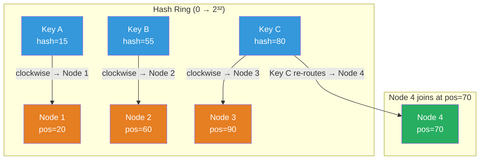

# [BEE-19006] Consistent Hashing

:::info
Consistent hashing maps both nodes and keys onto a circular hash ring so that when nodes are added or removed, only O(K/N) keys must be remapped — compared to O(K) for modular hashing — making it the foundational partitioning algorithm for distributed caches, key-value stores, and CDN request routing.
:::

## Context

The naive approach to distributing K keys across N nodes is modular hashing: `node = hash(key) % N`. This is fast and uniform, but it breaks down when N changes. Adding a single node changes the modulus, causing nearly all keys to hash to different nodes. In a distributed cache, this means a mass cache miss event; in a distributed database, it means moving nearly all data.

David Karger and colleagues at MIT described the solution in 1997 in "Consistent Hashing and Random Trees: Distributed Caching Protocols for Relieving Hot Spots on the World Wide Web" (ACM STOC 1997). If both nodes and keys are mapped to the same circular hash space (a ring from 0 to 2³²), then each key belongs to the nearest node clockwise on the ring. When a node joins, it takes over only the keys between itself and its predecessor; when it leaves, those same keys move to its successor. In both cases, only K/N keys change hands instead of nearly all K.

The 1997 paper also introduced **virtual nodes** (the paper calls them "replicas of each site"): instead of each physical node occupying one ring position, it occupies many. If each of N nodes maps to m positions, the ring has N×m total points. This reduces the variance in load distribution: with one position per node, the fraction of the ring owned by any node follows a distribution with high variance, meaning some nodes become hotspots. With m positions per node, the variance shrinks by a factor of approximately m. In practice, 100–256 virtual nodes per physical node brings the standard deviation of load below 10%.

Amazon Dynamo (DeCandia et al., SOSP 2007) applied consistent hashing at scale for a production key-value store serving Amazon's shopping cart and order systems. Dynamo assigns each physical node a set of tokens (positions) on the ring and replicates each key to the next N-1 unique physical nodes clockwise — skipping virtual nodes that belong to the same physical host. This ensures replicas land on distinct machines regardless of vnode count.

Apache Cassandra inherits Dynamo's ring model. Each node is assigned multiple tokens; the default in older versions was 8 vnodes, but DataStax now recommends 256 for more even distribution. Memcached clients adopted consistent hashing through the **ketama** library (Last.fm, 2007), which hashes each server to 100–200 ring points and routes cache keys to the nearest point.

**Redis Cluster is not consistent hashing.** Redis 3.0 uses 16,384 fixed **hash slots** (`CRC16(key) % 16384`), explicitly assigned to nodes by administrators. The remapping is deterministic and controlled rather than automatic — a design tradeoff that favors operational predictability over seamless elasticity.

Two alternatives to Karger's ring algorithm are worth knowing. **Rendezvous hashing** (Thaler and Ravishankar, University of Michigan, 1996) assigns a key to the node with the highest `hash(key, node_id)` score across all nodes. It achieves the same O(K/N) remapping property with no ring data structure, but requires O(N) work per key lookup as cluster size grows. **Jump consistent hash** (Lamping and Veach, Google, arXiv:1406.2294, 2014) produces an even distribution in O(1) memory and roughly five lines of code but requires that buckets be sequentially numbered — it suits data sharding but not arbitrary node membership changes.

## Design Thinking

**Consistent hashing solves the elasticity problem, not the hotspot problem.** A popular key will still hammer whichever node owns it regardless of the ring algorithm. Consistent hashing distributes ownership evenly in aggregate, but a single viral key is a separate concern handled by caching at a higher layer or key-splitting.

**Virtual node count is a calibration between operational simplicity and load balance.** More vnodes mean smoother rebalancing — when a node is added, it steals a small slice from many predecessors instead of a large slice from one. The downside is that node failure redistributes load to many different successors, which can create many small movements that are hard to observe. Cassandra's recommendation of 256 vnodes per node balances these factors for typical workloads.

**Consistent hashing is stateful infrastructure — the ring must be consistently replicated.** Every node in a cluster needs the same view of which virtual nodes exist. Disagreement about ring membership causes split-brain key routing. Production systems use gossip (BEE-19004) or consensus (BEE-19002) to propagate ring state and detect divergence.

## Visual



## Example

**Consistent hashing lookup (pseudocode):**

```
# Ring: sorted list of (position, node_id) tuples, including virtual nodes
# Each physical node N maps to positions: hash("N@0"), hash("N@1"), ..., hash("N@99")

ring = SortedList of (position, node_id)

# Populate ring with virtual nodes
for each node in cluster:
    for i in 0..100:
        pos = hash(f"{node.id}@{i}")  # e.g., MD5 or SHA1 truncated to uint32
        ring.insert((pos, node.id))

# Route a key
def get_node(key):
    pos = hash(key)
    # Binary search for first ring position >= pos (wrap around if past end)
    idx = ring.bisect_left(pos)
    if idx == len(ring):
        idx = 0                         # wrap: pos is past the last entry
    return ring[idx].node_id

# Node "cache-3" joins:
for i in 0..100:
    pos = hash(f"cache-3@{i}")
    ring.insert((pos, "cache-3"))
# Only keys in (predecessor[pos], pos] for each of cache-3's 100 positions move.
# Expected fraction of keys moved: 100 / (N_old * 100 + 100) ≈ 1/(N_old + 1)

# Node "cache-1" leaves:
for i in 0..100:
    pos = hash(f"cache-1@{i}")
    ring.remove((pos, "cache-1"))
# Keys owned by cache-1's positions now route to their successors — no other keys move.
```

**Variance with virtual nodes (observed from Cassandra benchmarks):**

```
vnodes per node | std dev of load | 99th-pct range
----------------+-----------------+-------------------
       1        |     ~50%        | 0.10× – 2.50× avg
      10        |     ~25%        | 0.40× – 1.80× avg
     100        |     ~10%        | 0.76× – 1.28× avg
     256        |     ~ 5%        | 0.88× – 1.12× avg
    1000        |     ~ 3%        | 0.92× – 1.09× avg
```

## Related BEEs

- [BEE-6004](../data-storage/partitioning-and-sharding.md) -- Partitioning and Sharding: consistent hashing is one strategy for deciding which shard owns a key; virtual nodes address the rebalancing overhead of range-based partitioning
- [BEE-9004](../caching/distributed-caching.md) -- Distributed Caching: Memcached clusters route cache keys via consistent hashing (ketama); replacing a cache node causes only K/N cache misses rather than a full cold-cache event
- [BEE-19004](gossip-protocols.md) -- Gossip Protocols: ring membership changes must be propagated cluster-wide; Cassandra and Consul use gossip to disseminate token ring updates
- [BEE-19002](consensus-algorithms-paxos-and-raft.md) -- Consensus Algorithms: etcd and ZooKeeper store ring metadata in a consistent log so all nodes see the same ring state without split-brain routing

## References

- [Consistent Hashing and Random Trees -- Karger et al., ACM STOC 1997](https://dl.acm.org/doi/10.1145/258533.258660)
- [Dynamo: Amazon's Highly Available Key-value Store -- DeCandia et al., SOSP 2007](https://www.allthingsdistributed.com/files/amazon-dynamo-sosp2007.pdf)
- [A Fast, Minimal Memory, Consistent Hash Algorithm -- Lamping & Veach, arXiv:1406.2294, 2014](https://arxiv.org/abs/1406.2294)
- [A Name-Based Mapping Scheme for Rendezvous -- Thaler & Ravishankar, University of Michigan, 1996](https://www.eecs.umich.edu/techreports/cse/96/CSE-TR-316-96.pdf)
- [libketama: Consistent Hashing for Memcached Clients -- Richard Jones, Last.fm Engineering, 2007](https://www.metabrew.com/article/libketama-consistent-hashing-algo-memcached-clients)
- [Redis Cluster Specification -- Redis Documentation](https://redis.io/docs/latest/operate/oss_and_stack/reference/cluster-spec/)
- [Data Distribution: How Does Cassandra Distribute Data? -- DataStax Documentation](https://docs.datastax.com/en/cassandra-oss/3.0/cassandra/architecture/archDataDistributeHashing.html)
