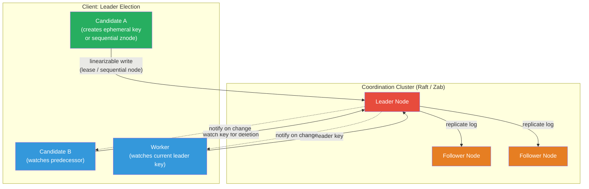

# [BEE-19029] Coordination Services

:::info
A coordination service is a fault-tolerant, strongly-consistent store of small metadata that provides building blocks — watches, ephemeral nodes or leases, atomic transactions — from which distributed applications compose higher-level primitives like leader election, distributed locks, service discovery, and configuration distribution without each application re-implementing consensus.
:::

## Context

Coordination is the hard part of building distributed systems. Every production system eventually needs leader election so that one instance acts as primary, distributed locks so that only one worker processes a task, and distributed configuration so that a change propagates atomically to all service instances. The naive approach is to build each primitive from scratch on top of a relational database or a message queue — approaches that work poorly because they mix coordination semantics (watch-for-change, session-expiry-equals-release) with storage semantics (persistence, large values, batch writes).

Patrick Hunt, Mahadev Konar, Flavio Junqueira, and Benjamin Reed at Yahoo described the design philosophy in "ZooKeeper: Wait-free Coordination for Internet-scale Systems" (USENIX ATC, 2010). Their insight was that a coordination service should not implement specific algorithms — it should expose primitives from which clients compose algorithms. ZooKeeper's three core primitives (the hierarchical znode namespace, one-shot watches, and ephemeral nodes that vanish when a client session ends) are sufficient to implement arbitrary coordination recipes without embedding any single algorithm in the service itself. The paper reports that ZooKeeper was serving 700K operations/second at Yahoo at time of publication.

etcd was created by Brandon Philips and the CoreOS team in 2013 as a simpler, Raft-based alternative with a flat key-value API and gRPC transport. Its adoption exploded when Kubernetes chose it as the sole backing store for the control plane in 2014. Every Kubernetes object — pods, deployments, nodes, endpoints — is stored as a key-value entry in etcd; every controller watches a key prefix for changes and reacts to state transitions. etcd's MVCC architecture, where every write creates a new global revision rather than overwriting, means that Kubernetes controllers can reliably resume a watch after a connection drop without missing events — by subscribing from the last-seen revision rather than the current state.

## Design Thinking

**Coordination services are not databases.** They are purpose-built for small, frequently-read metadata (service addresses, leader identity, lock tokens, feature flags) and favor low-latency reads, linearizable writes, and event-driven watches over throughput, large values, or complex queries. ZooKeeper recommends storing at most 1 MB per znode; etcd has a hard limit of 1.5 MB per key and a total cluster data size target of 8 GB. Storing application data in a coordination service causes compaction storms, performance degradation, and eventual cluster exhaustion.

**Every write is a consensus round.** Under both ZooKeeper (Zab protocol) and etcd (Raft), all mutating operations are serialized through the leader. A write requires a quorum of nodes to acknowledge the log entry before the leader applies it and responds to the client. This makes writes durable and linearizable but also relatively expensive (3–10 ms) compared to a key-value cache. Read throughput can be scaled by adding followers (for stale reads) but linearizable reads always require a leader round-trip. Sizing a coordination cluster at 3 or 5 nodes (never even-numbered) gives fault tolerance of 1 or 2 node failures respectively, while larger clusters increase write latency without improving fault tolerance.

**Ephemeral nodes and leases are the liveness mechanism.** Leader election and distributed locking work by tying resource ownership to session health. In ZooKeeper, an ephemeral znode is automatically deleted when the client session that created it expires; session expiry is the mechanism by which a crashed lock holder releases the lock. In etcd, a lease is a time-to-live token that the client must periodically renew; keys attached to the lease expire when the lease is not renewed. Both mechanisms require the application to handle the session-loss or lease-expiry event and potentially re-acquire coordination primitives.

## Visual



## Best Practices

**MUST NOT use a coordination service as a general-purpose cache or database.** Store only coordination metadata: lock tokens, leader identity, service endpoints, feature flags. If you find yourself storing multi-kilobyte values or accumulating millions of keys, the data belongs in a database with the coordination service holding only a reference.

**MUST handle session expiry and lease expiry in application code.** The ephemeral-node / lease mechanism is the only way a lock is released when a lock holder crashes — but it also means that a live application whose network is briefly partitioned may lose its session or lease, even though it is still running. Applications MUST detect session loss events and re-establish coordination state (re-create the ephemeral node, re-acquire the lock) rather than assuming coordination state is permanent.

**Use linearizable reads when correctness requires up-to-date data.** ZooKeeper followers serve reads from local state, which may lag the leader; a stale read may show a leader identity that has already changed. Use `sync()` before a read to guarantee the follower is caught up. In etcd, the default `Get` is linearizable (routed through leader); stale reads can be opted into with `WithSerializable()` for lower latency when freshness does not matter.

**Scope watches to the narrowest key range needed.** Each watch is a server-side resource. In ZooKeeper, watches are one-shot and must be re-registered after each notification — a common source of missed events if re-registration is not done before processing the notification. In etcd, a single watch stream is multiplexed on one connection and delivers all events in order; watches on large key ranges with high mutation rates can overwhelm a client's event processing loop. Scope watches to the specific key or prefix that the client cares about.

**Set session timeouts and lease TTLs to match the failure detection window.** A ZooKeeper session timeout of 2 seconds means a crashed client releases its ephemeral nodes within 2 seconds — acceptable for most leader election scenarios but too slow for latency-sensitive failover. Setting the timeout too short (< 1 second) risks spurious session expiry under transient network jitter. A lease TTL in etcd serves the same purpose; the client SHOULD renew the lease at half the TTL interval to provide a renewal safety margin.

**Run coordination clusters at 3 or 5 nodes, never 4 or 2.** A 3-node cluster tolerates 1 failure (quorum = 2); a 5-node cluster tolerates 2 failures (quorum = 3). A 4-node cluster also tolerates only 1 failure (quorum = 3) — providing no additional fault tolerance over 3 nodes while adding a node that increases write latency. Never run with 2 nodes: the loss of either node loses quorum and makes the cluster unavailable.

## Deep Dive

**ZooKeeper's znode types and the sequential-ephemeral recipe.** ZooKeeper has four znode types: *persistent* (survives session), *ephemeral* (deleted on session expiry), *persistent sequential* (persistent + monotonic sequence number appended), and *ephemeral sequential*. The last type is the foundation of all wait-free recipes. To implement a distributed lock: each candidate creates an ephemeral sequential znode under a parent path (e.g., `/locks/my_lock_0000000017`). The candidate with the lowest sequence number holds the lock. All others watch only the znode with the immediately preceding sequence number — not the lock parent — so that when the lock holder releases (or its session expires), only the next candidate is notified, avoiding herd effect. Leader election works identically: the node with the lowest sequence number is the leader.

**etcd's MVCC watch history.** etcd assigns a global *revision* to every write — a 64-bit integer that increments monotonically across all keys in the cluster. When a client subscribes to a watch, it can specify a starting revision: `Watch(key, WithRev(lastSeenRevision))`. etcd stores a compaction window of historical revisions (configurable, default 5 minutes for Kubernetes). A client that was disconnected for less than the compaction window can resume a watch and receive all events it missed, in order. This is fundamentally different from ZooKeeper's one-shot watches, which deliver only the existence of a change, not queued missed events.

**etcd transactions as conditional multi-key operations.** etcd transactions (`Txn`) combine a set of compare operations and two branches (success / failure), all applied atomically in a single Raft log entry: `if (key A version == X AND key B value == Y) then { put C, delete D } else { put E }`. This is the building block for CAS-based locks: create a key only if it does not exist (`version == 0`), store the lock identity in the value, and attach a lease to the key so it auto-expires. The etcd concurrency package implements exactly this for distributed mutexes and leader election.

**Kubernetes and etcd: every object is a watch target.** Kubernetes stores every API object at a structured key such as `/registry/pods/default/nginx`. Controller-manager instances watch key prefixes (e.g., `/registry/pods/`) using etcd's range watch. When a new pod is created, the kubelet on the assigned node receives a watch notification for its hostname prefix, pulls the pod spec, and starts the container. The `resourceVersion` field on every Kubernetes object IS the etcd revision at the time of the last write — passed back to `kubectl` clients and used to detect concurrent modifications.

## Example

**ZooKeeper leader election (Python with Kazoo):**

```python
from kazoo.client import KazooClient
from kazoo.recipe.election import Election

zk = KazooClient(hosts='zk1:2181,zk2:2181,zk3:2181')
zk.start()

# KazooClient.Election wraps the sequential ephemeral znode recipe
election = Election(zk, "/services/my-worker/election")

def on_elected():
    """Called when this instance becomes the leader."""
    print("I am the leader — starting primary work")
    # ... do leader work; election releases the lock on function return

election.run(on_elected)  # blocks until elected, calls on_elected, then releases

# Manual sequential ephemeral znode (to illustrate the recipe):
leader_path = zk.create(
    "/locks/election-",
    ephemeral=True,
    sequence=True,      # produces /locks/election-0000000017
)
children = sorted(zk.get_children("/locks"))
if children[0] == leader_path.split("/")[-1]:
    print("This node is the leader")
else:
    # Watch the preceding node — not the parent — to avoid herd effect
    predecessor = children[children.index(leader_path.split("/")[-1]) - 1]
    @zk.DataWatch(f"/locks/{predecessor}")
    def watch_predecessor(data, stat, event=None):
        if event and event.type == "DELETED":
            # predecessor released — re-check leadership
            pass
```

**etcd leader election (Go with the concurrency package):**

```go
import (
    "context"
    clientv3 "go.etcd.io/etcd/client/v3"
    "go.etcd.io/etcd/client/v3/concurrency"
)

func runLeaderElection(ctx context.Context, client *clientv3.Client) error {
    // Create a session with a 10-second TTL (lease auto-renewed by session)
    session, err := concurrency.NewSession(client, concurrency.WithTTL(10))
    if err != nil {
        return err
    }
    defer session.Close()

    election := concurrency.NewElection(session, "/services/my-worker/leader")

    // Campaign blocks until this instance becomes the leader
    // On return, this instance holds the leader key; the key has a lease
    if err := election.Campaign(ctx, "instance-id-abc"); err != nil {
        return err
    }

    // Retrieve the fencing token: the revision at which we became leader
    resp, _ := election.Leader(ctx)
    fencingToken := resp.Kvs[0].CreateRevision
    _ = fencingToken  // pass to protected resources (see BEE-19028)

    // Do leader work; call Resign when done or before shutdown
    defer election.Resign(ctx)
    doLeaderWork(ctx)
    return nil
}

// Observing the current leader (follower side):
func observeLeader(ctx context.Context, client *clientv3.Client) {
    session, _ := concurrency.NewSession(client, concurrency.WithTTL(10))
    election := concurrency.NewElection(session, "/services/my-worker/leader")

    ch := election.Observe(ctx)
    for resp := range ch {
        leaderID := string(resp.Kvs[0].Value)
        leaderRevision := resp.Kvs[0].CreateRevision
        _ = leaderID; _ = leaderRevision
    }
}
```

**etcd watch from a historical revision (resumable watch):**

```go
// On startup, load last processed revision from durable storage
lastRevision := loadLastRevision()  // e.g., from a local file or database

watchCh := client.Watch(ctx, "/config/", clientv3.WithPrefix(),
    clientv3.WithRev(lastRevision+1))  // replay events since last seen

for watchResp := range watchCh {
    for _, event := range watchResp.Events {
        processEvent(event)
        // Persist the revision so a restart can resume from here
        saveLastRevision(event.Kv.ModRevision)
    }
}
```

## Related BEEs

- [BEE-19002](consensus-algorithms-paxos-and-raft.md) -- Consensus Algorithms: Paxos and Raft: coordination services are consensus state machines — ZooKeeper uses Zab (a Paxos variant) and etcd uses Raft; the linearizability guarantees of the coordination service are derived entirely from the consensus protocol underneath
- [BEE-19005](distributed-locking.md) -- Distributed Locking: distributed locks are one of the core recipes built on coordination service primitives (sequential ephemeral znodes in ZooKeeper, lease-backed keys in etcd); the coordination service provides the durability and failure detection that raw Redis or database locks cannot
- [BEE-19017](lease-based-coordination.md) -- Lease-Based Coordination: leases are etcd's primary mechanism for ephemeral state; understanding lease renewal, TTL selection, and lease-expiry handling is prerequisite to building reliable primitives on etcd
- [BEE-19007](service-discovery.md) -- Service Discovery: service instances register their addresses as ephemeral znodes or lease-backed keys in a coordination service; a coordinator service failure makes service discovery temporarily unavailable, coupling their availability
- [BEE-19028](fencing-tokens.md) -- Fencing Tokens: the revision number returned on lock acquisition from etcd, or the zxid from ZooKeeper, serves as the fencing token that downstream resources use to reject stale lock holders

## References

- [ZooKeeper: Wait-free Coordination for Internet-scale Systems -- Hunt, Konar, Junqueira, Reed, USENIX ATC 2010](https://www.usenix.org/conference/usenix-atc-10/zookeeper-wait-free-coordination-internet-scale-systems)
- [ZooKeeper Recipes and Solutions -- Apache ZooKeeper Documentation](https://zookeeper.apache.org/doc/r3.6.2/recipes.html)
- [etcd versus other key-value stores -- etcd Documentation](https://etcd.io/docs/v3.5/learning/why/)
- [Leases -- Kubernetes Documentation](https://kubernetes.io/docs/concepts/architecture/leases/)
- [In Search of an Understandable Consensus Algorithm -- Ongaro and Ousterhout, USENIX ATC 2014](https://raft.github.io/raft.pdf)
