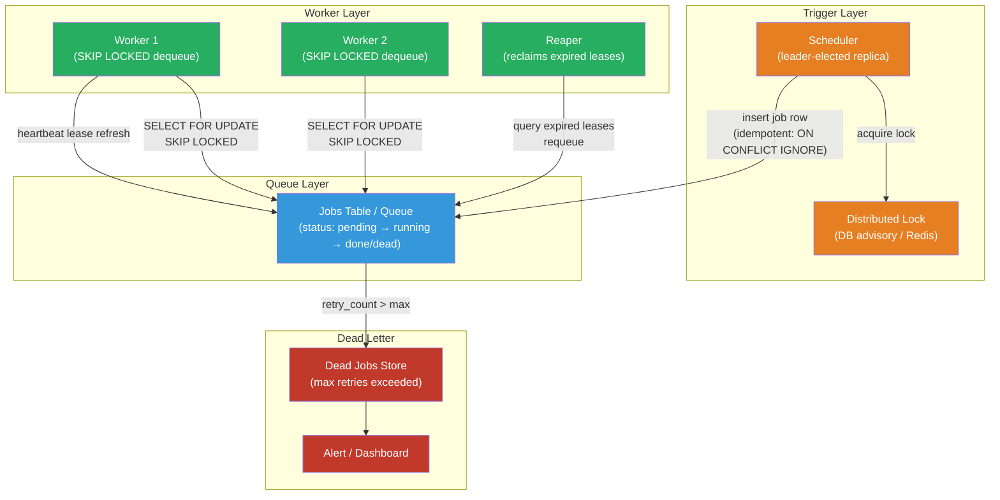

# [BEE-457] Distributed Job Scheduling

:::info
Distributed job scheduling coordinates the reliable execution of background tasks — periodic cron jobs, one-off deferred tasks, and long-running workflows — across multiple processes or machines, providing fault tolerance, at-least-once delivery, and observability that a single cron process cannot.
:::

## Context

The Unix `cron` daemon has been scheduling periodic tasks since 1975. For a single server, it works well: a time expression fires a command, the shell runs it, the process exits. The problems emerge when the system grows beyond one machine:

**Single point of failure.** If the server running cron restarts or crashes, jobs do not fire. High-availability cron requires running the daemon on multiple hosts — but then every host fires the job simultaneously, and the job must tolerate concurrent duplicate execution or use external coordination to suppress duplicates.

**No delivery guarantee.** If a job is running when the server restarts, cron has no record that it was in progress. The job silently disappears. There is no retry, no alert, no dead-letter record.

**No observability.** Cron produces no structured output by default. Logs (if any) go to `/var/mail`. There is no dashboard showing which jobs ran, how long they took, or how many failed. The Google SRE book (Beyer et al., 2016) addresses this directly: "Cron jobs are frequently overlooked from an SRE perspective because they are typically low-priority background activities. But they can become major sources of problems."

**Clock skew across hosts.** Distributed systems rely on system clocks, which can drift. When two replicas each believe they should fire a job at 03:00, even a 50ms clock difference can cause double execution — or a missed execution if one clock skips ahead while the other is behind (see BEE-427 for clock synchronization).

The ACM Queue paper "Reliable Cron across the Planet" (Sanfilippo and Koop, 2015) formalizes these failure modes and describes the architecture Google uses internally to run cron at global scale: a distributed cron daemon backed by Paxos consensus, which guarantees that exactly one replica fires each job even across regional failures.

For most systems, the right answer is not to build a Paxos-backed cron daemon. It is to use a **job queue with a scheduler frontend**: tasks are written durably to a queue or database table at schedule time, and workers pull from the queue independently. This decouples "deciding when to run a job" from "running the job," and makes each step independently fault-tolerant.

## Design Thinking

### Three Layers of Job Scheduling

A complete scheduling system has three layers:

1. **Trigger layer**: decides when a job should run (cron expression, delay, event). This layer must be deduplicated — only one instance should insert each job into the queue.
2. **Queue layer**: stores pending jobs durably until a worker picks them up. Jobs in the queue survive worker crashes.
3. **Worker layer**: pulls jobs from the queue, executes them, marks them complete or failed.

The trigger layer is where most of the distributed coordination complexity lives. The queue and worker layers can be treated as independent systems.

### At-Least-Once vs. Exactly-Once Execution

**At-least-once** is the practical default: the system guarantees a job will eventually run, but may run it more than once (on crash and retry). It is achievable with a durable queue and standard distributed systems primitives.

**Exactly-once** is much harder: it requires a global commit protocol that atomically marks the job as "running" and begins execution, with no gap where a crash could cause a re-run. Google Spanner (BEE-454) and Kafka exactly-once transactions approximate this, but even these systems ultimately make jobs idempotent and detect duplicates rather than preventing them at the protocol layer.

**The practical answer is always: make jobs idempotent, accept at-least-once delivery.** An idempotent job produces the same outcome whether it runs once or ten times. Techniques:

- Check-before-act: query the database to see if the job's outcome already exists before performing it.
- Idempotency key: the job carries a unique key (e.g., `"invoice-generation:2024-03-01:tenant-7"`); the worker records this key in a `completed_jobs` table and skips if already present.
- Upsert instead of insert: use database `INSERT ... ON CONFLICT DO NOTHING` or equivalent.

### Leader Election for the Trigger Layer

When multiple replicas of a service are running, all of them will evaluate cron schedules. Without coordination, all replicas insert the same job simultaneously.

**Database advisory locks** are the simplest solution for services already using a relational database. PostgreSQL's `pg_try_advisory_lock(key)` acquires a session-level lock; only one replica holds it at a time. The replica holding the lock becomes the cron leader and inserts scheduled jobs; all other replicas skip. If the leader crashes, its session ends, the lock releases, and another replica acquires it on the next cycle.

**Distributed lock stores** (Redis `SET NX PX`, etcd leases, ZooKeeper ephemeral nodes) provide the same guarantee for services without a shared database.

**Managed schedulers** (AWS EventBridge Scheduler, Google Cloud Scheduler) eliminate the trigger layer entirely by running the scheduler on behalf of the application — they insert a message into SQS, invoke a Lambda, or call an HTTP endpoint, with at-least-once delivery guaranteed by the cloud provider.

### Job Durability: The Lease Pattern

A worker that crashes mid-job leaves the job in an indeterminate state. Without recovery, the job is permanently stuck "in progress." The **lease pattern** (Martin Fowler, 2023) solves this: when a worker claims a job, it records a lease expiry timestamp. The worker must refresh the lease (extend the timestamp) periodically — the heartbeat. If the worker crashes, it stops heartbeating, the lease expires, and a reaper process (or the next worker poll) reclaims the job and requeues it.

PostgreSQL `SKIP LOCKED` is a key implementation primitive: `SELECT ... FOR UPDATE SKIP LOCKED` atomically dequeues a job that is not already locked by another connection. If a worker crashes, its transaction rolls back, the lock releases, and the row is available to the next worker.

## Best Practices

**MUST NOT rely on system cron for jobs that must not be lost.** If a scheduled job missing one execution causes data loss, billing errors, or user-facing failures, it requires a durable queue. System cron provides no retry, no durability, and no observability. Use it only for best-effort housekeeping tasks where occasional misses are tolerable.

**MUST make all scheduled jobs idempotent.** Accept that at-least-once delivery is the realistic guarantee. Design every job to check whether its work is already done before doing it. Record job completions with an idempotency key so that a second execution detects and skips the duplicate.

**MUST deduplicate job insertion at the trigger layer.** When multiple replicas run the scheduler, use a distributed lock (database advisory lock, Redis `SET NX`, or a managed scheduler) to ensure only one replica inserts a given job instance. A job already inserted but not yet running SHOULD be detected by a unique constraint on the `(job_name, scheduled_at)` pair.

**MUST implement the lease/heartbeat pattern for long-running jobs.** A job that runs longer than a few seconds SHOULD hold a renewable lease. Workers MUST renew the lease at an interval shorter than the lease TTL (e.g., renew every 15 seconds with a 60-second TTL). A reaper process MUST periodically query for expired leases and requeue those jobs.

**SHOULD use `SELECT FOR UPDATE SKIP LOCKED` (or equivalent) for database-backed job queues.** This pattern dequeues a job atomically within the worker's transaction. If the worker's transaction rolls back (crash, exception), the job row is automatically released and available to the next worker — no explicit cleanup required.

**MUST set a maximum retry limit and route permanently failing jobs to a dead-letter store.** A job that always fails (bug, invalid input, downstream outage) MUST NOT retry indefinitely. After a configurable retry limit (typically 3–5), mark the job as `dead` and move it to a dead-letter table or queue. Operators MUST be alerted when the dead-letter backlog grows, and there MUST be a mechanism to inspect, fix, and replay dead jobs.

**MUST instrument jobs with start time, duration, status, and error.** Job execution is "dark matter" in observability — invisible unless explicitly measured. Every job execution SHOULD emit a structured log or metric with: job name, job ID, attempt number, status (started/completed/failed), duration, and error message if applicable. Queue depth (jobs waiting) and age of the oldest pending job are the primary signals that the worker pool is undersized.

**SHOULD use a workflow orchestrator for multi-step jobs with dependencies.** A job that consists of multiple steps — "fetch data, transform, write to warehouse, send notification" — is better modeled as a workflow (Temporal, AWS Step Functions) than as a single long-running job. Orchestrators provide step-level retry, state durability across crashes, and visual execution history.

## Visual



## Example

**PostgreSQL-backed job queue with SKIP LOCKED dequeue and lease heartbeat:**

```sql
-- Jobs table: the durable store for pending, running, and dead jobs
CREATE TABLE scheduled_jobs (
    id            BIGSERIAL PRIMARY KEY,
    job_name      TEXT NOT NULL,
    payload       JSONB NOT NULL DEFAULT '{}',
    scheduled_at  TIMESTAMPTZ NOT NULL,
    status        TEXT NOT NULL DEFAULT 'pending',  -- pending | running | done | dead
    attempt       INT NOT NULL DEFAULT 0,
    max_attempts  INT NOT NULL DEFAULT 5,
    lease_expires TIMESTAMPTZ,                      -- NULL when not running
    error         TEXT,
    created_at    TIMESTAMPTZ NOT NULL DEFAULT now(),
    UNIQUE (job_name, scheduled_at)                 -- deduplication key
);

CREATE INDEX ON scheduled_jobs (status, scheduled_at)
    WHERE status = 'pending';
CREATE INDEX ON scheduled_jobs (lease_expires)
    WHERE status = 'running';
```

```python
import psycopg2
from datetime import datetime, timedelta, timezone
import time
import logging

LEASE_TTL_SECONDS = 60
HEARTBEAT_INTERVAL = 15

def dequeue_job(conn) -> dict | None:
    """Atomically claim one pending job using SKIP LOCKED."""
    with conn.cursor() as cur:
        cur.execute("""
            UPDATE scheduled_jobs
            SET status = 'running',
                attempt = attempt + 1,
                lease_expires = now() + interval '60 seconds'
            WHERE id = (
                SELECT id FROM scheduled_jobs
                WHERE status = 'pending'
                  AND scheduled_at <= now()
                ORDER BY scheduled_at
                LIMIT 1
                FOR UPDATE SKIP LOCKED   -- skip jobs locked by other workers
            )
            RETURNING id, job_name, payload, attempt, max_attempts
        """)
        row = cur.fetchone()
        conn.commit()
        return dict(zip(["id","job_name","payload","attempt","max_attempts"], row)) if row else None

def heartbeat(conn, job_id: int):
    """Extend the lease to prevent reaper from reclaiming an in-progress job."""
    with conn.cursor() as cur:
        cur.execute(
            "UPDATE scheduled_jobs SET lease_expires = now() + interval '60 seconds' WHERE id = %s",
            (job_id,)
        )
        conn.commit()

def complete_job(conn, job_id: int):
    with conn.cursor() as cur:
        cur.execute("UPDATE scheduled_jobs SET status = 'done', lease_expires = NULL WHERE id = %s", (job_id,))
        conn.commit()

def fail_job(conn, job_id: int, error: str, attempt: int, max_attempts: int):
    next_status = 'dead' if attempt >= max_attempts else 'pending'
    with conn.cursor() as cur:
        cur.execute(
            """UPDATE scheduled_jobs
               SET status = %s, lease_expires = NULL, error = %s,
                   -- exponential backoff: next attempt after 2^attempt minutes
                   scheduled_at = CASE WHEN %s = 'pending'
                                       THEN now() + (power(2, %s) * interval '1 minute')
                                       ELSE scheduled_at END
               WHERE id = %s""",
            (next_status, error, next_status, attempt, job_id)
        )
        conn.commit()

def reaper(conn):
    """Reclaim jobs whose workers have crashed (lease expired)."""
    with conn.cursor() as cur:
        cur.execute("""
            UPDATE scheduled_jobs
            SET status = 'pending', lease_expires = NULL
            WHERE status = 'running'
              AND lease_expires < now()
        """)
        reclaimed = cur.rowcount
        conn.commit()
    if reclaimed:
        logging.info("reaper: reclaimed %d expired job leases", reclaimed)

def worker_loop(conn):
    while True:
        job = dequeue_job(conn)
        if not job:
            time.sleep(5)
            continue

        logging.info("starting job=%s id=%d attempt=%d", job["job_name"], job["id"], job["attempt"])
        start = time.monotonic()

        try:
            # Heartbeat in a background thread while the job runs
            import threading
            stop_hb = threading.Event()
            def hb_loop():
                while not stop_hb.wait(HEARTBEAT_INTERVAL):
                    heartbeat(conn, job["id"])
            threading.Thread(target=hb_loop, daemon=True).start()

            execute_job(job["job_name"], job["payload"])   # business logic

            stop_hb.set()
            complete_job(conn, job["id"])
            logging.info("completed job=%s id=%d duration=%.2fs",
                         job["job_name"], job["id"], time.monotonic() - start)
        except Exception as e:
            stop_hb.set()
            fail_job(conn, job["id"], str(e), job["attempt"], job["max_attempts"])
            logging.error("failed job=%s id=%d attempt=%d error=%s",
                          job["job_name"], job["id"], job["attempt"], e)
```

**Idempotent job body — check-before-act:**

```python
def generate_monthly_invoices(payload: dict):
    """
    Safe to run multiple times: uses ON CONFLICT DO NOTHING to skip already-generated invoices.
    The idempotency key is (tenant_id, billing_month) — the same key this job was inserted with.
    """
    tenant_id = payload["tenant_id"]
    billing_month = payload["billing_month"]  # e.g., "2024-03"

    with db.transaction():
        rows_inserted = db.execute("""
            INSERT INTO invoices (tenant_id, billing_month, amount, created_at)
            SELECT %s, %s, calculate_amount(%s, %s), now()
            WHERE NOT EXISTS (
                SELECT 1 FROM invoices WHERE tenant_id = %s AND billing_month = %s
            )
        """, (tenant_id, billing_month, tenant_id, billing_month, tenant_id, billing_month))

        if rows_inserted == 0:
            logger.info("invoice already exists for tenant=%s month=%s — skipping",
                        tenant_id, billing_month)
            return   # idempotent: second execution does nothing
```

## Related BEEs

- [BEE-19005](distributed-locking.md) -- Distributed Locking: the leader election mechanism for the scheduler trigger layer is a direct application of distributed locking primitives
- [BEE-19028](fencing-tokens.md) -- Fencing Tokens: when using a distributed lock for scheduler leader election, fencing tokens prevent a stale leader from inserting duplicate jobs after its lock has expired
- [BEE-19017](lease-based-coordination.md) -- Lease-Based Coordination: the heartbeat/lease pattern for job workers is the same lease primitive described in BEE-436
- [BEE-10005](../messaging/dead-letter-queues-and-poison-messages.md) -- Dead Letter Queues and Poison Messages: jobs that exceed their retry limit are the job-queue equivalent of poison messages; the DLQ pattern applies directly
- [BEE-8005](../transactions/idempotency-and-exactly-once-semantics.md) -- Idempotency and Exactly-Once Semantics: all scheduled jobs MUST be designed for idempotency to safely tolerate at-least-once delivery
- [BEE-19008](clock-synchronization-and-physical-time.md) -- Clock Synchronization and Physical Time: cron expressions are evaluated against wall-clock time; clock skew across replicas is the root cause of duplicate and missed job firings

## References

- [Distributed Periodic Scheduling with Cron -- Google SRE Book](https://sre.google/sre-book/distributed-periodic-scheduling/)
- [Reliable Cron across the Planet -- ACM Queue (Sanfilippo and Koop, 2015)](https://queue.acm.org/detail.cfm?id=2745840)
- [Lease -- Patterns of Distributed Systems (Martin Fowler, 2023)](https://martinfowler.com/articles/patterns-of-distributed-systems/lease.html)
- [SELECT FOR UPDATE SKIP LOCKED -- PostgreSQL Documentation](https://www.postgresql.org/docs/current/sql-select.html#SQL-FOR-UPDATE-SHARE)
- [What is Amazon EventBridge Scheduler? -- AWS Documentation](https://docs.aws.amazon.com/scheduler/latest/UserGuide/what-is-scheduler.html)
- [Temporal Workflow Documentation -- temporal.io](https://docs.temporal.io/)
