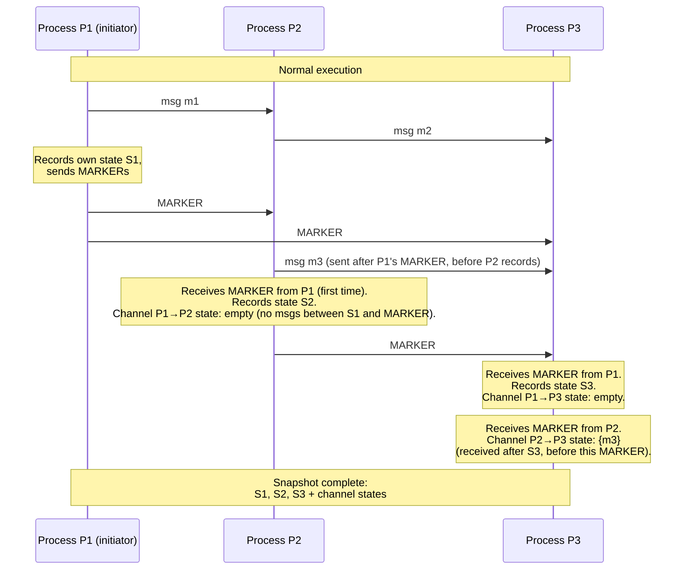

# [BEE-435] Distributed Snapshots

:::info
A distributed snapshot captures a consistent global state of a running distributed system — the local state of every process and every message in transit — without stopping execution, by using marker messages to coordinate what each process records as part of the same logical instant.
:::

## Context

Recording the state of a single process is trivial: suspend it, copy its memory, resume. Recording the state of a distributed system is not: the processes run on separate machines with no shared memory, and messages in transit between them are owned by neither sender nor receiver. A naive approach — broadcast "stop, record your state, send it to me, resume" — introduces a pause proportional to cluster size and requires a reliable coordinator. The deeper problem is correctness: a snapshot where process A has recorded receiving a message that process B has not yet recorded sending is inconsistent. It implies a message that was received but never sent, which cannot correspond to any reachable system state.

K. Mani Chandy and Leslie Lamport solved this in "Distributed Snapshots: Determining Global States of Distributed Systems" (ACM Transactions on Computer Systems, vol. 3, no. 1, February 1985). The algorithm requires only FIFO channels — messages arrive in the order they were sent — and introduces a single new message type, the **MARKER**. The initiating process records its own state and sends a MARKER on every outgoing channel. Any process that receives a MARKER for the first time records its own state, records that channel's state as empty (no messages in transit before the MARKER), then immediately sends a MARKER on all its outgoing channels. Any subsequent MARKER on a channel C means "record C's channel state as all messages received on C after you recorded your own state but before this MARKER arrived." When every process has received a MARKER on every incoming channel, the snapshot is complete. The algorithm runs concurrently with normal execution — it does not pause the system.

The key invariant: because channels are FIFO, a MARKER arriving on channel C from process P means that every message P sent before recording its state has already arrived (they were sent before the MARKER, so they precede it in the FIFO queue). This guarantees the snapshot is a **consistent cut**: every message recorded as received was also recorded as sent by its sender. No message appears to travel backwards in time.

Apache Flink adapted this algorithm into **Asynchronous Barrier Snapshotting (ABS)**, described by Carbone, Fóra, Ewen, Haridi, and Tzoumas in "Lightweight Asynchronous Snapshots for Distributed Dataflows" (arXiv:1506.08603, 2015). Instead of MARKER messages, the Flink JobManager injects **checkpoint barriers** into the data stream between records. Barriers partition the stream into pre-snapshot and post-snapshot records. When a stateful operator receives a barrier on all inputs, it saves its state to durable storage and forwards the barrier downstream. Once the barrier reaches all sinks, the checkpoint is complete. Flink 1.11 introduced **unaligned checkpoints** (FLIP-76): rather than waiting for barriers to arrive on all inputs before snapshotting (which stalls processing under backpressure), the operator immediately snapshots its state and all buffered in-flight records, allowing barriers to overtake queued data. This reduces checkpoint latency under load at the cost of larger checkpoint state.

## Design Thinking

**Snapshots serve different purposes; understand which one you need.** Chandy-Lamport was designed for global predicate detection — asking "was the system ever in a state satisfying condition X?" without stopping it. Flink checkpoints serve fault recovery — after a failure, restore the last checkpoint and replay unprocessed input. Disaster recovery snapshots serve durability — periodically persist state so a cluster restart need not replay years of input. Each purpose has different requirements for frequency, granularity, and storage.

**Consistent cuts are not the same as globally synchronized state.** A consistent cut captures a state the system could have been in, not the state at a single wall-clock instant. Two processes may record their local states at different real times, as long as no causality violation occurs. This is acceptable for fault recovery (replay from a causally consistent state) and global predicate detection, but not for use cases requiring a single synchronized instant, such as producing a point-in-time replica for read-traffic offloading — those require coordination or lock-based techniques.

**Barrier alignment under backpressure is a throughput problem.** When a stream operator has multiple inputs, aligned checkpointing (waiting for a barrier on every input before snapshotting) stalls processing of fast inputs while waiting for barriers on slow ones. Under sustained backpressure — common in burst traffic — this can delay checkpoints by minutes and accumulate unbounded queues. Unaligned checkpoints solve the latency problem but increase snapshot size because all buffered records must be included. The right choice depends on whether checkpoint latency or checkpoint size is the binding constraint.

**Checkpoint frequency trades recovery time against overhead.** More frequent checkpoints reduce the amount of input that must be replayed after a failure but consume more I/O and CPU. Less frequent checkpoints reduce overhead but extend recovery time. A failure that requires replaying 10 minutes of input may violate latency SLOs for stream processing pipelines with downstream consumers. Size the checkpoint interval by computing: what is the acceptable replay duration in the worst case?

## Visual



## Example

**Flink checkpoint configuration and recovery:**

```java
// Configure checkpointing in a Flink streaming job
StreamExecutionEnvironment env = StreamExecutionEnvironment.getExecutionEnvironment();

// Checkpoint every 60 seconds; Flink injects barriers into the stream
env.enableCheckpointing(60_000);

CheckpointConfig config = env.getCheckpointConfig();

// Exactly-once: barrier alignment (default)
// Use AT_LEAST_ONCE for lower latency, accepting potential duplicate processing
config.setCheckpointingConsistencyMode(CheckpointingMode.EXACTLY_ONCE);

// Fail the job if a checkpoint takes longer than 2 minutes
config.setCheckpointTimeout(120_000);

// Allow at most 1 concurrent checkpoint (prevents checkpoint storms)
config.setMaxConcurrentCheckpoints(1);

// Keep last 3 checkpoints for manual recovery
config.setExternalizedCheckpointCleanup(
    ExternalizedCheckpointCleanup.RETAIN_ON_CANCELLATION);
config.setNumRetainedSuccessfulCheckpoints(3);

// Unaligned checkpoints: reduce checkpoint latency under backpressure
// (Flink 1.11+; increases checkpoint size — benchmark before using)
config.enableUnalignedCheckpoints();

// State backend: where operator state is stored between checkpoints
// RocksDB for large state; HashMapStateBackend for small/medium state
env.setStateBackend(new EmbeddedRocksDBStateBackend());

// Remote checkpoint storage (e.g., S3, HDFS)
// Required for recovery across cluster restarts
env.getCheckpointConfig().setCheckpointStorage("s3://my-bucket/flink-checkpoints/");
```

**Manual Chandy-Lamport snapshot (pseudocode):**

```python
# FIFO channels required — use TCP or ordered message queues

class Process:
    def initiate_snapshot(self):
        self.record_local_state()
        self.snapshot_initiated = True
        self.channel_state = {}
        # Mark all channels as "recording" — track messages arriving after this point
        for channel in self.outgoing_channels:
            channel.send(MARKER)

    def on_message(self, msg, channel):
        if msg == MARKER:
            if not self.snapshot_initiated:
                # First MARKER received: record own state, record this channel as empty
                self.record_local_state()
                self.snapshot_initiated = True
                self.channel_state = {channel: []}  # empty — no msgs in transit before MARKER
                # Forward MARKER on all other outgoing channels
                for c in self.outgoing_channels:
                    c.send(MARKER)
            else:
                # Already recording: this channel's in-transit messages are now known
                # channel_state[channel] = messages received since we recorded state
                self.channel_state[channel] = self.recording_buffer[channel]
                self.recording_buffer[channel] = None  # stop recording this channel
                # Snapshot complete when all incoming channels have delivered a MARKER
                if all(ch in self.channel_state for ch in self.incoming_channels):
                    self.snapshot_complete()
        else:
            if self.snapshot_initiated and channel not in self.channel_state:
                # Recording phase: buffer messages arriving before MARKER on this channel
                self.recording_buffer.setdefault(channel, []).append(msg)
            self.deliver(msg)
```

## Related BEEs

- [BEE-19002](consensus-algorithms-paxos-and-raft.md) -- Consensus Algorithms: Raft and Paxos use log replication rather than snapshots for fault recovery, but Raft's `InstallSnapshot` RPC is used to bring lagging followers up to speed without replaying the full log — a targeted use of snapshotting within a consensus protocol
- [BEE-10003](../messaging/delivery-guarantees.md) -- Delivery Guarantees: Flink's exactly-once processing guarantee combines checkpointing (Chandy-Lamport-derived) with two-phase commit to external sinks — the checkpoint barrier carries the transaction boundary
- [BEE-10004](../messaging/event-sourcing.md) -- Event Sourcing: event-sourced systems face the same recovery time problem — replaying the full event log from the beginning is slow; periodic snapshots (state at event N) truncate replay to just the events after the snapshot
- [BEE-19011](write-ahead-logging.md) -- Write-Ahead Logging: databases use WAL checkpoints for the same reason Flink uses periodic snapshots — to bound recovery time by limiting how much log must be replayed after a crash; both are applications of the snapshot-then-replay pattern

## References

- [Distributed Snapshots: Determining Global States of Distributed Systems -- Chandy and Lamport, ACM TOCS 1985](https://dl.acm.org/doi/10.1145/214451.214456)
- [Chandy-Lamport Paper PDF -- Leslie Lamport's Archive](https://lamport.azurewebsites.net/pubs/chandy.pdf)
- [Lightweight Asynchronous Snapshots for Distributed Dataflows -- Carbone et al., arXiv 2015](https://arxiv.org/abs/1506.08603)
- [Fault Tolerance via State Snapshots -- Apache Flink Documentation](https://nightlies.apache.org/flink/flink-docs-master/docs/learn-flink/fault_tolerance/)
- [FLIP-76: Unaligned Checkpoints -- Apache Flink Wiki](https://cwiki.apache.org/confluence/display/FLINK/FLIP-76:+Unaligned+Checkpoints)
- [From Aligned to Unaligned Checkpoints -- Apache Flink Blog, 2020](https://flink.apache.org/2020/10/15/from-aligned-to-unaligned-checkpoints-part-1-checkpoints-alignment-and-backpressure/)
