# [BEE-19015] Failure Detection

:::info
Failure detection is the distributed systems problem of determining whether a remote process has crashed or is merely slow — a problem with no perfect solution in asynchronous networks, but one that practical systems address through heartbeats, probabilistic suspicion, and indirect probing to trade detection speed against false positive rate.
:::

## Context

The theoretical boundary was established by Fischer, Lynch, and Paterson in "Impossibility of Distributed Consensus with One Faulty Process" (JACM, 1985) — the FLP impossibility result. In a purely asynchronous message-passing system with no timing assumptions, a single crashed process is indistinguishable from one that is arbitrarily slow. A message may be delayed by an unbounded amount. No algorithm can reliably detect a crash in finite time without risk of false accusation. The paper won the 2001 Dijkstra Prize for most influential paper in distributed computing.

Chandra and Toueg responded in "Unreliable Failure Detectors for Reliable Distributed Systems" (JACM, 1996) by defining failure detectors as an abstraction with two properties: **completeness** (every crashed process is eventually suspected) and **accuracy** (no live process is permanently suspected). Perfect failure detectors have both; the FLP result proves perfect detectors are impossible in purely asynchronous systems. Chandra and Toueg showed that even an eventually accurate detector — one that may suspect live nodes, but eventually stops — is sufficient to solve consensus. This shifted the engineering question from "how do we detect crashes perfectly?" to "how do we make failure detection good enough for the algorithms that use it?"

Practical systems use three main approaches. **Heartbeat-based detection** is the simplest: a monitored process sends a periodic signal; if the monitor receives nothing within a timeout window, it suspects the process is dead. The tension is in setting the timeout: too short causes false positives on a congested network; too long delays detection and prolongs unavailability. The right timeout depends on network RTT variance, which is environment-specific (LAN vs. WAN vs. cloud VPC) and can change over time.

**SWIM** (Scalable Weakly-consistent Infection-style Membership protocol), described by Das, Gupta, and Motivala at DSN 2002, solves the O(n²) message complexity problem of all-pairs heartbeating in large clusters. Instead of every node pinging every other node, each node pings one randomly selected peer per round. If no ack is received within a timeout, rather than immediately declaring the peer dead, the node asks k other randomly selected peers to independently ping the suspect (indirect ping). Only if none of the indirect pings succeed does the node mark the peer as failed. Membership updates (join, leave, failure) are disseminated by piggybacking on ping and ack messages — the "infection-style" part — achieving O(log n) propagation time with O(n) messages per round. HashiCorp's `memberlist` library implements SWIM with additional Lifeguard extensions for WAN robustness; it powers Consul, Nomad, and Serf.

**The phi (ϕ) accrual failure detector**, described by Hayashibara, Défago, Yared, and Katayama at SRDS 2004, replaces the binary healthy/dead output with a continuous suspicion value. Rather than a fixed timeout, it models the inter-arrival time distribution of heartbeats (approximated as exponential or Gaussian) and outputs φ(t) = −log₁₀(P_later(t)), where P_later(t) is the probability that a heartbeat would arrive later than the current time t given the historical distribution. As time passes without a heartbeat, φ grows from 0 toward infinity. Applications set their own threshold — Cassandra's `phi_convict_threshold` defaults to 8, meaning a node is suspected when the probability of a legitimate heartbeat delay drops below 10⁻⁸. High-latency environments (WAN, EC2) typically use 10–12. This approach adapts to changing network conditions: a node experiencing transient congestion causes φ to rise more slowly if the inter-arrival distribution already shows high variance, reducing false positives without a static timeout adjustment.

## Design Thinking

**Choose between active and passive detection.** Active detection (heartbeats, probes) is initiated by the monitor; it catches slow or silently crashed processes but costs bandwidth and CPU proportional to cluster size. Passive detection (outlier detection, error rate monitoring) infers health from observed request failures without additional traffic, but only detects failures visible through normal traffic — a node that accepts connections but hangs forever on one endpoint may go undetected. Production systems combine both: Kubernetes uses active liveness probes to catch hung processes and passive readiness probes to route around slow ones.

**Separate liveness from readiness.** A process is **live** if it has not crashed and its runtime is functional. A process is **ready** if it can handle the current workload. A live process may not be ready (database connection pool exhausted, cache warming in progress, heavy GC pause). Mixing these leads to unnecessary restarts (Kubernetes killing a container that is live but briefly not ready) or failed requests (routing traffic to a container that is ready but will imminently crash). Define distinct failure detector instances for each property.

**Tune the false positive tradeoff explicitly.** Every failure detector has a detection time vs. false positive rate curve. Shortening the timeout or lowering the phi threshold detects failures faster but increases the rate at which live nodes are incorrectly suspected. False positives in distributed databases cause unnecessary leader elections, data redistribution, and replication storms. In Cassandra, a false positive declaration causes all data served by that node to be re-routed to other replicas, increasing their load. On EC2 or Kubernetes with network jitter, phi_convict_threshold 8 is conservative; 5 may cause false flapping.

**Treat network partitions differently from node crashes.** A heartbeat timeout cannot distinguish a crashed node from a partitioned-but-alive node. If your system acts the same way in both cases (marking the node as dead and redistributing its work), you may violate correctness when the partition heals and the presumed-dead node is still writing. This is the split-brain problem. Systems like Raft solve it by requiring nodes to stop serving writes if they lose quorum contact, preventing the partitioned node from diverging. Failure detection alone does not solve this — it must be combined with a fencing mechanism (see BEE-19005 on distributed locking) or a consensus protocol.

## Visual

```mermaid
flowchart TD
    subgraph "Simple Heartbeat"
        A1["Node A\n(monitor)"]:::monitor
        B1["Node B\n(monitored)"]:::live
        T1["Timeout window\nT × multiplier"]:::timeout
        A1 -->|"ping every T"| B1
        B1 -->|ack| A1
        T1 -->|"no ack → suspect"| A1
    end

    subgraph "SWIM Indirect Ping"
        A2["Node A"]:::monitor
        B2["Node B\n(suspect)"]:::suspect
        C2["Node C"]:::live
        D2["Node D"]:::live
        A2 -->|"1. direct ping"| B2
        B2 -. "no ack" .-> A2
        A2 -->|"2. indirect ping\nvia C, D"| C2 & D2
        C2 & D2 -->|"ping B on\nbehalf of A"| B2
        B2 -. "still no ack" .-> A2
        A2 -->|"3. declare failed\n+ gossip"| C2
    end

    subgraph "Phi Accrual"
        TS["Heartbeat timestamps\n[t₁, t₂, t₃, ...]"]:::data
        PH["φ(t) = -log₁₀(P_later(t))\ngrows as time passes without HB"]:::formula
        TH["Threshold\n(e.g. φ=8)"]:::threshold
        OK["φ < threshold\n→ live"]:::live2
        SU["φ ≥ threshold\n→ suspect"]:::suspect2
        TS --> PH
        TH --> OK & SU
        PH --> OK
        PH --> SU
    end

    style A1 fill:#3498db,color:#fff
    style B1 fill:#27ae60,color:#fff
    style T1 fill:#95a5a6,color:#fff
    style A2 fill:#3498db,color:#fff
    style B2 fill:#e74c3c,color:#fff
    style C2 fill:#27ae60,color:#fff
    style D2 fill:#27ae60,color:#fff
    style TS fill:#95a5a6,color:#fff
    style PH fill:#e67e22,color:#fff
    style TH fill:#95a5a6,color:#fff
    style OK fill:#27ae60,color:#fff
    style SU fill:#e74c3c,color:#fff
    style live2 fill:#27ae60,color:#fff
    style suspect2 fill:#e74c3c,color:#fff
```



## Example

**Phi accrual threshold tuning (Cassandra):**

```yaml
# cassandra.yaml
# phi_convict_threshold: controls failure detector sensitivity
# Default: 8
# Range: 5 (very sensitive, fast detection) to 16 (very tolerant, slow detection)
# φ(t) = -log₁₀(P_later(t))
# At threshold 8: node is suspected when P(legitimate delay) < 10⁻⁸

phi_convict_threshold: 8   # Default — appropriate for same-datacenter, low-jitter
# phi_convict_threshold: 12  # EC2, WAN, or high-jitter networks
# phi_convict_threshold: 5   # Low-latency local cluster, need fast failover

# The Gossip interval also matters:
# gossip_interval_in_ms: 1000  # How often nodes gossip (and heartbeat)
# A node is suspected after roughly:
# detection_time ≈ phi_convict_threshold × gossip_interval / log(10)
# At threshold 8, interval 1s: ≈ 8 × 1000 / 2.3 ≈ 3.5s + variance
```

**Kubernetes liveness vs. readiness probes:**

```yaml
# Separate liveness (process health) from readiness (traffic acceptance)

livenessProbe:
  httpGet:
    path: /healthz      # Returns 200 if JVM/runtime is alive
    port: 8080
  initialDelaySeconds: 30   # Allow startup time
  periodSeconds: 10
  failureThreshold: 3        # 3 consecutive failures → restart container
  # Timeout too short causes false restarts during GC or heavy load

readinessProbe:
  httpGet:
    path: /ready        # Returns 200 only when connections and caches are warm
    port: 8080
  initialDelaySeconds: 10
  periodSeconds: 5
  failureThreshold: 2        # 2 consecutive failures → remove from load balancer
  # Does NOT restart — just stops routing traffic until probe passes again

startupProbe:
  httpGet:
    path: /healthz
    port: 8080
  failureThreshold: 30       # 30 × 10s = up to 5 minutes for initial startup
  periodSeconds: 10
  # Disables liveness/readiness during startup — prevents kill-on-slow-start
```

**SWIM-style indirect ping (pseudocode):**

```python
# Each node runs this loop each gossip round
PROBE_INTERVAL = 1.0   # seconds
INDIRECT_K = 3          # number of nodes to ask for indirect ping
SUSPECT_TIMEOUT = 5.0   # seconds before declaring failure

def gossip_round(self):
    target = random.choice(self.members)

    if self.ping(target, timeout=0.5):
        target.status = ALIVE
        return

    # Direct ping failed — ask k other nodes to try
    helpers = random.sample([m for m in self.members if m != target], k=INDIRECT_K)
    acks = [self.indirect_ping(helper, target, timeout=1.0) for helper in helpers]

    if any(acks):
        # At least one helper reached target — it's alive, we had a network issue
        target.status = ALIVE
        return

    # No direct or indirect ack — mark suspect, start timer
    target.status = SUSPECT
    target.suspect_since = now()

    # If still suspect after timeout → declare failed, gossip to cluster
    if now() - target.suspect_since > SUSPECT_TIMEOUT:
        target.status = FAILED
        self.disseminate(FailureEvent(target))  # piggybacked on next ping/ack
```

## Related BEEs

- [BEE-19002](consensus-algorithms-paxos-and-raft.md) -- Consensus Algorithms: Raft uses heartbeat-based failure detection for leader elections — followers start an election if they receive no heartbeat within the election timeout; the FLP impossibility applies here too, which is why Raft uses randomized timeouts to break symmetry
- [BEE-19004](gossip-protocols.md) -- Gossip Protocols: SWIM's infection-style membership dissemination is a gossip protocol; failure events propagate in O(log n) rounds by piggybacking on the same ping/ack messages used for probing
- [BEE-19005](distributed-locking.md) -- Distributed Locking: failure detection tells you a lock holder has died; fencing tokens (a monotonically increasing lock version) prevent the presumed-dead holder from completing writes if it later recovers, solving the split-brain that failure detection alone cannot prevent
- [BEE-19014](quorum-systems-and-nwr-consistency.md) -- Quorum Systems and NWR Consistency: Cassandra uses phi accrual failure detection to decide when a replica is dead; once dead, reads and writes route around it using quorum; the phi threshold directly affects how long stale routing persists before failover

## References

- [Impossibility of Distributed Consensus with One Faulty Process -- Fischer, Lynch, Paterson, JACM 1985](https://dl.acm.org/doi/10.1145/3149.214121)
- [Unreliable Failure Detectors for Reliable Distributed Systems -- Chandra and Toueg, JACM 1996](https://dl.acm.org/doi/10.1145/226643.226647)
- [SWIM: Scalable Weakly-consistent Infection-style Process Group Membership Protocol -- Das, Gupta, Motivala, DSN 2002](https://ieeexplore.ieee.org/document/1028914/)
- [SWIM Paper PDF -- Cornell University](https://www.cs.cornell.edu/projects/Quicksilver/public_pdfs/SWIM.pdf)
- [The Φ Accrual Failure Detector -- Hayashibara, Défago, Yared, Katayama, SRDS 2004](https://ieeexplore.ieee.org/document/1353004/)
- [memberlist: Go library implementing SWIM -- HashiCorp](https://github.com/hashicorp/memberlist)
- [Configure Liveness, Readiness and Startup Probes -- Kubernetes Documentation](https://kubernetes.io/docs/tasks/configure-pod-container/configure-liveness-readiness-startup-probes/)
- [Outlier Detection -- Envoy Proxy Documentation](https://www.envoyproxy.io/docs/envoy/latest/intro/arch_overview/upstream/outlier)
