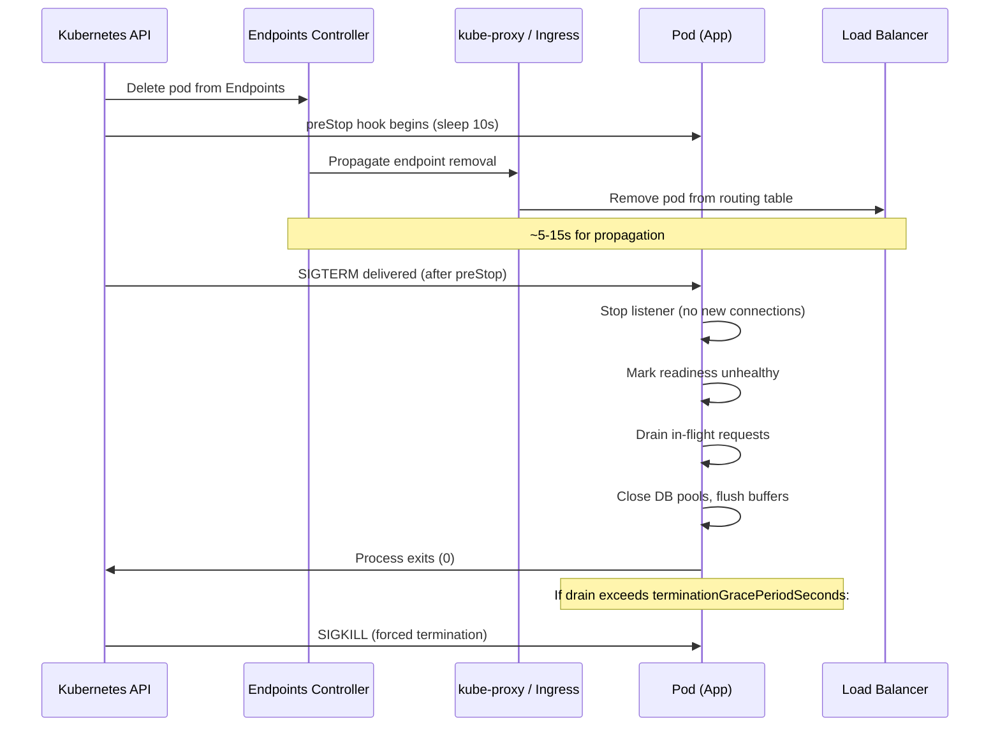

# [BEE-19034] Graceful Shutdown and Connection Draining

:::info
Graceful shutdown is the process of stopping a service without dropping in-flight requests: finish the work in progress, reject new work, close connections cleanly, and exit. In Kubernetes, doing this correctly requires understanding a race condition that is fundamental to how the platform works — and patching it with a preStop sleep.
:::

## Context

Before container orchestration, graceful shutdown was a straightforward UNIX signal-handling problem: catch `SIGTERM`, finish open requests, exit. In a Kubernetes cluster, the problem is harder because two independent processes happen simultaneously when a pod is deleted: the API server sends `SIGTERM` to the pod, and the Endpoints controller begins removing the pod from the `Endpoints` object that kube-proxy and ingress controllers use to route traffic. These two actions are parallel and uncoordinated.

The consequence is a **race condition**: a pod may finish reading `SIGTERM`, stop accepting new connections, and begin shutting down while kube-proxy on multiple nodes is still actively routing traffic to it — because the endpoint removal notification has not yet propagated. Requests arriving during this window land on a pod that is no longer accepting connections and receive a connection reset. From the user's perspective, the request failed. From the pod's perspective, it behaved correctly.

This race is not a bug in Kubernetes; it is a fundamental consequence of eventual consistency in a distributed system. The Kubernetes documentation acknowledges it and recommends the `preStop` lifecycle hook as the mitigation: delay the application's shutdown by a few seconds to allow the load-balancer tables to converge before the application stops accepting connections.

The problem exists across all HTTP servers and gRPC services, but the mechanics differ. HTTP/1.1 uses per-request connections and can close them after each request completes. HTTP/2 multiplexes many streams on one connection and requires sending a `GOAWAY` frame to signal the peer to open no new streams on this connection while existing streams finish. gRPC, which is built on HTTP/2, provides `GracefulStop()` which sends `GOAWAY`, waits for active RPCs to complete, then closes the server. Each of these protocols requires explicit, protocol-aware shutdown logic.

## Design Thinking

Graceful shutdown has three distinct phases that must happen in strict order:

1. **Stop accepting new work.** Mark the readiness probe unhealthy (or stop the listener) so no new traffic is routed to this instance. This must happen before draining begins. If new requests continue arriving during the drain, the drain never completes.

2. **Drain in-flight work.** Allow existing requests and connections to complete. Set a deadline (the `terminationGracePeriodSeconds`) after which remaining work is abandoned and the process exits.

3. **Release resources.** Close database connection pools, flush buffers, close open files, deregister from service discovery. Resource release happens last — closing a database pool while requests are still running will cause those requests to fail.

The shutdown order is the reverse of the startup order. If the service registers with a service registry at startup, deregister first at shutdown. If it opens a database pool and then starts the HTTP listener, close the HTTP listener first and the database pool last.

**The preStop window.** In Kubernetes, a `preStop` sleep of 5–15 seconds is inserted between the pod entering `Terminating` state (when endpoint removal begins) and the application receiving `SIGTERM` (when the application's shutdown code begins). This window gives kube-proxy and ingress controller time to remove the pod from their routing tables before the application stops accepting connections. Without this window, the race condition described in the Context section causes dropped connections.

**terminationGracePeriodSeconds sizing.** This is the total time Kubernetes allows from `SIGTERM` to `SIGKILL`. It must be larger than: `preStop_sleep + max_request_duration + drain_overhead`. A typical value for a web service is 30–60 seconds. Long-running jobs (batch processors, streaming consumers) may need minutes. Setting it too short means Kubernetes will `SIGKILL` the process while requests are still in flight, defeating the purpose of graceful shutdown.

## Best Practices

**MUST add a preStop sleep in Kubernetes deployments.** A `preStop` hook with `sleep 10` delays `SIGTERM` by 10 seconds, giving kube-proxy and ingress controllers time to remove the pod from their routing tables. The exact value should be tuned to the observed endpoint propagation latency in the cluster — typically 5–15 seconds. Without this, connections are dropped during every rolling update and every pod deletion.

```yaml
lifecycle:
  preStop:
    exec:
      command: ["sh", "-c", "sleep 10"]
```

**MUST set `terminationGracePeriodSeconds` larger than the preStop duration plus the maximum expected request duration.** If `preStop` sleeps for 10 seconds and the slowest expected request takes 20 seconds, `terminationGracePeriodSeconds` must be at least 35 seconds (10 + 20 + 5 overhead). The default is 30 seconds, which is often too low for services with slow database queries or large file uploads.

**MUST handle `SIGTERM` explicitly in the application.** Most web frameworks do not respond to `SIGTERM` by draining connections and exiting — they terminate immediately. Register a signal handler that: (1) stops the HTTP listener from accepting new connections, (2) waits for in-flight requests to complete or a deadline to expire, (3) closes connection pools and flushes buffers. In Go, `http.Server.Shutdown(ctx)` does steps 1 and 2; in Node.js, `server.close(callback)` stops accepting but does not drain keep-alive connections (requires additional logic); in Python/Gunicorn, `SIGWINCH` starts graceful shutdown of workers.

**SHOULD mark the readiness probe unhealthy before beginning the drain.** If the application's readiness probe continues to return HTTP 200 during shutdown, load balancers may send new requests to the terminating pod even after `preStop` ends and `SIGTERM` fires — because the load balancer respects the readiness probe, not the endpoint status, in some configurations. Explicitly set a flag that the readiness endpoint checks, flipping it to unhealthy at the start of the shutdown handler, before calling `server.Shutdown()`.

**MUST apply a deadline to the drain phase.** A drain without a deadline can block indefinitely if a client holds a long-lived connection open (a WebSocket, a gRPC streaming call, a large multipart upload). Use `context.WithTimeout` in Go, `server.closeAllConnections()` after a timeout in Node.js, or `terminationGracePeriodSeconds` as a hard backstop. Draining that outlasts `terminationGracePeriodSeconds` results in `SIGKILL`, which is indistinguishable from a crash.

**MUST use `GracefulStop()` (not `Stop()`) for gRPC servers.** `Stop()` closes all connections immediately, dropping in-flight RPCs. `GracefulStop()` sends a `GOAWAY` frame on all active HTTP/2 connections instructing the client not to open new streams, then waits for all existing RPCs to complete before closing the connections. However, `GracefulStop()` blocks indefinitely if any RPC does not complete; wrap it in a goroutine and call `Stop()` after a deadline:

```go
go s.GracefulStop()
time.Sleep(drainTimeout)
s.Stop() // force-close any remaining connections
```

**SHOULD shut down resources in reverse startup order.** If startup order is: connect to database → open Redis → start HTTP server → register in service discovery, then shutdown order is: deregister from service discovery → stop HTTP server → close Redis → close database. This ensures that resources are not closed while other parts of the system that depend on them are still running.

## Visual



## Example

**Go: SIGTERM handler with HTTP drain and deadline:**

```go
package main

import (
    "context"
    "log"
    "net/http"
    "os"
    "os/signal"
    "sync/atomic"
    "syscall"
    "time"
)

var isReady atomic.Bool

func main() {
    mux := http.NewServeMux()
    mux.HandleFunc("/health/ready", func(w http.ResponseWriter, r *http.Request) {
        if !isReady.Load() {
            http.Error(w, "shutting down", http.StatusServiceUnavailable)
            return
        }
        w.WriteHeader(http.StatusOK)
    })
    mux.HandleFunc("/api/work", doWork)

    srv := &http.Server{Addr: ":8080", Handler: mux}

    // Mark ready once the server is listening
    isReady.Store(true)

    // Catch SIGTERM (Kubernetes) and SIGINT (local dev)
    quit := make(chan os.Signal, 1)
    signal.Notify(quit, syscall.SIGTERM, syscall.SIGINT)

    go func() {
        if err := srv.ListenAndServe(); err != http.ErrServerClosed {
            log.Fatalf("server error: %v", err)
        }
    }()

    <-quit
    log.Println("SIGTERM received — beginning graceful shutdown")

    // Step 1: mark not-ready so the load balancer stops sending new requests
    isReady.Store(false)

    // Step 2: drain in-flight requests with a 25-second deadline
    // (terminationGracePeriodSeconds should be ≥ preStop(10s) + this(25s))
    ctx, cancel := context.WithTimeout(context.Background(), 25*time.Second)
    defer cancel()

    if err := srv.Shutdown(ctx); err != nil {
        log.Printf("shutdown deadline exceeded, forcing close: %v", err)
    }

    // Step 3: close downstream resources (reverse of startup order)
    closeRedis()
    closeDBPool()
    log.Println("shutdown complete")
}
```

**Kubernetes deployment manifest with preStop and graceful period:**

```yaml
spec:
  template:
    spec:
      terminationGracePeriodSeconds: 40  # preStop(10) + drain(25) + overhead(5)
      containers:
        - name: api
          image: my-service:latest
          readinessProbe:
            httpGet:
              path: /health/ready
              port: 8080
            periodSeconds: 5
            failureThreshold: 1  # stop routing immediately on first failure
          lifecycle:
            preStop:
              exec:
                # Sleep before SIGTERM so kube-proxy removes the endpoint first
                command: ["sh", "-c", "sleep 10"]
```

**gRPC server: GracefulStop with hard deadline:**

```go
grpcServer := grpc.NewServer()
pb.RegisterMyServiceServer(grpcServer, &myServiceImpl{})

go grpcServer.ListenAndServe(lis)

<-quit
log.Println("beginning gRPC graceful stop")

stopped := make(chan struct{})
go func() {
    grpcServer.GracefulStop() // sends GOAWAY, waits for active RPCs
    close(stopped)
}()

select {
case <-stopped:
    log.Println("gRPC server stopped cleanly")
case <-time.After(20 * time.Second):
    log.Println("gRPC drain timeout — forcing stop")
    grpcServer.Stop() // force-close remaining connections
}
```

## Implementation Notes

**Go.** `http.Server.Shutdown(ctx)` stops the listener and waits for active connections to become idle (no active requests), then closes them. It does not wait for WebSocket connections or hijacked connections — those must be tracked and closed separately. The passed context controls how long to wait; when it expires, open connections are aborted.

**Node.js.** `server.close(callback)` stops accepting new connections but does not close existing keep-alive connections — these may remain open indefinitely. Node.js 18.2+ added `server.closeAllConnections()` and `server.closeIdleConnections()` to address this. For older Node.js, track active connections manually with `server.on('connection', ...)` and destroy them during shutdown.

**Python/Gunicorn.** Send `SIGWINCH` to Gunicorn to gracefully stop all workers (they finish their current request then exit) without stopping the master. The `--graceful-timeout` flag (default 30 seconds) controls how long workers have to finish. Gunicorn also supports `SIGUSR2` + `SIGWINCH` for zero-downtime rolling restarts.

**Java/Spring Boot.** Spring Boot 2.3+ supports graceful shutdown with `server.shutdown=graceful` in `application.properties`. The timeout is configured via `spring.lifecycle.timeout-per-shutdown-phase` (default 30 seconds). This is sufficient for most HTTP workloads but still requires the Kubernetes `preStop` hook.

## Related BEEs

- [BEE-12003](../resilience/timeouts-and-deadlines.md) -- Timeouts and Deadlines: the drain deadline in graceful shutdown is a special case of a deadline — without it, a single long-lived connection can block shutdown indefinitely
- [BEE-14006](../observability/health-checks-and-readiness-probes.md) -- Health Checks and Readiness Probes: the readiness probe is the primary mechanism for signaling "I am not ready for traffic" during shutdown — must be set to failing before the drain begins
- [BEE-16002](../cicd-devops/deployment-strategies.md) -- Deployment Strategies: rolling updates depend on graceful shutdown to achieve zero-downtime deployments; without it, pods being replaced drop connections
- [BEE-19032](tail-latency-and-hedged-requests.md) -- Tail Latency and Hedged Requests: a pod that is slow to shut down because its drain deadline is too short can appear as a P99 spike during deployments — correct drain sizing prevents this

## References

- [Pod Lifecycle -- Kubernetes Documentation](https://kubernetes.io/docs/concepts/workloads/pods/pod-lifecycle/)
- [Container Lifecycle Hooks -- Kubernetes Documentation](https://kubernetes.io/docs/concepts/containers/container-lifecycle-hooks/)
- [Kubernetes best practices: terminating with grace -- Google Cloud Blog](https://cloud.google.com/blog/products/containers-kubernetes/kubernetes-best-practices-terminating-with-grace)
- [Server Graceful Stop -- gRPC Documentation](https://grpc.io/docs/guides/server-graceful-stop/)
- [Graceful upgrades in Go -- Cloudflare Blog](https://blog.cloudflare.com/graceful-upgrades-in-go/)
- [Graceful shutdown in Kubernetes -- RisingStack Engineering](https://blog.risingstack.com/graceful-shutdown-node-js-kubernetes/)
- [Importance of Graceful Shutdown in Kubernetes -- Criteo Engineering](https://medium.com/criteo-engineering/importance-of-graceful-shutdown-in-kubernetes-605f0669d6ae)
