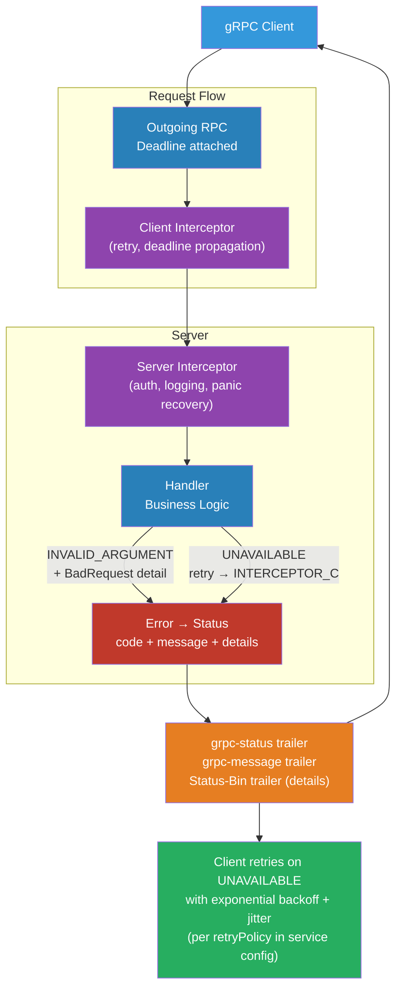

# [BEE-19059] gRPC Error Handling and Status Codes

:::info
gRPC defines 17 canonical status codes that replace HTTP status codes for RPC semantics, plus a two-layer error model — a basic status (code + message) and rich structured details — that enables clients to take programmatic action on errors without parsing free-text messages.
:::

## Context

HTTP APIs signal errors with status codes that are well understood but coarse: a 400 tells the client the request was bad, but not whether the field was missing, out of range, or failed a business rule. REST services work around this by embedding structured error bodies, but there is no standard for their format (Problem Details, RFC 9457, is widely adopted but not universal).

gRPC takes a different approach. Every RPC response carries a `grpc-status` trailer (a numeric code, 0–16) and an optional `grpc-message` trailer (a URL-encoded string). These are defined in the gRPC core specification and implemented identically in every gRPC runtime — Go, Java, Python, Node.js, C++. The 17 status codes (0 = OK through 16 = UNAUTHENTICATED) cover the full taxonomy of RPC failures.

For richer errors, gRPC uses the `google.rpc.Status` proto, which adds a `details` field — a repeated `google.protobuf.Any` — carrying typed error detail messages from the `google/rpc/error_details.proto` package: `BadRequest` for field-level validation, `RetryInfo` for retry delays, `QuotaFailure` for quota violations, and others. This model was first described in the Google API Design Guide and is the basis for Google Cloud's API error responses.

The practical benefit: gRPC clients can match on `code == UNAVAILABLE` to retry, extract `RetryInfo.retry_delay` to know how long to wait, and surface `BadRequest.FieldViolation` to the user without parsing a string. This is impossible to do portably with REST unless all services adopt the same error schema.

## Design Thinking

### Status Code Taxonomy

The 17 codes fall into four groups by cause:

**Client errors** (caller must fix the request):
- `INVALID_ARGUMENT` (3) — invalid field value, range, or format
- `OUT_OF_RANGE` (11) — value valid but out of acceptable range (prefer over INVALID_ARGUMENT when the range is clear)
- `NOT_FOUND` (5) — resource does not exist
- `ALREADY_EXISTS` (6) — resource already exists (on create)
- `PERMISSION_DENIED` (7) — caller lacks permission for the operation
- `UNAUTHENTICATED` (16) — no valid credentials provided
- `FAILED_PRECONDITION` (9) — system state prevents the operation (e.g., deleting a non-empty bucket)

**Transient errors** (safe to retry):
- `UNAVAILABLE` (14) — server temporarily unavailable; retry with backoff
- `RESOURCE_EXHAUSTED` (8) — quota or rate limit; retry after delay from `RetryInfo`

**Timeout / cancellation**:
- `DEADLINE_EXCEEDED` (4) — deadline passed before operation completed
- `CANCELLED` (1) — operation was cancelled by the caller

**Server errors** (not the caller's fault):
- `INTERNAL` (13) — invariant broken; indicates a bug in the server
- `UNKNOWN` (2) — catch-all for unmapped errors
- `DATA_LOSS` (15) — unrecoverable data corruption
- `UNIMPLEMENTED` (12) — method not implemented or disabled

**Abuse / conflict**:
- `ABORTED` (10) — operation aborted due to a conflict (e.g., transaction conflict); caller may retry at a higher level

### Choosing the Right Code

The most common mistake is overusing `INTERNAL` and `UNKNOWN`. These should be reserved for server bugs. Prefer specific client-error codes:

| Situation | Correct code |
|---|---|
| Request field `amount` is negative | `INVALID_ARGUMENT` |
| Page token in wrong format | `INVALID_ARGUMENT` |
| Request field `page_size` is 10001 (max is 10000) | `OUT_OF_RANGE` |
| Order `ord_123` not found | `NOT_FOUND` |
| Creating an order that already exists | `ALREADY_EXISTS` |
| Caller's JWT is expired | `UNAUTHENTICATED` |
| Caller's JWT is valid but they lack the role | `PERMISSION_DENIED` |
| Transaction conflict on optimistic lock | `ABORTED` |
| Tried to delete a non-empty parent | `FAILED_PRECONDITION` |
| Server is in maintenance mode | `UNAVAILABLE` |
| Rate limit exceeded | `RESOURCE_EXHAUSTED` |

### Retryability

There is no fixed universal set of retryable codes — it depends on the operation. The key principle from the gRPC spec: **retry only when the server did not start processing**. `UNAVAILABLE` is safe to retry for all RPCs. `RESOURCE_EXHAUSTED` is often retryable after the delay in `RetryInfo`. `ABORTED` is retryable at the application level (re-read the resource, then retry). `DEADLINE_EXCEEDED` is not automatically retryable — the deadline has already passed; the caller must decide whether to issue a fresh request.

## Best Practices

**MUST choose the most specific code that accurately describes the failure.** Returning `UNKNOWN` or `INTERNAL` for a missing resource or invalid argument forces clients to parse the message string. Message strings are for humans; status codes are for machines.

**MUST NOT return `OK` with an error embedded in the response body.** Some implementations put an error object inside a response message and return status `OK`. This defeats the gRPC error model: clients cannot intercept it with standard interceptors, retries won't trigger, and streaming semantics break. Always propagate errors as non-OK status.

**MUST populate `grpc-message` with a developer-readable explanation, not a user-facing one.** Status messages are logged and surfaced in stack traces. They are not safe to display to end users. Use `LocalizedMessage` in the error details for user-facing text.

**SHOULD attach `google.rpc.BadRequest` details for `INVALID_ARGUMENT` errors.** A `BadRequest` detail lists each `FieldViolation` with a field path (dot-notation: `"order.items[0].quantity"`) and a description. This lets client SDKs surface per-field errors to forms without parsing the status message.

**SHOULD attach `google.rpc.RetryInfo` to `RESOURCE_EXHAUSTED` responses.** The `retry_delay` field tells the client exactly how long to wait. Without it, clients guess or use fixed backoff. With it, the server enforces the retry cadence, which is essential for quota systems.

**SHOULD configure retry policy in gRPC service config rather than in application code.** The service config retry policy (`retryPolicy.retryableStatusCodes`) applies automatically to all calls through the channel without requiring application code changes. Keep retry logic out of business logic.

**SHOULD use interceptors to attach error details consistently.** A server-side interceptor can catch panics, log them, and return `INTERNAL` with a `DebugInfo` detail containing the stack trace — without modifying every handler.

**MAY use `FAILED_PRECONDITION` vs `ABORTED` to signal retryability intent.** `FAILED_PRECONDITION` means the system state is wrong and a simple retry will fail again (the caller must fix the state first). `ABORTED` means the operation was fine but conflicted with a concurrent operation — the caller may retry after re-reading the state.

## Visual



## Example

**Returning rich error details — Python server:**

```python
# errors.py — helpers for building rich gRPC errors
import grpc
from google.rpc import status_pb2, error_details_pb2, code_pb2
from google.protobuf import any_pb2


def invalid_argument(field: str, description: str) -> grpc.RpcError:
    """Return INVALID_ARGUMENT with a BadRequest FieldViolation."""
    detail = error_details_pb2.BadRequest(
        field_violations=[
            error_details_pb2.BadRequest.FieldViolation(
                field=field,
                description=description,
            )
        ]
    )
    any_detail = any_pb2.Any()
    any_detail.Pack(detail)

    rich_status = status_pb2.Status(
        code=code_pb2.INVALID_ARGUMENT,
        message=f"Invalid value for field '{field}': {description}",
        details=[any_detail],
    )
    # grpcio-status allows attaching a google.rpc.Status to an RpcError
    from grpc_status import rpc_status
    return rpc_status.to_status(rich_status).to_call_rpc_error()


def resource_exhausted(retry_seconds: int) -> grpc.RpcError:
    """Return RESOURCE_EXHAUSTED with a RetryInfo delay."""
    from google.protobuf.duration_pb2 import Duration
    retry_info = error_details_pb2.RetryInfo(
        retry_delay=Duration(seconds=retry_seconds)
    )
    any_detail = any_pb2.Any()
    any_detail.Pack(retry_info)

    rich_status = status_pb2.Status(
        code=code_pb2.RESOURCE_EXHAUSTED,
        message="Rate limit exceeded. See retry_delay for when to retry.",
        details=[any_detail],
    )
    from grpc_status import rpc_status
    return rpc_status.to_status(rich_status).to_call_rpc_error()


# orders_service.py — handler using the helpers
class OrdersServicer(orders_pb2_grpc.OrdersServicer):
    def CreateOrder(self, request, context):
        if request.amount_cents <= 0:
            context.abort_with_status(
                invalid_argument("amount_cents", "must be a positive integer")
            )

        if self.rate_limiter.is_exceeded(request.customer_id):
            context.abort_with_status(
                resource_exhausted(retry_seconds=30)
            )

        # ... business logic
```

**Reading error details — Python client:**

```python
# client.py — extracting rich error details from a failed RPC
import grpc
from grpc_status import rpc_status
from google.rpc import error_details_pb2


def create_order(stub, request):
    try:
        return stub.CreateOrder(request)
    except grpc.RpcError as e:
        status = rpc_status.from_call(e)
        if status is None:
            # No rich details; fall back to code + message
            raise

        for detail in status.details:
            # Unpack BadRequest for field-level validation errors
            if detail.Is(error_details_pb2.BadRequest.DESCRIPTOR):
                bad_request = error_details_pb2.BadRequest()
                detail.Unpack(bad_request)
                for violation in bad_request.field_violations:
                    print(f"Field '{violation.field}': {violation.description}")

            # Unpack RetryInfo for rate-limit retry delay
            elif detail.Is(error_details_pb2.RetryInfo.DESCRIPTOR):
                retry_info = error_details_pb2.RetryInfo()
                detail.Unpack(retry_info)
                print(f"Retry after {retry_info.retry_delay.seconds}s")
        raise
```

**Service config retry policy — Go channel setup:**

```go
// channel.go — configure automatic retry on UNAVAILABLE
import (
    "google.golang.org/grpc"
    "encoding/json"
)

const serviceConfig = `{
    "methodConfig": [{
        "name": [{"service": "orders.OrdersService"}],
        "retryPolicy": {
            "maxAttempts": 4,
            "initialBackoff": "0.1s",
            "maxBackoff": "1s",
            "backoffMultiplier": 2.0,
            "retryableStatusCodes": ["UNAVAILABLE"]
        },
        "timeout": "5s"
    }]
}`

func newOrdersClient(addr string) (orders.OrdersServiceClient, error) {
    conn, err := grpc.Dial(
        addr,
        grpc.WithDefaultServiceConfig(serviceConfig),
        grpc.WithTransportCredentials(credentials.NewTLS(nil)),
    )
    if err != nil {
        return nil, err
    }
    return orders.NewOrdersServiceClient(conn), nil
}
// Retries happen transparently in the gRPC channel layer.
// Application code sees only success or the final error after maxAttempts.
```

**Server interceptor for consistent error wrapping:**

```go
// interceptor.go — convert panics to INTERNAL, log all errors
func UnaryServerInterceptor() grpc.UnaryServerInterceptor {
    return func(
        ctx context.Context,
        req interface{},
        info *grpc.UnaryServerInfo,
        handler grpc.UnaryHandler,
    ) (resp interface{}, err error) {
        defer func() {
            if r := recover(); r != nil {
                // Panic → INTERNAL with DebugInfo (stack trace)
                st, _ := status.New(codes.Internal, "internal server error").
                    WithDetails(&errdetails.DebugInfo{
                        StackEntries: []string{fmt.Sprintf("%v", r)},
                    })
                err = st.Err()
            }
        }()

        resp, err = handler(ctx, req)

        if err != nil {
            s, _ := status.FromError(err)
            // Log all non-OK responses with their code
            log.Printf("RPC %s → %s: %s", info.FullMethod, s.Code(), s.Message())
        }
        return
    }
}
```

## Implementation Notes

**HTTP mapping**: When gRPC is exposed via gRPC-Gateway (HTTP/JSON) or consumed by a client that receives an HTTP response without a `grpc-status` trailer, codes map to HTTP status as follows: `NOT_FOUND` → 404, `PERMISSION_DENIED` → 403, `UNAUTHENTICATED` → 401, `UNAVAILABLE` → 503, `RESOURCE_EXHAUSTED` → 429, `INVALID_ARGUMENT` → 400, `UNIMPLEMENTED` → 501. This mapping is one-way: servers must always send `grpc-status`, not rely on HTTP status for gRPC clients.

**gRPC-Web and gRPC-Gateway**: Both translate gRPC status to HTTP for browser clients. `grpc-status` is sent as a trailer-in-body (for HTTP/1.1). Error details survive the translation if the gateway is configured to pass through `google.rpc.Status`.

**Deadlines**: `DEADLINE_EXCEEDED` is generated by the gRPC runtime when the deadline passes, regardless of where in the call chain the work was happening. It propagates upstream automatically — if a downstream service exceeds the deadline, the upstream gRPC call also returns `DEADLINE_EXCEEDED`. Check `ctx.Err()` in handlers before starting expensive work.

**`grpcio-status` vs `grpcio`**: In Python, `grpcio` provides basic status codes. The `grpcio-status` package (separate install) provides `rpc_status` utilities for packing and unpacking `google.rpc.Status` with rich details. Both are needed for the full error model.

**Proto import**: Add `google/rpc/error_details.proto` and `google/rpc/status.proto` from `github.com/googleapis/googleapis` to your protoc include path. In Go, import `google.golang.org/genproto/googleapis/rpc/errdetails`. In Python, install `googleapis-common-protos`.

## Related BEEs

- [BEE-4005](../api-design/graphql-vs-rest-vs-grpc.md) -- GraphQL vs REST vs gRPC: covers when to choose gRPC over REST; error handling is one of gRPC's differentiators
- [BEE-12002](../resilience/retry-strategies-and-exponential-backoff.md) -- Retry Strategies and Exponential Backoff: the general retry theory; gRPC service config implements this at the channel layer
- [BEE-12003](../resilience/timeouts-and-deadlines.md) -- Timeouts and Deadlines: deadline propagation interacts with `DEADLINE_EXCEEDED`; understand the relationship between deadlines and status codes
- [BEE-19046](grpc-streaming-patterns.md) -- gRPC Streaming Patterns: streaming RPCs use the same status code model; a stream terminates with a single trailing status

## References

- [Status Codes — gRPC Documentation](https://grpc.io/docs/guides/status-codes/)
- [Error Handling — gRPC Documentation](https://grpc.io/docs/guides/error/)
- [Retry — gRPC Documentation](https://grpc.io/docs/guides/retry/)
- [google/rpc/status.proto — googleapis/googleapis](https://github.com/googleapis/googleapis/blob/master/google/rpc/status.proto)
- [google/rpc/error_details.proto — googleapis/googleapis](https://github.com/googleapis/googleapis/blob/master/google/rpc/error_details.proto)
- [AIP-193: Errors — Google API Improvement Proposals](https://google.aip.dev/193)
- [gRPC Retry Design — Proposal A6](https://github.com/grpc/proposal/blob/master/A6-client-retries.md)
