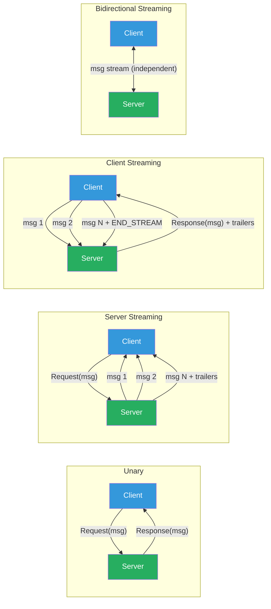

# [BEE-19046] gRPC Streaming Patterns

:::info
gRPC offers four RPC types — unary, server streaming, client streaming, and bidirectional streaming — each suited to a distinct communication pattern; choosing the wrong type wastes a connection, breaks flow control, or forces polling where push would suffice.
:::

## Context

HTTP/1.1's request-response model is fundamentally half-duplex: a client sends a request, the server responds, and the connection is either reused for the next request or torn down. For service-to-service communication where one side continuously produces data — a log aggregation service streaming events, a machine learning inference service processing a video frame-by-frame, or a chat service relaying messages — this model requires either polling (N requests for N updates) or long-polling with its attendant timeout and reconnect complexity.

gRPC, open-sourced by Google in 2015, is built on HTTP/2 (RFC 7540), which enables full-duplex multiplexed streams over a single TCP connection. A single HTTP/2 connection carries many logical streams concurrently; each stream is bidirectional and supports arbitrary message framing with flow control at both the stream and connection level. gRPC maps its four RPC types directly onto HTTP/2 streams: a unary RPC uses a single request DATA frame and a single response DATA frame; a server-streaming RPC uses one request DATA frame and N response DATA frames; bidirectional streaming keeps both DATA frame sequences open simultaneously.

This architecture provides capabilities impossible in HTTP/1.1 without hacks: the server can push data the moment it is produced; the client can stream uploads without waiting for the server to finish; both sides can send and cancel concurrently. The tradeoff is complexity: streaming RPCs have a lifecycle (open → half-close → close), error semantics (status codes arrive in HTTP/2 trailers, not headers), and flow control windows that must be managed to avoid deadlocks.

## Design Thinking

### Choosing the Right RPC Type

| RPC Type | Client sends | Server sends | Use when |
|---|---|---|---|
| **Unary** | 1 message | 1 message | Request-response: CRUD, auth, queries |
| **Server streaming** | 1 message | N messages | Server has more data than fits in one response: large result sets, real-time feeds, log tailing |
| **Client streaming** | N messages | 1 message | Client has more data than fits in one request: file upload, sensor data ingestion, bulk write |
| **Bidirectional** | N messages | N messages | Independent send/receive: chat, real-time collaboration, game state sync |

The decision point: does either side need to send more than one logical message in the exchange? If yes, use streaming. Does the sequence of messages from each side interleave independently (not request/response pairs)? If yes, use bidirectional rather than alternating server/client streaming.

Bidirectional streaming is powerful but operationally complex. Prefer server or client streaming when only one side needs to send multiple messages. Unary RPCs are simpler to implement, debug, and observe — use them by default.

### HTTP/2 Flow Control

gRPC inherits HTTP/2's sliding-window flow control at two levels:

**Connection level**: limits total bytes in-flight across all streams on one connection (default 65,535 bytes per RFC 7540; most implementations increase this to 1–16 MB via SETTINGS frames).

**Stream level**: limits bytes in-flight on a single stream (also 65,535 bytes default). A sender cannot transmit more data than the receiver's advertised window allows. The receiver increments the window by sending WINDOW_UPDATE frames as it processes data.

A slow consumer automatically slows the producer — this is backpressure. If a server-streaming RPC produces data faster than the client reads it, the server's write blocks when the stream window fills. gRPC-Go exposes `peer.Peer` and flow control via `SetWriteDeadline`; gRPC-Java exposes `isReady()` on `StreamObserver` to check whether the stream window is non-zero before sending. A producer that ignores `isReady()` will queue messages in-process memory until it exhausts heap, not until HTTP/2 backpressure kicks in.

### Deadline Propagation

Every gRPC call carries a deadline (absolute UTC time) encoded in the `grpc-timeout` HTTP/2 header. The deadline represents the total wall-clock time the caller is willing to wait, not a per-hop timeout. A service receiving a request MUST propagate the remaining deadline to any downstream gRPC calls it makes, not set a fresh timeout. Failing to propagate deadlines allows downstream services to continue work after the upstream caller has already given up and moved on — wasting resources and generating orphaned side effects.

gRPC libraries provide context propagation for this. In Go, `context.WithDeadline` or `context.WithTimeout` is passed to each downstream call. In Java, the interceptor chain propagates deadlines automatically when using grpc-java's built-in deadline propagation. In Python, `asyncio` contexts or the `grpc.aio` API carry deadlines.

### Error Handling in Streams

gRPC errors in streaming RPCs arrive in HTTP/2 trailers (after all DATA frames), not in response headers. The final status is a `grpc-status` trailer with one of the well-defined status codes (`OK`, `CANCELLED`, `DEADLINE_EXCEEDED`, `RESOURCE_EXHAUSTED`, etc.).

A streaming RPC can fail mid-stream. The server closes the stream by sending a `RST_STREAM` frame (hard abort) or by sending trailers with a non-OK status. The client observes this as an error on the stream iterator or `StreamObserver.onError` callback. Partial data already received by the client is application-defined — some protocols treat partial streams as usable; others discard them.

## Best Practices

**MUST set and propagate deadlines on every RPC, including streaming calls.** A streaming RPC without a deadline can hold a connection open indefinitely if either side stalls. On the server side, check `ctx.Done()` (Go) or `context.is_active()` (Python) inside the message loop and abort early if the context is cancelled. On the client side, pass the parent context with the remaining deadline to every downstream call.

**MUST respect flow control: check `isReady()` before writing in server streaming and bidirectional RPCs.** Ignoring flow control queues messages in application heap, not in the HTTP/2 window. The result is unbounded memory growth on the sender when the receiver is slow. In gRPC-Go, the `Send` method blocks when the window is exhausted; in gRPC-Java, `isReady()` must be polled or `onReadyHandler` used to trigger writes only when the stream can accept more data.

**MUST set a maximum message size and enforce it at both client and server.** gRPC defaults to a 4 MB max message size. Unbounded message sizes allow a misbehaving client to exhaust server heap with a single large message. Set `grpc.MaxRecvMsgSize` and `grpc.MaxSendMsgSize` explicitly. For large data, stream it in chunks rather than sending a single large message.

**SHOULD use server streaming for paginated large result sets instead of response pagination.** A unary RPC returning a large result set requires buffering the entire response before sending. A server-streaming RPC can produce items as they are fetched from the database, reducing time-to-first-byte and memory usage. The tradeoff: streaming results cannot be cached as easily as a paginated response; the client must handle partial delivery if the stream fails mid-way.

**SHOULD implement graceful stream termination.** For client streaming and bidirectional RPCs, the client half-closes the stream (sends `END_STREAM` on the last message frame) to signal no more client messages. The server should drain remaining client messages before sending trailers. Abruptly closing a stream (RST_STREAM) loses buffered messages; half-closing gives both sides a chance to flush.

**MUST enable gRPC keepalives for long-lived streaming connections.** Idle TCP connections are silently dropped by NAT devices and load balancers after 30–300 seconds. Configure `GRPC_ARG_KEEPALIVE_TIME_MS` (client-side ping interval) and `GRPC_ARG_KEEPALIVE_TIMEOUT_MS` (deadline for pong response). The server must be configured with `GRPC_ARG_HTTP2_MIN_RECV_PING_INTERVAL_WITHOUT_DATA_MS` to accept pings from clients. Without keepalives, long idle streams fail silently and the client observes a `UNAVAILABLE` error on the next write.

**SHOULD use unary RPCs for operations that complete in one round-trip, even if the response is large.** Streaming adds complexity: reconnect logic, partial state recovery, backpressure management. If the response fits in memory and is consumed atomically, unary is simpler. Use server streaming when: (a) the response is too large to buffer in memory, (b) time-to-first-byte matters, or (c) results are produced incrementally over a time window longer than a reasonable unary timeout.

## Visual



## Example

**Proto definition for all four streaming types:**

```protobuf
syntax = "proto3";

service OrderService {
  // Unary: create one order, get one response
  rpc CreateOrder(CreateOrderRequest) returns (Order);

  // Server streaming: subscribe to events for one order
  rpc WatchOrderStatus(WatchRequest) returns (stream OrderEvent);

  // Client streaming: bulk-upload orders, get a summary
  rpc BulkCreateOrders(stream CreateOrderRequest) returns (BulkCreateResponse);

  // Bidirectional: real-time order matching
  rpc MatchOrders(stream OrderOffer) returns (stream OrderMatch);
}
```

**Server streaming with deadline and flow control (Go):**

```go
func (s *Server) WatchOrderStatus(req *pb.WatchRequest, stream pb.OrderService_WatchOrderStatusServer) error {
    ctx := stream.Context()
    ch := s.events.Subscribe(req.OrderId)
    defer s.events.Unsubscribe(req.OrderId, ch)

    for {
        select {
        case <-ctx.Done():
            // Deadline exceeded or client cancelled — stop immediately
            return status.FromContextError(ctx.Err()).Err()

        case event, ok := <-ch:
            if !ok {
                return nil // stream closed normally
            }
            // Send returns an error if the client has disconnected or stream window full
            if err := stream.Send(event); err != nil {
                return err
            }
        }
    }
}
```

**Client streaming with graceful termination (Go):**

```go
func BulkCreateOrders(client pb.OrderServiceClient, orders []*pb.CreateOrderRequest) (*pb.BulkCreateResponse, error) {
    ctx, cancel := context.WithTimeout(context.Background(), 30*time.Second)
    defer cancel()

    stream, err := client.BulkCreateOrders(ctx)
    if err != nil {
        return nil, err
    }

    for _, order := range orders {
        if err := stream.Send(order); err != nil {
            return nil, fmt.Errorf("send: %w", err)
        }
    }

    // Half-close the client side: signals no more messages; server processes and responds
    resp, err := stream.CloseAndRecv()
    if err != nil {
        return nil, fmt.Errorf("close: %w", err)
    }
    return resp, nil
}
```

**Keepalive configuration (Go server + client):**

```go
// Server: accept keepalive pings from clients
serverOpts := []grpc.ServerOption{
    grpc.KeepaliveEnforcementPolicy(keepalive.EnforcementPolicy{
        MinTime:             10 * time.Second, // min ping interval client may use
        PermitWithoutStream: true,             // allow pings even on idle connection
    }),
    grpc.KeepaliveParams(keepalive.ServerParameters{
        MaxConnectionIdle: 5 * time.Minute,  // close idle connections after 5 min
        Time:              2 * time.Hour,    // server-initiated ping interval
        Timeout:           20 * time.Second, // time to wait for ping ack
    }),
}

// Client: ping server to keep streaming connection alive
dialOpts := []grpc.DialOption{
    grpc.WithKeepaliveParams(keepalive.ClientParameters{
        Time:                30 * time.Second, // send ping every 30s of inactivity
        Timeout:             10 * time.Second, // wait 10s for ping ack before closing
        PermitWithoutStream: false,            // only ping when there is an active RPC
    }),
}
```

## Implementation Notes

**gRPC-Go**: Streaming RPCs use `stream.Send()` / `stream.Recv()`. `Send` blocks when the HTTP/2 flow control window is full. `Context.Done()` must be polled in the message loop to respect deadlines. The `grpc.MaxRecvMsgSize` and `grpc.MaxSendMsgSize` dial options apply per-message.

**gRPC-Java**: Server streaming uses `StreamObserver<ResponseType>`. Call `isReady()` before each `onNext()` call; register an `onReadyHandler` to be notified when the window reopens. The `ManagedChannelBuilder.maxInboundMessageSize()` configures the receive limit. Deadline propagation requires explicit `stub.withDeadline(deadline)` on each call.

**gRPC-Python (grpc.aio)**: Async streaming uses `async for message in stream:` on the server side. `context.is_active()` checks whether the client has cancelled. `await stream.write(message)` is back-pressured by the HTTP/2 window. Use `grpc.aio.insecure_channel` with `options=[('grpc.keepalive_time_ms', 30000), ...]`.

**gRPC-Node.js**: Server streaming uses `call.write(message)` and `call.end()`. The `drain` event fires when the internal buffer is flushed; pause/resume the upstream source accordingly. Deadlines are set via `deadline` option in the call options object.

**Load Balancing**: Standard L4/L7 load balancers distribute connections, not individual RPC streams. A long-lived bidirectional stream stays on one backend for its lifetime; a backend restart terminates the stream. Use client-side load balancing (gRPC's built-in `round_robin` or `pick_first` policy with name resolution) or a gRPC-aware proxy (Envoy, Linkerd) to distribute streams across backends and transparently reconnect on failure.

## Related BEEs

- [BEE-4005](../api-design/graphql-vs-rest-vs-grpc.md) -- GraphQL vs REST vs gRPC: covers when to choose gRPC over REST or GraphQL; this article covers what to do once you have chosen gRPC and need streaming
- [BEE-10006](../messaging/backpressure-and-flow-control.md) -- Backpressure and Flow Control: gRPC's HTTP/2 flow control is one implementation of the general backpressure principle; the same concepts apply to message queues and reactive streams
- [BEE-12003](../resilience/timeouts-and-deadlines.md) -- Timeouts and Deadlines: gRPC deadline propagation is the canonical example of distributed deadline management; the concepts apply equally to REST calls and async operations
- [BEE-19037](long-polling-sse-and-websocket-architecture.md) -- Long-Polling, SSE, and WebSocket Architecture: SSE and WebSockets provide server-push and bidirectional communication over HTTP/1.1; gRPC streaming is the HTTP/2 equivalent with stronger typing and better flow control

## References

- [Core Concepts, Architecture and Lifecycle — gRPC Documentation](https://grpc.io/docs/what-is-grpc/core-concepts/)
- [gRPC over HTTP2 — Protocol Specification](https://github.com/grpc/grpc/blob/master/doc/PROTOCOL-HTTP2.md)
- [gRPC on HTTP/2: Engineering a Robust, High-performance Protocol — gRPC Blog](https://grpc.io/blog/grpc-on-http2/)
- [Flow Control — gRPC Documentation](https://grpc.io/docs/guides/flow-control/)
- [Hypertext Transfer Protocol Version 2 (HTTP/2) — RFC 7540](https://www.rfc-editor.org/rfc/rfc7540)
