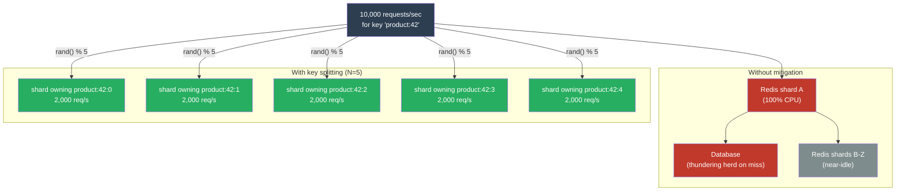

# [BEE-452] Hot Spots and Hot Key Mitigation

:::info
A hot key is a single cache entry, database partition, or message queue partition that receives a disproportionate share of traffic — enough to saturate the single node responsible for it while the rest of the cluster sits idle. The fix is never "buy a bigger node": it requires distributing the load across the cluster.
:::

## Context

Distributed systems are designed on the assumption that load will be spread across nodes roughly evenly. Consistent hashing, range-based partitioning, and Kafka partition assignment all attempt to achieve this. What they cannot control is which keys clients actually request. When a single key — a celebrity's profile, a trending hashtag, the landing page of a popular product — receives millions of requests per minute, the node holding that key becomes the bottleneck regardless of how many nodes the cluster has.

The canonical case is the **celebrity tweet problem**. When a celebrity with 100 million followers posts, Twitter's cache receives simultaneous reads for that single tweet record from millions of sessions. A Redis node handling that key will hit its single-threaded CPU limit (Redis processes commands on one thread per primary shard) before the cluster as a whole reaches 5% utilization. The problem is not capacity — it is concentration.

Facebook's 2013 paper "Scaling Memcache at Facebook" (Nishtala et al., USENIX NSDI 2013) is the canonical engineering treatment of this problem at scale. Facebook's solution involved two mechanisms: **leases** to prevent thundering herd on cache misses (only one request fetches from the database; the rest wait for the lease holder to populate the cache), and **regional pools** with selective replication of the most-read keys across multiple memcached servers. These two mechanisms — collapsing duplicate cache-miss requests and replicating hot data — remain the two fundamental approaches to hot key mitigation.

In cloud databases, hot keys manifest as throttling. DynamoDB provisions capacity at the partition level, not the table level. A partition receiving more than 3,000 read request units per second or 1,000 write request units per second will be throttled even if other partitions are idle and the table's aggregate throughput limit has not been reached. DynamoDB's **adaptive capacity** (introduced 2019) and **split-for-heat** (automatic partition subdivision for sustained hot reads) partially mitigate this, but the only complete solution is distributing access across partition key values.

## Design Thinking

Hot keys form along three dimensions, and the right mitigation depends on which dimension is the source:

**Read-heavy vs. write-heavy.** A key that receives 10,000 reads per second but is written rarely (a product catalog entry, a profile picture URL) can be solved by replication: serve reads from N copies, writes go to one source and fan out. A key that receives 10,000 writes per second (a real-time counter, a leaderboard score) cannot be solved by replication alone — writes still need to be serialized somewhere. Write-heavy hot keys require either write coalescing (buffer many writes, apply as a batch) or a distributed counter structure (CRDT counter, Redis INCRBY with local accumulation).

**Predictable vs. unpredictable.** Some hot keys are foreseeable — a product launch, a scheduled event, a recurring daily peak. These allow preemptive mitigation: pre-warming a local cache, pre-replicating the key, pre-scaling the partition. Unpredictable hot keys (viral content, breaking news) require runtime detection and automatic response.

**Isolated vs. cascading.** A hot Redis key hurts only the Redis shard holding it. A hot database shard that causes the shard's primary to be slow also starves reads from any cache-aside pattern that queries the shard on cache miss, causing those misses to pile up and amplify the load — a **thundering herd** on top of a hot partition. The two problems compound.

## Best Practices

### Detection

**MUST instrument key access frequency before attributing performance problems to hot keys.** Hot key symptoms (high CPU on one Redis shard, DynamoDB throttle exceptions on one partition, one Kafka broker with abnormal consumer lag) are often misdiagnosed as capacity problems. Confirm the diagnosis first:

- Redis: `redis-cli --hotkeys` (requires `maxmemory-policy allkeys-lfu` or `volatile-lfu`); `OBJECT FREQ <key>` for individual frequency inspection; shard CPU imbalance in your Redis monitoring dashboard
- DynamoDB: Enable CloudWatch Contributor Insights on the table; look for partition keys that account for >50% of consumed capacity
- Kafka: Check per-partition consumer lag in your Kafka metrics; a single partition with 10× the lag of its neighbors is a hot partition

### Local In-Process Cache (L1 Cache)

**SHOULD add an in-process (L1) cache in front of Redis or Memcached for known hot keys.** An L1 cache absorbs reads in the application process before they reach the network. With a TTL of 1–5 seconds and a bounded size (e.g., top 1,000 keys by access frequency), an L1 cache can absorb 80–95% of reads for hot keys at zero additional infrastructure cost. The trade-off is per-process staleness: every application instance has its own L1 cache, so a write to the backing store will not immediately be reflected in all instances' L1 caches. This is acceptable for read-heavy data where slight staleness is tolerable (profile data, catalog entries, configuration).

Use a bounded LRU or LFU map as the L1 cache. Do not use an unbounded map — a misconfigured L1 cache that caches every key will exhaust heap memory.

### Key Splitting (Fan-Out Replication)

**SHOULD split a hot key across N replica keys for read-heavy workloads that cannot tolerate staleness.** Instead of storing the value at `product:42`, store copies at `product:42:0`, `product:42:1`, ..., `product:42:N-1`. Reads select a random replica (`rand() % N`). Writes update all N replicas (or update one and replicate asynchronously). With N=10, a single key's read load is distributed across 10 shards.

Choose N based on observed QPS relative to per-shard read capacity. For Redis with a single-threaded shard handling ~100,000 commands/second, a key receiving 50,000 reads/second needs N ≥ 2; a key receiving 500,000 reads/second needs N ≥ 5, with headroom.

This technique requires the application to know the replica count at read time. Store N in a configuration service or derive it deterministically (`hash(key) % shard_count`). MUST NOT use a random N per request — the writer must know how many replicas to update.

### Request Coalescing (Single-Flight)

**MUST implement request coalescing (the single-flight pattern) to prevent thundering herd on cache misses.** When a hot key expires or is evicted, many concurrent requests will attempt to refetch it from the database simultaneously. Each request sees a cache miss and launches a database query. The database receives a sudden burst of identical queries, which may take hundreds of milliseconds each, during which the cache key remains unpopulated. All in-flight requests wait, and the burst amplifies.

Single-flight coalescing ensures that only one goroutine/thread fetches the missing value from the backing store; all other concurrent requests for the same key wait for the single fetch to complete and then read the populated cache. The result is one database query per key per cache miss, regardless of concurrent request count.

### TTL Jitter

**MUST add random jitter to cache TTLs to prevent synchronized expiry.** If 10,000 cache keys are all written in a batch operation with `TTL=300s`, they all expire simultaneously at T+300. All 10,000 keys miss the cache at the same instant, producing a thundering herd across thousands of keys rather than one. Add jitter: `TTL = base_ttl + rand(0, base_ttl * 0.1)` spreads expiries over a 10% window. For a 5-minute TTL, expiries are spread over a 30-second window — reducing peak miss rate by 10×.

**MAY use probabilistic early recomputation** (also called XFetch or early expiration) for extremely hot keys where any cache miss is costly: recompute the value slightly before it expires, with probability proportional to how close the key is to expiration. The probability of early recompute at time t for a key expiring at T is: `p = exp((t − T) / (β × recompute_time))`, where β is a tuning constant (typically 1.0). This trades slight excess compute for zero visible cache misses.

### Write-Heavy Hot Keys

**SHOULD use write coalescing for counters and leaderboard scores.** Instead of issuing `INCRBY counter 1` to Redis for every event, accumulate increments locally in the application process (e.g., an `AtomicInteger`) and flush to Redis in batches every 100ms or every 100 increments, whichever comes first. At 10,000 events/second, this reduces Redis write rate from 10,000/second to 100/second (100× reduction) at the cost of up to 100ms of counter staleness.

For exact counts where staleness is unacceptable, use a CRDT G-Counter: each node maintains its own count, and the global count is the sum of all node counts. Reads require aggregation across nodes but no coordination.

## System-Specific Notes

**Redis Cluster.** Redis Cluster uses hash slots (16,384 slots) to distribute keys across shards. A hot key always maps to one slot and therefore one primary node. Key splitting (`{product:42}:0`, `{product:42}:1`) using hash tags works within a cluster, but all replicas of the same logical key MUST use the same hash tag so they land on the same slot — or use no hash tag and accept that replicas spread across slots (and therefore shards). Spreading across shards is usually desirable for hot key relief but requires the application to track which shard holds which replica.

**DynamoDB.** DynamoDB's adaptive capacity automatically boosts a hot partition's provisioned capacity up to the table's total provisioned capacity, providing temporary relief. For sustained hot access patterns, use **write sharding**: append a random suffix (`product_id#1`, `product_id#2`, ..., `product_id#N`) to the partition key. Queries must scatter across all N suffixes and gather results. This is the recommended DynamoDB pattern for high-write hot keys.

**Kafka.** Kafka partition assignment is key-hash-based by default. A hot message key will always route to the same partition. If the key cannot be changed (it represents a real entity like a user ID), use a **custom partitioner** that distributes messages for known hot keys across multiple partitions by appending a suffix. Consumers reading those partitions must deduplicate based on entity ID.

## Visual



## Example

**Key splitting for a hot Redis key:**

```python
import random
import json
import redis

NUM_REPLICAS = 5
r = redis.Redis()

def get_hot_key(logical_key: str) -> dict | None:
    """Read from a random replica of the hot key."""
    replica_idx = random.randrange(NUM_REPLICAS)
    physical_key = f"{logical_key}:{replica_idx}"
    value = r.get(physical_key)
    return json.loads(value) if value else None

def set_hot_key(logical_key: str, value: dict, ttl_seconds: int):
    """Write to all replicas. Uses a pipeline for efficiency."""
    serialized = json.dumps(value)
    # Spread expiry times to avoid simultaneous expiry across replicas
    with r.pipeline() as pipe:
        for i in range(NUM_REPLICAS):
            physical_key = f"{logical_key}:{i}"
            jitter = random.randint(0, ttl_seconds // 10)
            pipe.setex(physical_key, ttl_seconds + jitter, serialized)
        pipe.execute()
```

**Request coalescing with Go's singleflight:**

```go
import (
    "context"
    "encoding/json"
    "golang.org/x/sync/singleflight"
)

var sfGroup singleflight.Group

// GetProduct fetches a product, collapsing concurrent cache-miss requests
// into a single database query. All waiters receive the same result.
func GetProduct(ctx context.Context, productID string) (*Product, error) {
    // Try cache first
    if cached := cache.Get(productID); cached != nil {
        return cached.(*Product), nil
    }

    // singleflight: only one goroutine fetches from DB per productID
    result, err, _ := sfGroup.Do(productID, func() (interface{}, error) {
        // Double-check cache in case another goroutine populated it
        if cached := cache.Get(productID); cached != nil {
            return cached.(*Product), nil
        }
        product, err := db.QueryProduct(ctx, productID)
        if err != nil {
            return nil, err
        }
        // Populate cache with jittered TTL
        ttl := baseTTL + time.Duration(rand.Intn(30))*time.Second
        cache.Set(productID, product, ttl)
        return product, nil
    })
    if err != nil {
        return nil, err
    }
    return result.(*Product), nil
}
```

**Write coalescing for a hot counter:**

```python
import threading
import time
import redis

class CoalescedCounter:
    """
    Accumulate increments locally, flush to Redis in batches.
    Reduces Redis write rate by up to flush_interval_ms × local_rate.
    """
    def __init__(self, key: str, flush_interval_ms: int = 100):
        self._key = key
        self._local = 0
        self._lock = threading.Lock()
        self._redis = redis.Redis()
        self._flush_interval = flush_interval_ms / 1000.0
        threading.Thread(target=self._flush_loop, daemon=True).start()

    def increment(self, amount: int = 1):
        with self._lock:
            self._local += amount

    def _flush_loop(self):
        while True:
            time.sleep(self._flush_interval)
            with self._lock:
                if self._local > 0:
                    self._redis.incrby(self._key, self._local)
                    self._local = 0
```

## Related BEEs

- [BEE-9005](../caching/cache-stampede-and-thundering-herd.md) -- Cache Stampede and Thundering Herd: the single-flight / lease pattern is the canonical solution for thundering herd on cache miss; hot key expiry is the most common trigger
- [BEE-19006](consistent-hashing.md) -- Consistent Hashing: consistent hashing distributes keys evenly in theory but cannot prevent hot keys when client access is uneven; key splitting works above the consistent hashing layer
- [BEE-9004](../caching/distributed-caching.md) -- Distributed Caching: discusses Redis Cluster and shard architecture; understanding shard topology is a prerequisite for effective key splitting
- [BEE-19010](crdts-conflict-free-replicated-data-types.md) -- CRDTs: G-Counter CRDTs are the correct data structure for write-heavy counters where exact counts are required without central serialization
- [BEE-19032](tail-latency-and-hedged-requests.md) -- Tail Latency and Hedged Requests: a hot partition causing high P99 latency is a candidate for hedged reads while the hot key mitigation is being deployed

## References

- [Scaling Memcache at Facebook -- Nishtala et al., USENIX NSDI 2013](https://research.facebook.com/publications/scaling-memcache-at-facebook/)
- [Scaling DynamoDB: How Partitions, Hot Keys, and Split for Heat Impact Performance -- AWS Database Blog](https://aws.amazon.com/blogs/database/part-2-scaling-dynamodb-how-partitions-hot-keys-and-split-for-heat-impact-performance/)
- [A Detailed Explanation of the Detection and Processing of BigKey and HotKey in Redis -- Alibaba Cloud](https://www.alibabacloud.com/blog/a-detailed-explanation-of-the-detection-and-processing-of-bigkey-and-hotkey-in-redis_598143)
- [OBJECT FREQ -- Redis Documentation](https://redis.io/docs/latest/commands/object-freq/)
- [Handling Hotkeys in Timeline Storage at Twitter -- Matthew Tejo](https://matthewtejo.substack.com/p/handling-hotkeys-in-timeline-storage)
- [How Amazon DynamoDB Adaptive Capacity Accommodates Uneven Data Access Patterns -- AWS Database Blog](https://aws.amazon.com/blogs/database/how-amazon-dynamodb-adaptive-capacity-accommodates-uneven-data-access-patterns-or-why-what-you-know-about-dynamodb-might-be-outdated/)
