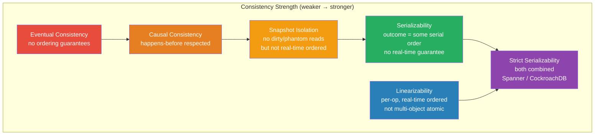

# [BEE-19009] Linearizability and Serializability

:::info
Linearizability and serializability are two distinct consistency guarantees — linearizability concerns the real-time ordering of individual operations on a shared object; serializability concerns whether the outcome of concurrent transactions is equivalent to some serial execution — and conflating them explains most consistency bugs in distributed systems.
:::

## Context

Consistency is one of the most overloaded words in distributed systems. ACID's "C" means application invariants are preserved. CAP's "C" means linearizability. SQL's isolation levels concern serializability. These are not the same property, and understanding exactly where they differ is a prerequisite for reasoning about any storage system's correctness guarantees.

**Serializability** was formalized by Christos Papadimitriou in "The Serializability of Concurrent Database Updates" (JACM, October 1979). The definition: a concurrent execution of transactions is serializable if its outcome is equivalent to the outcome of some serial (non-interleaved) execution of those same transactions. Serializability is a property of *transaction histories* — multi-operation, potentially multi-object executions. Critically, it makes no claim about wall-clock time: a serializable execution might produce an outcome consistent with a serial order that does not match the real-time order in which transactions were submitted. Transaction A could begin and complete before transaction B begins, yet a serializable execution might produce an outcome equivalent to running B first.

**Linearizability** was defined by Maurice Herlihy and Jeannette Wing in "Linearizability: A Correctness Condition for Concurrent Objects" (ACM TOPLAS, July 1990). The definition: a concurrent execution of operations on a shared object is linearizable if each operation appears to take effect instantaneously at some point between its invocation and its response, and those instantaneous effects respect real-time ordering. Linearizability is a property of *individual operations* on a shared object (a register, a queue, a key-value store). It is stronger than serializability in one dimension (preserves real-time order) but weaker in another (applies per-object, not per-transaction).

The difference matters in practice. Consider a key-value store with linearizability: if writer W sets `x = 1` and its write completes before reader R starts its read of `x`, R is guaranteed to see `1`. This is the recency guarantee. Without linearizability, R might read a stale replica and see `x = 0` even after W's write has committed everywhere — the system is internally consistent but R's read is stale relative to real time. This is the classic "read your own writes" failure mode in distributed databases with eventually consistent replicas.

Serializability without linearizability is easy to construct: a database that processes all transactions on a single thread is serializable (execution is literally serial) but if that database has read replicas that lag behind the primary, reads from replicas are not linearizable — they may not reflect the most recent committed state. Many relational databases operating in "read committed" or "repeatable read" mode are not serializable at all (only serializable isolation level guarantees it), and even those that are serializable are not automatically linearizable across replicas.

**Strict serializability** — the combination of both — means transactions execute in a serial order that is consistent with real-time ordering. If transaction A's commit precedes transaction B's start in real time, the serializable order must place A before B. Google Spanner achieves strict serializability using TrueTime (BEE-19008) to bound commit timestamps within a real-time interval. CockroachDB and FoundationDB make similar claims. etcd, which provides linearizable reads on individual keys, is linearizable but not serializable (individual key operations, not multi-key transactions, unless you use its transactional API).

Kyle Kingsbury's Jepsen project (jepsen.io) has empirically tested dozens of production databases for linearizability violations since 2013. His methodology: deploy a cluster, inject network partitions and node faults, write to the database, read back the values, and use the Knossos linearizability checker to verify that the observed read/write history is consistent with some linearizable execution. His findings revealed that MongoDB, Cassandra, Redis, RethinkDB, and others violated their stated consistency guarantees under real failure conditions. The Jepsen analyses are the most rigorous publicly available empirical evidence of the gap between consistency claims and consistency reality.

Peter Bailis et al. established the theoretical limits in "Highly Available Transactions: Virtues and Limitations" (VLDB 2013): serializability and snapshot isolation are *not* achievable with high availability during network partitions. Any system that claims strict serializability necessarily sacrifices availability during partition events — it must block or reject requests rather than serve potentially stale data.

## Design Thinking

**Serializability is about what happened; linearizability is about when it appeared to happen.** A serializable system lets you reason about transaction outcomes without worrying about interleaving. A linearizable system additionally lets you reason about when those outcomes became visible relative to real-world time. Most application correctness bugs stem from violating one or the other — not from violating both simultaneously.

**The consistency level you need is determined by your invariants, not by convention.** A social media "like" counter can tolerate eventual consistency — losing a few counts during a partition is acceptable. A bank transfer cannot tolerate serializability violations — the debit and credit must appear atomically. A distributed lock service cannot tolerate linearizability violations — two processes must never both believe they hold the lock. Choosing a consistency level requires identifying which of these failure modes your application can handle.

**You cannot test for consistency violations with happy-path load tests.** Linearizability violations only surface under concurrent access with failures — network partitions, leader elections, disk faults. A database that passes all your integration tests during normal operation can still violate linearizability during a 200ms network partition. Jepsen-style fault injection testing is the only reliable way to verify consistency claims under real conditions.

## Comparison Table

| Property | Serializability | Linearizability | Strict Serializability |
|---|---|---|---|
| Applies to | Transactions (multi-op) | Single operations | Transactions (multi-op) |
| Real-time ordering | Not required | Required | Required |
| Multi-object atomicity | Yes | Per-object only | Yes |
| Available during partition? | No | No | No |
| Examples | PostgreSQL SERIALIZABLE | etcd reads | Spanner, CockroachDB |

## Visual



## Example

**Linearizability violation (stale replica read):**

```
# Setup: primary + one replica; replica lags ~500ms
# Linearizability requires: if W completes before R starts, R must see W's value.

Timeline (real time →):

  T=0ms:  Writer W:  SET x = 42         (starts)
  T=10ms: Writer W:  SET x = 42         (commits on primary, ack to client)
  T=11ms: Reader R:  GET x              (starts — AFTER W completed)
  T=11ms: Reader R routes to replica    (replica has not yet received replication)
  T=11ms: Reader R:  returns x = 0     ← LINEARIZABILITY VIOLATION

Correct (linearizable) behavior: R must return 42, because R started after W completed.
Stale replica read: R returns 0, which was the value before W ran.

# Real-world cause: read from follower in eventually-consistent replication
# Fix: read from primary (or use read-your-own-writes session token)
# Systems that avoid this: etcd (linearizable reads go through leader),
#   Spanner (uses TrueTime to bound stale reads), CockroachDB (follower reads opt-in)
```

**Serializability violation (write skew):**

```
# Setup: two concurrent transactions updating an on-call schedule
# Invariant: at least one doctor must be on call at all times.

Initial state: Alice=ON_CALL, Bob=ON_CALL

Txn A (Alice requests off-call):            Txn B (Bob requests off-call):
  READ: alice=ON, bob=ON  → 2 on call         READ: alice=ON, bob=ON  → 2 on call
  CHECK: 2 > 1, safe to remove Alice          CHECK: 2 > 1, safe to remove Bob
  WRITE: alice=OFF_CALL                        WRITE: bob=OFF_CALL
  COMMIT                                       COMMIT

Final state: Alice=OFF_CALL, Bob=OFF_CALL  ← INVARIANT VIOLATED (no one on call)

# This is a write skew anomaly — both transactions read consistent snapshots,
# made locally valid decisions, but their combined effect violates the invariant.
# Write skew is not prevented by snapshot isolation — requires SERIALIZABLE isolation.
# Serializable execution would have blocked Txn B until A committed, then
# Txn B's re-read would show Alice=OFF → only one on call → reject Bob's request.
```

**Strict serializability (Spanner-style):**

```
# Two transactions, T1 commits before T2 starts in real time.
# Strict serializability requires the serializable order to match real-time order.

T=100ms: T1 commits (transfers $100 from A to B)
T=200ms: T2 starts (reads balance of A and B)

# Strictly serializable: T2 must see T1's effects.
# Serializable only: T2 might be placed "before" T1 in the serial order
#   and read pre-transfer balances — even though T2 started after T1 committed.

# Spanner's mechanism:
#   T1 commit timestamp = TrueTime.now().latest (say 100ms + 4ms uncertainty = 104ms)
#   T1 waits until TrueTime.now().earliest > 104ms before returning to client
#   T2 starts at T=200ms, reads any value with commit_timestamp ≤ 200ms
#   → T2 will always include T1's writes (104ms < 200ms)
```

## Related BEEs

- [BEE-8002](../transactions/isolation-levels-and-their-anomalies.md) -- Isolation Levels and Their Anomalies: isolation levels (read committed, repeatable read, serializable) are the SQL taxonomy of serializability properties; write skew requires SERIALIZABLE to prevent
- [BEE-19001](cap-theorem-and-the-consistency-availability-tradeoff.md) -- CAP Theorem: CAP's C refers to linearizability specifically (not serializability); Brewer's original framing and Gilbert-Lynch proof both use Herlihy & Wing's definition
- [BEE-19008](clock-synchronization-and-physical-time.md) -- Clock Synchronization and Physical Time: TrueTime's bounded uncertainty window is the mechanism Spanner uses to achieve strict serializability — commit timestamps are assigned within a guaranteed real-time interval
- [BEE-11006](../concurrency/optimistic-vs-pessimistic-concurrency-control.md) -- Optimistic vs Pessimistic Concurrency Control: serializable snapshot isolation (SSI) achieves serializability optimistically by detecting write-skew cycles at commit time rather than blocking reads

## References

- [Linearizability: A Correctness Condition for Concurrent Objects -- Herlihy & Wing, ACM TOPLAS, 1990](https://dl.acm.org/doi/10.1145/78969.78972)
- [The Serializability of Concurrent Database Updates -- Papadimitriou, JACM, 1979](https://dl.acm.org/doi/10.1145/322154.322158)
- [Highly Available Transactions: Virtues and Limitations -- Bailis et al., VLDB 2013](https://www.vldb.org/pvldb/vol7/p181-bailis.pdf)
- [Consistency Models -- Kyle Kingsbury, jepsen.io](https://jepsen.io/consistency)
- [Designing Data-Intensive Applications, Chapter 9 -- Martin Kleppmann, O'Reilly](https://www.oreilly.com/library/view/designing-data-intensive-applications/9781491903063/)
- [Spanner: Google's Globally-Distributed Database -- Corbett et al., OSDI 2012](https://www.usenix.org/system/files/conference/osdi12/osdi12-final-16.pdf)
