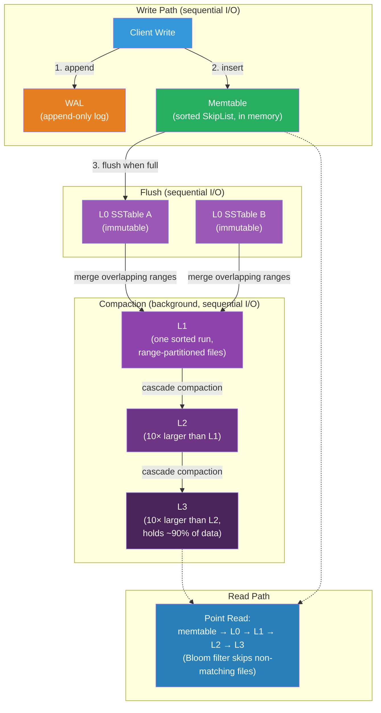

# [BEE-443] Log-Structured Merge Trees

:::info
Log-Structured Merge Trees (LSM Trees) achieve high write throughput by converting random in-place updates into sequential append-only writes — accumulating mutations in memory, flushing them as immutable sorted files, and merging those files in the background — trading higher read amplification for dramatically lower write amplification compared to B-trees.
:::

## Context

Patrick O'Neil, Edward Cheng, Dieter Gawlick, and Elizabeth O'Neil introduced the Log-Structured Merge-Tree in "The Log-Structured Merge-Tree (LSM-Tree)" (Acta Informatica, 1996). Their starting observation was mechanical: random I/O on spinning disks is two to three orders of magnitude slower than sequential I/O. B-trees, which update records in-place at leaf pages, require random disk seeks on every write. LSM trees instead batch all writes into a memory buffer, append the buffer sequentially to disk as an immutable sorted file (an SSTable), and merge files in the background. The write path becomes entirely sequential; the random-access penalty is deferred to compaction.

Google Bigtable (Chang et al., OSDI 2006) brought LSM trees to production at scale. Bigtable uses a three-component design — an in-memory memtable, an immutable SSTable hierarchy on disk, and a write-ahead log — and introduced the terminology that the ecosystem still uses. The Bigtable paper's influence produced HBase (its open-source equivalent), Cassandra (which adopted the same storage model for its column families), and LevelDB (Google, 2011), which formalized the multi-level compaction strategy. Facebook forked LevelDB into RocksDB (2012) to handle write-heavy production workloads at the scale of their social graph: RocksDB is now embedded in TiKV (TiDB's storage layer), CockroachDB, MyRocks (MySQL with RocksDB as storage engine), and Kafka's log storage.

The key data structure exposed by LSM trees to upper layers is the **SSTable** (Sorted String Table): an immutable, ordered file of key-value pairs with an embedded index and Bloom filter. Immutability is essential — it means concurrent reads never race with writes inside a file, and files can be cached, replicated, and replaced atomically. The cost is that a logical "delete" cannot remove a key from an existing file; instead it writes a **tombstone** marker that suppresses older versions until compaction reclaims the space.

Niv Dayan, Manos Athanassoulis, and Stratos Idreos analyzed the memory allocation of Bloom filters across LSM levels in "Monkey: Optimal Navigable Key-Value Store" (ACM SIGMOD, 2017), showing that assigning equal bits-per-element across all levels is suboptimal. Because most data resides in the deepest level and most false-positive cost comes from larger levels, exponentially more filter bits assigned to shallower levels halves lookup latency with the same total memory budget. RocksDB's per-level `bloom_bits_per_key` configuration implements this insight.

## Design Thinking

**The choice between LSM trees and B-trees reduces to the write-to-read ratio and write pattern.** B-trees are optimal for workloads with many point reads and low write volume: a single log-n seek finds any key, and in-place updates are cheap when the working set fits in the page cache. LSM trees are optimal for write-dominant workloads where the incoming write volume exceeds what in-place B-tree updates can sustain: write throughput is limited by memtable flush rate and sequential SSTable bandwidth, not by random I/O capacity. The inflection point is approximately 70% writes in mixed workloads; below that, B-trees typically win on read latency. Above that, LSM trees win on write throughput and hardware cost per write.

**The three amplification metrics are in fundamental tension.** Write amplification (bytes written per logical byte) measures how much compaction multiplies I/O; leveled compaction incurs 10–30× write amplification. Read amplification (disk reads per point lookup) measures how many files must be checked; without Bloom filters, it is linear in the number of files. Space amplification (disk usage / logical data size) measures wasted space from stale versions and tombstones pending compaction; size-tiered compaction can double the logical data size. No compaction strategy minimizes all three simultaneously: leveled reduces space and read amplification at the cost of write amplification; size-tiered reduces write amplification at the cost of space and read amplification.

**Compaction must be sized to keep up with the incoming write rate.** If writes arrive faster than compaction can merge files, L0 accumulates unbounded files. RocksDB stalls writes when L0 reaches `level0_slowdown_writes_trigger` (default 20 files) and stops them at `level0_stop_writes_trigger` (default 36 files). Provisioning compaction resources — CPU cores for `max_background_compactions` and I/O bandwidth — must account for the compaction fan-out, not just the raw write rate. A rule of thumb: for leveled compaction with a 10× multiplier, total I/O load is approximately 10–30× the application write rate.

## Visual



## Best Practices

**Match the compaction strategy to the dominant access pattern.** Use leveled compaction (RocksDB default) when read latency and space efficiency are priorities: a point read checks at most one file per level because levels maintain non-overlapping key ranges. Use size-tiered (universal) compaction when sustained write throughput is the bottleneck and temporary space doubling is acceptable: compaction merges files of similar sizes without the cascading rewriting of leveled. Cassandra uses size-tiered by default for time-series and append-heavy workloads; RocksDB uses leveled for general OLTP.

**Tune Bloom filter bits-per-key based on lookup patterns, not uniformly.** The default 10 bits-per-key yields a ~1% false positive rate per SSTable. For hot workloads where many lookups miss (key not present), raising bits-per-key to 15–20 in deeper levels reduces false positives and eliminates unnecessary disk reads. Per-level filter tuning (Monkey-style: exponentially more bits in shallower levels) further reduces aggregate lookup cost if memory is constrained.

**Keep memtable size and flush frequency in balance.** A larger memtable (RocksDB `write_buffer_size`, default 64 MB) reduces flush frequency and therefore the number of L0 files produced per time unit, reducing L0 → L1 compaction pressure. Setting `max_write_buffer_number` to 2–4 allows concurrent writes to continue during a flush. SHOULD NOT set memtables so large that flush latency (the time to write one full memtable as an SSTable) exceeds the write pressure window, or L0 will accumulate during the stall.

**Enable per-level compression, heaviest on the bottom level.** Most data (90%+ with leveled compaction) lives in the deepest level. Compressing deep levels with a heavier codec (Zstd) and leaving L0/L1 uncompressed (or using Snappy) reduces storage cost without adding CPU to the hot write path. RocksDB `bottommost_compression` configures the bottom level independently.

**Size levels to avoid compaction stalls before they happen.** Use `level_compaction_dynamic_level_bytes = true` so RocksDB calculates level targets from the actual bottom-level size rather than a static base. This prevents levels from being permanently undersized as the dataset grows and eliminates the "score >> 1" condition that triggers stall cascades during unexpected write spikes.

**Monitor write amplification, space amplification, and L0 file count continuously.** Write amplification (reported by RocksDB statistics as `rocksdb.compaction.bytes.written` / `rocksdb.bytes.written`) above 30× typically indicates compaction misconfiguration. L0 file count above `level0_slowdown_writes_trigger` is an immediate signal that the write rate exceeds compaction capacity. Space amplification above 2× indicates that compaction is not running frequently enough to reclaim tombstones and stale versions.

## Deep Dive

**SSTable structure.** Each SSTable file is organized as a sequence of blocks: data blocks contain sorted key-value pairs (default 4 KB each, configurable); an index block maps the first key of each data block to its file offset, enabling binary search; a filter block holds the Bloom filter; a footer contains block offsets and compression metadata. On open, RocksDB reads the footer, index, and filter blocks into memory (the block cache). Only data blocks are fetched on demand. A point read that hits the Bloom filter performs one binary search in the in-memory index block, then one sequential read of the target data block — a single file-level lookup reduces to two memory accesses plus one sequential disk read.

**Leveled compaction mechanics.** L0 may contain overlapping key ranges across files (multiple memtable flushes may cover the same keys). All levels L1 and deeper maintain a single sorted run: no two files at the same level share a key range. When L0 triggers compaction, the compaction job selects all L0 files and merges them with any overlapping files in L1 using a k-way merge-sort, producing new non-overlapping L1 files. If L1 now exceeds its size target, one L1 file is selected and merged with any overlapping L2 files — this cascades through levels as needed. The merge-sort is key-ordered; for duplicate keys across levels, the version with the higher sequence number (more recent) wins and older versions are discarded.

**Tombstones and compaction lag.** A delete produces a tombstone record (key + deletion marker). The tombstone suppresses older versions of the same key during reads. The underlying storage is not reclaimed until the tombstone and any older versions of that key are co-located in the same compaction job. On the bottommost level, tombstones can be dropped entirely (no older versions can exist below them). This means deletes incur space cost proportional to how long it takes for a tombstone to reach the bottom and be compacted out — an important consideration for workloads with high delete volume or short TTLs.

## Example

**RocksDB configuration for write-heavy OLTP:**

```cpp
#include "rocksdb/options.h"

rocksdb::Options options;
// Increase memtable size to reduce L0 file count (less compaction pressure)
options.write_buffer_size = 128 * 1024 * 1024;  // 128 MB per memtable
options.max_write_buffer_number = 3;             // up to 3 memtables in memory

// Leveled compaction — better read latency and space efficiency
options.compaction_style = rocksdb::kCompactionStyleLevel;
options.level_compaction_dynamic_level_bytes = true;  // auto-size levels

// L1 target: align with memtable size to reduce L0→L1 compaction cost
options.max_bytes_for_level_base = 128 * 1024 * 1024;  // 128 MB
options.max_bytes_for_level_multiplier = 10;             // L2=1.28 GB, L3=12.8 GB...

// Compaction concurrency (provision for sustained write load)
options.max_background_compactions = 4;
options.max_background_flushes = 2;

// Compression: none for L0/L1 (low-latency path), LZ4 for mid, Zstd for bottom
options.compression_per_level = {
    rocksdb::kNoCompression,    // L0
    rocksdb::kNoCompression,    // L1
    rocksdb::kLZ4Compression,   // L2
    rocksdb::kLZ4Compression,   // L3
    rocksdb::kZSTD,             // L4 (bottom — ~90% of data)
};
options.bottommost_compression = rocksdb::kZSTD;

// Bloom filter: 10 bits/key → ~1% false positive rate
rocksdb::BlockBasedTableOptions table_options;
table_options.filter_policy.reset(
    rocksdb::NewBloomFilterPolicy(10, false)  // false = block-based (faster)
);
table_options.block_cache = rocksdb::NewLRUCache(512 * 1024 * 1024);  // 512 MB cache
options.table_factory.reset(rocksdb::NewBlockBasedTableFactory(table_options));
```

**Observing LSM internals via RocksDB statistics:**

```
# rocksdb.stats output (from db.GetProperty("rocksdb.stats")):

** Compaction Stats [default] **
Level    Files   Size     Score Read(GB)  Rn(GB) Rnp1(GB) Write(GB) Wnew(GB)
----------------------------------------------------------------
  L0      3/0    192 MB   0.75  0.00      0.00   0.00      0.19      0.19
  L1      8/0    897 MB   0.86  2.31      0.81   1.50      2.16      0.66
  L2     64/0    8.95 GB  0.88  25.2      2.16   23.0      24.7      1.70
  L3    512/0   90.1 GB   1.00  254       24.7   229       243       14.0

Uptime(secs): 86400.0 total, 86400.0 interval
Flush(GB): cumulative 8.00
Write Amplification: cumulative 30.4        ← total bytes written / app bytes
Read  Amplification: 3.2
Space Amplification: 1.12                   ← disk used / logical data size
Stalls(count): 0 level0_slowdown, 0 level0_stop
```

**Python: basic LSM-like write path in pseudocode:**

```python
import sortedcontainers  # skip-list equivalent via sorted dict

class LSMTree:
    def __init__(self, memtable_limit=64 * 1024 * 1024):
        self.wal = open("wal.log", "ab")          # sequential write-ahead log
        self.memtable = sortedcontainers.SortedDict()
        self.memtable_size = 0
        self.memtable_limit = memtable_limit
        self.sstables = []                          # list of (sorted dict) flushed files

    def put(self, key: str, value: bytes):
        # 1. Append to WAL for durability (sequential I/O)
        self.wal.write(f"{key}={value.hex()}\n".encode())
        self.wal.flush()

        # 2. Insert into in-memory memtable (O(log n) sorted insert)
        self.memtable[key] = value
        self.memtable_size += len(key) + len(value)

        # 3. Flush when memtable reaches size limit
        if self.memtable_size >= self.memtable_limit:
            self._flush()

    def get(self, key: str) -> bytes | None:
        # 1. Check memtable first (most recent data)
        if key in self.memtable:
            return self.memtable[key]

        # 2. Search SSTables from newest to oldest (linear — Bloom filter would skip most)
        for sstable in reversed(self.sstables):
            if key in sstable:
                return sstable[key]

        return None  # key not found

    def _flush(self):
        # Write memtable as immutable sorted SSTable (sequential I/O)
        self.sstables.append(dict(self.memtable))  # sorted dict → immutable snapshot
        self.memtable.clear()
        self.memtable_size = 0
        # Background: trigger compaction if too many SSTables accumulate
        if len(self.sstables) >= 4:
            self._compact()

    def _compact(self):
        # Merge all SSTables into one (k-way merge-sort, last value wins per key)
        merged = {}
        for sstable in self.sstables:
            merged.update(sstable)  # later SSTables overwrite earlier (newer wins)
        self.sstables = [merged]
```

## Related BEEs

- [BEE-6005](../data-storage/storage-engines.md) -- Storage Engines: B-trees and LSM trees are the two dominant storage engine designs; B-trees minimize read amplification through in-place updates; LSM trees minimize write amplification through sequential batching — the choice determines the engine's write throughput ceiling and read latency floor
- [BEE-19011](write-ahead-logging.md) -- Write-Ahead Logging: LSM trees use a WAL as the first write destination for durability; the WAL ensures that memtable contents can be reconstructed after a crash, allowing the memtable to remain volatile without sacrificing write durability
- [BEE-19012](bloom-filters-and-probabilistic-data-structures.md) -- Bloom Filters and Probabilistic Data Structures: every SSTable in an LSM tree carries a Bloom filter; the filter answers "is this key definitely not in this file?" with no false negatives, allowing the read path to skip the large majority of files without disk I/O
- [BEE-19022](anti-entropy-and-replica-repair.md) -- Anti-Entropy and Replica Repair: Cassandra's storage layer is an LSM tree (memtable + SSTables + compaction); Cassandra anti-entropy repair must account for LSM tombstone lifetimes — tombstones must be compacted out within gc_grace_seconds or deleted keys can be resurrected by a repaired replica that still holds stale data

## References

- [The Log-Structured Merge-Tree (LSM-Tree) -- O'Neil, Cheng, Gawlick, O'Neil, Acta Informatica 1996](https://www.cs.umb.edu/~poneil/lsmtree.pdf)
- [Bigtable: A Distributed Storage System for Structured Data -- Chang et al., OSDI 2006](https://research.google.com/archive/bigtable-osdi06.pdf)
- [RocksDB Wiki -- Facebook/Meta](https://github.com/facebook/rocksdb/wiki)
- [Leveled Compaction -- RocksDB Wiki](https://github.com/facebook/rocksdb/wiki/Leveled-Compaction)
- [Monkey: Optimal Navigable Key-Value Store -- Dayan, Athanassoulis, Idreos, ACM SIGMOD 2017](https://dl.acm.org/doi/10.1145/3035918.3064054)
- [LevelDB -- Google](https://github.com/google/leveldb)
