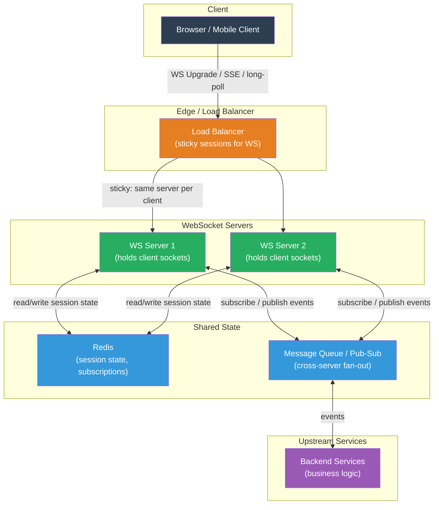

# [BEE-19037] Long-Polling, SSE, and WebSocket Architecture

:::info
Real-time communication between clients and servers requires choosing among three persistence models — long-polling, Server-Sent Events, and WebSockets — each with fundamentally different connection lifetimes, directionality, and scaling properties. The choice determines whether load balancers need sticky sessions, how graceful shutdown works, and how many simultaneous clients a server can hold.
:::

## Context

Early web applications were purely request-response: the client asked, the server answered, the connection closed. Delivering server-initiated events — a new chat message, a stock price update, a build status change — required the client to poll repeatedly. Polling at short intervals burns server resources and adds latency equal to the polling period; polling at long intervals misses events.

**Comet** (named by Alex Russell in 2006) was the umbrella term for browser hacks that simulated server push before native APIs existed. The most common technique was **long-polling**: the client sends an HTTP request, the server holds it open until an event occurs (or a timeout fires), then responds. The client immediately issues the next request. Each round-trip incurs HTTP overhead — headers, TCP handshake (or reuse), and TLS overhead — but event delivery latency drops to the RTT rather than the polling interval.

**Server-Sent Events (SSE)** standardized the one-directional server-push pattern. A client opens a single HTTP connection with `Accept: text/event-stream`; the server streams `data:` lines indefinitely. The browser's `EventSource` API handles reconnection automatically using the `Last-Event-ID` header — if the connection drops, the browser reconnects and the server resumes from where it left off. Under HTTP/1.1, browsers limit connections to six per origin, which constrains SSE to six simultaneous streams per tab. HTTP/2 multiplexing removes this limit, allowing hundreds of SSE streams over one TCP connection.

**WebSocket** (RFC 6455, standardized 2011) replaced the HTTP connection model entirely. An HTTP/1.1 `Upgrade: websocket` handshake converts the TCP connection to a bidirectional, full-duplex channel. After the handshake, both sides send framed messages independently — no waiting for a request before responding. Latency drops to a single RTT for each message; there is no per-message HTTP overhead. The trade-off is that WebSocket connections are stateful and long-lived, which complicates horizontal scaling, load balancing, and deployment.

**gRPC streaming** (HTTP/2 streams over persistent connections) is the dominant choice for backend-to-backend real-time communication: binary protobuf encoding, multiplexed streams, bidirectional streaming, and native support in all major RPC frameworks. It is less appropriate for browser clients, where native gRPC-Web requires a proxy.

## Design Thinking

### Choosing the Right Model

The primary question is directionality and latency requirements:

| Mechanism | Direction | Latency | Browser support | Connection model |
|---|---|---|---|---|
| Short polling | Client→Server (repeated) | Up to poll interval | Universal | Stateless HTTP |
| Long-polling | Server→Client (emulated) | ~1 RTT | Universal | Stateless HTTP |
| SSE | Server→Client only | ~1 RTT | All modern browsers | Persistent HTTP |
| WebSocket | Bidirectional | ~1 RTT | All modern browsers | Stateful upgrade |
| gRPC streaming | Bidirectional | ~1 RTT | Backend only (native) | Stateful HTTP/2 |

**Use SSE when:**
- Communication is server-to-client only (live feeds, notifications, progress bars)
- You need automatic reconnection with last-event replay
- Simplicity matters — SSE works through most HTTP proxies without configuration
- You are already running HTTP/2 (eliminating the six-connection limit)

**Use WebSocket when:**
- Communication is bidirectional at low latency (chat, collaborative editing, multiplayer games)
- The client sends frequent messages (not just occasional acks)
- You control the infrastructure and can configure load balancers for sticky sessions

**Use long-polling when:**
- WebSocket support is uncertain (corporate proxies that strip Upgrade headers)
- Event frequency is low (one event every few minutes) — the polling overhead is acceptable
- You need to work with infrastructure that does not support persistent connections

### Scaling Stateful Connections

HTTP is stateless: any server can handle any request. WebSocket connections break this invariant — a client is permanently attached to the server holding its connection. This has three consequences:

**Load balancing requires session affinity.** Standard round-robin load balancing sends new connections to any backend. If a WebSocket reconnect lands on a different server, the connection context is lost. The solution is **sticky sessions**: IP hash or cookie-based affinity routes each client to the same backend. The risk: uneven load distribution when IP hash produces hot servers; cookie-based affinity survives NAT rebalancing better.

**Horizontal scaling requires externalizing connection state.** If the client's subscription list, authentication state, or in-flight messages live only in the server's process memory, that state is lost when the server restarts or when traffic is rebalanced. The pattern is to store session state in a shared store (Redis, a database) and treat each server as stateless with respect to connection metadata. The server owns the TCP socket but not the business state.

**Slack's architecture** illustrates this at scale. Slack's Channel Servers (2016 design, later Flannel architecture) hold millions of WebSocket connections but route events through a shared messaging layer. When a message arrives for a channel, the server fans it out to all connected clients in that channel, looking up channel membership from shared state rather than process-local memory. Consistent hashing assigns channels to Channel Servers, so most messages are local; cross-server fan-out handles the rest.

### Graceful Shutdown with Long-Lived Connections

HTTP requests are typically sub-second; graceful shutdown waits for in-flight requests and then exits. WebSocket connections may last hours. Graceful shutdown must handle two classes:

1. **No-op connections**: idle WebSocket connections that carry no in-progress work. These can be closed immediately with a `1001 Going Away` close frame.
2. **Active connections**: connections with in-progress operations (a message being delivered, a collaborative edit being applied). These need a longer drain window.

The shutdown sequence:
1. Mark the server as "draining" — the load balancer health check returns unhealthy, so no new connections arrive.
2. Send a `Connection: close` or WebSocket close frame to idle connections.
3. Wait for active operations to complete, bounded by a maximum drain timeout (typically 60–300 seconds for WebSocket, much longer than the 25–35 seconds appropriate for HTTP APIs).
4. Force-close remaining connections after the timeout.

Kubernetes `terminationGracePeriodSeconds` must be set to accommodate the WebSocket drain window, not just the HTTP request drain window. A service that serves both HTTP APIs and WebSocket connections needs the larger of the two values.

## Best Practices

**MUST use WebSocket over SSE only when bidirectional communication is genuinely required.** SSE is simpler to implement, proxy-friendly, and supports automatic reconnection natively. If the client only receives events and never sends messages (or sends messages via a separate REST API), SSE reduces complexity without sacrificing latency.

**MUST configure sticky sessions at the load balancer when using WebSocket.** IP hash-based affinity is the simplest option; cookie-based affinity (`AWSALB`, `NginxSticky`, or custom) survives CGNAT and IPv6 transitions better. SHOULD prefer cookie-based affinity for production deployments where clients may share an IP (mobile networks, corporate proxies).

**SHOULD externalize connection state from the WebSocket server process.** Store subscription lists, authenticated user identity, and channel memberships in a shared store (Redis). The server process owns the TCP socket but should be replaceable: if it dies, the client reconnects and rehydrates state from the shared store. This enables rolling deployments without session loss.

**MUST implement application-level heartbeats (ping/pong).** TCP keep-alive is insufficient: corporate firewalls and cloud NAT gateways silently drop idle TCP connections after 30–900 seconds. The WebSocket protocol provides ping/pong control frames (RFC 6455 Section 5.5). The server SHOULD send a ping every 25–55 seconds; the client MUST respond with pong. A missed pong after a configurable timeout (two missed pongs) indicates a dead connection and SHOULD trigger server-side close and cleanup.

**MUST increase `terminationGracePeriodSeconds` when serving WebSocket connections.** For HTTP APIs, 30–40 seconds is typically sufficient. For WebSocket servers, the grace period must cover the maximum expected connection lifetime or the drain window, whichever is longer. For most applications, 120–300 seconds is appropriate. The preStop hook should mark the server as draining before SIGTERM is processed.

**SHOULD use SSE with HTTP/2 to eliminate the six-connection-per-origin limit.** Under HTTP/1.1, a single browser tab can open at most six connections to the same origin; SSE consumes one per stream. Under HTTP/2, a single TCP connection multiplexes all SSE streams, removing this limit. Verify that both the server and any intermediate proxies (nginx, Envoy, CDN) support HTTP/2 for SSE connections.

**SHOULD implement last-event replay for SSE streams.** Include an `id:` field in each SSE event. When the client reconnects, the browser sends `Last-Event-ID` in the request headers. The server SHOULD use this ID to replay missed events from a short-lived event log (Redis list, database table). This provides at-least-once delivery across reconnections without client-side polling logic.

## Visual



## Example

**WebSocket server with ping/pong heartbeat and graceful shutdown (Python asyncio):**

```python
import asyncio
import signal
import websockets
from websockets.exceptions import ConnectionClosedOK, ConnectionClosedError

PING_INTERVAL = 30   # seconds between server-initiated pings
PING_TIMEOUT  = 10   # seconds to wait for pong before closing

active_connections: set[websockets.WebSocketServerProtocol] = set()
draining = False

async def handle_connection(ws: websockets.WebSocketServerProtocol):
    if draining:
        await ws.close(1001, "Server is draining")
        return

    active_connections.add(ws)
    try:
        async for message in ws:
            # Route message to business logic; response sent back on same socket
            response = await process_message(message)
            await ws.send(response)
    except (ConnectionClosedOK, ConnectionClosedError):
        pass
    finally:
        active_connections.discard(ws)

async def drain_and_shutdown(server: websockets.WebSocketServer):
    global draining
    draining = True  # Health check now returns unhealthy; LB stops sending new connections

    # Close idle connections immediately
    await asyncio.gather(
        *[ws.close(1001, "Server shutting down") for ws in list(active_connections)],
        return_exceptions=True
    )

    # Wait up to 120s for active connections to finish
    deadline = asyncio.get_event_loop().time() + 120
    while active_connections and asyncio.get_event_loop().time() < deadline:
        await asyncio.sleep(1)

    server.close()
    await server.wait_closed()

async def main():
    server = await websockets.serve(
        handle_connection,
        "0.0.0.0",
        8765,
        ping_interval=PING_INTERVAL,
        ping_timeout=PING_TIMEOUT,
    )

    loop = asyncio.get_running_loop()
    loop.add_signal_handler(signal.SIGTERM, lambda: asyncio.create_task(drain_and_shutdown(server)))

    await server.wait_closed()
```

**SSE endpoint with last-event replay (Python/FastAPI):**

```python
import asyncio
from fastapi import FastAPI, Request
from fastapi.responses import StreamingResponse
import redis.asyncio as redis

app = FastAPI()
r = redis.Redis()

async def event_stream(channel: str, last_event_id: str | None):
    # Replay missed events from Redis list if client reconnects with Last-Event-ID
    if last_event_id:
        missed = await r.lrange(f"events:{channel}", 0, -1)
        for event in missed:
            event_id, data = event.decode().split(":", 1)
            if event_id > last_event_id:          # only events after last seen
                yield f"id: {event_id}\ndata: {data}\n\n"

    # Subscribe to new events
    pubsub = r.pubsub()
    await pubsub.subscribe(channel)
    async for message in pubsub.listen():
        if message["type"] == "message":
            event_id = generate_event_id()        # monotonically increasing ID
            data = message["data"].decode()
            await r.rpush(f"events:{channel}", f"{event_id}:{data}")
            await r.expire(f"events:{channel}", 300)  # retain for 5 minutes
            yield f"id: {event_id}\ndata: {data}\n\n"

@app.get("/events/{channel}")
async def sse_endpoint(channel: str, request: Request):
    last_event_id = request.headers.get("Last-Event-ID")
    return StreamingResponse(
        event_stream(channel, last_event_id),
        media_type="text/event-stream",
        headers={
            "Cache-Control": "no-cache",
            "X-Accel-Buffering": "no",   # disable nginx buffering for SSE
        },
    )
```

**Nginx configuration for WebSocket proxying with sticky sessions:**

```nginx
upstream websocket_backends {
    ip_hash;                          # sticky sessions: same client IP → same backend
    server ws-server-1:8765;
    server ws-server-2:8765;
    server ws-server-3:8765;
    keepalive 300;                    # keep connections to backends alive
}

server {
    listen 443 ssl http2;

    location /ws/ {
        proxy_pass http://websocket_backends;
        proxy_http_version 1.1;
        proxy_set_header Upgrade $http_upgrade;
        proxy_set_header Connection "upgrade";
        proxy_set_header Host $host;
        proxy_read_timeout 3600s;     # 1 hour; prevents nginx from closing idle WS connections
        proxy_send_timeout 3600s;
    }

    location /events/ {              # SSE endpoint
        proxy_pass http://websocket_backends;
        proxy_http_version 1.1;
        proxy_set_header Connection "";    # keep connection alive (no upgrade needed)
        proxy_buffering off;               # critical: disable buffering for streaming
        proxy_read_timeout 3600s;
    }
}
```

## Related BEEs

- [BEE-19034](graceful-shutdown-and-connection-draining.md) -- Graceful Shutdown and Connection Draining: WebSocket connections require a longer drain window than HTTP requests; the shutdown sequencing in BEE-19034 applies directly, with a higher `terminationGracePeriodSeconds`
- [BEE-11004](../concurrency/async-i-o-and-event-loops.md) -- Async I/O and Event Loops: WebSocket servers are I/O-bound and benefit from async event loops; holding thousands of idle connections is feasible only with non-blocking I/O
- [BEE-11005](../concurrency/producer-consumer-and-worker-pool-patterns.md) -- Producer-Consumer and Worker Pool Patterns: message fan-out from a pub/sub broker to WebSocket connections is a producer-consumer problem
- [BEE-19036](api-gateway-patterns.md) -- API Gateway Patterns: WebSocket connections typically pass through the API Gateway, which must be configured to pass through the Upgrade handshake and support long-lived connections
- [BEE-12007](../resilience/rate-limiting-and-throttling.md) -- Rate Limiting and Throttling: rate limiting WebSocket connections requires per-connection or per-user message rate limits, not just per-request IP-based limits
- [BEE-3008](../networking-fundamentals/http-as-a-substrate-for-new-protocols.md) -- HTTP as a Substrate for New Protocols: SSE and WebSocket are two of several conventions layered on HTTP; this article frames the broader pattern and inventories which HTTP primitives each convention exploits

## References

- [RFC 6455 -- The WebSocket Protocol (IETF)](https://datatracker.ietf.org/doc/html/rfc6455)
- [Server-Sent Events -- WHATWG HTML Living Standard](https://html.spec.whatwg.org/multipage/server-sent-events.html)
- [Using Server-Sent Events -- MDN Web Docs](https://developer.mozilla.org/en-US/docs/Web/API/Server-sent_events/Using_server-sent_events)
- [Real-Time Messaging at Slack -- Slack Engineering](https://slack.engineering/real-time-messaging/)
- [The Challenge of Scaling WebSockets -- Ably](https://ably.com/topic/the-challenge-of-scaling-websockets)
- [gRPC Core Concepts -- gRPC Documentation](https://grpc.io/docs/what-is-grpc/core-concepts/)
