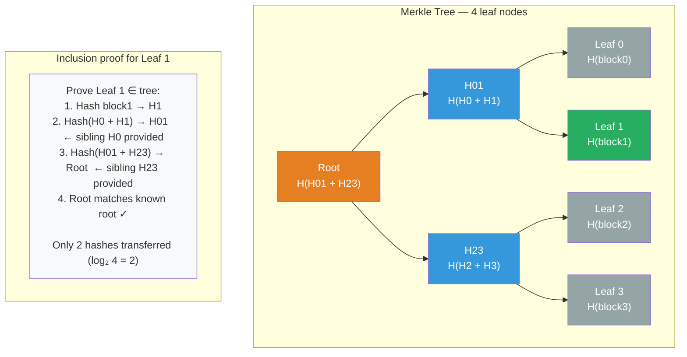

# [BEE-432] Merkle Trees

:::info
A Merkle tree lets you verify that a single element belongs to a large dataset — or that two replicas agree — using only O(log n) hashes instead of transferring all n items. This asymmetry makes Merkle trees the standard primitive for anti-entropy repair in distributed databases, content-addressed storage in Git, transaction verification in Bitcoin, and tamper-evident logging in certificate transparency.
:::

## Context

Ralph Merkle described hash trees in "A Certified Digital Signature" (CRYPTO '89, first submitted to CACM in 1979; US Patent 4,309,569, issued 1982). The core idea is straightforward: hash each data block to produce a leaf node, then repeatedly pair and hash adjacent nodes up to a single root hash. The root hash is a cryptographic fingerprint of the entire dataset.

The useful property follows from the avalanche effect of cryptographic hash functions: changing any single byte anywhere in the input changes the root hash in an unpredictable way. This makes the tree **tamper-evident** — two parties holding the same root hash can be certain their underlying data agrees. But more importantly, the tree structure allows a **prover** to convince a **verifier** that a specific leaf belongs to the tree by supplying only the sibling hashes along the path from that leaf to the root — O(log n) hashes for n leaves. The verifier recomputes the path bottom-up and checks that the result equals the known root. No other data is needed.

**Git** applies this directly. Every Git object — blob (file content), tree (directory listing), commit — is stored under a SHA-1 (later SHA-256) key derived from its content. A commit points to a tree, which points to blobs and sub-trees, forming a Merkle DAG. When comparing two commits, Git walks the DAGs and stops recursing at any subtree whose root hash matches — an entire directory with ten thousand files is confirmed identical with a single hash comparison. This enables `git diff` and `git clone --depth` to transfer only what actually changed.

**Bitcoin** uses Merkle trees inside each block to support Simplified Payment Verification (SPV). Satoshi Nakamoto's 2008 whitepaper describes this in section 8: a light client downloads only 80-byte block headers (containing the Merkle root) and asks a full node for the sibling hashes along the path from a specific transaction to the root. The client recomputes the path and verifies inclusion without downloading the full block. CVE-2012-2459 later revealed that Bitcoin's implementation duplicated the final transaction when the count was odd, allowing the same Merkle root to correspond to two different transaction sets — an input validation vulnerability fixed by checking for this normalization form.

**Amazon DynamoDB and Apache Cassandra** use Merkle trees for anti-entropy repair. DeCandia et al. described this in the Dynamo paper (SOSP 2007): each node maintains a Merkle tree over its key range, with leaves representing small key-space buckets. During background repair, two replicas exchange root hashes. If they match, the entire key range is consistent. If they differ, the nodes recurse into subtrees, narrowing down the divergent range to a small set of buckets that must be synchronized. Cassandra's `nodetool repair` runs this protocol; without it, network partitions and node failures would cause permanent divergence.

**Certificate Transparency** (RFC 6962, Ben Laurie et al., 2013) uses an append-only Merkle tree to create publicly auditable logs of TLS certificates. Each certificate authority submits certificates to one or more CT logs. The log returns a Signed Certificate Timestamp (SCT) — a promise to include the certificate in the tree. Browsers verify that certificates appear in known logs. Inclusion proofs (O(log n) hashes proving a certificate is in the tree) and consistency proofs (O(log n) hashes proving that an older log is a prefix of a newer one) allow anyone to audit the log without downloading it entirely.

## Design Thinking

**Use a Merkle tree when you need to verify subset membership or compare large datasets cheaply.** The fundamental trade-off is space (storing the tree) and time (building and updating the tree) against communication cost (O(log n) vs O(n) for comparison or verification). This trade-off favors Merkle trees when datasets are large, communication is expensive, and verifications are frequent — exactly the conditions in distributed database repair, blockchain SPV, and certificate auditing.

**Merkle trees are static structures that are expensive to update.** Appending a new leaf requires recomputing O(log n) hashes up to the root. Inserting in the middle requires restructuring the tree. Certificate Transparency logs sidestep this by being append-only — they never modify existing leaves. Cassandra and DynamoDB rebuild Merkle trees periodically over fixed key ranges rather than maintaining them incrementally. If your use case requires frequent random updates, a Merkle tree may not be the right structure; consider Bloom filters for membership (BEE-431) or versioned vector clocks (BEE-422) for causality tracking.

**The hash function choice determines security properties.** SHA-1 is broken for collision resistance (SHAttered attack, 2017) and Git is migrating to SHA-256. Bitcoin uses double-SHA-256 (SHA-256 applied twice). Certificate Transparency uses SHA-256. For new systems, use SHA-256 or SHA-3. The second-preimage resistance property matters most for Merkle trees: given a leaf, it MUST be computationally infeasible to find a different leaf with the same hash. Most current hash functions provide this even where collision resistance is weaker.

**Distinguish inclusion proofs from consistency proofs.** Inclusion proofs answer "is this element in this tree?" — the verifier knows the root and checks a single element. Consistency proofs answer "is this old tree a prefix of this new tree?" — the verifier holds two roots (at different times) and checks that the log grew only by appending. Certificate Transparency requires both. Anti-entropy repair in databases only needs inclusion/exclusion comparison. Git only needs root equality checks. Match the proof type to the actual query.

## Visual



## Example

**Cassandra anti-entropy repair with Merkle trees:**

```
# Two replicas (A and B) are compared using Merkle trees
# Key range: [0x0000, 0xFFFF) divided into 4 buckets

Replica A tree:             Replica B tree (diverged at bucket 2):
Root: H(H01 + H23)          Root: H(H01 + H23')   ← roots differ
├── H01: H(H0 + H1)         ├── H01: H(H0 + H1)   ← match: skip buckets 0-1
└── H23: H(H2 + H3)         └── H23': H(H2' + H3) ← differ: recurse
    ├── H2: hash(bucket2)       ├── H2': hash(bucket2') ← differ: stream bucket 2
    └── H3: hash(bucket3)       └── H3: hash(bucket3)   ← match: skip bucket 3

# Result: only bucket 2 (keys 0x8000-0xBFFF) is streamed from A to B
# Without Merkle tree: must compare all keys in all 4 buckets
```

**Git content-addressed storage:**

```bash
# Every object in Git is stored under the hash of its content
git cat-file -p HEAD
# tree 5b8e4b...     <- points to root tree object
# parent 3f7a2c...
# author Alice <alice@example.com> 1713100000 +0000
# commit message

git cat-file -p 5b8e4b
# 100644 blob a9f3b2...  README.md
# 100644 blob 7c8d1e...  main.go
# 040000 tree 2e5f9a...  internal/

# To compare two commits: walk DAGs, stop at matching subtree hashes
# If internal/ tree hash matches between commits → no changes in that subtree
# Time proportional to files changed, not files total
```

**Certificate Transparency inclusion proof (RFC 6962):**

```
# Browser receives certificate with SCT (Signed Certificate Timestamp)
# SCT proves the CT log committed to include the certificate

# To verify inclusion after the merge delay:
# 1. Browser fetches the current log tree size and root hash (signed by log)
# 2. Browser requests inclusion proof for the certificate's leaf hash
# 3. Log returns [sibling_hash_1, sibling_hash_2, ..., sibling_hash_k] (k = log₂ n hashes)
# 4. Browser recomputes:
#    leaf_hash = H(0x00 || certificate_data)
#    parent = H(0x01 || leaf_hash || sibling_1)
#    grandparent = H(0x01 || parent || sibling_2)
#    ... until root
# 5. Computed root must match the signed root — certificate is in the log

# Consistency proof (auditor verifying log only grows by appending):
# Given root_old (size m) and root_new (size n, n > m):
# Log provides O(log n) hashes proving root_old is a prefix of root_new
```

## Related BEEs

- [BEE-6003](../data-storage/replication-strategies.md) -- Replication Strategies: Cassandra and DynamoDB anti-entropy repair uses Merkle trees to identify divergent key ranges between replicas without transferring all data — the Merkle comparison runs on top of the gossip replication infrastructure
- [BEE-6005](../data-storage/storage-engines.md) -- Storage Engines: Git is a content-addressed object store built on a Merkle DAG; the storage engine directly maps SHA hashes to object files, making deduplication and incremental transfer structural properties, not add-ons
- [BEE-19004](gossip-protocols.md) -- Gossip Protocols: Cassandra nodes use gossip to coordinate which replica pairs should run anti-entropy repair; the Merkle tree comparison is the payload that identifies the key ranges needing synchronization
- [BEE-19012](bloom-filters-and-probabilistic-data-structures.md) -- Bloom Filters and Probabilistic Data Structures: Bloom filters and Merkle trees solve different distributed systems problems — Bloom filters answer "is this key present?" in O(1) with bounded false positives; Merkle trees answer "where do two replicas differ?" in O(log n) with zero false positives; production databases (Cassandra, RocksDB) use both

## References

- [A Certified Digital Signature -- Ralph Merkle, CRYPTO 1989](https://link.springer.com/content/pdf/10.1007/0-387-34805-0_21.pdf)
- [Method of Providing Digital Signatures -- US Patent 4,309,569 (Ralph Merkle, 1982)](https://patents.google.com/patent/US4309569A/en)
- [Bitcoin: A Peer-to-Peer Electronic Cash System -- Satoshi Nakamoto, 2008](https://bitcoin.org/bitcoin.pdf)
- [Merkle Tree Vulnerabilities -- Bitcoin Optech](https://bitcoinops.org/en/topics/merkle-tree-vulnerabilities/)
- [Dynamo: Amazon's Highly Available Key-value Store -- DeCandia et al., SOSP 2007](https://www.allthingsdistributed.com/files/amazon-dynamo-sosp2007.pdf)
- [Certificate Transparency -- RFC 6962 (Ben Laurie et al., 2013)](https://www.rfc-editor.org/rfc/rfc6962.html)
- [Certificate Transparency Version 2.0 -- RFC 9162 (2021)](https://www.rfc-editor.org/rfc/rfc9162.html)
