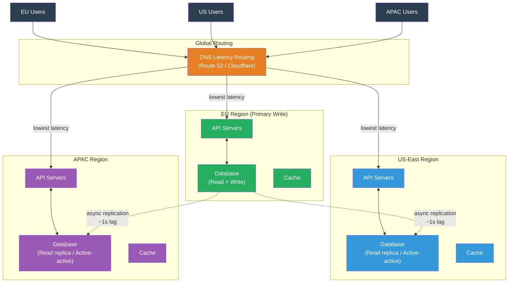

# [BEE-454] Multi-Region Architecture

:::info
Multi-region architecture deploys a system across geographically separated data centers to reduce latency for distant users, survive regional failures, and comply with data residency regulations — but every design decision must contend with the speed of light, which sets an irreducible lower bound on cross-region write latency.
:::

## Context

The case for multiple regions is usually made on three separate grounds, and the architecture that results depends on which ground is primary.

**Latency.** The speed of light in fiber is approximately 200,000 km/s, giving a one-way transit time of about 35ms from New York to London (6,800 km) and 70ms from New York to Tokyo (11,000 km). Round-trip times are double. A database write that requires a network round-trip to a remote region adds 70–140ms of irreducible delay for every synchronous operation — before any queueing, processing, or replication overhead. This is physics, not engineering, and it cannot be optimized away. Serving users from a region near them eliminates this delay.

**Availability.** A single-region system fails if that region becomes unavailable — due to a cloud provider outage, a natural disaster, or a facility event. Netflix's "Chaos Monkey" and later "Chaos Kong" programs (Basiri et al., 2016) stress-tested regional failure scenarios and led to Netflix running active-active across three AWS regions, each capable of handling 100% of traffic independently. The 2011 AWS US-East outage, which took down many internet services for hours, became the inflection point that pushed many large services toward multi-region deployments.

**Compliance.** The EU's GDPR (effective May 2018) requires that personal data about EU residents be processed and stored within the EU, or under adequate data protection agreements. Similar regulations exist in China (PIPL, 2021), Russia (Federal Law 152-FZ), and others. These regulations force architectures where user data is stored in specific regions regardless of where the service is headquartered — a problem that pure latency or availability designs do not need to solve.

The Google Spanner paper (Corbett et al., OSDI 2012) demonstrated that it was possible to build a globally consistent, serializable database across multiple data centers using **TrueTime** — GPS and atomic clock-derived timestamps with bounded uncertainty. Spanner achieves external consistency across regions, but at the cost of deliberately waiting out TrueTime uncertainty intervals on commits (~7ms per commit, calibrated against the clock uncertainty). Spanner showed that global consistency is possible; it also showed the price: every commit pays at least one RTT plus the uncertainty interval, making sub-100ms global writes possible only across geographically close regions.

## Design Thinking

### Active-Passive vs. Active-Active

The fundamental choice is how many regions accept writes.

In **active-passive**, one region (the primary) accepts all writes. Other regions (replicas) serve read traffic only. Failover promotes a replica to primary when the primary region becomes unavailable. The advantages: simple conflict resolution (no conflicts possible, only one writer), familiar replication model (primary-replica), and existing tooling (Aurora Global Database, PostgreSQL streaming replication). The disadvantage: write latency is determined by the primary region's distance from the writer — a user in Tokyo writing to a US-East primary waits 140ms minimum per write.

In **active-active**, multiple regions accept writes simultaneously. Any region can serve both reads and writes for any user. The advantage: writes always go to the nearby region. The disadvantage: writes to the same record from different regions simultaneously create **conflicts** that the system must detect and resolve. Conflict resolution is the central engineering challenge of active-active.

### The Conflict Resolution Spectrum

Conflict resolution strategies range from approximate to exact:

| Strategy | Consistency | Complexity | Use cases |
|---|---|---|---|
| Last-Write-Wins (LWW) | Eventual | Low | User profile settings, preferences, social media likes |
| CRDT merge | Strong eventual | Medium | Counters, sets, collaborative documents |
| Application-defined merge | Configurable | High | Shopping carts, collaborative editing, inventory |
| Synchronous global commit | Linearizable | Very high | Financial transactions, inventory reservations |

**Last-Write-Wins** assigns each write a timestamp and, on conflict, keeps the write with the higher timestamp. It is simple to implement and requires no coordination, but it loses data: if two users update the same document simultaneously from different regions, one update is silently discarded. LWW is acceptable when lost updates are tolerable (a user updating their profile picture) and unacceptable when they are not (an order system).

**CRDT-based merge** converges correctly for specific data types: G-counters (increment-only), OR-Sets (observed-remove sets), and LWW-registers. When the data model fits a CRDT, active-active is safe without application-level conflict logic.

**Synchronous global commit** (as in Google Spanner) eliminates conflicts by serializing all writes globally at the cost of cross-region round-trip latency on every write. This is appropriate for financial transactions but inappropriate for user-facing interactive applications.

### Data Residency and Routing

GDPR and similar regulations introduce a routing constraint that overrides latency optimization: EU user data must stay in the EU regardless of where the request originates. This requires the system to:

1. Associate each user (or tenant) with a home region.
2. Route all writes for that user to their home region, even if the user is temporarily in another region.
3. Never replicate their data to non-compliant regions unless under an adequate transfer mechanism.

This "follow the user" routing conflicts with "follow the traffic" latency optimization. When a GDPR-covered EU user travels to Japan, their writes still go to the EU region — adding cross-region latency rather than eliminating it. The architecture must choose which constraint takes precedence.

## Best Practices

**MUST quantify the latency budget for cross-region writes before choosing active-active.** Measure actual RTTs between planned regions. If a write requires one cross-region round-trip for replication acknowledgment, and RTT is 70ms, every write takes ≥70ms. For an interactive UI, this may be acceptable for background operations but not for the critical path. Synchronous cross-region writes MUST be on the non-critical path or replaced with asynchronous replication with eventual consistency.

**MUST define the conflict resolution strategy before writing the first active-active replica.** "We'll figure out conflicts later" is not a strategy. Enumerate every entity type that can be written from multiple regions and assign a conflict resolution policy. For entities where LWW is unacceptable, design the data model to use CRDTs or route writes for that entity type to a single authoritative region (per-entity region affinity), accepting that those writes have higher latency.

**SHOULD implement per-entity region affinity for mutable state where LWW is unacceptable.** Rather than making the entire system active-active, partition entities across regions: EU users are always written in the EU region, US users in the US region. This eliminates conflicts for those entities while keeping active-active behavior for truly global reads. The trade-off: a US-based admin editing an EU user's record pays cross-region latency.

**MUST design the read-your-writes path across regions.** A user who writes in EU and immediately reads from US will not see their write unless the replication has completed (which takes seconds for asynchronous replication). Solutions: (a) route reads for the same session back to the write region using a sticky session cookie; (b) use a version token (causality token) that the client presents on reads, and have other regions serve the read only after they have applied that version; (c) accept eventual consistency and design the UI to show local state optimistically.

**SHOULD use DNS-based latency routing as the global load balancing entry point.** AWS Route 53 latency routing, Google Cloud Traffic Director, and Cloudflare's load balancer all route users to the lowest-latency region based on DNS query origin. This is the simplest form of global traffic management and requires no application-layer changes. DNS TTLs for latency routing SHOULD be 60–300 seconds — short enough to fail over quickly, long enough to avoid excessive DNS traffic. Anycast (routing the same IP to multiple regional PoPs at the network layer) is appropriate for UDP workloads and DDoS mitigation but less common for application routing.

**MUST implement region-aware health checks and failover.** Each region SHOULD have an independent health check that evaluates whether the region is capable of handling traffic — including database replication lag, connection pool exhaustion, and application errors. Failover to a secondary region SHOULD be automatic and tested regularly. Test failover under realistic load, not just during maintenance windows: a region failover at 10% traffic is very different from a failover at 90%.

**SHOULD use asynchronous replication for active-passive and accept the RPO.** Aurora Global Database replicates across regions with a typical lag of under 1 second. DynamoDB Global Tables replicates with a typical lag of under 1 second for small items. These lags define the **Recovery Point Objective (RPO)**: the maximum data loss in a regional failure. If 1 second of data loss is unacceptable (financial systems, payment records), synchronous replication or a global commit protocol is required — with the corresponding latency cost.

## Visual



## Example

**Read-your-writes with a causality token:**

```python
# On write: return a version token the client must present on subsequent reads
def update_user_profile(user_id: str, patch: dict) -> dict:
    # Write goes to the user's home region database
    result = primary_db.update("users", user_id, patch)

    # Encode the write's LSN (log sequence number) or timestamp as a token
    token = encode_causality_token(result.lsn, region="eu-west-1")
    return {"success": True, "causality_token": token}

# On read: honor the causality token
def get_user_profile(user_id: str, causality_token: str | None) -> dict:
    if causality_token:
        required_lsn, write_region = decode_causality_token(causality_token)

        if current_region != write_region:
            # Check if this replica has caught up to the required LSN
            if not replica_db.has_applied_lsn(required_lsn):
                # Option A: proxy read to the write region (adds latency)
                return proxy_to_region(write_region, user_id)
                # Option B: wait briefly for replication to catch up
                # replica_db.wait_for_lsn(required_lsn, timeout_ms=200)

    return replica_db.get("users", user_id)
```

**Per-entity region affinity for GDPR compliance:**

```python
# Route writes for a user to their home region, regardless of where the request arrives
def get_home_region(user_id: str) -> str:
    """Returns the authoritative write region for a user."""
    # Could be stored in a global routing table (Redis, DynamoDB global table)
    # or derived from the user_id directly
    return user_region_cache.get(user_id) or routing_table.lookup(user_id)

def write_user_data(user_id: str, data: dict) -> dict:
    home_region = get_home_region(user_id)

    if home_region == CURRENT_REGION:
        return local_db.write("users", user_id, data)
    else:
        # Cross-region write: forward to the authoritative region
        # This adds RTT latency but ensures compliance and avoids conflicts
        return forward_to_region(home_region, "write_user_data", user_id, data)
```

**Conflict resolution: last-write-wins with Lamport timestamp:**

```python
from dataclasses import dataclass
from typing import Any

@dataclass
class VersionedRecord:
    value: Any
    timestamp: float      # wall clock, best-effort
    region: str           # tiebreaker: lexicographically higher region wins

    def __lt__(self, other: "VersionedRecord") -> bool:
        """True if self should lose to other in LWW conflict resolution."""
        if self.timestamp != other.timestamp:
            return self.timestamp < other.timestamp
        # Deterministic tiebreaker: avoid discarding updates non-deterministically
        return self.region < other.region

def resolve_conflict(local: VersionedRecord, remote: VersionedRecord) -> VersionedRecord:
    """Return the record that wins under LWW. The losing record's update is silently dropped."""
    return remote if local < remote else local
```

## Related BEEs

- [BEE-19001](cap-theorem-and-the-consistency-availability-tradeoff.md) -- CAP Theorem and the Consistency-Availability Tradeoff: multi-region active-active is fundamentally a choice to prefer availability and partition tolerance over strong consistency
- [BEE-19010](crdts-conflict-free-replicated-data-types.md) -- CRDTs: the correct conflict-free data structure for active-active write patterns where LWW data loss is unacceptable
- [BEE-19018](change-data-capture.md) -- Change Data Capture: the mechanism used by Aurora Global Database, DynamoDB Global Tables, and similar systems to replicate writes across regions asynchronously
- [BEE-19003](vector-clocks-and-logical-timestamps.md) -- Vector Clocks and Logical Timestamps: causality tokens for read-your-writes consistency are a practical application of vector clock concepts
- [BEE-8006](../transactions/eventual-consistency-patterns.md) -- Eventual Consistency Patterns: active-passive replication with asynchronous lag is one of the primary eventual consistency patterns in practice

## References

- [Spanner: Google's Globally-Distributed Database -- Corbett et al., OSDI 2012](https://research.google.com/archive/spanner-osdi2012.pdf)
- [Using Amazon Aurora Global Database -- AWS Documentation](https://docs.aws.amazon.com/AmazonRDS/latest/AuroraUserGuide/aurora-global-database.html)
- [Amazon DynamoDB Global Tables -- AWS Documentation](https://docs.aws.amazon.com/amazondynamodb/latest/developerguide/GlobalTables.html)
- [Multi-Region Capabilities Overview -- CockroachDB Documentation](https://www.cockroachlabs.com/docs/stable/multiregion-overview)
- [Disaster Recovery Architecture on AWS, Part IV: Multi-site Active/Active -- AWS Architecture Blog](https://aws.amazon.com/blogs/architecture/disaster-recovery-dr-architecture-on-aws-part-iv-multi-site-active-active/)
- [Understanding Architectures for Multi-Region Data Residency -- InfoQ](https://www.infoq.com/articles/understanding-architectures-multiregion-data-residency/)
- [Latency-based routing -- AWS Route 53 Documentation](https://docs.aws.amazon.com/Route53/latest/DeveloperGuide/routing-policy-latency.html)
