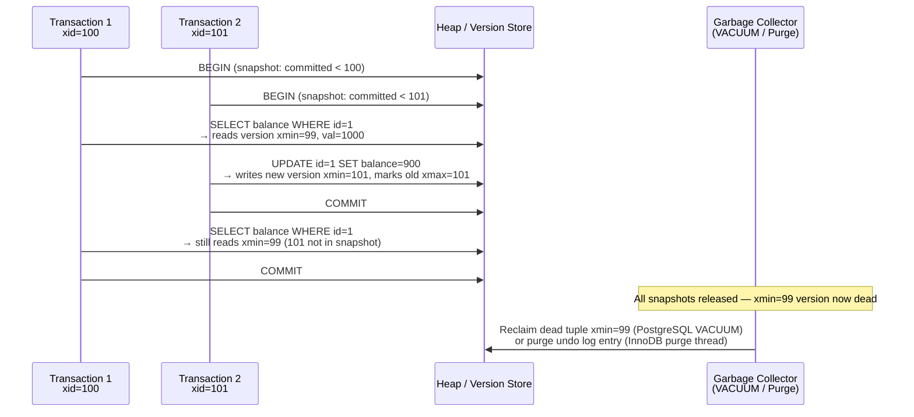

# [BEE-445] MVCC: Multi-Version Concurrency Control

:::info
MVCC (Multi-Version Concurrency Control) is a concurrency scheme in which readers never block writers and writers never block readers by retaining multiple timestamped versions of each row: each transaction sees a consistent snapshot of the database as of its start time, while concurrent updates create new versions rather than overwriting data in place.
:::

## Context

David P. Reed described the fundamental principle of multi-versioning in his 1978 MIT doctoral dissertation "Naming and Synchronization in a Decentralized Computer System" — the first rigorous treatment of retaining multiple versions of data objects to allow readers and writers to proceed without mutual blocking. Philip Bernstein and Nathan Goodman systematized the theory in "Concurrency Control in Distributed Database Systems" (ACM Computing Surveys, 1981), which classified multi-version schemes alongside single-version locking protocols and proved their equivalence under serializability.

The first commercial implementation appeared in 1984 with Digital Equipment Corporation's VAX Rdb/ELN. Oracle Database adopted MVCC in the same year, pioneering the undo-segment architecture that MySQL InnoDB would later generalize: the current committed version lives in the main table, and historical versions are reconstructed by replaying undo log entries. Michael Stonebraker's Postgres project (1985) chose the opposite design: all versions of a row are written sequentially to the heap, with no separate undo log, enabling point-in-time queries but requiring periodic garbage collection (VACUUM) to reclaim space.

Wu et al. published "An Empirical Evaluation of In-Memory Multi-Version Concurrency Control" (VLDB, 2017) — a systematic study of the four key design dimensions in any MVCC system: (1) version storage format (append-only heap, delta storage, or time-travel table); (2) garbage collection strategy (tuple-level, transaction-level, or epoch-based); (3) index management (logical vs physical version pointers); and (4) transaction ID allocation. This taxonomy unifies what are otherwise presented as implementation details specific to individual databases and forms the conceptual framework for comparing MVCC designs.

## Design Thinking

**MVCC's fundamental tradeoff: read throughput for write space amplification.** Under two-phase locking, a writer must hold locks that block concurrent readers. Under MVCC, writers append new versions and readers access the appropriate older version — readers and writers never contend on the same resource. This eliminates the read-write lock bottleneck that dominates OLTP workloads, at the cost of accumulating stale row versions that must eventually be reclaimed.

**Version storage architecture determines the read path cost.** Three designs exist: (1) *Append-only* (PostgreSQL): all versions of a row are written as new heap tuples, linked backward through ctid chains. A reader accessing a row written one hundred updates ago must traverse one hundred heap tuples. (2) *Delta storage* (InnoDB): the main table holds the current committed version; historical versions are stored as delta records in an undo log, linked via rollback pointers. A reader of the current version pays zero overhead; a reader needing an older version pays reconstruction cost proportional to the number of intervening updates. (3) *Time-travel table*: a secondary store holds old versions, and the main table always has current data. This variant appears in some analytical engines. In practice, delta storage wins for OLTP because the common case — reading the latest committed version — is zero-cost.

**Snapshot isolation (SI) is not serializable.** MVCC naturally provides snapshot isolation: each transaction reads from a frozen snapshot taken at transaction start, so non-repeatable reads and phantom reads cannot occur. However, write skew anomalies are still possible (two transactions read overlapping data, each updates a disjoint subset, producing a state neither would have allowed from a fully-serializable execution). Serializable isolation requires additional mechanisms — predicate locks (2PL), or abort-on-dangerous-rw-antidependency (Serializable Snapshot Isolation, BEE-442). Most MVCC databases default to snapshot isolation rather than serializable isolation.

## Visual



## Best Practices

**Keep transactions short to minimize version accumulation.** Every active transaction holds a snapshot and prevents garbage collection of any version newer than its snapshot's lower bound. A long-running read transaction on a write-heavy table causes dead tuple accumulation (PostgreSQL) or undo log growth (InnoDB) proportional to the write rate times the transaction duration. MUST NOT hold idle transactions open while waiting for application logic.

**Tune autovacuum aggressively for write-heavy PostgreSQL tables.** The default autovacuum thresholds (trigger when 20% of rows are dead) are calibrated for moderate workloads. High-write tables SHOULD use per-table overrides: `autovacuum_vacuum_scale_factor = 0.01` (1%) and `autovacuum_vacuum_cost_delay = 2ms`. Monitor `pg_stat_user_tables.n_dead_tup` and `pg_stat_user_tables.last_autovacuum` to confirm vacuuming is keeping pace.

**Monitor transaction ID age to prevent XID wraparound.** PostgreSQL uses 32-bit transaction IDs, giving a maximum span of approximately 2 billion transactions before wraparound. When a table's oldest unfrozen XID exceeds `autovacuum_freeze_max_age` (200 million by default), autovacuum runs to freeze tuples — but if it cannot keep pace, PostgreSQL enters a forced-shutdown mode. MUST alert when `age(datfrozenxid)` in `pg_database` exceeds 1.5 billion.

**For InnoDB, monitor undo log length and the purge lag.** InnoDB's purge thread reclaims undo log entries after all active read views are released. A long-running transaction on a high-write MySQL instance causes undo log growth that degrades all queries (the purge thread cannot keep pace). Monitor `SHOW ENGINE INNODB STATUS` for `History list length`; values above 10,000 indicate purge lag.

**Do not assume snapshot isolation prevents all anomalies.** SHOULD explicitly use `SERIALIZABLE` isolation or apply application-level constraints for operations where write skew would produce incorrect results (e.g., "at least one doctor on call" invariants, hotel booking double-allocation). Under snapshot isolation, both transactions read the consistent state and both commit — only `SERIALIZABLE` or explicit locking prevents the anomaly.

**Use `SELECT ... FOR UPDATE` to serialize reads that will be updated.** When a transaction reads a row and will update it based on the value read, a plain MVCC read does not prevent another transaction from concurrently updating the same row. `SELECT ... FOR UPDATE` promotes the read to an update lock, blocking concurrent writers for that row — combining MVCC's non-blocking read behavior with pessimistic control for the specific rows being modified.

## Deep Dive

**PostgreSQL tuple visibility algorithm.** Every heap tuple has two hidden fields: `xmin` (the XID of the transaction that inserted this version) and `xmax` (the XID of the transaction that deleted or updated it, or 0 if still live). At statement start (READ COMMITTED) or transaction start (REPEATABLE READ / SERIALIZABLE), PostgreSQL captures a snapshot: the set of XIDs that are in-progress at that moment. A tuple version is visible to a transaction if: (1) `xmin` is committed and not in the snapshot's in-progress set (the inserting transaction committed before the snapshot was taken), AND (2) either `xmax` is 0, or `xmax` is in the in-progress set, or `xmax` is the current transaction's own XID (the deleting transaction is still uncommitted). PostgreSQL stores commit/abort status in `pg_xact` (formerly `pg_clog`) — a bitmap array indexed by XID — which is consulted during each visibility check.

**InnoDB read view and undo chain.** When an InnoDB transaction begins its first consistent read, it creates a *read view*: a snapshot capturing the minimum and maximum active transaction IDs at that moment, plus a list of all active transaction IDs in between. Each row in the main table stores two hidden fields: `DB_TRX_ID` (the transaction that wrote the current version) and `DB_ROLL_PTR` (a pointer into the undo log to the previous version). If `DB_TRX_ID` is newer than the read view's upper bound, InnoDB follows `DB_ROLL_PTR` to retrieve the previous version from the undo log, repeating until it finds a version whose `DB_TRX_ID` is visible to the read view or runs out of history.

**CockroachDB: distributed MVCC with hybrid logical clocks.** CockroachDB implements MVCC on top of RocksDB: each key-value pair is stored with a timestamp suffix `key@timestamp`, and all versions of a key are stored in sorted order in the LSM-tree. Timestamps are hybrid logical clocks (HLC) — wall clock time ORed with a logical counter — which remain monotonically increasing across distributed nodes even in the presence of clock skew. A transaction's read timestamp determines which version it sees. Garbage collection runs as a background process on each range, compacting versions whose HLC timestamp is older than the range's GC TTL (25 hours by default) and for which a more recent committed version exists.

## Example

**Observing MVCC internals in PostgreSQL:**

```sql
-- Create table and insert a row
CREATE TABLE accounts (id INT PRIMARY KEY, balance INT);
INSERT INTO accounts VALUES (1, 1000);

-- Inspect the tuple's xmin/xmax
SELECT xmin, xmax, * FROM accounts WHERE id = 1;
-- xmin=501, xmax=0, id=1, balance=1000

-- In session A: begin a long-running transaction
BEGIN;  -- xid = 502
SELECT balance FROM accounts WHERE id = 1;
-- sees balance=1000 (xmin=501 is committed, xmax=0)

-- In session B: update the row (commits immediately)
UPDATE accounts SET balance = 900 WHERE id = 1;  -- xid = 503
-- PostgreSQL writes a NEW tuple: xmin=503, xmax=0, balance=900
-- Marks the OLD tuple: xmin=501, xmax=503

-- Back in session A: still sees original value
SELECT balance FROM accounts WHERE id = 1;
-- Returns 1000 — snapshot was taken before xid=503 committed

-- Check dead tuples accumulating
SELECT relname, n_dead_tup, last_autovacuum
FROM pg_stat_user_tables WHERE relname = 'accounts';

-- Inspect tuple versions directly (requires pageinspect extension)
CREATE EXTENSION IF NOT EXISTS pageinspect;
SELECT t_xmin, t_xmax, t_infomask, t_data
FROM heap_page_items(get_raw_page('accounts', 0));
-- Shows both old (xmin=501, xmax=503) and new (xmin=503, xmax=0) tuples
```

**Monitoring XID age and autovacuum health:**

```sql
-- Alert threshold: age > 1.5 billion means wraparound risk within 500M transactions
SELECT datname,
       age(datfrozenxid)                   AS xid_age,
       2000000000 - age(datfrozenxid)      AS xids_until_wraparound
FROM pg_database
ORDER BY xid_age DESC;

-- Per-table vacuum status
SELECT schemaname, relname,
       n_live_tup, n_dead_tup,
       round(n_dead_tup::numeric / NULLIF(n_live_tup + n_dead_tup, 0) * 100, 1) AS dead_pct,
       last_autovacuum,
       last_autoanalyze
FROM pg_stat_user_tables
WHERE n_dead_tup > 1000
ORDER BY dead_pct DESC;

-- Tune autovacuum for a write-heavy table
ALTER TABLE accounts SET (
  autovacuum_vacuum_scale_factor = 0.01,   -- trigger at 1% dead tuples (vs 20% default)
  autovacuum_vacuum_cost_delay = 2,        -- reduce I/O throttling delay
  autovacuum_freeze_max_age = 150000000    -- freeze earlier than the 200M default
);
```

**InnoDB undo log monitoring:**

```sql
-- Monitor purge lag — History list length should stay below 10,000
SHOW ENGINE INNODB STATUS\G
-- Look for: History list length 4523
-- Large values mean long-running transactions are blocking undo log purge

-- Find the blocking long-running transaction
SELECT trx_id, trx_started, trx_state,
       TIMESTAMPDIFF(SECOND, trx_started, NOW()) AS duration_s,
       trx_query
FROM information_schema.INNODB_TRX
ORDER BY trx_started ASC
LIMIT 5;
```

## Related BEEs

- [BEE-8002](../transactions/isolation-levels-and-their-anomalies.md) -- Isolation Levels and Their Anomalies: isolation levels (READ COMMITTED, REPEATABLE READ, SERIALIZABLE) map directly to when MVCC snapshots are acquired and how visibility rules are applied; MVCC is the mechanism that implements snapshot isolation without locking
- [BEE-19021](two-phase-locking.md) -- Two-Phase Locking: 2PL and MVCC are the two dominant concurrency control families; MVCC eliminates read-write blocking at the cost of version accumulation and GC overhead, while 2PL eliminates version overhead at the cost of blocking; most modern databases use hybrid approaches (MVCC for reads, 2PL or CAS for write-write conflict detection)
- [BEE-19023](serializable-snapshot-isolation.md) -- Serializable Snapshot Isolation: SSI is the mechanism PostgreSQL uses to promote MVCC snapshot isolation to full serializability by tracking rw-antidependencies between concurrent transactions and aborting those that form dangerous structures
- [BEE-8001](../transactions/acid-properties.md) -- ACID Properties: MVCC's versioned reads are the mechanism that implements the Isolation and Consistency properties of ACID — durability is handled by WAL, atomicity by undo logs or rollback segments, but the isolation guarantee that concurrent transactions see consistent snapshots is provided by MVCC

## References

- [Naming and Synchronization in a Decentralized Computer System -- David P. Reed, MIT PhD Dissertation, 1978](https://dspace.mit.edu/handle/1721.1/16279)
- [Concurrency Control in Distributed Database Systems -- Bernstein and Goodman, ACM Computing Surveys, 1981](https://dl.acm.org/doi/10.1145/356842.356846)
- [An Empirical Evaluation of In-Memory Multi-Version Concurrency Control -- Wu et al., VLDB 2017](https://www.vldb.org/pvldb/vol10/p781-Wu.pdf)
- [Routine Vacuuming -- PostgreSQL Documentation](https://www.postgresql.org/docs/current/routine-vacuuming.html)
- [InnoDB Multi-Versioning -- MySQL Documentation](https://dev.mysql.com/doc/refman/8.4/en/innodb-multi-versioning.html)
- [Storage Layer -- CockroachDB Architecture Documentation](https://www.cockroachlabs.com/docs/stable/architecture/storage-layer)
