# [BEE-19042] The N+1 Query Problem and Batch Loading

:::info
The N+1 query problem occurs when fetching a list of N records triggers one additional database query per record to load a related entity — producing N+1 total queries where one or two would suffice — and is the most common performance anti-pattern in ORM-based applications.
:::

## Context

Object-relational mappers (ORMs) bridge the gap between relational databases and object graphs by allowing code to traverse associations naturally: `order.customer.name` reads like a property access but implicitly executes a `SELECT` statement. This convenience comes with a trap: **lazy loading**, where the associated entity is fetched on first access, not at query time.

Lazy loading works fine when accessing one record. It becomes pathological in a loop. Fetching 100 orders and then accessing `order.customer` inside a loop fires 100 separate `SELECT` statements — one per order — in addition to the initial `SELECT` to fetch the orders themselves. This is the N+1 problem: N queries for N associations plus 1 for the parent list.

The problem has been documented in ORM literature since at least Martin Fowler's *Patterns of Enterprise Application Architecture* (2002), which names the Lazy Load pattern and notes its performance implications. Every major ORM provides eager loading as the solution: Rails' `includes`/`preload`/`eager_load`, Django's `select_related`/`prefetch_related`, Hibernate's `JOIN FETCH` and `@BatchSize`. The pattern is well understood — yet N+1 remains the single most frequently cited ORM performance issue in production systems, because lazy loading is the default and eager loading must be explicitly requested.

GraphQL amplified the problem significantly. In a REST endpoint, a developer writes a single resolver that can join and return all needed data. In GraphQL, each field has its own resolver function that runs independently. A query for `{ orders { id customer { name } } }` calls the `orders` resolver once and the `customer` resolver once per order returned. Without explicit batching, a GraphQL server with lazy-loading resolvers makes N+1 queries by construction. Facebook engineers Lee Byron and Nick Schrock created **DataLoader** in 2015 and open-sourced it as a canonical solution: a utility that collects all keys requested during the current event loop tick, fires a single batch fetch, and caches results for the request lifetime.

## Design Thinking

### Eager Loading vs. Batch Loading

Two structural solutions exist:

**Eager loading** (JOIN or multi-query prefetch): the application declares upfront which associations to load alongside the primary query. The ORM either JOINs the tables or issues a second `SELECT ... WHERE id IN (...)` immediately after the first. The result set includes all needed data before the loop begins. This is the right solution for REST APIs, background jobs, and any context where the full set of records and their associations is known before processing begins.

**Batch loading** (DataLoader pattern): the application defers all key lookups to the end of the current tick, then fires a single batch query. This is the right solution when the set of keys to load is not known upfront — specifically in GraphQL, where different resolvers running in the same request independently discover keys to look up. Batch loading cannot be performed with eager loading because the query is already executing when the need for related data is discovered.

The practical rule: use eager loading in REST and job processing contexts; use batch loading (DataLoader) in GraphQL resolvers.

### When N+1 Hides in Plain Sight

N+1 is not always a `for` loop with an explicit ORM call. Common disguised forms:

- **Serializers accessing associations**: a JSON serializer that calls `user.profile.avatar_url` for each user in a list.
- **Template rendering**: an HTML template that loops over posts and accesses `post.author.display_name`.
- **`count()` in a loop**: calling `.comments.count()` per post issues one `COUNT(*)` per post rather than a single `GROUP BY`.
- **Middleware or filters**: authentication middleware that looks up the current user's organization on every request, without caching the result for the request lifetime.

## Best Practices

**MUST enable N+1 detection in development and test environments.** The Bullet gem (Rails) intercepts ActiveRecord queries and raises an alert when an N+1 or unused eager load is detected. Django has `django-silk` and `nplusone`. In any framework, asserting a maximum query count in tests catches regressions:

```python
# Django: assert only 2 queries (1 for orders, 1 for customers) regardless of result size
from django.test.utils import CaptureQueriesContext
from django.db import connection

with CaptureQueriesContext(connection) as ctx:
    response = client.get("/api/orders/")
assert len(ctx.captured_queries) <= 2, f"N+1 detected: {len(ctx.captured_queries)} queries"
```

**MUST use eager loading when the associated data is always needed.** If every serialized order includes the customer name, always load customers eagerly. The performance difference between 1 query and N queries grows linearly with result set size:

```python
# Django: bad — N+1
orders = Order.objects.all()
for order in orders:
    print(order.customer.name)  # fires one SELECT per order

# Django: good — 2 queries total (one for orders, one for customers)
orders = Order.objects.select_related("customer").all()

# Django: good for many-to-many or reverse FK — 2 queries
orders = Order.objects.prefetch_related("line_items").all()
```

**MUST use `IN` clause batch loading as the default pattern for batch fetching.** When loading N related records by their IDs, one `SELECT ... WHERE id IN (id1, id2, ..., idN)` is always preferable to N individual `SELECT ... WHERE id = ?` queries. This applies equally to DataLoader implementations:

```javascript
// DataLoader batch function: receives array of keys, returns array of values in same order
const userLoader = new DataLoader(async (userIds) => {
  const users = await db.query(
    "SELECT * FROM users WHERE id = ANY($1)",
    [userIds]
  );
  // DataLoader requires results in the same order as input keys
  const userMap = Object.fromEntries(users.map(u => [u.id, u]));
  return userIds.map(id => userMap[id] ?? new Error(`User ${id} not found`));
});
```

**SHOULD scope DataLoader instances per request, never per application.** A DataLoader cache stores results for the lifetime of the loader instance. A request-scoped DataLoader correctly deduplicates within a request (user ID 42 looked up by three resolvers → one query) while preventing stale data from leaking across requests. A global DataLoader would serve cached data from previous requests, breaking cache invalidation:

```python
# FastAPI + Strawberry GraphQL: create fresh DataLoader per request
from strawberry.dataloader import DataLoader

async def get_context(request: Request):
    return {
        "user_loader": DataLoader(load_fn=batch_load_users),
        "product_loader": DataLoader(load_fn=batch_load_products),
    }
```

**MUST load associations via the foreign key side, not the primary key side, for one-to-many relationships.** Loading "all comments for each post" by iterating posts and calling `post.comments` is N+1. The correct batch pattern queries the many side by the list of parent IDs, then groups results:

```python
async def batch_load_comments_by_post(post_ids: list[int]) -> list[list[Comment]]:
    """Returns list of comment lists, one per input post_id, in input order."""
    comments = await db.fetch(
        "SELECT * FROM comments WHERE post_id = ANY($1) ORDER BY created_at",
        post_ids
    )
    # Group by post_id
    by_post: dict[int, list] = {pid: [] for pid in post_ids}
    for comment in comments:
        by_post[comment["post_id"]].append(comment)
    return [by_post[pid] for pid in post_ids]  # preserve input order
```

**SHOULD add a query count limit to integration tests for high-traffic endpoints.** An N+1 regression in a list endpoint that pages 100 records transforms 2 queries into 101. Asserting a ceiling in tests prevents this from reaching production undetected. Set the ceiling to `O(1)` with respect to result count: 2–5 queries for a typical list endpoint, regardless of page size.

## Visual

```mermaid
flowchart TD
    subgraph "N+1 (bad)"
        A1["SELECT * FROM orders\n→ [order1, order2, ..., order100]"]:::bad
        A2["SELECT * FROM customers WHERE id = 1"]:::bad
        A3["SELECT * FROM customers WHERE id = 2"]:::bad
        A4["... × 100"]:::bad
        A1 --> A2 --> A3 --> A4
    end

    subgraph "Eager Load (good — REST/jobs)"
        B1["SELECT * FROM orders\n→ [order1..100]"]:::good
        B2["SELECT * FROM customers\nWHERE id IN (1, 2, ..., 100)\n→ [customer1..100]"]:::good
        B1 --> B2
    end

    subgraph "DataLoader (good — GraphQL)"
        C1["Resolver tick:\norder1.customer_id=1\norder2.customer_id=2\n..."]:::good
        C2["End of tick:\nbatch([1,2,...,100])"]:::good
        C3["SELECT * FROM customers\nWHERE id IN (1,2,...,100)"]:::good
        C1 --> C2 --> C3
    end

    style A1 fill:#c0392b,color:#fff
    style A2 fill:#c0392b,color:#fff
    style A3 fill:#c0392b,color:#fff
    style A4 fill:#c0392b,color:#fff
    style B1 fill:#27ae60,color:#fff
    style B2 fill:#27ae60,color:#fff
    style C1 fill:#3498db,color:#fff
    style C2 fill:#3498db,color:#fff
    style C3 fill:#3498db,color:#fff
```



## Implementation Notes

**Rails**: `includes` chooses between `preload` (separate `IN` query) and `eager_load` (LEFT OUTER JOIN) based on whether conditions reference the association. Use `eager_load` when filtering by the associated table's columns; use `preload` otherwise. The Bullet gem detects N+1 in development with zero configuration overhead.

**Django**: `select_related` follows ForeignKey and OneToOne relationships using a SQL JOIN — use for single associated objects. `prefetch_related` issues a separate query and does the join in Python — use for ManyToMany and reverse ForeignKey relationships. `prefetch_related` cannot be filtered after the fact with `.filter()` inside a loop without causing N+1 again.

**Hibernate/JPA**: `FetchType.LAZY` on `@ManyToOne` is the default and the source of N+1. Solutions: `JOIN FETCH` in JPQL queries, `@EntityGraph` for named fetch plans, or `@BatchSize` to tell Hibernate to batch lazy loads into `IN` queries rather than individual selects.

**GraphQL (any language)**: DataLoader is the standard. Every association resolver SHOULD use a DataLoader. DataLoader implementations exist for Python (`strawberry-graphql`, `aiodataloader`), Go (`graph-gophers/dataloader`), Java (`java-dataloader`), and Ruby (`graphql-batch`). The key invariant: DataLoader batch functions must return results in the same order as the input key array, with `null` or an `Error` at positions where the key was not found.

## Related BEEs

- [BEE-6006](../data-storage/connection-pooling-and-query-optimization.md) -- Connection Pooling and Query Optimization: N+1 queries multiply connection usage; a connection pool exhausted by N+1 in one endpoint degrades all other endpoints
- [BEE-6002](../data-storage/indexing-deep-dive.md) -- Indexing Deep Dive: N+1 queries each hit the index individually; even a fast indexed lookup becomes slow when repeated N times; batch loading amortizes the index traversal cost
- [BEE-4005](../api-design/graphql-vs-rest-vs-grpc.md) -- GraphQL vs REST vs gRPC: GraphQL's per-field resolver model is the structural cause of N+1 in GraphQL; DataLoader is the canonical mitigation
- [BEE-9001](../caching/caching-fundamentals-and-cache-hierarchy.md) -- Caching Fundamentals: DataLoader's per-request cache is a minimal, correct cache for deduplication within a request; it complements but does not replace a persistent cache layer

## References

- [DataLoader — GitHub (graphql/dataloader)](https://github.com/graphql/dataloader)
- [Solving the N+1 Problem for GraphQL through Batching -- Shopify Engineering](https://shopify.engineering/solving-the-n-1-problem-for-graphql-through-batching)
- [Lazy Load -- Patterns of Enterprise Application Architecture, Martin Fowler (2002)](https://martinfowler.com/eaaCatalog/lazyLoad.html)
- [Active Record Query Interface -- Ruby on Rails Guides](https://guides.rubyonrails.org/active_record_querying.html)
- [QuerySet API Reference (select_related, prefetch_related) -- Django Documentation](https://docs.djangoproject.com/en/stable/ref/models/querysets/)
- [Bullet — N+1 Detection for Rails (flyerhzm)](https://github.com/flyerhzm/bullet)
