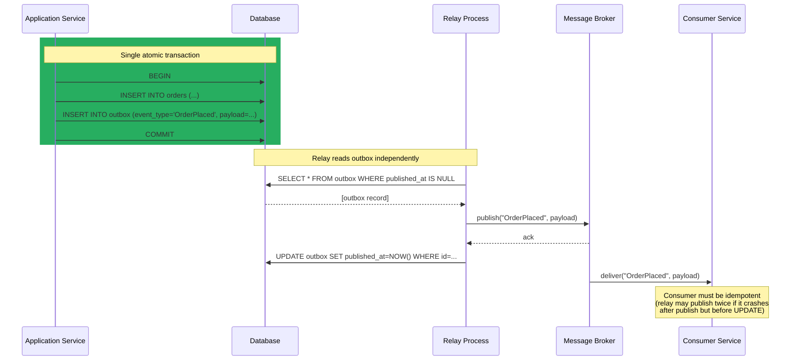

# [BEE-19053] The Outbox Pattern and Transactional Messaging

:::info
The Outbox Pattern solves the dual-write problem — the inability to atomically update a database and publish a message to a broker in one operation — by writing events to an "outbox" table in the same database transaction as the business data, then having a separate relay process publish them to the broker.
:::

## Context

A recurring failure mode in event-driven microservices: a service updates its database successfully and then attempts to publish an event to a message broker. The broker call fails. The database now reflects a state that no downstream consumer knows about. The event is lost. Alternatively, the publish succeeds but the database write fails or is rolled back. A downstream service has processed an event for a transaction that does not exist. Both outcomes corrupt the system's state.

This is the **dual-write problem**: a service must write to two independent systems — a database and a message broker — and there is no distributed transaction that spans both with ACID guarantees. The naive solution of "just retry" does not work: if the service crashes after publishing but before committing the database write, a retry will produce a duplicate event. If it crashes after the database commit but before publishing, the event is silently lost.

Martin Kleppmann identifies this failure mode explicitly in Chapter 11 of "Designing Data-Intensive Applications" (2017): dual writes to independent systems without coordination produce subtle consistency bugs that are difficult to reproduce and nearly impossible to detect with standard monitoring.

The Outbox Pattern, formalized and popularized by Chris Richardson in his microservices.io pattern catalog, resolves the problem by turning the two-system write into a single-system write. The service writes its business data and an outbox record to the same relational database in a single transaction. Because the outbox table is in the same database, the write is atomic: either both the business row and the outbox record are committed, or neither is. A separate process — the relay or publisher — then reads from the outbox table and publishes to the message broker independently. The relay is retryable and crash-safe because the outbox persists until the event is confirmed published.

The pattern provides **at-least-once delivery**: the relay may publish an event and then crash before marking it as sent, causing it to be published again on the next relay run. Consumers must be designed to handle duplicates — a requirement that applies equally to any message-based system (BEE-10007).

## Design Thinking

### Two Relay Strategies

The relay process that reads from the outbox and publishes to the broker can be implemented two ways:

**Polling relay**: A background thread or scheduled job queries the outbox table for unpublished events, publishes them, and marks them as sent. Simple to implement, works on any database. The downside: polling adds read load to the database and introduces latency equal to the poll interval (typically 1–5 seconds). At high event rates, polling can become a bottleneck.

**CDC-based relay (recommended for high throughput)**: A CDC system (Debezium, AWS DMS) watches the database's write-ahead log for inserts into the outbox table and publishes them to the broker as they appear. No polling loop; events are captured within milliseconds of commit. Debezium's Outbox Event Router is a Kafka Connect Single Message Transform (SMT) that extracts the event payload, routes it to the correct topic, and deletes or marks the outbox record — all without polling. The tradeoff: CDC introduces operational complexity (WAL configuration, connector deployment).

| | Polling Relay | CDC-Based Relay |
|---|---|---|
| Latency | Poll interval (1–5 s typical) | Milliseconds |
| DB load | Periodic reads | WAL stream (low) |
| Complexity | Low | Higher (connector infra) |
| Ordering | Within poll batch | Preserved from WAL |
| Database requirement | Any relational DB | Logical replication support |

### Outbox Table Design

The outbox table is a message queue inside the database. Its schema must contain enough information for the relay to publish the event correctly:

```sql
CREATE TABLE outbox (
    id           UUID        PRIMARY KEY DEFAULT gen_random_uuid(),
    aggregate_id VARCHAR(255) NOT NULL,  -- e.g. order ID, for topic routing
    event_type   VARCHAR(255) NOT NULL,  -- e.g. "OrderPlaced"
    payload      JSONB        NOT NULL,  -- serialized event data
    created_at   TIMESTAMPTZ  NOT NULL DEFAULT now(),
    published_at TIMESTAMPTZ            -- NULL = unpublished; set by relay
);

-- Index for the polling relay: scan only unpublished events
CREATE INDEX ON outbox (created_at) WHERE published_at IS NULL;
```

The relay queries `WHERE published_at IS NULL ORDER BY created_at` and publishes in order. After successful publish confirmation from the broker, it sets `published_at = now()`. Old published records can be deleted by a periodic cleanup job.

### Ordering Guarantees

Within a single `aggregate_id` (e.g., order ID), events should be published in the order they were inserted into the outbox. A polling relay achieves this with `ORDER BY created_at` in its query. A CDC relay preserves WAL order automatically, as rows are streamed in commit order.

Ordering guarantees *across* aggregate IDs typically are not provided or needed. Message brokers that support partitioned topics (Kafka, AWS Kinesis) naturally preserve per-key ordering when the relay routes events keyed on `aggregate_id`.

## Best Practices

**MUST write to the outbox table in the same database transaction as the business data.** This is the defining invariant of the pattern. An outbox write outside the transaction boundary reintroduces the dual-write problem.

**MUST NOT use database `LISTEN/NOTIFY` as the sole relay mechanism.** PostgreSQL `LISTEN/NOTIFY` notifications can be dropped if no listener is connected at the time of the `NOTIFY`. The outbox table provides durability; `LISTEN/NOTIFY` can supplement the relay as a low-latency wake-up signal, but the relay must fall back to polling the table.

**MUST ensure the relay is idempotent on the broker side.** The relay may publish an event and crash before marking it as sent. On restart, it will publish the event again. Brokers and consumers must handle duplicates — either via broker-level deduplication (Kafka's idempotent producer), consumer-level idempotency (BEE-10007), or by including a unique event ID in the payload that consumers can deduplicate.

**SHOULD include a unique event ID in every outbox record and propagate it as the message ID to the broker.** Most brokers allow setting a message key or ID. Setting it to the outbox record's UUID enables broker-side deduplication and makes consumer-side idempotency straightforward: store processed IDs in a set and skip duplicates.

**SHOULD use a CDC-based relay (Debezium) when event throughput exceeds a few hundred events per second, or when sub-second latency is required.** Polling at 1-second intervals introduces systematic lag. A CDC relay reads from the WAL stream and publishes within milliseconds of commit with minimal database read load.

**SHOULD purge old outbox records on a schedule.** The outbox table is a transient buffer, not a permanent event store. Accumulating millions of published records increases table size, slows index scans, and wastes storage. A daily `DELETE FROM outbox WHERE published_at < NOW() - INTERVAL '7 days'` or a TRUNCATE-based rotation keeps the table small.

**SHOULD monitor the outbox table for events that remain unpublished beyond a threshold.** A relay outage or broker failure will cause the backlog to grow. Alert on `COUNT(*) WHERE published_at IS NULL AND created_at < NOW() - INTERVAL '5 minutes'` exceeding a threshold. This catches silent relay failures before they become large-scale inconsistencies.

**MAY use a separate outbox table per aggregate type** (e.g., `order_outbox`, `payment_outbox`) to simplify relay routing and partition cleanup by domain. The tradeoff is more tables to manage; the benefit is independent relay configurations per aggregate.

## Visual



## Example

**Business write + outbox insert in a single transaction (Python / psycopg3):**

```python
import uuid
import json
from psycopg import Connection

def place_order(conn: Connection, order_data: dict) -> str:
    order_id = str(uuid.uuid4())
    event_id = str(uuid.uuid4())

    with conn.transaction():  # atomic: both writes or neither
        conn.execute(
            """INSERT INTO orders (id, customer_id, amount, status)
               VALUES (%s, %s, %s, 'pending')""",
            (order_id, order_data["customer_id"], order_data["amount"]),
        )
        conn.execute(
            """INSERT INTO outbox (id, aggregate_id, event_type, payload)
               VALUES (%s, %s, %s, %s)""",
            (
                event_id,
                order_id,
                "OrderPlaced",
                json.dumps({
                    "event_id": event_id,   # propagated for broker deduplication
                    "order_id": order_id,
                    "customer_id": order_data["customer_id"],
                    "amount": order_data["amount"],
                }),
            ),
        )
    return order_id
```

**Polling relay (Python):**

```python
import time

POLL_INTERVAL_SECONDS = 1
BATCH_SIZE = 100

def run_relay(conn: Connection, broker) -> None:
    while True:
        with conn.transaction():
            rows = conn.execute(
                """SELECT id, aggregate_id, event_type, payload
                   FROM outbox
                   WHERE published_at IS NULL
                   ORDER BY created_at
                   LIMIT %s
                   FOR UPDATE SKIP LOCKED""",  # prevents duplicate processing by concurrent relays
                (BATCH_SIZE,),
            ).fetchall()

            for row in rows:
                # publish with the outbox record's UUID as the message ID
                broker.publish(
                    topic=row["event_type"],
                    key=row["aggregate_id"],
                    value=row["payload"],
                    message_id=str(row["id"]),  # enables broker-side deduplication
                )
                conn.execute(
                    "UPDATE outbox SET published_at = NOW() WHERE id = %s",
                    (row["id"],),
                )
            # transaction commits here: published_at is set atomically for the batch

        if not rows:
            time.sleep(POLL_INTERVAL_SECONDS)
```

**Debezium Outbox Event Router configuration (Kafka Connect):**

```json
{
  "name": "order-outbox-connector",
  "config": {
    "connector.class": "io.debezium.connector.postgresql.PostgresConnector",
    "database.hostname": "postgres",
    "database.port": "5432",
    "database.dbname": "orders_db",
    "table.include.list": "public.outbox",
    "transforms": "outbox",
    "transforms.outbox.type": "io.debezium.transforms.outbox.EventRouter",
    "transforms.outbox.table.field.event.id": "id",
    "transforms.outbox.table.field.event.key": "aggregate_id",
    "transforms.outbox.table.field.event.type": "event_type",
    "transforms.outbox.table.field.event.payload": "payload",
    "transforms.outbox.route.by.field": "event_type",
    "transforms.outbox.route.topic.replacement": "outbox.${routedByValue}",
    "transforms.outbox.table.expand.json.payload": "true"
  }
}
```

**Outbox record cleanup (run daily via pg_cron):**

```sql
-- Remove published events older than 7 days
DELETE FROM outbox
WHERE published_at IS NOT NULL
  AND published_at < NOW() - INTERVAL '7 days';

-- Monitor unpublished backlog (alert if this exceeds threshold)
SELECT COUNT(*) AS unpublished_backlog
FROM outbox
WHERE published_at IS NULL
  AND created_at < NOW() - INTERVAL '5 minutes';
```

## Implementation Notes

**PostgreSQL + Debezium**: The recommended stack for high-throughput outbox relay. Enable PostgreSQL logical replication (`wal_level = logical`). Debezium's `PostgresConnector` streams WAL changes; the Outbox Event Router SMT transforms outbox inserts into properly routed Kafka messages. The connector handles ordering, retries, and acknowledgment. Delete-mode (`transforms.outbox.delete.handling.mode = rewrite`) rewrites deletions as tombstone messages rather than forwarding delete events.

**MySQL + Debezium**: Equivalent setup with `MySqlConnector`. MySQL's binlog is the equivalent of PostgreSQL's WAL. The same Outbox Event Router SMT works across connectors.

**MongoDB**: MongoDB Change Streams can serve as a CDC source for an outbox collection. The Debezium MongoDB connector supports the same Outbox Event Router pattern, watching a designated outbox collection.

**SQLAlchemy (Python)**: Wrap the outbox insert in the same `Session` as the business write and commit together. The session's unit-of-work pattern ensures atomicity.

**Spring Data / Hibernate (Java)**: Use `@Transactional` to span both the entity save and the `OutboxEvent` entity save. Spring's `ApplicationEventPublisher` with `@TransactionalEventListener(phase = AFTER_COMMIT)` is a common pattern — but note that `AFTER_COMMIT` listeners fire outside the transaction, which does not solve the dual-write problem. The correct approach is to write the outbox record inside the transaction, not in an `AFTER_COMMIT` listener.

## Related BEEs

- [BEE-19018](change-data-capture.md) -- Change Data Capture: CDC (Debezium, WAL-based) is the recommended relay mechanism for the Outbox Pattern at high throughput; the outbox table is the CDC source
- [BEE-10007](../messaging/idempotent-message-processing.md) -- Idempotent Message Processing: the Outbox Pattern provides at-least-once delivery; consumers must implement idempotency to handle duplicate events
- [BEE-8004](../transactions/saga-pattern.md) -- Saga Pattern: the Outbox Pattern is the standard implementation mechanism for publishing Saga step events atomically with the corresponding database state changes
- [BEE-19052](choreography-vs-orchestration-in-distributed-workflows.md) -- Choreography vs Orchestration: in choreography-based sagas, each service publishes events via the Outbox Pattern to guarantee events are never silently lost

## References

- [Transactional Outbox Pattern — microservices.io (Chris Richardson)](https://microservices.io/patterns/data/transactional-outbox.html)
- [Outbox Event Router — Debezium Documentation](https://debezium.io/documentation/reference/stable/transformations/outbox-event-router.html)
- [Designing Data-Intensive Applications, Chapter 11 — Martin Kleppmann (O'Reilly, 2017)](https://www.oreilly.com/library/view/designing-data-intensive-applications/9781491903063/ch11.html)
- [Implementing the Transactional Outbox Pattern with Amazon EventBridge Pipes — AWS Blog](https://aws.amazon.com/blogs/compute/implementing-the-transactional-outbox-pattern-with-amazon-eventbridge-pipes/)
