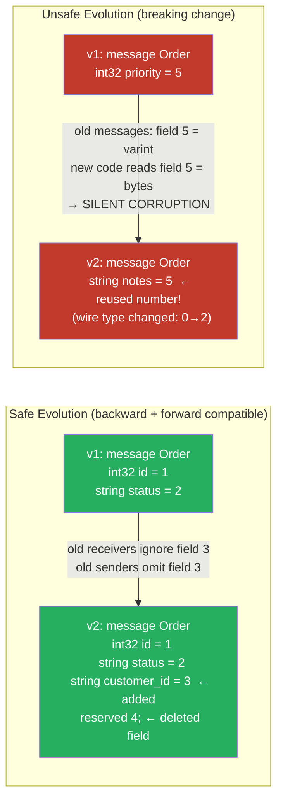

# [BEE-19049] Protocol Buffers and Schema Evolution

:::info
Protocol Buffers (protobuf) use field numbers — not field names — as the binary identity of each field, which makes adding and renaming fields safe, but changing or reusing field numbers a silent data corruption hazard that requires explicit schema governance to prevent.
:::

## Context

When services communicate over the network, both sides must agree on how data is encoded. JSON uses string field names, which are human-readable and self-describing but verbose. XML adds type annotations at the cost of even more verbosity. Protocol Buffers, developed at Google starting around 2001 and open-sourced in 2008, take a different approach: each field is identified in the binary wire format by a small integer (the field number), not by its name. A 32-bit integer field numbered 1 is encoded as the byte sequence `0x08` (varint, field 1, wire type 0) followed by the value — no field name, no type string. This makes serialized messages compact and fast to parse, but it puts the burden of compatibility on the schema author: field numbers are permanent.

The compactness advantage is significant at Google's scale. A 2008 Google internal paper estimated that switching from XML to Protocol Buffers reduced message sizes by 3–10× and parsing speed by 20–100×. At millions of RPC calls per second, the difference compounds. But the more lasting contribution was the schema evolution model: because both sides of a communication channel parse the same `.proto` file independently, and because field numbers are the only thing that connects a serialized byte stream to its schema, changing a field number in production is equivalent to deleting the old field and adding a new one with a different number — the receiver silently ignores the unknown field.

The proto3 language revision (2016) made unknown fields preserved by default (proto2 discarded them by default), which strengthened forward compatibility: a new sender can add fields that an old receiver hasn't seen, and the old receiver will ignore them rather than erroring. This is the foundation of the "rolling upgrade" pattern in microservices: deploy the new proto definition, update receivers before senders, and the deployment proceeds without a coordinated cutover.

## Design Thinking

### Wire Types and Backward Compatibility

protobuf encodes each field as a tag (field number + wire type packed into a varint) followed by the field data. The wire types are:

| Wire type | Meaning | Used for |
|---|---|---|
| 0 | Varint | int32, int64, uint32, uint64, sint32, sint64, bool, enum |
| 1 | 64-bit | fixed64, sfixed64, double |
| 2 | Length-delimited | string, bytes, embedded messages, packed repeated fields |
| 5 | 32-bit | fixed32, sfixed32, float |

Changing a field's type changes its wire type, which means the binary encoding is incompatible even if you keep the same field number. A field that was `int32` (wire type 0) cannot be changed to `string` (wire type 2) while keeping the same field number — the receiver will misparse the bytes. The safe type changes (same wire type) are: `int32` ↔ `int64` ↔ `uint32` ↔ `uint64` ↔ `bool`, `fixed32` ↔ `sfixed32` ↔ `float`, `fixed64` ↔ `sfixed64` ↔ `double`, `string` ↔ `bytes` (if content is valid UTF-8).

### Compatibility Matrix

| Change | Backward compatible? | Forward compatible? | Notes |
|---|---|---|---|
| Add optional field (new number) | Yes | Yes | Old receivers ignore; old senders omit |
| Delete field | Yes | Yes | Must `reserve` the number to prevent reuse |
| Rename field | Yes | Yes | Names are not in the wire format |
| Change field number | **No** | **No** | Treat as delete + add |
| Change wire type (int32 → string) | **No** | **No** | Receiver mismatch |
| Add enum value | Yes | Yes (proto3) | Old receivers see default |
| Remove enum value | Yes | **No** | Old senders still send it |
| Add `required` field (proto2) | **No** | **No** | Old senders don't populate it |
| Change `optional` to `repeated` | **No** | **No** | Wire encoding differs |

The most dangerous operation is reusing a deleted field number. If field 5 was `string user_id`, you delete it, and a future developer adds field 5 as `int32 priority`, any old message that encoded `user_id` as bytes will be misread as an integer by the new code. The `reserved` keyword prevents this:

```protobuf
message Order {
  reserved 5;           // never reuse field number 5
  reserved "user_id";   // never reuse this field name
  int32 id = 1;
  string status = 2;
}
```

### Versioning Strategy

Two schools of thought:

**Single evolving proto**: one `.proto` file per message type, evolved in place. Compatible changes are made freely; incompatible changes require a major version bump of the package (e.g., `acme.orders.v1` → `acme.orders.v2`). The v2 package gets a fresh schema; the v1 package is kept for backward compatibility until all consumers migrate. This is Google's recommended approach (Google AIP-0180).

**Versioned proto files**: a new `.proto` file per breaking change (e.g., `order_v1.proto`, `order_v2.proto`). Simpler to reason about but leads to schema proliferation and duplication. Suitable for smaller systems.

In practice: use a single evolving proto within a major version, use the `reserved` keyword aggressively for deleted fields, and introduce a new major version package only for breaking changes (field number reuse, wire type changes, removal of required fields).

## Best Practices

**MUST `reserve` field numbers and names whenever a field is deleted.** The risk is not deletion itself — it is reuse. A future developer, not knowing the field history, adds a field with the same number, causing silent data corruption in any system that has old messages in transit or in a queue. Treat `reserved` as permanent documentation of the schema's history.

**MUST NOT change a field number or wire type in a deployed schema.** This is a breaking change even if the proto file compiles. Old clients will misparse messages encoded with the new schema; new clients will misparse messages encoded with the old schema. If the change is necessary, create a new major version package.

**SHOULD keep field numbers small.** Field numbers 1–15 encode in one byte (tag + wire type); numbers 16–2047 encode in two bytes. For high-frequency fields in messages serialized millions of times per second, placing them in the 1–15 range reduces serialized size. Reserve 1–15 for the most commonly populated fields.

**MUST validate that sender and receiver schemas are compatible before a production deployment.** Tools like `buf breaking` (Buf CLI) statically detect breaking changes against a baseline schema: changed field numbers, changed types, deleted required fields, reused reserved numbers. Integrate `buf breaking` into CI to catch incompatible changes before they reach production.

**SHOULD use `proto3` rather than `proto2` for new schemas.** `proto3` removes `required` (the most common source of backward-incompatibility), preserves unknown fields by default (enabling forward compatibility), has cleaner JSON mapping, and is more widely supported in generated client libraries. Use `proto2` only when maintaining existing schemas that depend on `required` field semantics.

**SHOULD prefer `oneof` for mutually exclusive fields rather than multiple nullable fields.** `oneof` encodes that exactly one of a set of fields is set, and setting one clears the others. It avoids ambiguous states (two fields set simultaneously) without a runtime check. Note: you cannot add a field to an existing `oneof` in a backward-compatible way without care — treat `oneof` membership as part of the field's type.

**SHOULD generate code from proto files using a reproducible toolchain pinned to a specific version.** The generated code (Go structs, Java classes, Python dataclasses) is a derived artifact; the `.proto` files are the source of truth. Store `.proto` files in a centralized repository (a "proto registry" or a dedicated `api/` directory in a monorepo), and use Buf or `protoc` with explicit version pinning in CI.

## Visual



## Example

**Schema with safe evolution and reserved fields:**

```protobuf
syntax = "proto3";

package acme.orders.v1;

import "google/protobuf/timestamp.proto";

message Order {
  // Field numbers 1-15 use 1-byte tags: reserve for hot fields
  int64  id          = 1;
  string status      = 2;  // "pending" | "complete" | "cancelled"
  double amount      = 3;

  // Cold fields (accessed infrequently): numbers 16+
  string customer_id = 16;
  google.protobuf.Timestamp created_at = 17;
  repeated LineItem line_items = 18;

  // Deleted fields: NEVER reuse these numbers
  reserved 4, 5, 6;
  reserved "legacy_ref", "internal_priority";
}

message LineItem {
  int64  product_id = 1;
  int32  quantity   = 2;
  double unit_price = 3;
}
```

**Detecting breaking changes in CI with Buf:**

```bash
# buf.yaml (in the repo root or api/ directory)
version: v2
modules:
  - path: proto

# buf.gen.yaml
version: v2
plugins:
  - remote: buf.build/protocolbuffers/go
    out: gen/go

# In CI, compare against the previous git tag or the Buf Schema Registry
buf breaking --against '.git#tag=v1.0.0'

# Output on breaking change:
# proto/acme/orders/v1/order.proto:12:3:
#   Field "5" on message "Order" changed type from "TYPE_INT32" to "TYPE_STRING".
```

**Reading unknown fields in Go (forward compatibility):**

```go
// Old service receives a message from a newer sender that added field 19 (string notes)
// proto3 preserves unknown fields automatically
import "google.golang.org/protobuf/proto"

func handleOrder(data []byte) {
    order := &ordersv1.Order{}
    if err := proto.Unmarshal(data, order); err != nil {
        log.Fatal(err)
    }
    // order.Id, order.Status etc. are populated
    // field 19 (notes) is preserved in order.ProtoReflect().GetUnknown()
    // and will be re-serialized if this message is forwarded
    log.Printf("order %d status: %s", order.Id, order.Status)
}
```

**Major version bump for a breaking change:**

```protobuf
// proto/acme/orders/v2/order.proto
// v2 is a new package; v1 continues to exist and be supported
syntax = "proto3";

package acme.orders.v2;

message Order {
  // Breaking change: customer_id moved from string to a nested Customer message
  // Field numbers start fresh in v2
  int64    id          = 1;
  string   status      = 2;
  double   amount      = 3;
  Customer customer    = 4;  // incompatible with v1 field 16 (string customer_id)
}

message Customer {
  int64  id   = 1;
  string name = 2;
}
```

## Implementation Notes

**Buf CLI**: The modern standard for proto linting and breaking change detection. `buf lint` enforces naming conventions and style; `buf breaking` compares against a baseline. The Buf Schema Registry (BSR) hosts proto files and generated SDKs centrally. Replaces hand-crafted `protoc` invocations.

**Go (`google.golang.org/protobuf`)**: The v2 Go protobuf API (`google.golang.org/protobuf`) is the current standard; the older `github.com/golang/protobuf` is a compatibility shim. Use `proto.Marshal`/`proto.Unmarshal` directly; avoid reflection-based serialization in hot paths.

**Java (`com.google.protobuf`)**: The `com.google.protobuf` Maven artifact provides both lite and full runtime. The lite runtime (`com.google.protobuf:protobuf-javalite`) omits reflection and is appropriate for Android. Use `parseFrom` with `ExtensionRegistry` if using custom extensions.

**Python**: `protobuf` package from PyPI. The C extension (`grpcio-tools` installs it) is 10–100× faster than the pure Python runtime. Use `MessageToJson`/`ParseDict` from `google.protobuf.json_format` for JSON interoperability.

**JSON mapping**: proto3 has a defined JSON canonical mapping (field names in camelCase, enums as strings, `bytes` as base64, `Timestamp` as RFC 3339). Use `google.protobuf.json_format.MessageToJson` (Python) or `JsonFormat.printer().print(message)` (Java). JSON is useful for debugging and HTTP/REST interfaces but loses the compactness of binary encoding.

## Related BEEs

- [BEE-7004](../data-modeling/encoding-and-serialization-formats.md) -- Encoding and Serialization Formats: covers Avro, Protocol Buffers, Thrift, and MessagePack at a comparison level; this article provides the depth needed to safely evolve protobuf schemas in production
- [BEE-7003](../data-modeling/schema-evolution-and-backward-compatibility.md) -- Schema Evolution and Backward Compatibility: the general principles (backward compatibility, forward compatibility, required vs optional) apply equally to protobuf, Avro, and SQL schemas
- [BEE-19046](grpc-streaming-patterns.md) -- gRPC Streaming Patterns: gRPC uses protobuf as its IDL and wire format; schema evolution governs which proto changes require a new gRPC major version vs which can be deployed with rolling upgrades
- [BEE-6007](../data-storage/database-migrations.md) -- Database Migrations: protobuf schema evolution and SQL schema migration share the same constraint — changes must be deployable without a coordinated cutover of all producers and consumers simultaneously

## References

- [Protocol Buffers Language Guide (proto3) — Google](https://protobuf.dev/programming-guides/proto3/)
- [Protocol Buffers Dos and Don'ts — Google](https://protobuf.dev/best-practices/dos-donts/)
- [AIP-0180: Towards a Uniform Approach to Stability — Google API Improvement Proposals](https://google.aip.dev/180)
- [Buf CLI — Breaking Change Detection](https://buf.build/docs/breaking/overview)
- [Encoding — Protocol Buffers Documentation](https://protobuf.dev/programming-guides/encoding/)
