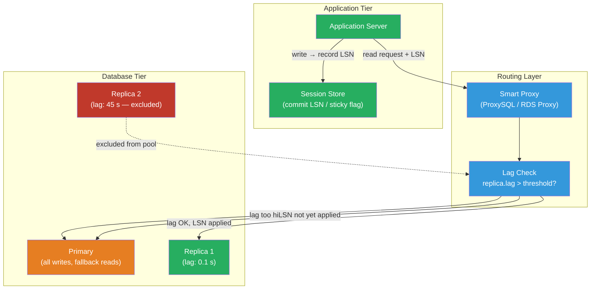

# [BEE-463] Read Replica Routing and Lag Handling

:::info
Read replica routing directs SELECT queries to replicas to reduce primary load, but replication lag — the delay between a write on the primary and its appearance on a replica — breaks read-your-writes consistency. Engineering the application layer to detect, tolerate, and compensate for lag is the central challenge.
:::

## Context

Adding read replicas is one of the first moves when a database primary becomes a throughput bottleneck. The theory is simple: replicate writes asynchronously to N standby servers, route read queries to standbys, and multiply read capacity linearly. In practice, the asymmetry between write ordering (strictly sequential on the primary) and read delivery (eventually consistent on replicas) introduces a class of bugs that only appear under load or after network events.

The canonical failure mode: a user submits a form, the write commits on the primary, the UI redirects to a detail page that reads from a replica, and the replica hasn't applied the write yet. The user sees stale data — or, worse, a 404 because a newly created row isn't visible yet. Martin Kleppmann's *Designing Data-Intensive Applications* (2017) names this the read-your-writes (monotonic reads) problem and classifies it as a session-level consistency guarantee that asynchronous replication cannot provide without explicit application-layer support.

Replication lag is not a fixed constant. It varies with primary write rate, replica I/O throughput, network conditions, and the presence of long-running transactions that block the replication stream. PostgreSQL tracks lag by comparing the primary's current write-ahead log (WAL) position against the position each replica has applied; the gap, measured in bytes or estimated seconds, is available in `pg_stat_replication`. MySQL exposes `Seconds_Behind_Source` in `SHOW REPLICA STATUS`, though this metric has known inaccuracies when the replication thread is idle. Percona XtraDB Cluster and Galera use synchronous certification-based replication, which eliminates lag but adds write latency and limits geographic distribution.

## Design Thinking

### Routing Strategies

Three patterns dominate:

**Proxy-layer routing** (ProxySQL, PgBouncer, RDS Proxy, Vitess): A smart proxy sits between the application and databases. The application connects to a single endpoint; the proxy routes read-only transactions to replicas and writes to the primary. ProxySQL can be configured with query rules matching `SELECT` statements and a replica group with lag-based failback: if a replica's lag exceeds a threshold, the proxy removes it from the read pool until it catches up. This centralizes routing logic and requires zero application changes.

**Driver-level routing** (AWS JDBC Driver for Aurora, Hikari with read-only datasource): Database drivers or connection pool configurations separate write and read data sources. Application code uses `@Transactional(readOnly = true)` (Spring) or explicitly acquires connections from different pools. This is more intrusive but allows fine-grained per-query control.

**Application-level routing** (explicit replica client): The application maintains two connection pools — `primary_pool` and `replica_pool` — and routes explicitly. This maximizes flexibility (route specific high-latency analytics queries to a dedicated analytics replica) but distributes routing logic across the codebase.

### Read-Your-Writes Consistency

The most important problem in replica routing is ensuring that a user sees their own writes. Four approaches:

**Sticky primary window**: After any write, route all reads from that session to the primary for a fixed duration (e.g., 500 ms to 2 s). Simple to implement with a session flag and timestamp. Effective when write-followed-by-read latency is the concern. Sends a burst of reads to the primary immediately after writes; if write operations are frequent, the replica is rarely used.

**LSN/GTID pinning**: After a write, record the commit position (PostgreSQL WAL LSN or MySQL GTID). When routing a subsequent read, query the replica for its current applied position and compare. If the replica is behind the recorded commit position, redirect to the primary. PostgreSQL `pg_last_wal_replay_lsn()` returns the replica's applied LSN. MySQL `WAIT_FOR_EXECUTED_GTID_SET(gtid, timeout)` blocks until the replica applies the given GTID. This is precise — it routes to the primary only when necessary — but requires propagating the commit position to the application tier (typically via a session cookie or cache entry).

**Monotonic session token**: Issue each session a token containing the highest write LSN the session has produced. On every read request, include the token. The read replica evaluates whether it has applied up to that LSN; if not, the read falls back to the primary. Shopify's "read your writes via GTID" and PlanetScale's consistency tokens use this approach.

**Read from primary by default for critical paths**: Identify the small set of user-visible reads that must see the latest data (post-create redirect, payment confirmation) and force those to the primary. Route everything else to replicas. Simpler than session tracking; leaves some read traffic on the primary but avoids complex distributed state.

### Lag Detection and Replica Health

A replica with high lag is worse than no replica: queries routed to it return stale data, and the inconsistency is invisible to the user. The routing layer must treat lag as a health signal.

PostgreSQL primary view:
```sql
SELECT client_addr,
       application_name,
       state,
       write_lag,
       flush_lag,
       replay_lag
FROM pg_stat_replication;
```
`replay_lag` is the interval between the primary committing a WAL record and the replica applying it. Monitor this value; alert when it exceeds a threshold (commonly 30 s for OLTP, 5 min for analytics replicas). If lag exceeds the threshold, remove the replica from the read pool rather than serving stale reads.

MySQL equivalent:
```sql
SHOW REPLICA STATUS\G
-- Seconds_Behind_Source: estimated lag in seconds
-- Replica_SQL_Running: must be Yes
-- Seconds_Behind_Source is NULL when the replica is not connected
```

`Seconds_Behind_Source` becomes unreliable when the replica I/O thread has caught up but the SQL thread is idle — it reports 0 even if the last applied transaction was minutes ago. The Percona `pt-heartbeat` tool inserts a timestamped row into a heartbeat table on the primary and measures the gap on replicas; this produces accurate lag regardless of replication thread idle state.

## Best Practices

**MUST NOT route reads to a replica that exceeds your lag SLA without falling back to the primary.** If your application requires read-your-writes consistency within 1 s, any replica with `replay_lag > 1s` is unsafe for reads that must reflect recent writes. Remove it from the pool proactively; do not wait for users to observe stale data.

**MUST implement read-your-writes for user-initiated write-then-read flows.** After a `POST /orders`, the `GET /orders/{id}` redirect MUST see the created order. Choose one of: sticky primary window, LSN pinning, or primary-only for critical paths. Document the policy in code so engineers adding new endpoints know the default assumption.

**SHOULD use a proxy layer (ProxySQL, PgBouncer, RDS Proxy) rather than application-level routing when starting out.** Proxy-based routing separates operational concerns (replica health, lag threshold, failover) from application logic. Migrate to application-level routing only when you need per-query control that a proxy cannot express.

**MUST distinguish between read-only and read-write transactions at the application layer.** ORM frameworks support this: Django's `using('replica')` queryset modifier, Spring's `@Transactional(readOnly = true)`, SQLAlchemy's `sessionmaker(bind=replica_engine)`. Transactions that mix reads and writes MUST go to the primary; do not attempt to split them.

**SHOULD monitor replica lag as a first-class SLO signal.** Add `db.replica.lag_seconds` to your metrics dashboard alongside request latency and error rate. Set alert thresholds: warn at 10 s, page at 60 s. Sustained lag indicates a primary write rate that exceeds replica throughput — the signal to scale replicas horizontally or investigate write amplification.

**MUST test replica failover paths in staging.** When a replica fails or is removed from the pool for high lag, all read traffic falls back to the primary. Verify the primary can handle 100% of read traffic without hitting connection limits or becoming a bottleneck. Use load testing tools to simulate this condition before it occurs in production.

**SHOULD record the commit LSN/GTID in distributed caches or session stores when using LSN pinning across stateless services.** If multiple application instances serve the same user, each instance must read the same pinning state. Store the session's highest commit position in Redis or the session store, not in process memory.

## Visual



## Example

**LSN-based read-your-writes in Python (PostgreSQL):**

```python
import psycopg2
from functools import wraps

# Two connection pools: primary (write) and replica (read)
primary_pool = connect_pool("postgres://primary/db")
replica_pool  = connect_pool("postgres://replica/db")

def get_primary_lsn(conn) -> str:
    """Return the current WAL LSN on the primary after a write."""
    row = conn.execute("SELECT pg_current_wal_lsn()::text").fetchone()
    return row[0]

def replica_has_applied(replica_conn, lsn: str) -> bool:
    """True if the replica has replayed up to or past the given LSN."""
    row = replica_conn.execute(
        "SELECT pg_last_wal_replay_lsn() >= %s::pg_lsn", (lsn,)
    ).fetchone()
    return row[0]

def route_read(session_lsn: str | None):
    """
    Return a connection to the replica if it has applied the session's
    last write LSN; fall back to the primary otherwise.
    """
    if session_lsn is None:
        return replica_pool.getconn()  # no prior write, replica is safe

    replica_conn = replica_pool.getconn()
    if replica_has_applied(replica_conn, session_lsn):
        return replica_conn
    replica_pool.putconn(replica_conn)
    return primary_pool.getconn()  # replica is behind, use primary

# Usage in a web handler:
def create_order(user_id: int, items: list) -> dict:
    with primary_pool.getconn() as conn:
        conn.execute("INSERT INTO orders (...) VALUES (...)", ...)
        lsn = get_primary_lsn(conn)
        conn.commit()

    session["last_write_lsn"] = lsn  # store in session cookie / Redis
    return {"order_id": ...}

def get_order(order_id: int, session: dict) -> dict:
    lsn = session.get("last_write_lsn")
    with route_read(lsn) as conn:
        return conn.execute(
            "SELECT * FROM orders WHERE id = %s", (order_id,)
        ).fetchone()
```

**Lag monitoring query (PostgreSQL primary):**

```sql
-- Run on the primary to monitor all connected replicas
SELECT
    application_name,
    client_addr,
    state,
    EXTRACT(EPOCH FROM write_lag)::int  AS write_lag_s,
    EXTRACT(EPOCH FROM flush_lag)::int  AS flush_lag_s,
    EXTRACT(EPOCH FROM replay_lag)::int AS replay_lag_s,
    CASE
        WHEN replay_lag > interval '30 seconds' THEN 'DEGRADED'
        WHEN replay_lag > interval '5 seconds'  THEN 'WARNING'
        ELSE 'OK'
    END AS lag_status
FROM pg_stat_replication
ORDER BY replay_lag DESC NULLS LAST;
```

**ProxySQL lag-based routing rule (MySQL):**

```sql
-- Add replica to hostgroup 20 (reads); proxy removes it when lag > 30 s
INSERT INTO mysql_servers (hostgroup_id, hostname, port, max_replication_lag)
VALUES (20, 'replica1.db.internal', 3306, 30);

-- Route SELECTs to hostgroup 20, writes to hostgroup 10 (primary)
INSERT INTO mysql_query_rules (rule_id, active, match_pattern, destination_hostgroup)
VALUES (1, 1, '^SELECT', 20);

LOAD MYSQL SERVERS TO RUNTIME;
LOAD MYSQL QUERY RULES TO RUNTIME;
```

## Related BEEs

- [BEE-6003](../data-storage/replication-strategies.md) -- Replication Strategies: covers the mechanics of streaming replication, semi-synchronous replication, and Galera — this article builds on those fundamentals to address application-layer routing concerns
- [BEE-8006](../transactions/eventual-consistency-patterns.md) -- Eventual Consistency Patterns: replica lag is one instance of eventual consistency; session guarantees like read-your-writes and monotonic reads are the key patterns for managing it
- [BEE-6006](../data-storage/connection-pooling-and-query-optimization.md) -- Connection Pooling and Query Optimization: separate primary and replica connection pools are the foundation of replica routing; pool sizing must account for the possibility that all reads fall back to primary
- [BEE-19019](session-guarantees-and-consistency-models.md) -- Session Guarantees and Consistency Models: defines read-your-writes, monotonic reads, and the other session guarantees that replica routing must preserve

## References

- [Designing Data-Intensive Applications, Chapter 5: Replication — Martin Kleppmann (2017)](https://dataintensive.net/)
- [pg_stat_replication — PostgreSQL Documentation](https://www.postgresql.org/docs/current/monitoring-stats.html#MONITORING-PG-STAT-REPLICATION-VIEW)
- [SHOW REPLICA STATUS — MySQL Documentation](https://dev.mysql.com/doc/refman/8.0/en/show-replica-status.html)
- [Read Your Writes via GTID — Shopify Engineering (2020)](https://shopify.engineering/read-your-writes-consistency)
- [pt-heartbeat: Replication Lag Measurement — Percona Toolkit](https://docs.percona.com/percona-toolkit/pt-heartbeat.html)
- [ProxySQL: Read/Write Split and Replication Lag Management](https://proxysql.com/documentation/proxysql-read-write-split-use-case/)
- [Amazon RDS Proxy — AWS Documentation](https://docs.aws.amazon.com/AmazonRDS/latest/UserGuide/rds-proxy.html)
