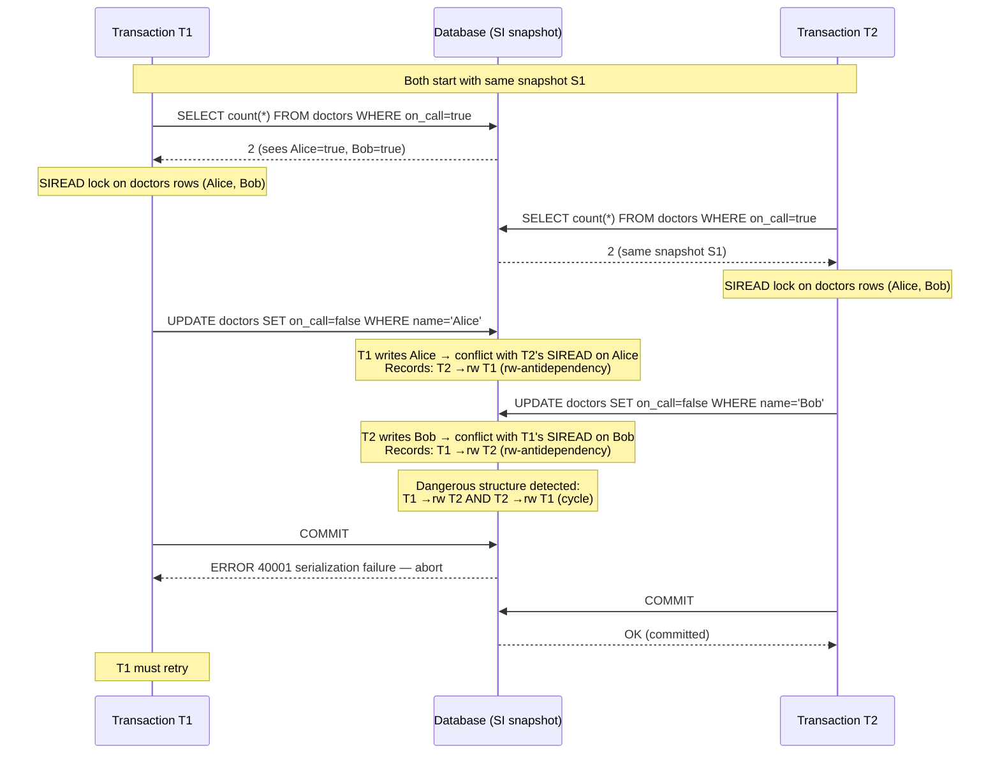

# [BEE-19023] Serializable Snapshot Isolation

:::info
Serializable Snapshot Isolation (SSI) achieves full SERIALIZABLE isolation by running on top of Snapshot Isolation's non-blocking multi-version reads and aborting only the transactions that form a "dangerous structure" — two consecutive read-write antidependencies that cannot be serialized — letting reads never block writes while still preventing write skew and all other serialization anomalies.
:::

## Context

Snapshot Isolation (SI) was a practical improvement over Two-Phase Locking adopted by Oracle in the late 1980s and formalized by Berenson, Bernstein, Gray and colleagues in "A Critique of ANSI SQL Isolation Levels" (SIGMOD, 1995). Under SI, every transaction reads from a consistent point-in-time snapshot and writers never block readers. This eliminated the read-write blocking of 2PL and dramatically improved read throughput. The problem: SI is not serializable. It permits **write skew** — an anomaly where two transactions both read an overlapping dataset, each decides to write based on what it read, and neither sees the other's write. The result can violate constraints that would hold under any serial execution.

The theoretical breakthrough came from Alan Fekete, Dimitrios Liarokapis, Elizabeth O'Neil, Patrick O'Neil, and Dennis Shasha in "Making Snapshot Isolation Serializable" (ACM TODS, 2005). They proved that SI's non-serializability is due entirely to a specific pattern in the dependency graph: a **dangerous structure** consisting of two consecutive read-write antidependencies. A read-write antidependency (rw-antidependency) occurs when transaction T1 reads a version of an object that T2 subsequently overwrites — T2's write is invisible to T1, creating an ordering constraint (T2 must logically precede T1). When two such edges appear consecutively (T1 → T2 → T3 in rw-antidependency), the transactions cannot all be serialized in any order. The key insight: you can detect this structure without tracking all possible dependency cycles.

Michael Cahill, Uwe Röhm, and Alan Fekete turned this theory into a practical algorithm in "Serializable Isolation for Snapshot Databases" (ACM SIGMOD, 2008), which they implemented in PostgreSQL. Dan R.K. Ports and Kevin Grittner refined and optimized it for production in "Serializable Snapshot Isolation in PostgreSQL" (VLDB, 2012), and PostgreSQL 9.1 (2011) shipped it as the `SERIALIZABLE` isolation level. The key mechanism is **SIREAD locks**: phantom locks that record what each transaction has read without blocking concurrent writers. When a writer conflicts with a SIREAD lock held by another transaction, an rw-antidependency is recorded. At commit time, if two consecutive rw-antidependencies form a dangerous structure, one transaction is aborted with error code `40001` (serialization failure) and can be safely retried.

The impact was significant: PostgreSQL became the first major production database to implement true serializable isolation without read-write blocking. Previously, SERIALIZABLE in PostgreSQL was equivalent to REPEATABLE READ (it did not prevent write skew). CockroachDB adopted a similar distributed variant using multi-version concurrency control and timestamp-based conflict detection. Google Spanner achieves external consistency (stronger than serializability) through TrueTime and strict 2PL — a different tradeoff that blocks reads but never aborts due to serialization failures.

## Design Thinking

**SSI trades abort risk for read throughput; 2PL trades blocking for abort predictability.** Under 2PL, a transaction that would form a dangerous structure is instead blocked at the read that creates the conflict — it waits until the conflicting write commits or aborts. Under SSI, the read proceeds immediately and the conflict is detected at commit time, potentially after significant computation. For read-heavy workloads, SSI wins: readers never wait. For write-heavy workloads with high contention on small hot rows, 2PL may produce fewer aborts. The choice is workload-dependent; neither dominates universally.

**SIREAD lock granularity is a memory-correctness tradeoff.** SSI tracks reads at tuple granularity by default. If a transaction reads many rows, its SIREAD locks consume memory. PostgreSQL promotes tuple-level SIREAD locks to page-level, then relation-level, to bound memory use. A page-level SIREAD lock is correct (conservative) but introduces false positives: any write to any row on that page registers as a conflict, even if the actual rows read were different. Relation-level promotion means any write to the table triggers a potential conflict. In practice, large sequential scans on busy tables can cause excessive false-positive aborts under SSI. Indexes mitigate this: a scan that hits an index range acquires a SIREAD lock on the index entries rather than the full relation.

**Read-only transactions can opt out of SSI's abort risk.** A transaction that reads but never writes cannot create a dangerous structure — it cannot have an outgoing rw-antidependency. PostgreSQL allows read-only transactions to declare themselves with `SET TRANSACTION READ ONLY` combined with `DEFERRABLE`, which causes the transaction to wait until a snapshot is guaranteed safe before proceeding, then execute with zero abort risk. This is optimal for long-running read-only queries (reporting, analytics) running under `SERIALIZABLE` isolation.

## Deep Dive

**The write skew anomaly in detail.** The on-call doctor example is the canonical illustration: two transactions T1 and T2 both execute `SELECT count(*) FROM doctors WHERE on_call = true` (result: 2), then both execute `UPDATE doctors SET on_call = false WHERE name = 'Alice'` (T1) and `UPDATE doctors SET on_call = false WHERE name = 'Bob'` (T2). Under SI, both transactions read the same snapshot (2 doctors on call), both decide the constraint is satisfied (at least 1 doctor remains), both commit — leaving 0 doctors on call. Under SSI, the two rw-antidependencies (T1's read of Bob's row is overwritten by T2; T2's read of Alice's row is overwritten by T1) form a dangerous structure, and one transaction is aborted.

**The rw-antidependency graph and dangerous structures.** Three types of dependency exist in a transaction schedule:
- **wr-dependency**: T1 writes X, T2 reads T1's version of X (T1 before T2)
- **ww-dependency**: T1 writes X, T2 overwrites X (T1 before T2)
- **rw-antidependency**: T1 reads version V of X, T2 writes a newer version of X (logically T2 before T1, because T1 did not see T2's write)

A **dangerous structure** exists when T1 has an rw-antidependency to T2 AND T2 has an rw-antidependency to T3 (where T1 may equal T3). This consecutive pair guarantees a serialization cycle. Fekete et al.'s theorem: a snapshot isolation schedule is non-serializable if and only if it contains a dangerous structure. SSI aborts a transaction in every detected dangerous structure, preventing non-serializable executions.

**SIREAD locks in PostgreSQL.** When a `SERIALIZABLE` transaction reads a row, PostgreSQL acquires a SIREAD lock on that row (or page, or relation after promotion). SIREAD locks appear in `pg_locks` with `mode = 'SIReadLock'`. When a transaction writes to a row, PostgreSQL checks whether any other `SERIALIZABLE` transaction holds a SIREAD lock on that row. If so, an rw-antidependency is recorded in internal conflict tracking structures. At commit time, PostgreSQL inspects the transaction's recorded conflicts: if the committing transaction is the "pivot" (T2) in a dangerous structure — it has both an incoming rw-antidependency (T1 →rw T2) and an outgoing one (T2 →rw T3) — it is aborted. This is checked not just at the committing transaction's boundaries but also when the in-doubt transactions are already committed (PostgreSQL tracks "committed-in" conflicts).

## Visual



## Best Practices

**MUST handle serialization failure (error 40001) and retry.** Under SSI, any `SERIALIZABLE` transaction can be aborted at commit time with `sqlstate 40001` (serialization_failure). Application code MUST catch this error and retry the entire transaction from the beginning — not resume from the failed statement. An aborted transaction has made no changes; the retry has the same semantic outcome as if it had simply waited for the conflicting transaction to commit first.

**Design transactions to be idempotent and retryable.** A serialization failure retry means re-executing the transaction's reads and writes. If the transaction has side effects (sending an email, calling an external API) that executed before the failed commit, retrying the transaction will duplicate those effects. Side effects MUST be deferred to after commit, or made idempotent, or tracked in a way that prevents double-execution on retry.

**Use `DEFERRABLE READ ONLY` for long-running reads.** A read-only transaction under SERIALIZABLE that declares `DEFERRABLE` waits until it can obtain a snapshot that is guaranteed to be serializable, then executes with zero abort risk. This is the right tool for reports, analytics, and any read that must be consistent but can tolerate a brief initial wait. Under non-deferrable SERIALIZABLE, even read-only transactions can be aborted if they are part of a dangerous structure.

**Add indexes on columns used in WHERE predicates of SERIALIZABLE transactions.** SSI's SIREAD lock granularity tracks index entries rather than full relation scans when an index is used. A sequential scan on a large table promotes SIREAD locks to relation level and causes any write to that table to register as a conflict — dramatically increasing false positive aborts. An index scan limits the SIREAD lock to the specific entries returned, reducing false positives.

**Monitor serialization failures and tune max_connections / statement_timeout.** PostgreSQL exposes `pg_stat_database.conflicts` (which includes serialization failures) and `pg_stat_activity`. A spike in serialization failures indicates hot contention — inspect which transactions are involved and whether index coverage can reduce SIREAD lock granularity. Long-running SERIALIZABLE transactions hold SIREAD locks longer and have more opportunity to collide; `statement_timeout` limits runaway transaction duration.

## Example

**Write skew under REPEATABLE READ (allowed) vs. SERIALIZABLE (prevented):**

```sql
-- Schema: doctors on call, constraint: at least 1 must be on call
CREATE TABLE doctors (name text PRIMARY KEY, on_call boolean NOT NULL);
INSERT INTO doctors VALUES ('Alice', true), ('Bob', true);

-- Session 1: REPEATABLE READ — write skew is ALLOWED
BEGIN ISOLATION LEVEL REPEATABLE READ;
  SELECT count(*) FROM doctors WHERE on_call = true;  -- returns 2
  -- (Session 2 also reads 2 and decides to go off-call concurrently)
  UPDATE doctors SET on_call = false WHERE name = 'Alice';
COMMIT;  -- Succeeds even if Session 2 already committed the same kind of update

-- End result: 0 doctors on call — constraint violated, no error raised
```

```sql
-- Session 1: SERIALIZABLE — write skew is PREVENTED
BEGIN ISOLATION LEVEL SERIALIZABLE;
  SELECT count(*) FROM doctors WHERE on_call = true;  -- returns 2
  -- Acquires SIREAD lock on both rows
  UPDATE doctors SET on_call = false WHERE name = 'Alice';
COMMIT;
-- ERROR:  could not serialize access due to read/write dependencies among transactions
-- DETAIL:  Reason code: Canceled on identification as a pivot, during commit attempt.
-- HINT:  The transaction might succeed if retried.
-- SQLSTATE: 40001
```

**Retry loop for serialization failures (Python + psycopg2):**

```python
import psycopg2
from psycopg2.extensions import ISOLATION_LEVEL_SERIALIZABLE
import time
import random

SERIALIZATION_FAILURE = "40001"

def with_serializable_retry(conn, fn, max_attempts=5):
    """
    Execute fn(cursor) inside a SERIALIZABLE transaction.
    Retries on serialization failure with jittered backoff.
    fn must be side-effect-free or idempotent — it will be called again on retry.
    """
    conn.set_isolation_level(ISOLATION_LEVEL_SERIALIZABLE)
    for attempt in range(max_attempts):
        try:
            with conn.cursor() as cur:
                fn(cur)
            conn.commit()
            return
        except psycopg2.Error as e:
            conn.rollback()
            if e.pgcode == SERIALIZATION_FAILURE and attempt < max_attempts - 1:
                # Exponential backoff with jitter before retry
                delay = 0.01 * (2 ** attempt) + random.uniform(0, 0.01)
                time.sleep(delay)
                continue
            raise

def transfer_on_call(cur):
    # Read current state
    cur.execute("SELECT count(*) FROM doctors WHERE on_call = true")
    on_call_count = cur.fetchone()[0]
    if on_call_count <= 1:
        raise ValueError("Cannot go off-call: only one doctor on call")
    # Update — this write will register rw-antidependencies with concurrent readers
    cur.execute(
        "UPDATE doctors SET on_call = false WHERE name = %s",
        ("Alice",)
    )

with_serializable_retry(conn, transfer_on_call)
```

**Observing SIREAD locks in PostgreSQL:**

```sql
-- View active SIREAD locks during a SERIALIZABLE transaction
SELECT pid, mode, relation::regclass, page, tuple
FROM pg_locks
WHERE mode = 'SIReadLock';

-- pid  | mode        | relation | page | tuple
-- ------+-------------+----------+------+-------
-- 12345 | SIReadLock  | doctors  |    0 |     1  ← tuple-level (row 1 = Alice)
-- 12345 | SIReadLock  | doctors  |    0 |     2  ← tuple-level (row 2 = Bob)

-- If promoted to page-level (too many tuple locks):
-- 12345 | SIReadLock  | doctors  |    0 | null   ← page 0, all tuples

-- Monitor serialization failures database-wide
SELECT datname, conflicts
FROM pg_stat_database
WHERE datname = current_database();
```

## Related BEEs

- [BEE-8002](../transactions/isolation-levels-and-their-anomalies.md) -- Isolation Levels and Their Anomalies: SSI is the implementation technique that makes the SERIALIZABLE isolation level achievable without read-write blocking; write skew and phantom reads are the specific anomalies SSI prevents that REPEATABLE READ does not
- [BEE-19021](two-phase-locking.md) -- Two-Phase Locking: 2PL and SSI are the two primary approaches to SERIALIZABLE isolation — 2PL uses locks that block conflicting operations proactively; SSI uses SIREAD locks that never block but detect and abort dangerous structures at commit time
- [BEE-11006](../concurrency/optimistic-vs-pessimistic-concurrency-control.md) -- Optimistic vs Pessimistic Concurrency Control: SSI is an optimistic protocol — like OCC, it allows transactions to proceed and validates at commit time, incurring abort cost rather than blocking cost; the difference from OCC is that SSI's abort criterion is based on dependency-graph analysis rather than version comparison
- [BEE-19009](linearizability-and-serializability.md) -- Linearizability and Serializability: serializability is the isolation-level property SSI implements — the guarantee that concurrent transactions produce results equivalent to some serial execution; linearizability adds real-time ordering constraints beyond what SSI alone provides

## References

- [Making Snapshot Isolation Serializable -- Fekete, Liarokapis, O'Neil, O'Neil, Shasha, ACM TODS 2005](https://dsf.berkeley.edu/cs286/papers/ssi-tods2005.pdf)
- [Serializable Isolation for Snapshot Databases -- Cahill, Röhm, Fekete, ACM SIGMOD 2008](https://dl.acm.org/doi/10.1145/1376616.1376690)
- [Serializable Snapshot Isolation in PostgreSQL -- Ports and Grittner, VLDB 2012](https://vldb.org/pvldb/vol5/p1850_danrkports_vldb2012.pdf)
- [Transaction Isolation -- PostgreSQL Documentation](https://www.postgresql.org/docs/current/transaction-iso.html)
- [Serializable Snapshot Isolation (SSI) -- PostgreSQL Wiki](https://wiki.postgresql.org/wiki/SSI)
- [Serializable Transactions -- CockroachDB Documentation](https://www.cockroachlabs.com/docs/stable/demo-serializable)
- [Isolation Levels -- Google Cloud Spanner Documentation](https://docs.cloud.google.com/spanner/docs/isolation-levels)
