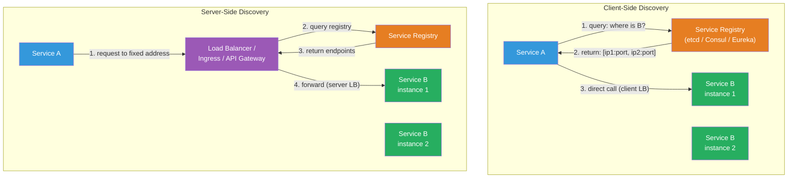

# [BEE-19007] Service Discovery

:::info
Service discovery is the mechanism by which clients locate network endpoints for services whose IP addresses and ports change dynamically — solved either by having clients query a registry directly, or by routing all traffic through an intermediary that resolves addresses on the client's behalf.
:::

## Context

In a statically deployed world, service locations are fixed: you hard-code `db.example.com:5432` in a config file and it stays there. In a dynamically scaled environment — containers restarted by an orchestrator, auto-scaled groups, rolling deployments — every restart potentially gives a service a new IP address. A monolith calling twenty other services cannot afford to require manual config updates every time any of those services restarts.

The scale of the problem accelerated with the adoption of microservices and container orchestration. Netflix, which pioneered much of the early thinking, open-sourced **Eureka** in 2012 as a registry-based discovery solution for their JVM services. Eureka is an AP system: instances register themselves, send periodic heartbeats, and the registry assumes they are alive until heartbeats stop. Netflix also published **Ribbon** as the client-side load balancer that reads from Eureka to route requests. Ribbon is now deprecated, but the Eureka architecture remains influential.

The problem has two orthogonal axes: **who discovers** (the client or an intermediary) and **who registers** (the service itself or a third party like an orchestrator). Getting each axis wrong independently causes different failure modes.

DNS has been a service discovery substrate since before the term existed. RFC 2782 (2000) standardized SRV records, which carry both host and port and support weighted priority selection — sufficient for static-ish environments where TTLs are short. RFC 6763 (Cheshire and Krochmal, 2013) standardized DNS-SD (DNS-based Service Discovery), which lets clients browse for services of a type (`_http._tcp.local`) and then resolve individual instance records, enabling zero-configuration discovery on local networks. Kubernetes uses CoreDNS to implement DNS-based discovery: every Service gets a predictable name (`<service>.<namespace>.svc.cluster.local`) backed by a ClusterIP, and CoreDNS watches the Kubernetes API server to keep records current.

For environments that need stronger guarantees than DNS TTL allows, registry-based systems provide watch/notification mechanisms: a client can subscribe to registry changes and receive a push when a service's endpoint set changes, rather than polling or relying on TTL expiry. etcd (Raft-backed, CP), Consul (Raft for registry + Gossip for membership, CP with tunable consistency), and ZooKeeper (ZAB consensus, CP) all offer this. etcd ephemeral keys with leases expire automatically when a client disconnects, providing built-in deregistration.

The service mesh model removes discovery from application code entirely. An Envoy sidecar proxy intercepts all outbound traffic; a control plane (Istio's `istiod`, Consul Connect, Linkerd) pushes endpoint updates to every Envoy instance via the **xDS protocol** — a family of gRPC streaming APIs (CDS for clusters, EDS for endpoints, RDS for routes, LDS for listeners). The application code talks to `localhost:port`; Envoy handles resolution, retries, and load balancing. The xDS protocol was developed by the Envoy project and has become an industry standard adopted by multiple control planes.

## Design Thinking

**Client-side discovery gives clients more control at the cost of coupling them to the registry.** The client queries the registry, receives a list of healthy instances, and applies its own load-balancing logic (round-robin, zone-aware, weighted). This enables sophisticated routing strategies but requires every service client to implement or embed a service-registry client library. If you change registry providers, all clients need updating.

**Server-side discovery decouples clients from the registry at the cost of an additional network hop.** Clients send requests to a fixed well-known address (a load balancer, API gateway, or ingress controller). That intermediary queries the registry and forwards the request. Clients stay simple, but every request traverses an extra layer that can become a bottleneck or failure point.

**Self-registration is simple but creates orphan registrations on crash.** A service that registers itself on startup must also deregister on shutdown — and implement graceful shutdown signal handling to do so. A process that crashes without sending a shutdown signal leaves a stale registry entry until the TTL or health-check failure removes it. During that window, clients may receive the dead instance's address and encounter connection errors.

**Third-party registration shifts the coupling to the orchestrator.** Kubernetes exemplifies this: kubelet registers and deregisters pods, and CoreDNS reflects Service endpoint changes from etcd. The service process has no registry client code. The downside is that the orchestrator must be in the data path of all registration events, which is fine in Kubernetes but requires significant investment to build elsewhere.

## Best Practices

**MUST implement health checks and configure deregistration timeouts.** A registry without health checks is a stale-address database. Every registered service MUST expose a health endpoint (HTTP `GET /health` returning 200 when ready, 503 when not), and the registry or orchestrator MUST be configured to deregister instances that fail health checks after a configurable grace period. In Consul, set `deregister_critical_service_after` to a value like `2m` to automatically purge long-failed instances. In Kubernetes, configure readiness probes — an instance failing its readiness probe is removed from the Service's endpoint set, stopping traffic before the pod is killed.

**MUST NOT rely on DNS TTL as your only stale-address defense.** Client JVMs and runtime HTTP libraries cache DNS responses well beyond the TTL. Java's `InetAddress` has historically defaulted to caching resolved addresses indefinitely (`networkaddress.cache.ttl = -1`). Even with short TTLs (5–30 seconds), DNS negative caching (NXDOMAIN responses) can cause clients to skip retrying a recently restarted service for the full negative TTL duration. Use health-aware client libraries or sidecars, not raw DNS, as your sole discovery mechanism in highly dynamic environments.

**SHOULD prefer CP registry systems (etcd, Consul) over AP systems (Eureka) when stale entries cause correctness issues.** Eureka's self-preservation mode — triggered when it stops receiving a quorum of expected heartbeats, typically during network partitions — deliberately retains all existing registrations to prevent mass deregistration. This improves availability but means clients may receive addresses for instances that are actually unreachable. If your system cannot handle retrying against dead endpoints, a CP registry's strong consistency is worth the availability tradeoff during registry partition.

**SHOULD implement graceful shutdown to enable explicit deregistration.** On SIGTERM, services SHOULD: (1) stop accepting new connections, (2) deregister from the service registry, (3) drain in-flight requests, (4) close connections and exit. This reduces the window during which clients receive a healthy-but-shutting-down address. In practice, combine explicit deregistration with a brief delay before stopping the listener, to allow the registry update to propagate to clients.

**MAY use the service mesh pattern to move discovery entirely out of application code.** For polyglot environments with many services, embedding a registry client in every service in every language is expensive to maintain. A sidecar model — Envoy with an xDS control plane, or Linkerd — centralizes discovery, retries, circuit breaking, and mTLS in infrastructure rather than application code. The trade-off is operational complexity: running a control plane is a significant new system dependency.

## Visual



## Example

**DNS SRV record for service discovery (RFC 2782):**

```
# DNS SRV record format: _service._proto.name TTL IN SRV priority weight port target
# Priority: lower value = preferred. Weight: proportional selection among equal-priority records.

_payments._tcp.internal.example.com. 30 IN SRV 10 70 8080 payments-1.internal.example.com.
_payments._tcp.internal.example.com. 30 IN SRV 10 30 8080 payments-2.internal.example.com.
_payments._tcp.internal.example.com. 30 IN SRV 20  0 8080 payments-3.internal.example.com.

# Priority 10: payments-1 gets 70% of traffic, payments-2 gets 30%
# Priority 20: payments-3 is standby, only used if priority-10 servers unavailable
# TTL 30s: clients re-query every 30 seconds

# Kubernetes equivalent (auto-generated by CoreDNS):
# payments.payments-ns.svc.cluster.local → ClusterIP (round-robined by kube-proxy)
# Headless service: each Pod gets its own A record
```

**Consul service registration and health check:**

```json
{
  "service": {
    "name": "payments",
    "id": "payments-pod-abc123",
    "address": "10.0.1.42",
    "port": 8080,
    "tags": ["v2", "primary"],
    "check": {
      "http": "http://10.0.1.42:8080/health",
      "interval": "10s",
      "timeout": "3s",
      "deregister_critical_service_after": "2m"
    }
  }
}

// What happens on failure:
// T=0s:  HTTP check to :8080/health → 503 (service restarting)
// T=10s: Second check fails → instance marked "critical"
// T=2m:  deregister_critical_service_after fires → instance removed from registry
// T=2m:  New clients no longer receive this instance's address
// Gap: clients may get connection errors for up to 2m; mitigate with retries (BEE-12002)
```

**Envoy xDS endpoint discovery (EDS):**

```yaml
# Control plane pushes DiscoveryResponse for EDS:
# Envoy sidecar receives this and updates its upstream cluster "payments"
resources:
  - "@type": type.googleapis.com/envoy.config.endpoint.v3.ClusterLoadAssignment
    cluster_name: payments
    endpoints:
      - lb_endpoints:
          - endpoint:
              address:
                socket_address:
                  address: 10.0.1.42
                  port_value: 8080
            health_status: HEALTHY
          - endpoint:
              address:
                socket_address:
                  address: 10.0.1.43
                  port_value: 8080
            health_status: HEALTHY
# When payments-pod-abc123 fails its health check:
# Control plane pushes updated EDS response with health_status: UNHEALTHY
# Envoy stops routing to 10.0.1.42 without any application code changes
```

## Related BEEs

- [BEE-19002](consensus-algorithms-paxos-and-raft.md) -- Consensus Algorithms: Consul and etcd implement their registries on top of Raft; the CP guarantee means registry reads are consistent even after a leader failover
- [BEE-19004](gossip-protocols.md) -- Gossip Protocols: Consul uses the Serf library (SWIM gossip) for cluster membership and failure detection across Consul agents, separate from its Raft-backed registry
- [BEE-12001](../resilience/circuit-breaker-pattern.md) -- Circuit Breaker Pattern: service discovery tells you where to send traffic; circuit breakers decide whether to send it based on recent failure rates — the two patterns compose
- [BEE-12002](../resilience/retry-strategies-and-exponential-backoff.md) -- Retry Strategies: stale registry entries produce connection errors; a retry with jitter on the next healthy instance from the registry is the standard mitigation
- [BEE-14006](../observability/health-checks-and-readiness-probes.md) -- Health Checks and Readiness Probes: the health check endpoints that service discovery relies on for liveness determination are described in depth here

## References

- [Client-Side Service Discovery Pattern -- Chris Richardson, microservices.io](https://microservices.io/patterns/client-side-discovery.html)
- [Server-Side Service Discovery Pattern -- Chris Richardson, microservices.io](https://microservices.io/patterns/server-side-discovery.html)
- [Self Registration Pattern -- Chris Richardson, microservices.io](https://microservices.io/patterns/self-registration.html)
- [Third Party Registration Pattern -- Chris Richardson, microservices.io](https://microservices.io/patterns/3rd-party-registration.html)
- [RFC 2782: A DNS RR for specifying the location of services (DNS SRV) -- IETF, 2000](https://datatracker.ietf.org/doc/html/rfc2782)
- [RFC 6763: DNS-Based Service Discovery -- Cheshire & Krochmal, IETF, 2013](https://datatracker.ietf.org/doc/html/rfc6763)
- [CoreDNS Kubernetes Plugin -- CoreDNS Documentation](https://coredns.io/plugins/kubernetes/)
- [Service Discovery -- Consul Documentation](https://developer.hashicorp.com/consul/docs/concepts/service-discovery)
- [Envoy xDS Protocol -- Envoy Proxy Documentation](https://www.envoyproxy.io/docs/envoy/latest/api-docs/xds_protocol)
- [Introducing istiod: Simplifying the Control Plane -- Istio Blog, 2020](https://istio.io/latest/blog/2020/istiod/)
- [Eureka: Netflix's Service Discovery -- GitHub](https://github.com/Netflix/eureka)
- [Kubernetes Service Discovery -- Kubernetes Documentation](https://kubernetes.io/docs/concepts/services-networking/service/)
