# [BEE-19048] Service-to-Service Authentication

:::info
Service-to-service authentication establishes that a calling service is who it claims to be — distinct from user authentication — and is the foundation of zero-trust networking, where no internal request is trusted by default simply because it originates inside a private network.
:::

## Context

Traditional perimeter security assumed that anything inside the network boundary was trustworthy. A service receiving a request from another internal IP address would process it without verifying the caller's identity. This assumption collapsed as organizations adopted microservices, containerized workloads, and multi-cloud deployments where "the network" is not a meaningful boundary — workloads from different tenants share the same infrastructure, lateral movement after a single compromised service can reach every other service on the internal network.

John Kindervag coined the term "Zero Trust" at Forrester in 2010. NIST Special Publication 800-207 (2020) formalized the architectural principles: every request must be authenticated and authorized regardless of network origin, network location is not sufficient to grant trust, and least-privilege access applies to machine-to-machine traffic as well as user traffic. Google's BeyondCorp initiative (2014, Osborn et al.) applied these principles at scale, eliminating the concept of a trusted corporate network and authenticating every service-to-service call based on workload identity rather than IP address.

The engineering challenge is that service identity is structurally different from user identity. Users authenticate once per session with a credential they carry (a password, a hardware token). Services authenticate on every outbound request, often thousands of times per second, and cannot interactively prompt for credentials. Secrets must be injected at runtime, rotated without downtime, and scoped to the minimum necessary audience. The credential management problem is as important as the authentication protocol itself.

## Design Thinking

### The Three Approaches

**Mutual TLS (mTLS)** issues each service a short-lived X.509 certificate from a shared CA. Both sides of the connection present their certificates; the TLS handshake authenticates both caller and callee simultaneously. This is the model used by service meshes (Istio, Linkerd) and is the most operationally robust option at scale because certificate issuance and rotation can be automated by the control plane.

**Short-lived JWT service tokens** issue each service a signed JWT with a short expiry (minutes to hours) from a trusted token authority (e.g., Kubernetes service account token projections, HashiCorp Vault's JWT auth). The caller includes the JWT in every request as a bearer token; the callee validates the signature and audience claim. Simpler to implement than mTLS but adds a token authority as a dependency and requires clock synchronization.

**Workload identity with cloud provider IAM** binds a service to an IAM role at the infrastructure level. AWS EC2 instance profiles, GCP Workload Identity Federation, and Azure Managed Identity give each workload credentials automatically rotated by the platform. The callee verifies the request against the cloud provider's IAM API. This works well within a single cloud provider; cross-cloud calls require federation or a separate token exchange.

**Shared API keys** (long-lived symmetric secrets stored in environment variables or a secrets manager) are the simplest option but the weakest: a leaked key grants access indefinitely until rotated, rotation is often manual, and there is no per-request identity — only per-secret identity.

### Choosing a Strategy

| Approach | Strength | Operational cost | Best for |
|---|---|---|---|
| mTLS (service mesh) | Mutual auth, automatic rotation | High initial (mesh setup) | Kubernetes, large microservices fleets |
| Short-lived JWT | Simple to implement, auditable | Medium (token authority) | Hybrid, cross-cloud, non-mesh |
| Workload identity (IAM) | Zero credential management | Low (platform-managed) | Single cloud, cloud-native workloads |
| Shared API keys | Simplest | Low (but risky at scale) | Internal tools, small service count |

The decision should be based on: (1) how many services exist, (2) whether a service mesh is already in use, (3) how credential rotation will be automated, and (4) whether cross-cloud or cross-cluster authentication is required.

## Best Practices

**MUST NOT use long-lived static secrets (hardcoded API keys, long-lived passwords) as the primary service authentication mechanism in production.** Long-lived credentials accumulate in logs, are difficult to rotate without downtime, and provide no per-request audit trail. Every credential must have a defined rotation interval and an automated rotation mechanism.

**MUST scope credentials to the minimum necessary audience.** A service token issued for Service A must be rejected by Service B. Include an `aud` (audience) claim in JWTs and validate it on every inbound request. mTLS certificates should include the service's SPIFFE ID (`spiffe://trust-domain/ns/namespace/sa/service-name`) in the Subject Alternative Name field, which the receiving service validates against its authorization policy.

**MUST validate inbound service credentials on every request, not once at connection establishment.** Session-level trust (trust a connection because the first request was authenticated) allows a hijacked connection to make unauthenticated requests. HTTP/2 multiplexes many requests over one connection; validate the JWT or check the mTLS peer certificate on every logical request, not just on connection open.

**SHOULD automate certificate or token rotation before expiry.** The correct rotation window is: issue a new credential, deploy it (so the service begins presenting the new credential), then revoke the old one. Manual rotation is operationally fragile. SPIRE rotates SVID certificates automatically before expiry. Kubernetes projected service account tokens are rotated by the kubelet. HashiCorp Vault leases are renewed automatically by the Vault Agent sidecar.

**SHOULD use SPIFFE/SPIRE for workload identity when operating across multiple clusters, clouds, or runtime environments.** SPIFFE (Secure Production Identity Framework for Everyone) standardizes workload identity as a URI: `spiffe://trust-domain/path`. SPIRE (the SPIFFE Runtime Environment) issues short-lived SVIDs (SPIFFE Verifiable Identity Documents) backed by X.509 or JWT. SPIFFE federations allow trust domains in different clouds to authenticate each other's workloads without sharing a common CA.

**SHOULD add a service identity claim to all audit log entries.** When a user-facing request fans out to multiple services, each service's audit log entry should record both the end-user identity (propagated via the original JWT's `sub` claim) and the calling service's identity (from the mTLS peer certificate or JWT `iss`/`azp` claims). Without both, correlating an audit trail across services is impossible.

**MUST propagate the end-user identity through the service call chain.** A service authenticated by mTLS or a service JWT is proving its own identity, not the identity of the user whose action triggered the call. Pass the original user JWT (or a scoped sub-token derived from it) in a standardized header (e.g., `X-User-Token` or via OIDC token exchange) so downstream services can enforce user-level authorization in addition to service-level authentication.

## Visual

```mermaid
flowchart TD
    subgraph "mTLS Flow"
        MA["Service A\n(cert: spiffe://td/svc-a)"]:::svc
        MB["Service B\n(cert: spiffe://td/svc-b)"]:::svc
        MCA["Shared CA\n(SPIRE / Mesh CA)"]:::ca
        MCA -->|"issues SVID"| MA
        MCA -->|"issues SVID"| MB
        MA -->|"mTLS: present cert, verify B's cert"| MB
    end

    subgraph "JWT Service Token Flow"
        JA["Service A"]:::svc
        JB["Service B"]:::svc
        TA["Token Authority\n(Vault / k8s OIDC)"]:::ca
        TA -->|"issues JWT (aud=svc-b, exp=15m)"| JA
        JA -->|"Authorization: Bearer <jwt>"| JB
        JB -->|"validate sig + aud + exp"| JB
    end

    subgraph "Workload Identity (IAM)"
        WA["Service A\n(EC2 / GKE pod)"]:::svc
        WB["Service B"]:::svc
        IAM["Cloud IAM\n(AWS STS / GCP)"]:::ca
        IAM -->|"auto-rotated instance credential"| WA
        WA -->|"signed request (SigV4 / OIDC)"| WB
        WB -->|"verify with IAM API"| IAM
    end

    style MA fill:#3498db,color:#fff
    style MB fill:#27ae60,color:#fff
    style MCA fill:#9b59b6,color:#fff
    style JA fill:#3498db,color:#fff
    style JB fill:#27ae60,color:#fff
    style TA fill:#9b59b6,color:#fff
    style WA fill:#3498db,color:#fff
    style WB fill:#27ae60,color:#fff
    style IAM fill:#9b59b6,color:#fff
```



## Example

**JWT service token validation (Go):**

```go
import (
    "github.com/golang-jwt/jwt/v5"
    "errors"
)

type ServiceClaims struct {
    jwt.RegisteredClaims
    ServiceName string `json:"svc"`
}

var signingKey = []byte(os.Getenv("SERVICE_TOKEN_SECRET")) // loaded from Vault at startup

// ValidateServiceToken verifies the incoming service JWT on every request.
// Called from an HTTP middleware or gRPC interceptor.
func ValidateServiceToken(tokenStr string, expectedAudience string) (*ServiceClaims, error) {
    token, err := jwt.ParseWithClaims(tokenStr, &ServiceClaims{},
        func(t *jwt.Token) (interface{}, error) {
            if _, ok := t.Method.(*jwt.SigningMethodHMAC); !ok {
                return nil, errors.New("unexpected signing method")
            }
            return signingKey, nil
        },
        jwt.WithAudiences(expectedAudience), // MUST validate audience
        jwt.WithExpirationRequired(),         // MUST reject expired tokens
        jwt.WithIssuedAt(),                   // reject tokens issued in the future
    )
    if err != nil {
        return nil, err
    }
    return token.Claims.(*ServiceClaims), nil
}

// Issue a short-lived service token (run in the calling service, not here)
func IssueServiceToken(callerName, targetService string) (string, error) {
    claims := ServiceClaims{
        RegisteredClaims: jwt.RegisteredClaims{
            Issuer:    callerName,
            Audience:  jwt.ClaimStrings{targetService},
            ExpiresAt: jwt.NewNumericDate(time.Now().Add(15 * time.Minute)),
            IssuedAt:  jwt.NewNumericDate(time.Now()),
            ID:        uuid.NewString(), // prevent replay within the expiry window
        },
        ServiceName: callerName,
    }
    return jwt.NewWithClaims(jwt.SigningMethodHS256, claims).SignedString(signingKey)
}
```

**Kubernetes projected service account token (YAML + Go validation):**

```yaml
# Pod spec: mount a short-lived projected token scoped to the target service
volumes:
  - name: order-svc-token
    projected:
      sources:
        - serviceAccountToken:
            audience: "order-service"   # audience restricts which service accepts it
            expirationSeconds: 900      # 15 minutes; kubelet rotates before expiry
            path: token
containers:
  - name: payment-service
    volumeMounts:
      - mountPath: /var/run/secrets/order-svc
        name: order-svc-token
```

```go
// Validate the projected service account token on the receiving side
// using the Kubernetes TokenReview API
func validateK8sToken(ctx context.Context, token string) (string, error) {
    review, err := k8sClient.AuthenticationV1().TokenReviews().Create(ctx,
        &authv1.TokenReview{
            Spec: authv1.TokenReviewSpec{
                Token:     token,
                Audiences: []string{"order-service"},
            },
        }, metav1.CreateOptions{})
    if err != nil || !review.Status.Authenticated {
        return "", errors.New("token not authenticated")
    }
    return review.Status.User.Username, nil // e.g., "system:serviceaccount:default:payment-svc"
}
```

**mTLS validation in a non-mesh environment (Go HTTPS server):**

```go
// Server: require and verify client certificate
tlsConfig := &tls.Config{
    ClientAuth: tls.RequireAndVerifyClientCert,
    ClientCAs:  loadCA("/etc/ssl/internal-ca.crt"),
    // Optionally: restrict cipher suites, min TLS version
    MinVersion: tls.VersionTLS13,
}

server := &http.Server{
    TLSConfig: tlsConfig,
    Handler:   http.HandlerFunc(func(w http.ResponseWriter, r *http.Request) {
        // Extract verified peer identity from TLS connection state
        if len(r.TLS.PeerCertificates) == 0 {
            http.Error(w, "client certificate required", http.StatusUnauthorized)
            return
        }
        peerCert := r.TLS.PeerCertificates[0]
        // Validate the SPIFFE ID in the SAN field
        for _, uri := range peerCert.URIs {
            if strings.HasPrefix(uri.String(), "spiffe://internal.example.com/") {
                // authorized caller
                handleRequest(w, r, uri.String())
                return
            }
        }
        http.Error(w, "untrusted peer identity", http.StatusForbidden)
    }),
}
```

## Implementation Notes

**Istio / Linkerd (service mesh mTLS)**: The mesh sidecar (Envoy / Linkerd2-proxy) handles certificate issuance, rotation, and mTLS termination transparently. Application code sends plain HTTP; mTLS is enforced at the proxy layer. Enable strict peer authentication with `PeerAuthentication` in Istio or via Linkerd's `Server` resource. Authorization policies (`AuthorizationPolicy` in Istio) layer on top to restrict which services can call which endpoints.

**HashiCorp Vault**: The `pki` secrets engine issues short-lived X.509 certificates. The `jwt` auth method issues JWTs. The Vault Agent sidecar or Vault CSI provider injects credentials into pods and rotates them automatically. Use `AppRole` for non-Kubernetes workloads; use the Kubernetes auth method for pods.

**AWS IAM (EC2/ECS/Lambda)**: IAM instance profiles and task roles inject short-lived STS credentials that are transparently rotated by the AWS SDK. Calling services sign requests with AWS Signature Version 4; the receiving service verifies by calling STS `AssumeRole` or using API Gateway's IAM authorization. For cross-account calls, configure cross-account IAM trust.

**SPIFFE/SPIRE**: Deploy a SPIRE Server per trust domain and SPIRE Agents on every node. Agents authenticate to the Server using node attestation (TPM, AWS IID, Kubernetes PSAT). Workloads retrieve SVIDs from the Workload API (a Unix domain socket). The SPIFFE federation feature allows two separate trust domains to trust each other's certificates without sharing a CA.

## Related BEEs

- [BEE-1001](../auth/authentication-vs-authorization.md) -- Authentication vs Authorization: covers the foundational distinction; service-to-service auth applies the same principles but with automated credential management instead of interactive user login
- [BEE-1003](../auth/oauth-openid-connect.md) -- Token-Based Authentication: JWT structure and validation apply identically to service tokens; service tokens add `aud` scoping and automation requirements
- [BEE-2003](../security-fundamentals/secrets-management.md) -- Secrets Management: service credentials (private keys, signing secrets) must be stored and rotated through a secrets manager, not hardcoded or stored in environment variables baked into images
- [BEE-3004](../networking-fundamentals/tls-ssl-handshake.md) -- TLS/SSL Handshake: mTLS extends the standard TLS handshake with client certificate presentation; understanding the base TLS handshake is prerequisite to understanding mTLS
- [BEE-19043](audit-logging-architecture.md) -- Audit Logging Architecture: service identity must appear in audit log entries to enable cross-service forensic investigation

## References

- [SPIFFE Overview — spiffe.io](https://spiffe.io/docs/latest/spiffe-about/overview/)
- [Zero Trust Architecture — NIST Special Publication 800-207 (2020)](https://nvlpubs.nist.gov/nistpubs/SpecialPublications/NIST.SP.800-207.pdf)
- [Mutual TLS for OAuth 2.0 — RFC 8705 (2020)](https://www.rfc-editor.org/rfc/rfc8705)
- [JSON Web Token (JWT) — RFC 7519](https://www.rfc-editor.org/rfc/rfc7519)
- [Service Account Tokens — Kubernetes Documentation](https://kubernetes.io/docs/concepts/security/service-accounts/)
- [BeyondCorp: A New Approach to Enterprise Security — Osborn et al., USENIX ;login: 2014](https://research.google/pubs/beyondcorp-a-new-approach-to-enterprise-security/)
