# [BEE-19025] Skip Lists

:::info
A skip list is a probabilistic data structure that maintains a sorted sequence with O(log n) expected search, insert, and delete by layering "express lane" linked lists atop a full sorted list — simpler to implement than balanced trees, easier to make lock-free under concurrent access, and the primary in-memory sorted structure behind Redis Sorted Sets and LSM-tree memtables.
:::

## Context

William Pugh introduced skip lists in "Skip Lists: A Probabilistic Alternative to Balanced Trees" (Communications of the ACM, 1990) as a response to the implementation complexity of self-balancing tree structures. Balanced binary search trees (AVL trees, red-black trees) provide O(log n) worst-case performance, but their rebalancing algorithms — rotations, color flips — are difficult to implement correctly and notoriously hard to make thread-safe. Pugh's insight was that randomization could achieve the same expected performance without rebalancing: promote each node to a higher "level" with probability p (typically 1/2 or 1/4) independently, and the resulting structure gives O(log n) expected cost for all operations with overwhelming probability.

The key practical advantage that made skip lists ubiquitous is **concurrent modification**. A balanced tree insertion or deletion may trigger rebalancing that affects O(log n) nodes simultaneously — holding fine-grained locks on multiple nodes in a tree requires careful lock-ordering protocols and prevents progress for threads traversing the subtree undergoing rebalancing. A skip list insert or delete only modifies the forward pointers of the predecessor nodes at each level — a local operation at each level that can be performed with a compare-and-swap (CAS) on each pointer, enabling lock-free concurrent access. Herlihy, Lev, Luchangco, and Shavit formalized the concurrent variant in "A Simple Optimistic Skip-List Algorithm" (Euro-Par, 2007).

Redis uses a skip list as one half of the implementation of Sorted Sets (the other half is a hash table for O(1) member-to-score lookup). Redis chose skip lists over balanced BSTs based on Antirez's reasoning in 2009: skip lists are simpler to implement and debug, easier to extend (forward iteration and backward iteration both work naturally), and perform comparably in practice — the probabilistic variance in skip list performance is dominated by cache effects that also affect tree traversal. The skip list in Redis uses p=1/4 and caps maximum height at 32.

LevelDB and RocksDB use a skip list as the memtable — the in-memory write buffer that accumulates new writes before they are flushed to L0 SSTables. The memtable must support concurrent writes from multiple threads and ordered sequential iteration when flushing (to produce a sorted SSTable). The skip list satisfies both: LevelDB's skip list is a lock-free, single-writer/multiple-reader structure that allows concurrent reads during a write; RocksDB's `InlineSkipList` extends this to allow fully concurrent multi-writer access using CAS on the forward pointer array.

## Design Thinking

**Skip lists occupy a specific niche: sorted in-memory structures with high write concurrency.** Red-black trees provide O(log n) guaranteed worst-case where skip lists provide O(log n) expected — but the constant factors favor skip lists in practice because tree rebalancing frequently touches parent nodes that must be locked or are likely to be cache-cold. When the access pattern is mixed reads and writes with many concurrent threads, the skip list's local update property (only predecessor nodes at each level need modification) enables finer-grained locking or full lock-freedom. When the data is disk-backed or cache-line density is paramount, B-trees win because their dense node layout fits entire nodes in cache lines and amortizes disk seeks.

**The probability p controls the memory-speed tradeoff.** Higher p (e.g., p=1/2) produces taller nodes (more levels on average), which reduces the expected search time by providing more express lanes, but uses more memory per node. Lower p (e.g., p=1/4) produces shorter nodes, reducing memory but increasing the average number of nodes visited per level. The crossover in real workloads favors p=1/4: fewer pointer indirections fit better in CPU caches, and the increase in nodes visited is bounded by 1/(1-p) at each level. LevelDB uses p=1/4 for this reason.

**Capping maximum height bounds memory without affecting expected performance.** Pugh's original analysis shows that the expected number of levels is O(log₁/p n). For a dataset of 1 billion records with p=1/4, this is about 15 levels. LevelDB caps at 12, RocksDB at 12, Redis at 32. Height is drawn from a geometric distribution; capping at 2 log₁/p n levels affects performance only for astronomically large datasets.

## Visual

```mermaid
flowchart LR
    subgraph "Level 3 (express)"
        H3["HEAD"]:::head --> N41_3["41"]:::node3 --> T3["TAIL"]:::tail
    end
    subgraph "Level 2"
        H2["HEAD"]:::head --> N21_2["21"]:::node2 --> N41_2["41"]:::node2 --> N68_2["68"]:::node2 --> T2["TAIL"]:::tail
    end
    subgraph "Level 1"
        H1["HEAD"]:::head --> N21_1["21"]:::node1 --> N41_1["41"]:::node1 --> N52_1["52"]:::node1 --> N68_1["68"]:::node1 --> T1["TAIL"]:::tail
    end
    subgraph "Level 0 (full sorted list)"
        H0["HEAD"]:::head --> N1["1"]:::node0 --> N21_0["21"]:::node0 --> N41_0["41"]:::node0 --> N52_0["52"]:::node0 --> N68_0["68"]:::node0 --> N99["99"]:::node0 --> T0["TAIL"]:::tail
    end

    style H3 fill:#2c3e50,color:#fff
    style H2 fill:#2c3e50,color:#fff
    style H1 fill:#2c3e50,color:#fff
    style H0 fill:#2c3e50,color:#fff
    style T3 fill:#2c3e50,color:#fff
    style T2 fill:#2c3e50,color:#fff
    style T1 fill:#2c3e50,color:#fff
    style T0 fill:#2c3e50,color:#fff
    style N41_3 fill:#e74c3c,color:#fff
    style N21_2 fill:#e67e22,color:#fff
    style N41_2 fill:#e74c3c,color:#fff
    style N68_2 fill:#e67e22,color:#fff
    style N21_1 fill:#e67e22,color:#fff
    style N41_1 fill:#e74c3c,color:#fff
    style N52_1 fill:#27ae60,color:#fff
    style N68_1 fill:#e67e22,color:#fff
    style N1 fill:#3498db,color:#fff
    style N21_0 fill:#e67e22,color:#fff
    style N41_0 fill:#e74c3c,color:#fff
    style N52_0 fill:#27ae60,color:#fff
    style N68_0 fill:#e67e22,color:#fff
    style N99 fill:#3498db,color:#fff
```



*Search for key 52: start at Level 3 HEAD → 41 < 52, advance → reach TAIL, drop to Level 2 → 41 < 52, advance → 68 > 52, drop to Level 1 → 52 found. Total comparisons: 5 instead of 7 at Level 0.*

## Best Practices

**Use p=1/4 for general-purpose in-memory skip lists.** The memory saving over p=1/2 is significant (average 4/3 pointers per node vs 2 pointers per node), and CPU cache behavior improves because shorter node arrays fit in cache lines. LevelDB, RocksDB, and most production skip list implementations use p=1/4. Use p=1/2 only when you have profiled that search latency dominates and memory is not a constraint.

**Cap maximum height at ⌈log₁/p n⌉ + a small constant.** Without a height cap, the randomly-generated height of each new node is geometrically distributed with no bound. In practice, for a skip list with at most N = 2^32 elements and p = 1/4, setting max height to 16 suffices. Allocating height beyond 2 log₁/p n wastes memory with near-zero benefit.

**For concurrent skip lists, use lazy (mark-then-sweep) deletion.** Direct deletion under concurrent access requires atomically updating all predecessor forward pointers across levels — a multi-CAS operation that is not natively atomic. Lazy deletion separates logical deletion (setting a `deleted` flag on the node, one atomic write) from physical removal (CAS-updating predecessor pointers, done opportunistically). Readers skip marked nodes; background threads or the next writer to traverse that region performs physical removal. This is the approach in Java's `ConcurrentSkipListMap` and the Herlihy et al. algorithm.

**Use arena allocation for skip list nodes.** Each inserted node requires a heap allocation of variable size (depending on its height). On a high-throughput workload (e.g., a memtable receiving 100K writes/second), malloc/free overhead dominates. Arena allocators pre-allocate large blocks and bump-pointer allocate individual nodes — LevelDB's memtable uses an `Arena` class that makes all allocations O(1) and frees the entire memtable at flush time in one operation.

**Prefer skip lists over BSTs when supporting bi-directional iteration and rank queries.** Skip lists support O(log n) rank-by-score (ZRANK in Redis), O(log n) range queries (ZRANGEBYSCORE), and O(1) sequential forward/backward scan through the sorted level-0 list. Augmenting a balanced BST with rank requires storing subtree sizes in each node and propagating updates through rotations — skip lists achieve the same with span counters per level pointer, which LevelDB and Redis both implement.

## Deep Dive

**Search algorithm.** Begin at the HEAD node at the highest level. At each level, advance the current pointer while the next node's key is less than the search key. When the next key would exceed the target (or reach TAIL), drop one level and repeat. Reaching level 0 and finding the target key is a hit; reaching level 0 with the target key absent is a miss. The invariant is: at each level, the current pointer is the rightmost node at that level whose key is less than the search target. This guarantees that on drop-down, the search resumes from the correct position at the level below.

**Insert algorithm.** Perform a search, recording the predecessor at each level in an `update[]` array. Draw a random height h for the new node. For each level 0 to h-1, splice the new node between `update[level]` and `update[level]->forward[level]`. In a sequential implementation, this requires no locks. In a concurrent implementation, CAS is used for the level-0 link first; if it succeeds, the node is logically present and subsequent higher-level links can be installed with retry loops. A concurrent reader that observes the node before the higher-level links are installed simply uses level-0 traversal — correctness is maintained.

**Expected cost analysis.** With p=1/4, the expected number of nodes examined during a search is bounded by the expected number of nodes between any two adjacent nodes at a given level. By the random height distribution, a level-k pointer skips an expected 1/p^k = 4^k positions. The total expected work ascending from level 0 to level h is geometric: Σ (1/p^k) for k=0 to h is bounded by O(1/(1-p)) = O(4/3) per level, and there are O(log₄ n) levels, giving O((4/3) log₄ n) = O(log n) comparisons.

**Lock-free multi-writer skip list (RocksDB `InlineSkipList`).** RocksDB's `InlineSkipList` supports multiple concurrent writers by preallocating the node's forward pointer array before inserting the node and using a single CAS to publish the node into the list at level 0. The critical property is that the node's height (and therefore its forward array size) is determined before publishing — readers can safely access the forward array once the node is visible. Higher-level links are installed sequentially after level-0 publication; this is safe because the only guarantee for correctness is that all elements reachable via level-0 are present, which is established by the level-0 CAS.

## Example

**Minimal skip list in Python (illustrates the algorithm):**

```python
import random

MAX_LEVEL = 16
P = 0.25  # promotion probability (p = 1/4)

class SkipNode:
    def __init__(self, key, value, level):
        self.key = key
        self.value = value
        self.forward = [None] * (level + 1)  # forward[i] = next node at level i

class SkipList:
    def __init__(self):
        self.head = SkipNode(float('-inf'), None, MAX_LEVEL)
        self.level = 0  # current maximum level in use

    def _random_level(self) -> int:
        """Draw height from geometric distribution with parameter P."""
        h = 0
        while h < MAX_LEVEL and random.random() < P:
            h += 1
        return h

    def search(self, key) -> object | None:
        cur = self.head
        for i in range(self.level, -1, -1):          # start at top level
            while cur.forward[i] and cur.forward[i].key < key:
                cur = cur.forward[i]                  # advance right
        cur = cur.forward[0]
        return cur.value if cur and cur.key == key else None

    def insert(self, key, value):
        update = [None] * (MAX_LEVEL + 1)
        cur = self.head
        for i in range(self.level, -1, -1):
            while cur.forward[i] and cur.forward[i].key < key:
                cur = cur.forward[i]
            update[i] = cur                           # record predecessor at each level

        h = self._random_level()
        if h > self.level:                            # new highest level — link from head
            for i in range(self.level + 1, h + 1):
                update[i] = self.head
            self.level = h

        node = SkipNode(key, value, h)
        for i in range(h + 1):
            node.forward[i] = update[i].forward[i]   # splice into each level
            update[i].forward[i] = node

    def delete(self, key) -> bool:
        update = [None] * (MAX_LEVEL + 1)
        cur = self.head
        for i in range(self.level, -1, -1):
            while cur.forward[i] and cur.forward[i].key < key:
                cur = cur.forward[i]
            update[i] = cur

        target = cur.forward[0]
        if not target or target.key != key:
            return False

        for i in range(self.level + 1):
            if update[i].forward[i] != target:        # target not present at this level
                break
            update[i].forward[i] = target.forward[i]  # unlink

        while self.level > 0 and self.head.forward[self.level] is None:
            self.level -= 1                           # shrink unused top levels
        return True
```

**Redis Sorted Set: skip list in practice:**

```redis
# Sorted sets use a skip list (for range queries) + hash table (for O(1) member lookup)

# Insert: O(log n)
ZADD leaderboard 1500 "alice"
ZADD leaderboard 2300 "bob"
ZADD leaderboard 1800 "carol"

# Point lookup: O(1) via hash table half
ZSCORE leaderboard "alice"   # → "1500"

# Rank query: O(log n) via skip list with span counters
ZRANK leaderboard "alice"    # → 0  (0-indexed, ascending by score)
ZREVRANK leaderboard "alice" # → 2  (descending)

# Range by score: O(log n + k) where k = number of results
ZRANGEBYSCORE leaderboard 1500 2000 WITHSCORES
# → ["alice", "1500", "carol", "1800"]

# Range by rank: O(log n + k) — walks level-0 list after binary search
ZRANGE leaderboard 0 -1 WITHSCORES  # full sorted order

# Sorted set internals: uses skip list when set size > zset-max-listpack-entries (128)
# or any member > zset-max-listpack-value (64 bytes)
CONFIG SET zset-max-listpack-entries 128
CONFIG SET zset-max-listpack-value 64
```

**LevelDB skip list constants (from source):**

```cpp
// From google/leveldb: db/skiplist.h
template <typename Key, class Comparator>
class SkipList {
 private:
  enum { kMaxHeight = 12 };  // Cap at 12 for datasets up to 4^12 ≈ 16M entries

  // Random height: each additional level with probability 1/4
  int RandomHeight() {
    static const unsigned int kBranching = 4;  // p = 1/4
    int height = 1;
    while (height < kMaxHeight && (rnd_.Next() % kBranching == 0)) {
      height++;
    }
    return height;
  }
};
// Node height distribution with p=1/4, kMaxHeight=12:
// height=1: 75% of nodes   ← most nodes are just level-0 links
// height=2: 18.75%
// height=3: 4.7%
// height=4: 1.2%
// ...
// Average pointers per node = 1 / (1 - 0.25) = 4/3 ≈ 1.33 forward pointers/node
```

## Related BEEs

- [BEE-19024](log-structured-merge-trees.md) -- Log-Structured Merge Trees: LSM-tree memtables in LevelDB and RocksDB are implemented as concurrent skip lists — the skip list provides the ordered iteration needed to produce sorted SSTables on flush and the lock-free concurrent write access needed to sustain high write throughput without serializing on a global lock
- [BEE-19012](bloom-filters-and-probabilistic-data-structures.md) -- Bloom Filters and Probabilistic Data Structures: both skip lists and Bloom filters are probabilistic — skip lists use randomized promotion to achieve expected O(log n) performance; Bloom filters use randomized hashing to achieve expected O(1) set membership queries; together they appear in the same systems (LevelDB/RocksDB skip list memtable + per-SSTable Bloom filters)
- [BEE-11003](../concurrency/locks-mutexes-and-semaphores.md) -- Locks, Mutexes, and Semaphores: concurrent skip lists are a canonical example of lock-free data structures using compare-and-swap instead of mutexes; the lazy deletion pattern (mark then physically remove) demonstrates how linearizability is achieved without global locks

## References

- [Skip Lists: A Probabilistic Alternative to Balanced Trees -- William Pugh, CACM 1990](https://dl.acm.org/doi/10.1145/78973.78977)
- [A Simple Optimistic Skip-List Algorithm -- Herlihy, Lev, Luchangco, Shavit, Euro-Par 2007](https://people.csail.mit.edu/shanir/publications/LazySkipList.pdf)
- [What Cannot be Skipped About the Skiplist: A Survey -- arXiv 2024](https://arxiv.org/abs/2403.04582)
- [Sorted Sets -- Redis Documentation](https://redis.io/docs/latest/develop/data-types/sorted-sets/)
- [Skip List Implementation -- LevelDB Source](https://github.com/google/leveldb/blob/main/db/skiplist.h)
- [InlineSkipList Implementation -- RocksDB Source](https://github.com/facebook/rocksdb/blob/main/memtable/inlineskiplist.h)
