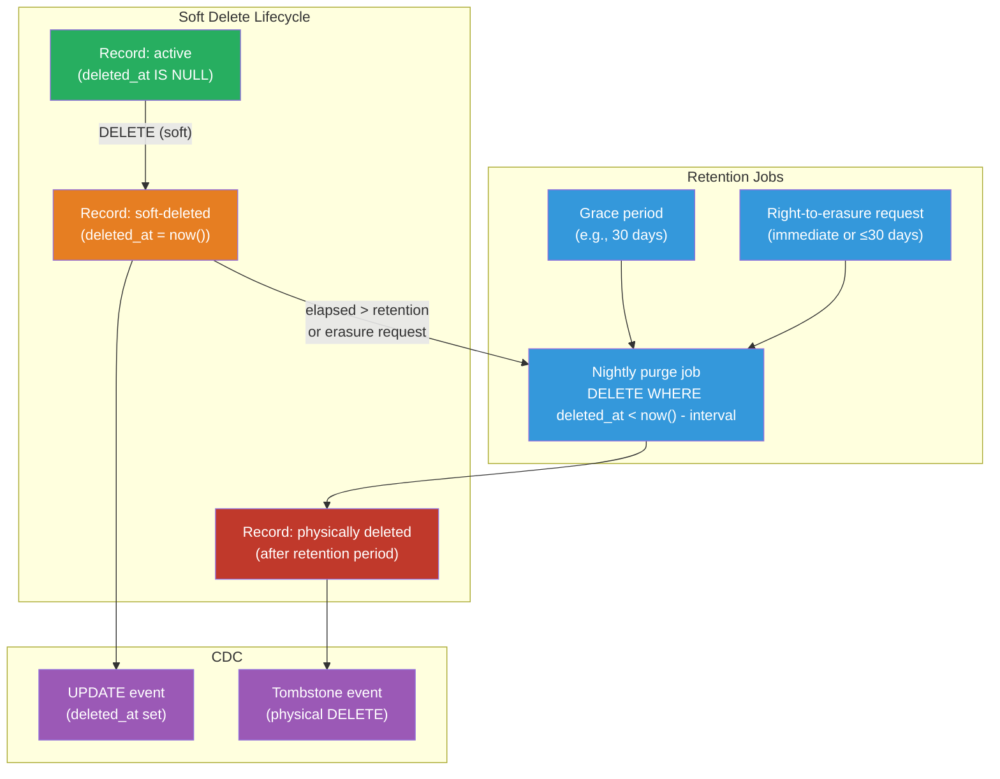

# [BEE-19041] Soft Deletes and Data Retention

:::info
Soft deletion marks records as deleted with a timestamp flag rather than removing them from the database, preserving the audit trail and enabling undo — but the pattern carries hidden costs in query complexity, index bloat, unique constraint breakage, and GDPR compliance that must be managed explicitly.
:::

## Context

The simplest way to delete a database record is `DELETE FROM table WHERE id = ?`. The record is gone, storage is reclaimed, and referential integrity constraints with `ON DELETE CASCADE` or `ON DELETE RESTRICT` fire as expected. For many systems, this is correct.

The alternative — **soft deletion** — adds a `deleted_at` timestamptz column (or a boolean `is_deleted` flag, though timestamps are more useful). A delete operation becomes `UPDATE table SET deleted_at = now() WHERE id = ?`. The row remains in the table; application queries add `WHERE deleted_at IS NULL` to exclude it. From the user's perspective, the record is gone. From the database's perspective, nothing has been removed.

The pattern became popular as systems grew to need audit trails (what changed, when, by whom), undo functionality (accidentally deleted a record — can it be restored?), and soft references across services (a foreign key to a record that no longer physically exists). Rails' `acts_as_paranoid` library (and its successor, the Paranoia gem) standardized the approach in the Ruby ecosystem in the late 2000s. Django has `django-safedelete`; Hibernate has `@Where` and `@SQLDelete` annotations.

The pattern is not without critics. Brandur Leach's widely-read 2021 essay "Soft Deletion Probably Isn't Worth It" (brandur.org) argues that the complexity costs — polluted indexes, missed filter clauses causing data leaks, GDPR conflicts, storage growth — routinely exceed the benefits for most applications. His recommendation: use an explicit audit log table for history, and physically delete the primary record. This position is reasonable and worth internalizing before defaulting to soft deletes.

## Design Thinking

### When Soft Deletes Are the Right Tool

Soft deletes are justified when:
- **Undo is a product requirement**: users can restore a deleted document, message, or record within a grace period.
- **Referential integrity must be preserved across time**: an invoice line item references a product; if the product is deleted, the invoice should still be readable.
- **The delete is a state transition, not a true removal**: "archived" documents, "cancelled" subscriptions, and "suspended" accounts are not really deleted — they have moved to a terminal state. A `status` enum (with `deleted` as a value) or `deleted_at` captures this cleanly.

Soft deletes are the wrong tool when:
- **GDPR/CCPA right-to-erasure applies** and the table contains personal data. A soft-deleted record is still personal data; it must be physically purged within the statutory deadline.
- **The record has no historical value**: temporary tokens, session records, ephemeral events. Physical deletion is simpler.
- **The table is write-heavy and large**: soft deletes accumulate dead rows that bloat indexes and require explicit VACUUM attention.

### The Audit Log Alternative

For use cases where the primary motivation is history, consider an explicit audit log table rather than soft deletes:

```sql
-- Primary table: physically deleted when the record is gone
-- Audit table: append-only, captures every state transition
CREATE TABLE orders_audit (
    id          BIGSERIAL PRIMARY KEY,
    order_id    BIGINT NOT NULL,          -- no FK: order may no longer exist
    action      TEXT NOT NULL,            -- 'created' | 'updated' | 'deleted'
    actor_id    BIGINT,
    occurred_at TIMESTAMPTZ NOT NULL DEFAULT now(),
    snapshot    JSONB NOT NULL            -- full row at the time of change
);
```

This cleanly separates concerns: the primary table is small and fast; the audit log is append-only and can be stored in cold storage or a separate database.

## Best Practices

**MUST add a partial index on `deleted_at IS NULL` for every query that filters active records.** Without a partial index, a query with `WHERE deleted_at IS NULL` scans all rows including soft-deleted ones. On a table where 90% of rows are soft-deleted, this makes full-table scans the effective query plan. A partial index excludes deleted rows entirely:

```sql
-- Only indexes rows where deleted_at IS NULL (active records)
CREATE INDEX idx_users_email_active ON users (email) WHERE deleted_at IS NULL;
CREATE INDEX idx_orders_user_active ON orders (user_id, created_at DESC) WHERE deleted_at IS NULL;
```

**MUST handle unique constraints explicitly when using soft deletes.** A unique index on `email` prevents a user from re-registering after soft-deleting their account — the old row still exists and violates the constraint. Three solutions:

1. **Partial unique index** (preferred for PostgreSQL):
```sql
CREATE UNIQUE INDEX idx_users_email_unique ON users (email) WHERE deleted_at IS NULL;
```
This allows multiple soft-deleted rows with the same email and enforces uniqueness only among active rows.

2. **Nullify the unique field on soft delete**: set `email = NULL` (or move it to a separate `deleted_email` column) when soft-deleting. The original value is gone; re-registration is possible.

3. **Composite unique index including `deleted_at`**: `UNIQUE (email, deleted_at)` does not work cleanly because `NULL != NULL` in SQL — two rows with `deleted_at = NULL` would both be allowed only if the database treats NULL specially. Most databases do: a unique index treats each NULL as distinct.

**MUST implement a physical purge process for tables containing personal data.** Soft-deleted personal data remains personal data under GDPR Article 17 and CCPA. A background job MUST run on a schedule (typically nightly) to physically delete rows that:
- Have `deleted_at` older than the retention period (e.g., 30 days)
- Or were specifically flagged by a right-to-erasure request with no grace period

For erasure requests, physical deletion or anonymization must be completed within 30 days under GDPR.

**SHOULD use a `deleted_at` timestamp rather than a boolean `is_deleted` flag.** A timestamp carries three pieces of information a boolean cannot: that the record is deleted, when it was deleted, and (with a correlated `deleted_by` column) who deleted it. Timestamps also enable time-based retention queries. The only cost is 8 bytes per row.

**MUST filter soft-deleted records at every query site, not just in the ORM default scope.** A common failure mode is relying on an ORM global scope (`default_scope { where(deleted_at: nil) }` in Rails) but writing raw SQL or a direct database client query that bypasses the scope. This leaks soft-deleted records into API responses or admin dashboards. Prefer making the soft-delete filter explicit at every query site, or use a database view that pre-applies the filter:

```sql
-- View presents only active records; raw queries against this view are safe
CREATE VIEW active_users AS
  SELECT * FROM users WHERE deleted_at IS NULL;
```

**SHOULD emit a hard-delete event (tombstone) when physically purging soft-deleted records** if other systems subscribe to change events via CDC. Debezium and similar CDC tools emit a tombstone event (a message with `null` value and the deleted row's key) when a row is physically deleted. Downstream Kafka consumers must handle this tombstone to remove the record from their materialized views. Soft deletes followed by a delayed physical purge produce two events: the `UPDATE` setting `deleted_at`, then the tombstone on purge.

**SHOULD run `VACUUM` more aggressively on tables with high soft-delete churn.** Physical deletion and soft-delete updates both produce dead tuples. On tables where many rows are soft-deleted and later purged, the autovacuum default thresholds (20% + 50 rows) may cause bloat to grow before vacuum fires. Tune per-table autovacuum settings:

```sql
ALTER TABLE orders SET (
    autovacuum_vacuum_scale_factor = 0.01,   -- vacuum when 1% of rows are dead (vs default 20%)
    autovacuum_vacuum_threshold = 100
);
```

## Visual



## Example

**Schema with partial indexes and partial unique constraint:**

```sql
CREATE TABLE users (
    id          BIGSERIAL PRIMARY KEY,
    email       TEXT NOT NULL,
    name        TEXT NOT NULL,
    deleted_at  TIMESTAMPTZ,
    deleted_by  BIGINT REFERENCES users(id),
    created_at  TIMESTAMPTZ NOT NULL DEFAULT now()
);

-- Unique email among active users only; allows re-registration after soft delete
CREATE UNIQUE INDEX idx_users_email_active
    ON users (email)
    WHERE deleted_at IS NULL;

-- Index for listing active users by creation date (excludes deleted rows)
CREATE INDEX idx_users_created_active
    ON users (created_at DESC)
    WHERE deleted_at IS NULL;
```

**Soft delete and restore operations:**

```python
from datetime import datetime, timezone
import psycopg2

def soft_delete_user(conn, user_id: int, deleted_by: int):
    """Mark a user as deleted; does not remove the row."""
    with conn.cursor() as cur:
        cur.execute(
            "UPDATE users SET deleted_at = now(), deleted_by = %s WHERE id = %s AND deleted_at IS NULL",
            (deleted_by, user_id)
        )
        if cur.rowcount == 0:
            raise ValueError(f"User {user_id} not found or already deleted")
    conn.commit()


def restore_user(conn, user_id: int):
    """Undo a soft delete within the grace period."""
    with conn.cursor() as cur:
        cur.execute(
            "UPDATE users SET deleted_at = NULL, deleted_by = NULL WHERE id = %s AND deleted_at IS NOT NULL",
            (user_id,)
        )
        if cur.rowcount == 0:
            raise ValueError(f"User {user_id} not found or not deleted")
    conn.commit()


def purge_expired_users(conn, retention_days: int = 30):
    """
    Physically delete users whose soft-delete is older than retention_days.
    Run as a nightly job. Produces a tombstone CDC event for each deleted row.
    """
    with conn.cursor() as cur:
        cur.execute(
            """DELETE FROM users
               WHERE deleted_at IS NOT NULL
                 AND deleted_at < now() - (%s || ' days')::INTERVAL
               RETURNING id""",
            (retention_days,)
        )
        purged_ids = [row[0] for row in cur.fetchall()]
    conn.commit()
    return purged_ids


def erasure_request(conn, user_id: int):
    """
    GDPR right-to-erasure: anonymize or physically delete immediately.
    Anonymization preserves aggregate statistics; physical delete removes all traces.
    """
    with conn.cursor() as cur:
        # Option A: anonymize (keep the row for referential integrity, scrub PII)
        cur.execute(
            """UPDATE users
               SET email = 'anonymized-' || id || '@deleted.invalid',
                   name  = 'Deleted User',
                   deleted_at = COALESCE(deleted_at, now())
               WHERE id = %s""",
            (user_id,)
        )
        # Option B: physical delete (uncomment if referential integrity allows)
        # cur.execute("DELETE FROM users WHERE id = %s", (user_id,))
    conn.commit()
```

## Related BEEs

- [BEE-7005](../data-modeling/designing-for-time-series-and-audit-data.md) -- Designing for Time-Series and Audit Data: the audit log alternative to soft deletes uses an append-only event table with the same design principles
- [BEE-19018](change-data-capture.md) -- Change Data Capture: soft deletes produce UPDATE events in CDC pipelines; physical purges produce tombstone events; downstream consumers must handle both
- [BEE-19038](distributed-job-scheduling.md) -- Distributed Job Scheduling: the nightly purge job and right-to-erasure fulfillment job are canonical examples of scheduled background jobs requiring idempotency and dead-letter handling
- [BEE-6007](../data-storage/database-migrations.md) -- Database Migrations: adding a `deleted_at` column to an existing table is a zero-downtime-compatible migration (nullable column, no default — safe in all major databases)
- [BEE-19039](zero-downtime-schema-migrations.md) -- Zero-Downtime Schema Migrations: the expand-contract pattern applies when converting a hard-delete table to soft-delete on a large production table

## References

- [Soft Deletion Probably Isn't Worth It -- Brandur Leach (2021)](https://brandur.org/soft-deletion)
- [Partial Indexes -- PostgreSQL Documentation](https://www.postgresql.org/docs/current/indexes-partial.html)
- [Article 17: Right to Erasure -- GDPR (EU) 2016/679](https://gdpr-info.eu/art-17-gdpr/)
- [Paranoia: Rails Soft Delete -- GitHub (rubysherpas)](https://github.com/rubysherpas/paranoia)
- [Tombstone Events -- Debezium Documentation](https://debezium.io/documentation/reference/stable/transformations/event-changes.html)
- [django-safedelete -- Read the Docs](https://django-safedelete.readthedocs.io/)
