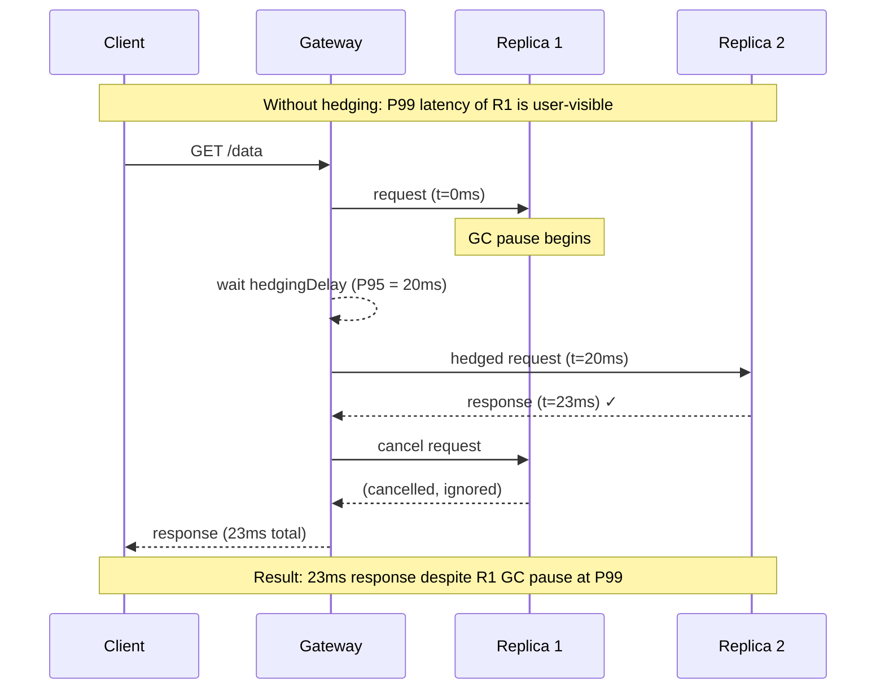

# [BEE-19032] Tail Latency and Hedged Requests

:::info
In a large distributed system, the slowest request in a fan-out call — not the average — determines the user-visible response time. Jeff Dean and Luiz André Barroso's 2013 paper "The Tail at Scale" proved that optimizing mean latency is insufficient: at 99th percentile, a single slow sub-call will poison the response of almost every user.
:::

## Context

In 2013, Jeff Dean and Luiz André Barroso at Google published "The Tail at Scale" (Communications of the ACM, February 2013) — a paper that fundamentally changed how large-scale systems are designed. The central observation: in any large distributed system, a small fraction of requests will be served slowly due to causes beyond the application's control: garbage collection pauses, OS scheduling jitter, background daemons competing for disk, memory bandwidth contention, or network retransmits. At low traffic, these slow requests are a minor nuisance. At scale, they become a structural problem.

The amplification effect arises from **fan-out**: a single user request often fans out to dozens or hundreds of sub-calls. If the P99 latency of any individual sub-call is 1 second, and a response requires 100 such sub-calls, then roughly 63% of responses will experience at least one sub-call at P99 or worse — even if the underlying service is healthy and fast at P50. The math: probability of at least one slow sub-call = 1 − (0.99)^100 ≈ 0.63. For 200 sub-calls, it's 87%. The tail becomes the median of the whole system.

Dean and Barroso quantified this in Google BigTable: reading 1,000 key-value pairs required fan-out across tablet servers, and P99.9 latency for that read was 1,800ms — even though individual tablet server reads completed in a few milliseconds. By sending a **hedged request** (a duplicate request to a second server after a brief delay) and using whichever response arrived first, P99.9 dropped to 74ms with only a 2% increase in total requests.

The paper's contribution was naming and systematizing a class of techniques Google engineers had discovered independently: **tail-tolerant** design. This approach treats tail latency not as a bug to fix but as an environmental condition to route around.

## Design Thinking

### Percentile Amplification

Mean and P95 latency measurements hide the problem. The relevant question for a fan-out system is: "What fraction of responses require all sub-calls to be fast?" The answer is a function of the number of sub-calls (n) and the slow-request rate (p):

```
P(at least one slow sub-call) = 1 − (1 − p)^n
```

At P99 (p = 0.01) and n = 100: 63% of top-level requests are affected.
At P99.9 (p = 0.001) and n = 1,000: 63% again.
At P95 (p = 0.05) and n = 100: 99.4% of top-level requests are affected.

The implication: **you must measure and optimize the tail, not the mean**. A system with excellent P50 but high P99 will deliver poor user experience at scale because the P99 is what most users see most of the time in a fan-out architecture.

### Root Causes of Tail Latency

Tail latency is not primarily caused by application bugs. The causes Dean and Barroso identified are largely environmental and shared:

- **Garbage collection pauses**: JVM, Go, and other managed runtimes stop the world. A 100ms GC pause is rare per-instance, but with 1,000 instances, expected frequency is every 100ms × 1,000 = once per minute at the fleet level.
- **Background maintenance**: log compaction in RocksDB, page eviction from buffer pools, checkpoint flushes in Postgres, index rebuilds.
- **Queue buildup**: a burst of requests fills a queue; the queue drains linearly; requests at the back wait for all earlier requests to complete.
- **Power and thermal limits**: a CPU near its thermal envelope will throttle, adding latency to a random subset of requests.
- **Network retransmits**: TCP retransmit timer fires after 200ms by default (RTO_MIN). A single dropped packet causes a 200ms stall.

None of these causes are fixable by the application in isolation. Tail-tolerant techniques work around them rather than eliminating them.

### The Hedging Trade-off

Hedged requests consume extra resources: each hedge is an additional request to a replica. The hedge costs approximately 1/(1 − utilization) × (hedging rate) extra work. At low utilization this is negligible; at high utilization it can create a feedback loop where hedging increases load, increasing tail latency, increasing the hedge rate, further increasing load. **Hedging must be rate-limited and disabled when the system is overloaded.**

The optimal hedge delay is the P50 or P75 latency of the sub-call. Hedging at P50 means half of all sub-calls will be hedged — too aggressive. Hedging at P95 means only 5% of sub-calls get hedged — appropriate for most services. The gRPC hedging spec defaults to sending the hedge after `hedgingDelay` duration, which SHOULD be set near P95 of the target service's observed latency.

## Best Practices

**MUST measure P99 and P99.9 latency at every service boundary, not just P50 and P95.** Dashboards that show only mean and P95 latency will not reveal tail amplification problems until they manifest as visible user degradation. Instrument all outbound calls with histograms (Prometheus `histogram_quantile`, or HdrHistogram for in-process measurement) and alert on P99 increases independently of mean latency.

**MUST NOT use timeouts as the primary tail latency strategy.** A timeout that fires at P99.5 will kill 0.5% of requests — those are real users whose requests fail. Hedged requests tolerate the slow path without failing it: the user gets the response from the fast replica, and the slow replica's response is discarded when it eventually arrives.

**SHOULD use hedged requests for read-path calls that are idempotent and have replicated backends.** The hedge sends a second request to a different replica after a configurable delay. MUST NOT hedge non-idempotent writes: a hedged `POST /order` creates two orders. Suitable candidates: reads from replicated databases or caches, search queries, read-heavy microservice calls.

**SHOULD cancel the slower request once a response is received.** The hedge consumes a connection and processing resources on the target server. Cancellation via HTTP request cancellation (context cancellation in Go, `AbortController` in browsers, connection close) or gRPC `cancel()` releases those resources immediately. Without cancellation, the "losing" request continues consuming server CPU through completion.

**SHOULD bound queue lengths explicitly.** An unbounded queue converts a latency spike into a latency cascade: a burst fills the queue, new requests join the back of a long queue, all requests in the burst experience elevated latency proportional to the burst size. Use bounded queues with fail-fast on full (HTTP 503 or 429) rather than unbounded queues. This converts a latency tail into an error tail, which is more visible, more alertable, and easier to handle upstream (retry with exponential backoff).

**SHOULD separate fast and slow work into different queues.** If a service handles both quick reads (1ms) and slow background scans (100ms), mixing them in one queue means quick reads wait behind slow scans when the queue is busy. Dedicated queues for different request classes prevent head-of-line blocking: fast work always has a queue with low depth and low expected wait.

**MAY use micro-partitioning to reduce hotspot exposure.** Assign data to many more virtual shards than physical nodes (e.g., 1,000 virtual shards across 50 nodes). When a node becomes slow, consistent hashing can migrate virtual shards to other nodes in seconds, limiting the blast radius of a slow node to the fraction of virtual shards it currently hosts.

## Visual



## Example

**gRPC hedging policy (service config JSON):**

```json
{
  "methodConfig": [{
    "name": [{"service": "product.ProductService", "method": "GetProduct"}],
    "hedgingPolicy": {
      "maxAttempts": 3,
      "hedgingDelay": "20ms",
      "nonFatalStatusCodes": ["UNAVAILABLE", "RESOURCE_EXHAUSTED"]
    }
  }]
}
```

`hedgingDelay` should be set to approximately the P95 latency of the target method. `maxAttempts` of 3 means: send request 1 immediately, request 2 after 20ms, request 3 after another 20ms — then wait for the first success response and cancel the others.

**Application-layer hedged request in Go:**

```go
import (
    "context"
    "time"
)

// HedgedGet sends a request and, after hedgeDelay, sends a parallel request
// to a second endpoint. Returns the first successful response.
// MUST only be used with idempotent, read-only endpoints.
func HedgedGet(ctx context.Context, primary, secondary string, hedgeDelay time.Duration) ([]byte, error) {
    type result struct {
        body []byte
        err  error
    }

    ch := make(chan result, 2) // buffered: both goroutines can send without blocking

    // Primary request — sent immediately
    ctx1, cancel1 := context.WithCancel(ctx)
    defer cancel1()
    go func() {
        body, err := fetch(ctx1, primary)
        ch <- result{body, err}
    }()

    // Hedge — sent after delay. If primary responds first, ctx2 is cancelled.
    ctx2, cancel2 := context.WithCancel(ctx)
    defer cancel2()
    go func() {
        select {
        case <-time.After(hedgeDelay):
            body, err := fetch(ctx2, secondary)
            ch <- result{body, err}
        case <-ctx2.Done():
            // Primary already responded; skip the hedge
        }
    }()

    // Return first successful response; cancel the other
    for i := 0; i < 2; i++ {
        r := <-ch
        if r.err == nil {
            cancel1()  // cancel whichever is still running
            cancel2()
            return r.body, nil
        }
    }
    return nil, fmt.Errorf("both requests failed")
}
```

**Bounded work queue with rejection:**

```python
import queue
import threading
from concurrent.futures import ThreadPoolExecutor

class BoundedWorkerPool:
    """
    Worker pool with bounded queue. Requests beyond MAX_QUEUE_DEPTH
    fail immediately with a 503 rather than queuing and adding latency.
    Converts latency tail into an error rate, which is easier to handle.
    """
    MAX_QUEUE_DEPTH = 100  # tune based on P99 acceptable latency / task duration

    def __init__(self, workers: int):
        self._pool = ThreadPoolExecutor(max_workers=workers)
        self._semaphore = threading.BoundedSemaphore(workers + self.MAX_QUEUE_DEPTH)

    def submit(self, fn, *args, **kwargs):
        if not self._semaphore.acquire(blocking=False):
            raise QueueFullError("Queue depth exceeded — fast-fail")
        
        def wrapped():
            try:
                return fn(*args, **kwargs)
            finally:
                self._semaphore.release()
        
        return self._pool.submit(wrapped)
```

## Related BEEs

- [BEE-12002](../resilience/retry-strategies-and-exponential-backoff.md) -- Retry Strategies and Exponential Backoff: hedged requests and retries are complementary; retries tolerate total failures, hedged requests tolerate slow responses; hedging MUST be rate-limited the same way retries are
- [BEE-12003](../resilience/timeouts-and-deadlines.md) -- Timeouts and Deadlines: the hedge delay is a soft timeout that triggers a parallel attempt rather than failure; hard timeouts on the outer request still bound total latency
- [BEE-10006](../messaging/backpressure-and-flow-control.md) -- Backpressure and Flow Control: bounded queues and fast-fail on queue full are the server-side complement to hedging on the client side; both are required for a tail-tolerant system
- [BEE-13004](../performance-scalability/profiling-and-bottleneck-identification.md) -- Profiling and Bottleneck Identification: tail latency root-cause analysis requires flame graphs, GC pause metrics, and per-instance latency histograms rather than aggregate means
- [BEE-12001](../resilience/circuit-breaker-pattern.md) -- Circuit Breaker Pattern: a circuit breaker on a consistently slow replica is the escalation path when hedging alone cannot compensate for a degraded node

## References

- [The Tail at Scale -- Dean & Barroso, Communications of the ACM, February 2013](https://research.google/pubs/the-tail-at-scale/)
- [gRPC Request Hedging Guide -- gRPC Documentation](https://grpc.io/docs/guides/request-hedging/)
- [When to Hedge in Interactive Services -- Primorac et al., USENIX NSDI 2021](https://www.usenix.org/conference/nsdi21/presentation/primorac)
- [Managing Tail Latency in Datacenter-Scale File Systems -- Microsoft Research, EuroSys 2019](https://dl.acm.org/doi/10.1145/3302424.3303973)
- [Latency at Every Percentile -- Marc Brooker, Amazon (2021)](https://brooker.co.za/blog/2021/04/19/latency.html)
- [How Global Payments Inc. Reduced Tail Latency Using Request Hedging with Amazon DynamoDB -- AWS Database Blog](https://aws.amazon.com/blogs/database/how-global-payments-inc-improved-their-tail-latency-using-request-hedging-with-amazon-dynamodb/)
