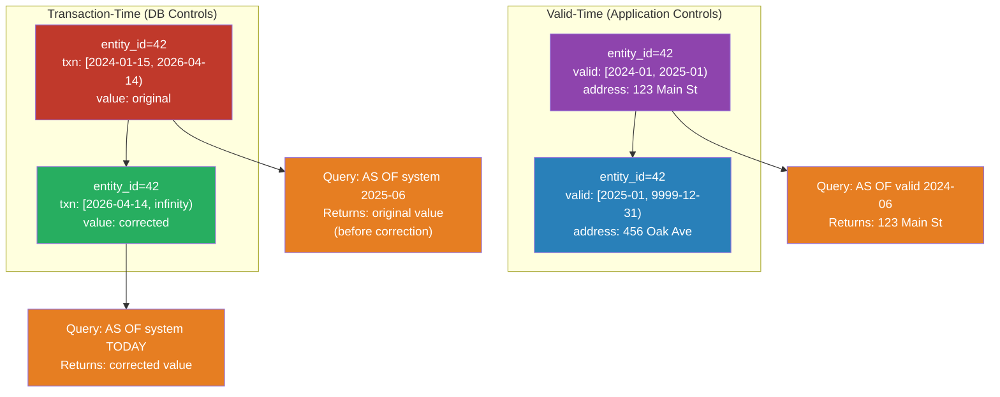

# [BEE-19058] Temporal Data Modeling

:::info
Temporal data modeling tracks not just the current state of an entity but also its history — both when a fact was true in the real world (valid time) and when it was recorded in the database (transaction time). Systems that need to answer "what did we believe on this date?" require both dimensions.
:::

## Context

Most database rows describe the present: the current address, the current price, the current account balance. When the value changes, the row is overwritten. This is sufficient until an auditor asks "what was the customer's address when the invoice was issued in March?" or a compliance team asks "what did our system report last quarter before the retroactive correction?"

The problem has two independent axes:

**Valid time**: when the fact was true in the real world. A price change is valid from a future date; an insurance policy coverage window is an application-time period.

**Transaction time**: when the system recorded the fact. Retroactive corrections change what was true in the past but are recorded at a later system time. The database reflects the current understanding of history, not necessarily the original recording.

**Bi-temporal modeling** tracks both. The SQL:2011 standard (ISO/IEC 9075:2011) formalized this with `PERIOD FOR` syntax and `WITH SYSTEM VERSIONING`. MariaDB 10.3+ implements system-versioned tables natively; DB2 supports both periods. PostgreSQL lacks native SQL:2011 support but provides range types and exclusion constraints that implement the same semantics manually.

Temporal data modeling addresses what audit logs cannot: audit logs record events, but they do not make historical queries easy. A temporal table answers "what was the state at time T?" in a single indexed query.

## Design Thinking

### Valid Time vs Transaction Time

| Dimension | Name | Who controls it | Example |
|---|---|---|---|
| When true in reality | Valid time / Application time | Application | Price effective 2026-06-01, insurance covers 2024–2026 |
| When recorded in DB | Transaction time / System time | Database | Correction entered 2026-04-14 for a March fact |

A **valid-time table** adds `valid_from` and `valid_to` columns. Application code sets them. Useful for scheduling, versioning, and business-defined time windows.

A **transaction-time table** adds system-managed start/end timestamps, auto-populated on write. Useful for audit trails and compliance — you can reconstruct what the system believed at any past moment.

A **bi-temporal table** has both. This is the most general form and handles retroactive corrections cleanly: a fact can have a valid period in the past, recorded at a transaction time in the present.

### SCD Type 2 Pattern

Slowly Changing Dimension (SCD) Type 2 is the most widely deployed temporal pattern: track the full history of an entity by adding a new row for each change instead of overwriting.

Conventions:
- `valid_from` — inclusive lower bound of the validity interval
- `valid_to` — exclusive upper bound; sentinel value `9999-12-31` (or `infinity`) marks the current row
- Exclusive upper bound (`valid_to > :ts`, not `>=`) ensures point-in-time queries work without ambiguity at boundaries

The exclusive-upper-bound convention (`[valid_from, valid_to)`) is important: it matches how PostgreSQL range types work canonically, avoids double-counting rows at boundary timestamps, and simplifies the "close prior row, open new row" update pattern.

### Range Types and Exclusion Constraints

PostgreSQL's `tstzrange` type encodes the validity interval as a first-class value. This enables:

- **GiST index** on the range column for overlap queries
- **Exclusion constraint** using the `&&` (overlaps) operator to enforce no-overlap at the database level
- Built-in operators: `@>` (contains a point), `<@` (is contained by), `-|-` (adjacent), `&&` (overlaps)

Without an exclusion constraint, application bugs can insert overlapping rows for the same entity, corrupting historical queries silently.

### Bi-Temporal Modeling

For retroactive corrections, both dimensions are required:

```
entity 42:
  row A: valid [2024-01, 2025-01), txn [2024-01-15, 2026-04-14)   ← original recording
  row B: valid [2024-01, 2025-01), txn [2026-04-14, infinity)      ← corrected version
```

Row A reflects what the system believed from Jan 15, 2024 until the correction on Apr 14, 2026. Row B reflects the corrected understanding of the same real-world period. A query "as of system time 2025-06-01" returns row A; a query today returns row B.

## Best Practices

**MUST use exclusive upper bound semantics (`[)`) for valid-time intervals.** The interval `[valid_from, valid_to)` means valid_to is not included. Use `WHERE valid_from <= :ts AND valid_to > :ts` for "as of" queries. Mixing inclusive and exclusive bounds across a schema causes subtle off-by-one errors and makes range operators unreliable.

**MUST use a sentinel far-future date (e.g., `9999-12-31`) rather than NULL for open-ended current rows.** NULL complicates BETWEEN queries, cannot be indexed efficiently with B-tree indexes, and prevents the use of range exclusion constraints. A sentinel date makes "current row" queries consistent with historical queries.

**MUST enforce no-overlap with an exclusion constraint on temporal primary keys.** A composite `(entity_id, valid_period)` primary key prevents duplicate rows, but a regular unique constraint does not prevent overlapping ranges. Use `EXCLUDE USING GIST (entity_id WITH =, valid_period WITH &&)` to prevent overlap at the database layer.

**MUST create a GiST index on range columns used in overlap or containment queries.** Without a GiST index, `&&` and `@>` operations on range columns are sequential scans. Add the index at table creation.

**SHOULD model valid time separately from transaction time unless retroactive corrections are a requirement.** Bi-temporal tables add significant complexity: every update becomes an insert, queries require two time dimensions, and reporting is harder to reason about. If corrections are always applied going forward, valid-time alone is sufficient.

**SHOULD close the prior row atomically with opening the new row.** The update that sets `valid_to = :new_valid_from` on the current row and the insert of the new row MUST be in the same transaction. A failure between the two leaves the table in a state where the current row is incorrectly closed or an open-ended overlap exists.

**MAY use PostgreSQL range types (`daterange`, `tstzrange`) instead of two separate date/timestamp columns.** Range types reduce the number of columns, enable GiST indexes and exclusion constraints with less boilerplate, and make range arithmetic (overlap, containment, adjacency) expressible with built-in operators rather than compound WHERE conditions.

## Visual



## Example

**Valid-time table using `daterange` with exclusion constraint:**

```sql
-- Valid-time customer addresses: track address history
CREATE TABLE customer_addresses (
    customer_id  BIGINT    NOT NULL,
    address      TEXT      NOT NULL,
    -- daterange uses [) semantics by default; upper bound is exclusive
    valid_period DATERANGE NOT NULL,

    -- Prevent overlapping validity periods for the same customer
    EXCLUDE USING GIST (
        customer_id WITH =,
        valid_period WITH &&
    )
);

-- GiST index: required for the exclusion constraint and overlap queries
-- PostgreSQL creates this automatically for EXCLUDE USING GIST

-- Sentinel far-future date marks the current row
INSERT INTO customer_addresses VALUES
    (42, '123 Main St', '[2024-01-01, 2025-01-01)'),
    (42, '456 Oak Ave', '[2025-01-01, 9999-12-31)');

-- "As of" query: address on a specific date
SELECT address
FROM customer_addresses
WHERE customer_id = 42
  AND valid_period @> '2024-06-15'::date;
-- Returns: 123 Main St

-- Current address (as of today)
SELECT address
FROM customer_addresses
WHERE customer_id = 42
  AND valid_period @> current_date;
-- Returns: 456 Oak Ave

-- Full address history for a customer
SELECT lower(valid_period) AS valid_from,
       upper(valid_period) AS valid_to,
       address
FROM customer_addresses
WHERE customer_id = 42
ORDER BY valid_period;
```

**Atomic "close prior, open new" update pattern:**

```python
# db.py — update customer address with valid-time tracking
from datetime import date
import psycopg

def update_customer_address(
    pool, customer_id: int, new_address: str, effective_date: date
) -> None:
    """Replace the current address, closing the prior row at effective_date."""
    with pool.connection() as conn:
        with conn.transaction():
            # Step 1: close the current open row at effective_date
            # valid_period's upper is exclusive, so '[today, infinity)' becomes '[today, effective_date)'
            conn.execute(
                """
                UPDATE customer_addresses
                SET valid_period = daterange(lower(valid_period), %s)
                WHERE customer_id = %s
                  AND valid_period @> current_date
                """,
                (effective_date, customer_id),
            )

            # Step 2: insert the new row starting at effective_date
            conn.execute(
                """
                INSERT INTO customer_addresses (customer_id, address, valid_period)
                VALUES (%s, %s, daterange(%s, '9999-12-31'))
                """,
                (customer_id, new_address, effective_date),
            )

# Usage: effective immediately
update_customer_address(pool, 42, "789 Pine Rd", date.today())

# Usage: scheduled future change
update_customer_address(pool, 42, "789 Pine Rd", date(2026, 7, 1))
```

**Bi-temporal table for retroactive corrections:**

```sql
-- Bi-temporal: both valid time (application) and transaction time (system)
CREATE TABLE account_balances (
    account_id   BIGINT    NOT NULL,
    balance      NUMERIC   NOT NULL,
    -- Valid time: when the balance was true in reality
    valid_period DATERANGE NOT NULL,
    -- Transaction time: when we recorded this (system-managed)
    txn_period   TSTZRANGE NOT NULL DEFAULT tstzrange(now(), 'infinity'),

    -- No two rows for the same account can overlap in both time dimensions
    EXCLUDE USING GIST (
        account_id WITH =,
        valid_period WITH &&,
        txn_period WITH &&
    )
);

-- "As of valid 2025-06-01, as of system 2025-01-01" (before a retroactive correction)
SELECT balance
FROM account_balances
WHERE account_id = 100
  AND valid_period @> '2025-06-01'::date
  AND txn_period @> '2025-01-01 00:00:00+00'::timestamptz;

-- Current understanding of the current balance
SELECT balance
FROM account_balances
WHERE account_id = 100
  AND valid_period @> current_date
  AND txn_period @> now();
```

**MariaDB native system-versioned table (for reference):**

```sql
-- MariaDB 10.3+: the database manages transaction time automatically
CREATE TABLE customer_addresses (
    customer_id BIGINT NOT NULL,
    address     TEXT   NOT NULL,
    PRIMARY KEY (customer_id)
) WITH SYSTEM VERSIONING;

-- MariaDB maintains row_start and row_end timestamps automatically

-- "As of system time" query
SELECT address
FROM customer_addresses
FOR SYSTEM_TIME AS OF TIMESTAMP '2025-06-01 00:00:00'
WHERE customer_id = 42;

-- Full history of a customer's rows
SELECT customer_id, address, ROW_START, ROW_END
FROM customer_addresses
FOR SYSTEM_TIME ALL
WHERE customer_id = 42;
```

## Implementation Notes

**Indexing strategy**: A GiST index on `(valid_period)` supports `@>` containment queries. For bi-temporal queries, index `valid_period` and `txn_period` separately or use a composite GiST index if queries filter on both simultaneously. B-tree indexes on the lower bound of the range column (`lower(valid_period)`) help order-by-date queries.

**ORM support**: Most ORMs do not understand temporal semantics natively. Temporal insert/update operations require raw SQL or a custom mixin that implements the close-prior, open-new pattern. Libraries like `temporaldb` (Python) or `bitemporal_activerecord` (Rails) exist but are not widely adopted.

**Temporal foreign keys**: Standard foreign keys do not validate temporal overlap. A child row referencing a parent that was valid only in `[2024, 2025)` can still insert with a `valid_period` of `[2025, 2026)` — the FK validates only that the parent ID exists. Enforce this with application-layer validation or database triggers.

**Partitioning**: For large temporal tables, range-partition by `lower(valid_period)` or by year to keep historical queries fast. Current-state queries always hit the latest partition; historical queries target older partitions efficiently.

**PostgreSQL 18**: PostgreSQL 18 introduced `WITHOUT OVERLAPS` syntax for temporal primary keys and temporal constraints, reducing the boilerplate needed for exclusion constraints. Syntax: `PRIMARY KEY (entity_id, valid_period WITHOUT OVERLAPS)`.

## Related BEEs

- [BEE-7005](../data-modeling/designing-for-time-series-and-audit-data.md) -- Designing for Time-Series and Audit Data: covers append-only event tables and audit logs; temporal data modeling is complementary — both preserve history, but temporal tables optimize for point-in-time queries
- [BEE-7003](../data-modeling/schema-evolution-and-backward-compatibility.md) -- Schema Evolution and Backward Compatibility: adding valid-time columns to an existing table is a schema evolution; sentinel values for valid_to must be chosen before the first row is inserted
- [BEE-6007](../data-storage/database-migrations.md) -- Database Migrations: temporal tables require careful migration strategy; retroactively adding valid_from/valid_to to existing tables requires backfilling with historical data or a default epoch

## References

- [Range Types — PostgreSQL Documentation](https://www.postgresql.org/docs/current/rangetypes.html)
- [SQL:2011 — Wikipedia](https://en.wikipedia.org/wiki/SQL:2011)
- [Temporal Tables — PostgreSQL Wiki](https://wiki.postgresql.org/wiki/SQL2011Temporal)
- [System-Versioned Tables — MariaDB Documentation](https://mariadb.com/docs/server/reference/sql-structure/temporal-tables/system-versioned-tables)
- [Slowly Changing Dimension — Wikipedia](https://en.wikipedia.org/wiki/Slowly_changing_dimension)
