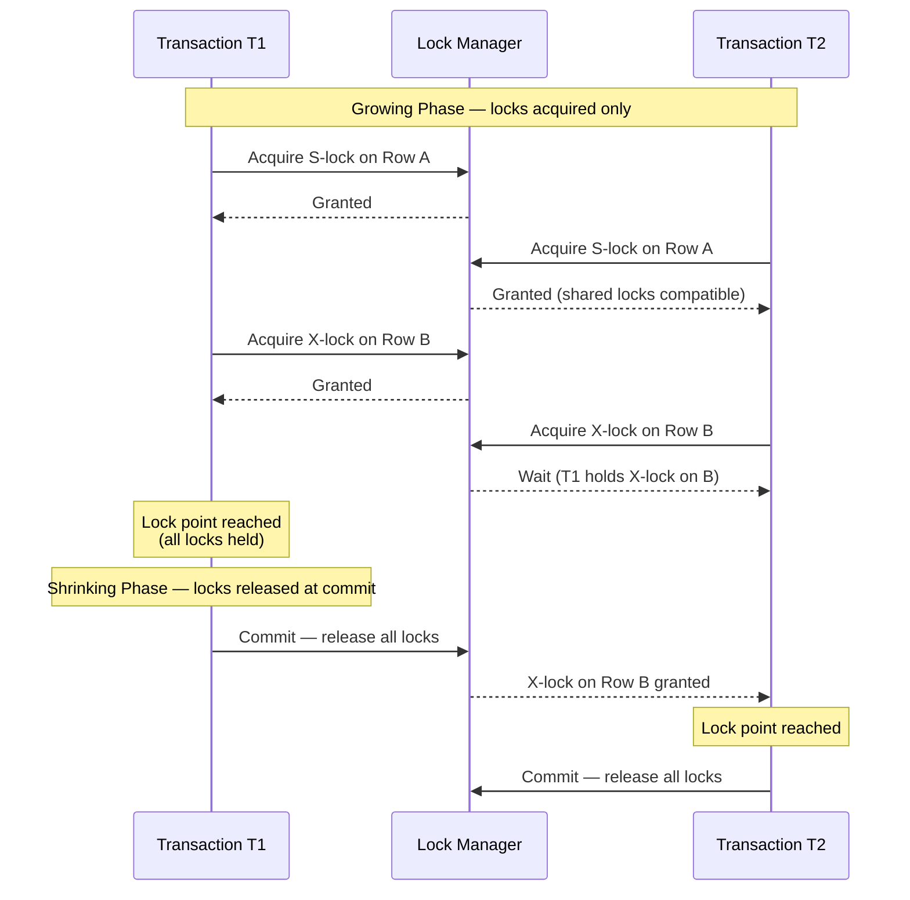

# [BEE-440] Two-Phase Locking

:::info
Two-Phase Locking (2PL) guarantees serializability by enforcing a simple rule: a transaction may not acquire any new lock after releasing its first lock — separating execution into a growing phase (locks only acquired) and a shrinking phase (locks only released) — making it the classical proof that pessimistic concurrency control can produce correct concurrent schedules.
:::

## Context

The theoretical foundation of database locking was established by Jim Gray, Raymond Lorie, Gianfranco Putzolu, and Irving Traiger in "Granularity of Locks and Degrees of Consistency in a Shared Data Base" (IFIP Working Conference on Modelling in Data Base Management Systems, 1976). That paper introduced the lock hierarchy (database → table → page → row → field), the compatibility matrix of shared and exclusive locks, and the observation that serializability follows from the Two-Phase Locking discipline. Philip Bernstein, Vassos Hadzilacos, and Nathan Goodman formalized and extended this in "Concurrency Control and Recovery in Database Systems" (Addison-Wesley, 1987), the canonical textbook on the subject, freely available from Microsoft Research. Jim Gray and Andreas Reuter's "Transaction Processing: Concepts and Techniques" (Morgan Kaufmann, 1992) translated this theory into the engineering practice that commercial databases adopted through the 1990s and 2000s.

The central problem 2PL solves is **write-write and read-write conflict ordering**. When two transactions concurrently access the same data item, their operations must be ordered in a way that is equivalent to some serial execution. Without a protocol to enforce ordering, a transaction can read data written by another that has not yet committed (dirty read), re-read data that was changed between reads (non-repeatable read), or find new rows that match a query predicate on a second execution (phantom read). 2PL prevents these anomalies by forcing conflicting operations to wait: a transaction that holds a shared (read) lock blocks writers; a transaction that holds an exclusive (write) lock blocks both readers and writers.

The proof that 2PL guarantees conflict serializability follows from the **lock point**: the moment when a transaction has acquired all its locks and holds them simultaneously. The lock points of all transactions in a schedule define a serial order — a transaction that reaches its lock point before another defines a point-in-time precedence. If the lock point order is T1, T2, T3, then the schedule is equivalent to executing T1, then T2, then T3 serially. Because 2PL's two-phase discipline forces each transaction to hold all its locks simultaneously at some point, a valid lock-point ordering always exists, and the schedule is serializable.

In practice, modern databases use **Strict 2PL** (also called Strong Strict 2PL or SS2PL), which holds all locks until the transaction commits or aborts. Basic 2PL can release read locks before commit, but doing so allows cascading aborts: if T1 releases a read lock and T2 then writes and commits, and T1 subsequently aborts, T2's committed write was predicated on T1's read — an inconsistency. Strict 2PL prevents this by keeping all locks held until the transaction outcome is final. PostgreSQL, MySQL InnoDB, Oracle, and SQL Server all implement Strict 2PL as their default locking protocol.

## Design Thinking

**2PL and MVCC solve different halves of the concurrency problem.** 2PL's read locks block concurrent writers, and write locks block concurrent readers. Multi-Version Concurrency Control (MVCC) eliminates read-write blocking by maintaining multiple versions of each row: readers see a consistent snapshot from their transaction start time and never acquire locks; writers create new versions without invalidating old ones. Most production databases (PostgreSQL, MySQL InnoDB, Oracle) use MVCC for read-write conflicts and 2PL-style locking only for write-write conflicts. The result is that SELECT statements never block INSERT/UPDATE/DELETE and vice versa — a key operational property for read-heavy workloads.

**Lock granularity is a throughput-isolation tradeoff.** A table-level lock is cheap to acquire and hold but serializes all concurrent transactions on that table. A row-level lock allows high concurrency but requires more memory and more lock manager overhead. Database lock hierarchies allow mixed granularity: a transaction may hold an intent lock on the table (announcing intent to lock rows within it) and row-level locks on the specific rows it accesses. Escalation from row locks to table locks may occur when a transaction holds too many row locks, trading concurrency for reduced overhead. Choosing granularity for application-level locking (SELECT ... FOR UPDATE vs LOCK TABLE) should be driven by the contention profile: high contention on a small set of rows favors row locks; bulk operations on entire tables may be faster with table locks to avoid per-row overhead.

**Deadlock is inherent to 2PL and must be designed for, not just handled.** Any system using 2PL with more than one transaction and more than one lockable resource can deadlock. The practical mitigations — consistent lock ordering, short transactions, and explicit timeout budgets — reduce frequency but do not eliminate it. Application code that calls the database MUST handle transaction rollback and retry. ORM frameworks that silently retry on deadlock can mask cascading retry storms; retry logic should include jitter and a maximum attempt count.

## Best Practices

**Order lock acquisition consistently across transactions to prevent deadlocks.** The most common deadlock pattern is T1 locking A then B while T2 locks B then A. If all transactions that access both A and B always lock in alphabetical or numeric order (A before B), the circular wait cannot form. For database rows, this means always updating rows in primary-key order within a transaction. For application-level resources, define a global ordering and document it.

**Keep transactions short to minimize lock hold time.** Locks acquired in a transaction are held until commit or rollback. A transaction that acquires a row lock and then calls an external API before committing holds that lock for the duration of the network call — potentially seconds. Restructure such transactions: complete the external call first, then open the transaction, perform the write, and commit immediately. The lock hold time drops from seconds to milliseconds.

**Use SELECT ... FOR UPDATE to explicitly signal read-then-write intent.** A plain SELECT acquires a shared lock (or no lock under MVCC). If the application intends to read a row and then update it based on the read value, a plain SELECT followed by an UPDATE creates a window where another transaction can modify the row between the read and the write. SELECT ... FOR UPDATE acquires an exclusive lock at read time, extending the 2PL growing phase to include the read, preventing concurrent modification.

**Set lock wait timeouts and handle deadlock errors in application code.** Every database has a configurable lock wait timeout (PostgreSQL: `lock_timeout`, MySQL: `innodb_lock_wait_timeout`, default 50 seconds). Leaving it at the default can cause long request queues during contention spikes. Set a timeout appropriate to your SLA — typically 1–5 seconds for interactive requests — and treat the resulting error as a retriable condition, not a fatal failure. Deadlock errors (PostgreSQL error code 40P01, MySQL 1213) are distinct from lock timeout errors and MUST also be retried.

**Avoid holding locks across user interactions or external I/O.** A transaction open while waiting for user input or while the application renders a response page holds locks for an unbounded duration. This pattern (sometimes called "optimistic locking without MVCC" in frameworks that open transactions on HTTP request start) is a common source of lock contention. MUST NOT hold database transactions open across network calls to external services, user prompts, or any I/O with variable latency.

## Deep Dive

**The three variants of 2PL have different abort and isolation properties:**

*Basic 2PL* allows releasing locks before commit, once the transaction enters its shrinking phase. This permits the highest concurrency but allows cascading aborts: if T1 releases a read lock and T2 updates and commits the same row before T1 finishes, T1's subsequent operations may be predicated on a state that no longer exists. If T1 then aborts, the schedule is not recoverable. Basic 2PL is theoretically complete but practically unused.

*Strict 2PL* holds write (exclusive) locks until commit. Read locks MAY be released during the shrinking phase. Write locks held until commit prevent dirty reads and cascading aborts. This is the minimum variant implemented by production systems.

*Rigorous 2PL* (also Strong Strict 2PL) holds all locks — both read and write — until commit. It is the safest variant and the most common in practice, because it prevents all anomalies including those arising from read lock early release. PostgreSQL's row-level locking and MySQL InnoDB both implement Rigorous 2PL under SERIALIZABLE isolation.

**Predicate locks address the phantom problem.** A standard row lock prevents modification of an existing row. But a transaction that selects all rows WHERE salary > 100000 is vulnerable to phantoms: a concurrent transaction can insert a new row with salary = 150000, which appears in a re-execution of the same query. A predicate lock covers the logical range of a query predicate, not just the rows currently matching it. PostgreSQL implements this through **Serializable Snapshot Isolation (SSI)**: rather than taking explicit predicate locks, SSI tracks read-write dependencies between concurrent transactions and aborts a transaction if its dependency graph contains a dangerous cycle (an anti-dependency pair that would produce a non-serializable schedule). MySQL InnoDB approximates predicate locking through **gap locks**: a lock on the gap between indexed values prevents inserts into that range.

**The lock compatibility matrix governs which operations can proceed concurrently:**

| Requesting \ Holding | No lock | Shared (S) | Exclusive (X) |
|---|---|---|---|
| Shared (S) | Grant | Grant | Wait |
| Exclusive (X) | Grant | Wait | Wait |

PostgreSQL extends this to eight lock modes with a finer-grained compatibility matrix to allow operations like VACUUM (which requires SHARE UPDATE EXCLUSIVE) to run concurrently with reads but not with schema changes.

## Visual



## Example

**PostgreSQL: row-level locking for read-then-update:**

```sql
-- Scenario: transfer funds between accounts
-- Wrong: SELECT then UPDATE creates a race window
BEGIN;
  SELECT balance FROM accounts WHERE id = 1;
  -- Another transaction can modify id=1 here
  UPDATE accounts SET balance = balance - 100 WHERE id = 1;
COMMIT;

-- Correct: SELECT FOR UPDATE acquires X-lock at read time
BEGIN;
  SELECT balance FROM accounts WHERE id = 1 FOR UPDATE;
  -- X-lock held on id=1; concurrent UPDATE must wait until this transaction commits
  UPDATE accounts SET balance = balance - 100 WHERE id = 1;
  UPDATE accounts SET balance = balance + 100 WHERE id = 2;
COMMIT;

-- Deadlock prevention: always lock rows in primary-key order
BEGIN;
  -- Locking smaller ID first, then larger ID — consistent ordering prevents deadlock
  SELECT * FROM accounts WHERE id IN (1, 2) ORDER BY id FOR UPDATE;
  UPDATE accounts SET balance = balance - 100 WHERE id = 1;
  UPDATE accounts SET balance = balance + 100 WHERE id = 2;
COMMIT;
```

**PostgreSQL: lock timeout and deadlock retry:**

```python
import psycopg2
from psycopg2 import OperationalError
import time
import random

DEADLOCK_ERRCODE = "40P01"
LOCK_TIMEOUT_ERRCODE = "55P03"

def transfer(conn, from_id, to_id, amount, max_retries=3):
    for attempt in range(max_retries):
        try:
            with conn.cursor() as cur:
                # Per-transaction lock timeout — don't wait more than 2 seconds
                cur.execute("SET LOCAL lock_timeout = '2s'")
                # Lock rows in PK order to prevent deadlock
                ids = sorted([from_id, to_id])
                cur.execute(
                    "SELECT id, balance FROM accounts WHERE id = ANY(%s) ORDER BY id FOR UPDATE",
                    (ids,)
                )
                rows = {row[0]: row[1] for row in cur.fetchall()}
                if rows[from_id] < amount:
                    raise ValueError("Insufficient funds")
                cur.execute(
                    "UPDATE accounts SET balance = balance - %s WHERE id = %s",
                    (amount, from_id)
                )
                cur.execute(
                    "UPDATE accounts SET balance = balance + %s WHERE id = %s",
                    (amount, to_id)
                )
            conn.commit()
            return
        except OperationalError as e:
            conn.rollback()
            if e.pgcode in (DEADLOCK_ERRCODE, LOCK_TIMEOUT_ERRCODE):
                if attempt < max_retries - 1:
                    # Jittered backoff before retry
                    time.sleep(0.05 * (2 ** attempt) + random.uniform(0, 0.05))
                    continue
            raise
```

**MySQL InnoDB: observing gap locks (phantom prevention):**

```sql
-- Session 1: acquire gap lock on range
SET TRANSACTION ISOLATION LEVEL SERIALIZABLE;
BEGIN;
SELECT * FROM orders WHERE amount > 1000 FOR UPDATE;
-- InnoDB acquires: record locks on matching rows + gap lock on the range

-- Session 2 (concurrent): insert into the locked range
INSERT INTO orders (amount) VALUES (1500);
-- Blocked: gap lock prevents inserts into amount > 1000 range

-- Session 1: re-execute the same query — no phantom appears
SELECT * FROM orders WHERE amount > 1000 FOR UPDATE;
-- Returns same rows as before; gap lock prevented the insert
COMMIT;
-- Session 2: now allowed to proceed
```

## Implementation Notes

**PostgreSQL** uses MVCC for all isolation levels below SERIALIZABLE and adds Serializable Snapshot Isolation (SSI) for full SERIALIZABLE. Row locks (acquired by SELECT FOR UPDATE, UPDATE, DELETE) are recorded in the row's tuple header — no separate lock table for row locks. Table-level locks are tracked in a shared lock table in shared memory. Lock information is visible via `pg_locks`.

**MySQL InnoDB** uses Next-Key locking (record lock + gap lock on the preceding gap) for REPEATABLE READ and SERIALIZABLE. Under READ COMMITTED, gap locks are released after the statement (reducing phantom protection but increasing concurrency). SERIALIZABLE adds shared locks to every plain SELECT, effectively converting reads to SELECT ... FOR SHARE. Lock information is visible via `information_schema.INNODB_LOCKS` and `performance_schema.data_locks` (MySQL 8+).

**Application ORMs** often open transactions implicitly and may not expose SELECT FOR UPDATE directly. Django's `select_for_update()`, SQLAlchemy's `with_for_update()`, and Hibernate's `LockModeType.PESSIMISTIC_WRITE` each map to the underlying SELECT ... FOR UPDATE. Verify the generated SQL when using ORM-level locking to ensure the expected lock mode is acquired.

## Related BEEs

- [BEE-8002](../transactions/isolation-levels-and-their-anomalies.md) -- Isolation Levels and Their Anomalies: 2PL's variants (basic, strict, rigorous) map directly to isolation levels — SERIALIZABLE requires rigorous 2PL or SSI; REPEATABLE READ requires at least strict 2PL on write locks; READ COMMITTED releases read locks early
- [BEE-11006](../concurrency/optimistic-vs-pessimistic-concurrency-control.md) -- Optimistic vs Pessimistic Concurrency Control: 2PL is the canonical pessimistic protocol; optimistic concurrency control (OCC) and MVCC avoid read locks entirely, deferring conflict detection to commit time — the choice depends on contention rate and abort cost
- [BEE-8003](../transactions/distributed-transactions-and-two-phase-commit.md) -- Distributed Transactions and Two-Phase Commit: distributed 2PL extends single-node 2PL across shards; a distributed transaction must acquire all locks across all participating nodes before any can release, combining 2PL with 2PC for atomicity
- [BEE-19005](distributed-locking.md) -- Distributed Locking: distributed locks (Redis SETNX, etcd leases) implement 2PL semantics at application level — the same growing-phase / shrinking-phase discipline applies, with the distributed lock manager substituted for the database lock manager

## References

- [Granularity of Locks and Degrees of Consistency in a Shared Data Base -- Gray, Lorie, Putzolu, Traiger, 1976](https://www.cs.cmu.edu/~15721-f24/papers/Granularities_of_Locking.pdf)
- [Concurrency Control and Recovery in Database Systems -- Bernstein, Hadzilacos, Goodman, Addison-Wesley 1987](https://www.microsoft.com/en-us/research/people/philbe/book/)
- [Transaction Processing: Concepts and Techniques -- Gray and Reuter, Morgan Kaufmann 1992](https://archive.org/details/transactionproce0000gray)
- [Explicit Locking -- PostgreSQL Documentation](https://www.postgresql.org/docs/current/explicit-locking.html)
- [Weak Consistency: A Generalized Theory and Optimistic Implementations -- Adya, MIT PhD Thesis 1999](https://dspace.mit.edu/handle/1721.1/149899)
- [A Critique of ANSI SQL Isolation Levels -- Berenson, Bernstein, Gray et al., SIGMOD 1995](https://dl.acm.org/doi/10.1145/223784.223785)
