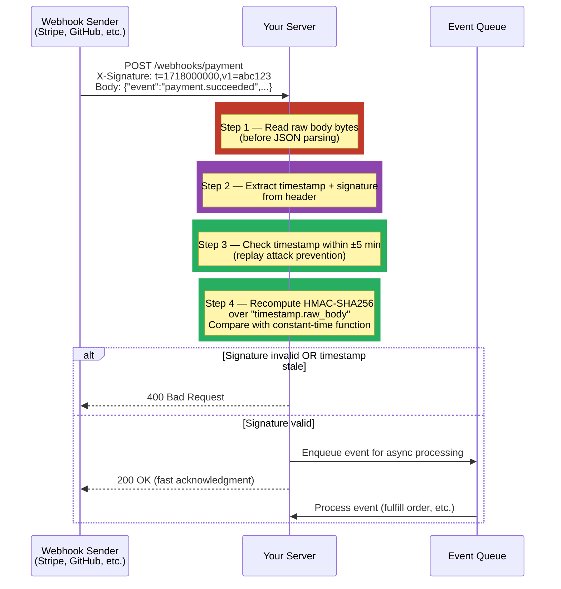

# [BEE-474] Webhook Signature Verification and Security

:::info
Webhook signature verification uses HMAC-SHA256 to prove that an incoming webhook request was signed by the expected sender and was not tampered with in transit — a required defense against spoofed requests, man-in-the-middle attacks, and replay attacks.
:::

## Context

A webhook is an HTTP callback: a third-party service sends a `POST` request to your server when an event occurs — a payment completes, a GitHub commit is pushed, an order ships. The request arrives over the internet, from an IP address that may change, carrying a payload that directly drives business logic: fulfilling orders, granting access, triggering deployments.

Without verification, any party on the internet can send a request to your webhook endpoint and trigger that logic. An attacker who discovers your payment webhook URL could forge a `PaymentSucceeded` event for an order that was never paid, or replay a legitimate past event to trigger a fulfillment twice.

The industry-standard defense is HMAC-SHA256 signature verification, defined in RFC 2104 (HMAC: Keyed-Hashing for Message Authentication, Krawczyk, Bellare, Canetti, 1997). The sender and receiver share a secret key out-of-band. When sending a webhook, the sender computes `HMAC-SHA256(secret, request_body)` and includes it in a request header. The receiver recomputes the same HMAC over the raw request body using the same secret and compares results. Because the secret is never transmitted in the request, an attacker who intercepts the request cannot forge a valid signature.

All major webhook-sending platforms implement this pattern: GitHub uses `X-Hub-Signature-256` (HMAC-SHA256 of the raw body), Stripe uses `Stripe-Signature` (a timestamp plus HMAC-SHA256 allowing multiple signatures for key rotation), and Shopify uses `X-Shopify-Hmac-SHA256` (base64-encoded HMAC-SHA256). The implementation details — how to handle the raw body, why string comparison fails, and how timestamps prevent replay attacks — are where most bugs occur.

## Best Practices

**MUST verify the HMAC signature before executing any business logic.** The verification step is not optional for production systems. A webhook endpoint that processes events without signature verification is indistinguishable from a public API endpoint — any caller can trigger its logic.

**MUST compute the HMAC over the raw request body bytes, before any parsing.** The HMAC is a function of the exact bytes the sender transmitted. Parsing the JSON body and re-serializing it before hashing changes the byte representation (key ordering, whitespace, Unicode escapes) and produces a different hash. Most web frameworks offer a way to read the raw body: buffer it before the JSON parser runs.

**MUST use a constant-time comparison function when comparing signatures.** A naive `signature == expected` comparison leaks timing information: it exits early when it finds the first non-matching byte, which an attacker can measure to learn how many leading bytes of their forged signature are correct. Use the standard library's constant-time comparison in every language: Python `hmac.compare_digest()`, Go `subtle.ConstantTimeCompare()`, Node.js `crypto.timingSafeEqual()`. These functions always examine every byte regardless of where the mismatch occurs.

**MUST reject webhooks with a timestamp outside an acceptable tolerance window (typically ±5 minutes) to prevent replay attacks.** A valid HMAC signature proves the sender knew the secret — but it does not prove the request is fresh. An attacker who captures a legitimate webhook can replay it days later and it will pass signature verification. Including a timestamp in the signed payload (as Stripe does: the signature covers `timestamp.body`) and rejecting requests where `|now - timestamp| > 300 seconds` closes this window.

**MUST store webhook secrets as application secrets, not in source code or version control.** A webhook secret is a symmetric key; exposure means an attacker can forge any payload. Store it in the same system used for other secrets (BEE-32): environment variables, a secrets manager (AWS Secrets Manager, HashiCorp Vault), or encrypted configuration.

**SHOULD support webhook secret rotation without downtime.** Platforms that allow multiple active signatures (Stripe sends both old and new signatures during a rotation window) enable zero-downtime rotation: accept either signature, update the secret, then stop accepting the old one. For platforms with a single secret, implement a short transition window where the server accepts both old and new secrets.

**SHOULD log signature verification failures with the request metadata (timestamp, IP, endpoint) and alert on elevated failure rates.** A burst of verification failures may indicate an attacker probing the endpoint or a misconfigured sender. Failed verifications should never silently return `200 OK` — return `400 Bad Request` or `401 Unauthorized` and log the event.

**MAY implement IP allowlisting as defense-in-depth.** Several platforms publish known sender IP ranges (Stripe, GitHub maintain public lists). Allowlisting these IPs adds a second layer of protection, but it must not replace signature verification — IP ranges change, and IP spoofing is possible. Treat allowlisting as defense-in-depth, not a primary control.

**MAY return `200 OK` immediately and process the event asynchronously.** Webhook senders typically have short delivery timeouts (5–30 seconds) and retry on non-2xx responses. If processing is slow, return `200 OK` immediately (indicating receipt), enqueue the event, and process it asynchronously. This decouples delivery reliability from processing latency.

## Visual



## Example

**Python (FastAPI) — raw body access + HMAC verification + timestamp check:**

```python
import hashlib
import hmac
import time
from fastapi import FastAPI, Request, HTTPException, Header
from typing import Optional

app = FastAPI()
WEBHOOK_SECRET = b"whsec_your_secret_here"  # loaded from secrets manager in prod
TIMESTAMP_TOLERANCE_SECONDS = 300  # 5 minutes

def verify_stripe_signature(
    raw_body: bytes,
    signature_header: str,
    secret: bytes,
    tolerance: int = TIMESTAMP_TOLERANCE_SECONDS,
) -> None:
    """Verify Stripe-Signature header: t=<timestamp>,v1=<hex-hmac>"""
    # Parse the header: "t=1718000000,v1=abc...,v1=def..." (multiple v1= on rotation)
    parts = {k: v for k, v in (item.split("=", 1) for item in signature_header.split(","))}
    timestamp = parts.get("t")
    if not timestamp:
        raise HTTPException(status_code=400, detail="Missing timestamp in signature")

    # Replay attack prevention: reject stale events
    age = abs(int(time.time()) - int(timestamp))
    if age > tolerance:
        raise HTTPException(status_code=400, detail=f"Webhook timestamp too old: {age}s")

    # Stripe signs "timestamp.raw_body"
    signed_payload = f"{timestamp}.".encode() + raw_body
    expected = hmac.new(secret, signed_payload, hashlib.sha256).hexdigest()

    # Collect all v1= signatures (there can be multiple during key rotation)
    received_sigs = [v for k, v in parts.items() if k == "v1"]

    # Constant-time comparison against each signature — exit True if any matches
    if not any(hmac.compare_digest(expected, sig) for sig in received_sigs):
        raise HTTPException(status_code=400, detail="Signature verification failed")

@app.post("/webhooks/stripe")
async def stripe_webhook(
    request: Request,
    stripe_signature: Optional[str] = Header(None, alias="stripe-signature"),
) -> dict:
    if not stripe_signature:
        raise HTTPException(status_code=400, detail="Missing Stripe-Signature header")

    # CRITICAL: read raw bytes BEFORE any JSON parsing
    raw_body = await request.body()

    verify_stripe_signature(raw_body, stripe_signature, WEBHOOK_SECRET)

    # Safe to parse now — verification passed
    event = await request.json()
    # Enqueue for async processing; return 200 immediately
    await enqueue_event(event)
    return {"received": True}
```

**Go — GitHub webhook verification (`X-Hub-Signature-256`):**

```go
package webhooks

import (
    "crypto/hmac"
    "crypto/sha256"
    "crypto/subtle"
    "encoding/hex"
    "fmt"
    "io"
    "net/http"
    "strings"
)

var webhookSecret = []byte("your_github_secret")

func VerifyGitHubSignature(r *http.Request) ([]byte, error) {
    // Read raw body — must happen before any JSON decoding
    body, err := io.ReadAll(r.Body)
    if err != nil {
        return nil, fmt.Errorf("reading body: %w", err)
    }

    sigHeader := r.Header.Get("X-Hub-Signature-256")
    if sigHeader == "" {
        return nil, fmt.Errorf("missing X-Hub-Signature-256 header")
    }
    // Header format: "sha256=<hex>"
    if !strings.HasPrefix(sigHeader, "sha256=") {
        return nil, fmt.Errorf("unexpected signature format")
    }
    received, err := hex.DecodeString(strings.TrimPrefix(sigHeader, "sha256="))
    if err != nil {
        return nil, fmt.Errorf("decoding signature: %w", err)
    }

    // Compute expected HMAC
    mac := hmac.New(sha256.New, webhookSecret)
    mac.Write(body)
    expected := mac.Sum(nil)

    // Constant-time comparison — prevents timing attacks
    if subtle.ConstantTimeCompare(expected, received) != 1 {
        return nil, fmt.Errorf("signature mismatch")
    }

    return body, nil // return verified raw body for caller to parse
}

func HandleGitHubWebhook(w http.ResponseWriter, r *http.Request) {
    body, err := VerifyGitHubSignature(r)
    if err != nil {
        http.Error(w, "Unauthorized", http.StatusUnauthorized)
        return
    }
    // Process body (JSON decode etc.) only after verification
    w.WriteHeader(http.StatusOK)
    _ = body
}
```

**Secret rotation — accepting both old and new secrets during transition:**

```python
def verify_any_secret(
    raw_body: bytes,
    timestamp: str,
    received_sig: str,
    secrets: list[bytes],  # [new_secret, old_secret] — try new first
) -> bool:
    signed_payload = f"{timestamp}.".encode() + raw_body
    for secret in secrets:
        expected = hmac.new(secret, signed_payload, hashlib.sha256).hexdigest()
        if hmac.compare_digest(expected, received_sig):
            return True
    return False

# During rotation: both secrets are active simultaneously
ACTIVE_SECRETS = [NEW_SECRET, OLD_SECRET]
```

## Implementation Notes

**Raw body buffering**: The most common implementation bug is verifying the HMAC after the framework has already consumed and parsed the request body. In Express (Node.js), use `express.raw({ type: 'application/json' })` for webhook routes instead of `express.json()`. In FastAPI/Starlette, `await request.body()` reads and caches the raw bytes; subsequent `await request.json()` parses from the cache. In Spring Boot, use `@RequestBody byte[] body` or configure `HttpServletRequest.getInputStream()` to be repeatable.

**Node.js**: The standard library provides `crypto.timingSafeEqual(a, b)` for constant-time comparison; both buffers must be the same length (pad if not). Stripe's official Node.js SDK (`stripe.webhooks.constructEvent`) handles raw body, signature parsing, timestamp tolerance, and constant-time comparison correctly — use it rather than reimplementing.

**Django**: Add a custom middleware or view decorator that reads `request.body` (the raw bytes attribute) before the view's JSON parsing runs. The `body` attribute is only available before Django's JSON middleware reads it.

**Replay tolerance vs freshness**: 5 minutes is Stripe's recommendation and a reasonable default. Adjust shorter (1–2 minutes) for high-security operations, or longer (15 minutes) for webhook senders in regions with unreliable clocks. The tradeoff: shorter tolerance reduces replay window but increases false rejections from clock skew.

## Related BEEs

- [BEE-4007](../api-design/webhooks-and-callback-patterns.md) -- Webhooks and Callback Patterns: covers webhook architectural design (retry strategies, delivery ordering, fan-out); this article covers the security layer that every webhook receiver must implement
- [BEE-2003](../security-fundamentals/secrets-management.md) -- Secrets Management: the shared HMAC secret must be stored and rotated using the same practices as any symmetric key — environment variables, secrets managers, never in source code
- [BEE-2005](../security-fundamentals/cryptographic-basics-for-engineers.md) -- Cryptographic Basics for Engineers: HMAC-SHA256 is a keyed hash function; understanding hash properties (collision resistance, one-wayness) explains why signature verification provides the guarantees it does

## References

- [Validating Webhook Deliveries — GitHub Documentation](https://docs.github.com/en/webhooks/using-webhooks/validating-webhook-deliveries)
- [Webhook Signatures — Stripe Documentation](https://docs.stripe.com/webhooks/signature)
- [RFC 2104: HMAC: Keyed-Hashing for Message Authentication — IETF](https://datatracker.ietf.org/doc/html/rfc2104)
- [Webhooks — Shopify Developer Documentation](https://shopify.dev/docs/apps/build/webhooks/subscribe/https)
