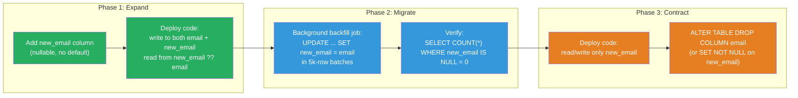

# [BEE-458] Zero-Downtime Schema Migrations

:::info
Zero-downtime schema migrations change a production database schema without taking the application offline — by decomposing each backward-incompatible change into a sequence of backward-compatible steps that allow old and new code to run simultaneously during a rolling deployment.
:::

## Context

A naive schema migration runs an `ALTER TABLE` statement, the database acquires a table lock, the statement completes, and the application restarts. For a small table this takes milliseconds. For a 500-million-row table, the `ALTER TABLE` holds the lock for minutes or hours, blocking all reads and writes — a full outage.

Even without a long lock, rolling deployments create a temporal overlap problem. When a Kubernetes rolling deploy upgrades pods one at a time, old pods and new pods serve traffic simultaneously. If the new code expects a column named `user_email` and the migration has already renamed it from `email`, old pods fail. If the migration has not run yet, new pods fail. The schema and the code must be compatible in both directions during the transition window.

Martin Fowler formalized this problem as the **Parallel Change** pattern (also called expand-contract) in 2014: a backward-incompatible change is broken into three independent deployments — expand (add the new schema), migrate (copy data from old to new), and contract (remove the old schema). This ensures that at every point in time, a consistent version of the application works against the database. The pattern is now standard in continuous delivery literature.

Online DDL tools tackle the complementary problem: large-table structural changes that are mechanically safe (no data loss, no application change needed) but physically disruptive because of lock duration. GitHub introduced **gh-ost** (GitHub's Online Schema Migrator) in 2016 specifically because `ALTER TABLE` on MySQL tables with hundreds of millions of rows was untenable. gh-ost creates a shadow table, copies rows in batches, and tails the binary log to replay concurrent writes — then performs an atomic table swap when the shadow is fully caught up, with no application lock.

Percona's **pt-online-schema-change** (pt-osc) predates gh-ost and uses a trigger-based approach: it creates a shadow table, installs `INSERT/UPDATE/DELETE` triggers to keep it synchronized, copies existing rows, and then renames the tables. The trigger overhead is its main limitation; gh-ost's log-based approach avoids this and adds the ability to pause and throttle the migration.

PostgreSQL handles DDL differently from MySQL. Many `ALTER TABLE` operations in modern PostgreSQL (14+) are instant or require only brief locks. Adding a nullable column with no default is instant since PostgreSQL 11 — it rewrites no rows. `CREATE INDEX CONCURRENTLY` builds an index without holding a write lock. The danger is operations that still require `ACCESS EXCLUSIVE` lock for the full duration: adding `NOT NULL` without a default, adding a check constraint without `NOT VALID`, and type changes that require a rewrite.

## Design Thinking

### Three Axes of Risk

Every schema change has three risk axes:

1. **Lock duration**: Does the DDL statement hold a table lock? For how long? On a busy table, even a brief `ACCESS EXCLUSIVE` lock queues behind active transactions and blocks new ones behind it (PostgreSQL's lock queue is FIFO, so a single DDL waiting behind a long transaction blocks all subsequent reads).

2. **Data volume**: Does the change require touching every row (a rewrite)? For large tables, any rewrite is measured in minutes, not seconds.

3. **Application compatibility**: Is the change backward-incompatible with the currently deployed code? If old code and new code must coexist during the deploy window, the schema must satisfy both.

A zero-downtime migration strategy must address all three axes independently.

### The Expand-Contract Sequence

For any backward-incompatible change, the recipe is:

**Phase 1 — Expand:** Add the new schema element (column, table, index) alongside the old one. Write code that writes to both old and new, reads from new with fallback to old. Deploy this code. The database now has both old and new; all running code is compatible with this state.

**Phase 2 — Migrate:** Backfill existing data from old schema to new schema. This runs as a background job, not in a migration script inside the deploy pipeline. Large backfills MUST be batched (see Best Practices).

**Phase 3 — Contract:** Once all data is migrated and no code references the old schema element, remove it. Deploy the code that no longer references the old column, then run the migration that drops it.

This requires three separate deployments spread over hours or days for large tables. The window between expand and contract is the backward-compatibility window.

### When Online DDL Tools Are Needed

Online DDL tools (gh-ost, pt-osc for MySQL; pg_repack, pgroll for PostgreSQL) are needed when:
- The table is large enough that the DDL rewrite would hold a lock for an unacceptable duration
- The change is mechanically safe (no application code change needed) but physically involves a rewrite

Online DDL tools are NOT a substitute for expand-contract. They address lock duration; expand-contract addresses application compatibility.

## Best Practices

**MUST decompose backward-incompatible schema changes using the expand-contract pattern.** Column renames, type changes, and adding NOT NULL constraints are backward-incompatible. Each requires at minimum two deployments: one to add the new element and deploy compatible code, one to remove the old element after migration. Attempting a single-step rename or constraint addition in a rolling deploy will cause failures in old pods that cannot see the new schema or new pods that cannot write to the old schema.

**MUST NOT add a NOT NULL column with no server-side default in a single migration step.** This is one of the most common causes of production incidents. The sequence:
1. Deploy: add the column as nullable, add application code to populate it on write.
2. Backfill: run a background job to fill existing rows.
3. Verify: confirm zero NULL rows in the column.
4. Deploy: add the NOT NULL constraint using `SET NOT NULL` (PostgreSQL 12+ uses a metadata-only change if no nulls exist) or `ADD CONSTRAINT ... CHECK ... NOT VALID` followed by `VALIDATE CONSTRAINT` in a separate transaction.

**MUST use `CREATE INDEX CONCURRENTLY` (PostgreSQL) or an online DDL tool (MySQL) for index creation on large tables.** `CREATE INDEX` without `CONCURRENTLY` acquires a `SHARE` lock that blocks all writes for the full build duration. `CONCURRENTLY` allows writes throughout but takes approximately twice as long and cannot run inside a transaction block. gh-ost and pt-osc provide equivalent capabilities for MySQL.

**MUST set `lock_timeout` before DDL statements on busy tables.** Even instant DDL can stall behind a long-running transaction in PostgreSQL's lock queue. Setting `SET lock_timeout = '2s'` before the `ALTER TABLE` causes the statement to fail rather than queue indefinitely. Pair with retry logic: if the statement fails with lock timeout, retry after a brief interval. This is always preferable to silently blocking all subsequent queries.

**MUST batch large backfills.** Updating every row in a 100M-row table in a single transaction creates a multi-minute exclusive lock on modified rows and generates enormous WAL/binlog volume. Instead, update in bounded batches (1,000–10,000 rows per batch) with a short sleep between batches to allow normal traffic to proceed. Process rows in primary key order for locality:

```sql
-- Example: backfill new_email from email in batches
DO $$
DECLARE
  last_id BIGINT := 0;
  batch_size INT := 5000;
  rows_updated INT;
BEGIN
  LOOP
    UPDATE users
    SET new_email = email
    WHERE id > last_id
      AND id <= last_id + batch_size
      AND new_email IS NULL;

    GET DIAGNOSTICS rows_updated = ROW_COUNT;
    EXIT WHEN rows_updated = 0;

    last_id := last_id + batch_size;
    PERFORM pg_sleep(0.05);  -- 50ms pause between batches
  END LOOP;
END $$;
```

**SHOULD run migration scripts before the new code version deploys, not after.** The standard rolling deploy sequence is: run the migration (which must be backward-compatible with the currently running code), then deploy new code. This means every migration script in the deploy pipeline must be readable by the old code version. If the migration removes a column the old code reads, the old pods fail before the new ones are ready. The old code must be able to ignore or not reference the column being removed.

**SHOULD use `NOT VALID` + `VALIDATE CONSTRAINT` for adding check constraints on large tables (PostgreSQL).** `ALTER TABLE ... ADD CONSTRAINT ... CHECK (...)` scans the entire table while holding `ACCESS EXCLUSIVE`. `ALTER TABLE ... ADD CONSTRAINT ... CHECK (...) NOT VALID` marks the constraint and validates only new rows immediately (brief lock), then `ALTER TABLE ... VALIDATE CONSTRAINT ...` verifies existing rows with only a `SHARE UPDATE EXCLUSIVE` lock — allowing concurrent reads and most writes.

## Visual



## Common Migration Recipes

### Renaming a Column (3 deployments)

| Deploy | Schema change | Code change |
|--------|--------------|-------------|
| 1 | Add `new_name` column (nullable) | Write to both `old_name` and `new_name`; read from `new_name ?? old_name` |
| — | Backfill `new_name` from `old_name` (background job) | — |
| 2 | Add NOT NULL constraint to `new_name` (after backfill complete) | Read and write only `new_name` |
| 3 | Drop `old_name` column | Code already removed references |

### Adding NOT NULL to an Existing Column (2 deployments)

| Deploy | Schema change | Code change |
|--------|--------------|-------------|
| 1 | (none) | Populate column on all writes; reject nulls at application layer |
| — | Backfill existing nulls (background job) | — |
| 2 | `SET NOT NULL` (PostgreSQL 12+: instant metadata-only if no nulls exist) | (none) |

### Splitting a Column into Two (3 deployments)

| Deploy | Schema change | Code change |
|--------|--------------|-------------|
| 1 | Add `col_a`, `col_b` (nullable) | Write to both old `col` and new `col_a`/`col_b`; read from new with fallback |
| — | Backfill `col_a`, `col_b` from `col` (background job) | — |
| 2 | Set NOT NULL on `col_a`, `col_b` | Read/write only `col_a`/`col_b` |
| 3 | Drop `col` | Code already removed references |

## Related BEEs

- [BEE-6007](../data-storage/database-migrations.md) -- Database Migrations: covers migration tooling (Flyway, Liquibase, Alembic) and the fundamentals of version-controlled schema changes; this article extends it with zero-downtime techniques
- [BEE-7003](../data-modeling/schema-evolution-and-backward-compatibility.md) -- Schema Evolution and Backward Compatibility: defines backward-compatible and backward-incompatible change types; the classifications directly determine which expand-contract phases are needed
- [BEE-16002](../cicd-devops/deployment-strategies.md) -- Deployment Strategies: rolling deploys are the root cause of the temporal overlap problem that expand-contract solves; blue-green deploys simplify schema migration but require database connection switching
- [BEE-19028](fencing-tokens.md) -- Fencing Tokens: backfill jobs that run concurrently with application writes must be idempotent; the idempotency techniques from BEE-164 apply directly

## References

- [Parallel Change -- Martin Fowler (2014)](https://martinfowler.com/bliki/ParallelChange.html)
- [gh-ost: GitHub's Online Schema Migration Tool -- GitHub Engineering Blog (2016)](https://github.blog/news-insights/company-news/gh-ost-github-s-online-migration-tool-for-mysql/)
- [pt-online-schema-change -- Percona Toolkit Documentation](https://docs.percona.com/percona-toolkit/pt-online-schema-change.html)
- [Schema Changes and PostgreSQL Lock Queue -- Xata Engineering](https://xata.io/blog/migrations-and-exclusive-locks)
- [Backward Compatible Database Changes -- PlanetScale](https://planetscale.com/blog/backward-compatible-databases-changes)
- [pgroll: Zero-Downtime PostgreSQL Migrations -- Xata Engineering](https://xata.io/blog/pgroll-schema-migrations-postgres)
