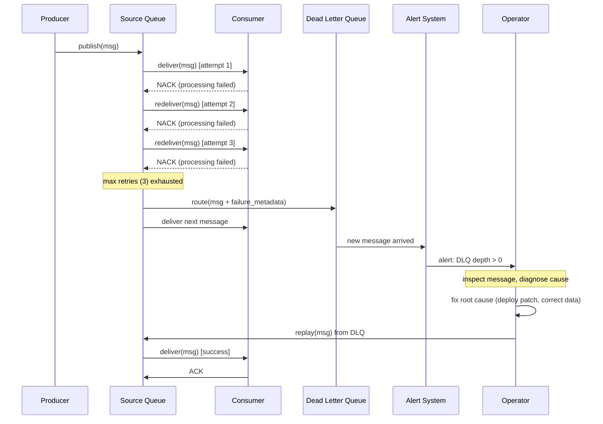

# [BEE-224] Dead Letter Queues and Poison Messages

:::info
Route unprocessable messages to a dedicated holding queue. Monitor it. Inspect it. Fix the root cause before replaying. Never let a single bad message block the flow of all the good ones.
:::

## Context

In any message-driven system, some messages will fail to process. The failure can be transient — a downstream service is temporarily unavailable — or permanent — the payload is malformed, the schema has changed, or there is a bug in the consumer. Retrying a transient failure makes sense. Retrying a permanent failure indefinitely does not.

A **poison message** is a message that repeatedly fails processing regardless of how many times it is retried. If the messaging system has no mechanism to isolate it, a poison message can stall an entire queue: the consumer picks it up, fails, requeues it, picks it up again, fails again, in an infinite loop. No other messages in the queue are processed while the consumer is stuck.

A **Dead Letter Queue (DLQ)** is a dedicated destination — a separate queue or topic — where messages are routed after they have exhausted their retry budget. The DLQ is not a trash bin; it is a holding area for investigation and recovery. Messages in the DLQ are kept until an operator inspects them, determines the cause of failure, fixes the underlying issue, and either replays the messages or discards them.

**References:**
- [Using dead-letter queues in Amazon SQS — AWS Documentation](https://docs.aws.amazon.com/AWSSimpleQueueService/latest/SQSDeveloperGuide/sqs-dead-letter-queues.html)
- [Service Bus dead-letter queues — Azure Service Bus | Microsoft Learn](https://learn.microsoft.com/en-us/azure/service-bus-messaging/service-bus-dead-letter-queues)
- [Dead letter queue — Wikipedia](https://en.wikipedia.org/wiki/Dead_letter_queue)

## Principle

**Configure a DLQ for every queue that carries business-critical messages. Set a finite max retry count. Enrich DLQ messages with failure metadata. Monitor the DLQ and alert on any new arrivals. Never replay from the DLQ without first fixing the root cause.**

## What Is a Poison Message?

A poison message is one that cannot be processed successfully by a consumer, no matter how many times it is retried. The failure is permanent given the current state of the system.

Common causes:

| Cause | Example |
|---|---|
| Schema mismatch | Producer serialized with Protobuf v2; consumer still expects v1 |
| Invalid or missing data | `product_id` field is null; consumer cannot look up the product |
| Business rule violation | Order total is negative; validation always rejects it |
| Consumer bug | A null pointer exception in code that was recently deployed |
| Downstream permanently unavailable | A third-party service has been decommissioned |
| Message too large | Payload exceeds broker size limit; deserialization always fails |

The key distinction from a transient failure: **a transient failure will eventually succeed if retried after a delay. A poison message will never succeed until something external changes** — the code is fixed, the data is corrected, or the schema is migrated.

## Why Infinite Retries Are Harmful

Without a DLQ, the typical fallback for processing failures is indefinite retry. This creates several problems:

1. **Queue starvation.** While the consumer is stuck retrying a poison message, all subsequent messages in the queue are delayed. In an ordered queue, no message behind the poison message can be processed at all.

2. **Resource waste.** CPU cycles, network calls, and downstream service connections are consumed on work that will never succeed.

3. **Alert fatigue.** If every retry emits an error log or metric, on-call engineers are buried in noise from a single bad message.

4. **Hidden data integrity issues.** Messages processed out of order after a long retry cycle may arrive in a state that downstream systems no longer expect.

The correct model: retry a bounded number of times with backoff (see [BEE-26](26.md)1), then route to the DLQ and move on.

## DLQ Message Enrichment

When a message is routed to the DLQ, the raw payload alone is rarely enough to diagnose the problem. The message should be enriched with metadata at the point of routing:

| Metadata Field | Purpose |
|---|---|
| `source_queue` | Which queue the message originally came from |
| `failure_reason` | Exception type and message from the last failed attempt |
| `attempt_count` | How many times processing was attempted |
| `first_failure_time` | Timestamp of the first failed attempt |
| `last_failure_time` | Timestamp of the most recent failed attempt |
| `consumer_id` | Which consumer instance processed it |
| `original_message_id` | Stable identifier linking the DLQ entry to the source |

Many brokers (AWS SQS, Azure Service Bus, ActiveMQ) populate some of this metadata automatically. For brokers that do not, the consumer should wrap the message before forwarding it to the DLQ.

## Message Flow



## Max Retry Count

The max retry count (called `maxReceiveCount` in AWS SQS, `maxDeliveryCount` in Azure Service Bus) is the number of times the broker will attempt delivery before routing to the DLQ.

**Choosing the right value:**

- **Too low (1–2):** A single transient network hiccup routes a perfectly valid message to the DLQ. On-call burden increases.
- **Too high (50+):** A poison message burns through retries slowly, blocking the queue for an extended period.
- **Typical sweet spot: 3–5 for most systems**, combined with exponential backoff (see [BEE-26](26.md)1). This allows the system to survive brief outages without endlessly recycling unprocessable messages.

For queues processing time-sensitive work (payment processing, inventory holds), prefer a lower max retry count combined with shorter backoff intervals so the DLQ catches permanent failures quickly.

## DLQ Monitoring and Alerting

A DLQ without monitoring is worse than no DLQ at all. Messages accumulate silently, the root cause grows stale, and recovery becomes harder.

**Required alerts:**

1. **DLQ depth > 0** — Any message in the DLQ should trigger a notification. For high-volume systems, alert on depth > threshold (e.g., 5 messages) to avoid alert storms from transient spikes.
2. **DLQ depth growing over time** — Indicates a systematic failure, not a one-off. Escalate if depth increases across multiple check intervals.
3. **DLQ message age exceeds SLA** — If a DLQ message has been sitting uninspected for longer than the SLA permits (e.g., 24 hours), escalate.

Structured log lines emitted when messages are routed to the DLQ enable log-based alerting (see [BEE-2003](../security-fundamentals/secrets-management.md)1):

```json
{
  "level": "error",
  "event": "message.dead_lettered",
  "queue": "order.fulfillment",
  "dlq": "order.fulfillment.dlq",
  "message_id": "msg-abc123",
  "attempt_count": 3,
  "failure_reason": "ValidationException: product_id not found",
  "timestamp": "2024-03-15T14:23:01Z"
}
```

## Manual Inspection and Replay

When the DLQ alert fires, the recovery process is:

1. **Inspect the message.** Read the payload and failure metadata. Understand what the consumer tried to do and why it failed.
2. **Classify the failure.** Is it a data problem (bad input from the producer), a code bug (fixed in a recent deploy), or an infrastructure issue (downstream service now healthy)?
3. **Fix the root cause.** Deploy the code fix, correct the upstream data, or confirm the downstream service is healthy.
4. **Replay selectively.** If the fix is targeted, replay only the affected messages. For broad fixes, replay the full DLQ batch.
5. **Verify.** Confirm the replayed messages are processed successfully. Watch consumer error rates.
6. **Discard if unrecoverable.** Some messages cannot be replayed (e.g., a time-sensitive notification for an event that has already passed). Document and discard them.

**Do not replay without fixing the root cause.** Replaying unfixed messages sends them straight back to the DLQ.

## Automated vs. Manual DLQ Processing

In some systems, it is possible to automate part of DLQ handling:

| Pattern | When Appropriate |
|---|---|
| Auto-replay after delay | Infrastructure outage: wait for recovery, then auto-replay |
| Conditional discard | Messages past a TTL are discarded automatically |
| Separate DLQ consumer | A dedicated service inspects and routes messages based on error type |
| Human-in-the-loop | Default for business-critical queues where data integrity matters |

For order processing, payments, and inventory — always require human review before replay. For telemetry pipelines and non-critical notifications, automated replay policies are appropriate.

## Worked Example: Order Fulfillment

An order fulfillment service consumes from a `order.placed` queue. Each message contains an order with a list of `product_id` values that the consumer validates against the product catalog.

**The failure scenario:**

A message arrives with `product_id: "PRD-99999"`, which does not exist in the product catalog. The consumer throws a `ProductNotFoundException`.

```
Attempt 1: ProductNotFoundException — NACK
Attempt 2: ProductNotFoundException — NACK (backoff: 2s)
Attempt 3: ProductNotFoundException — NACK (backoff: 4s)
maxReceiveCount = 3 → route to order.placed.dlq
```

The DLQ message is enriched:

```json
{
  "original_payload": {
    "order_id": "ORD-88812",
    "customer_id": "CUST-441",
    "items": [
      { "product_id": "PRD-99999", "quantity": 2 }
    ]
  },
  "failure_reason": "ProductNotFoundException: PRD-99999 not found in catalog",
  "attempt_count": 3,
  "source_queue": "order.placed",
  "last_failure_time": "2024-03-15T14:23:01Z"
}
```

An alert fires. The on-call engineer inspects the DLQ message, checks the product catalog, and discovers `PRD-99999` was accidentally deleted during a catalog migration. The product is restored. The engineer replays the message from the DLQ, and the consumer processes it successfully.

## Common Mistakes

### 1. No DLQ Configured

The most dangerous mistake. Without a DLQ, a poison message either blocks the queue indefinitely (ordered queues) or is retried forever, consuming resources and generating noise while never making progress. Always configure a DLQ for queues that carry business-critical messages.

### 2. DLQ Without Monitoring

A DLQ that no one watches is operationally equivalent to discarding the messages. The DLQ fills up silently, the data loss is discovered later (if ever), and the window for recovery grows stale. Every DLQ must have a corresponding alert on depth > 0.

### 3. Infinite Retries Without a DLQ

Setting `maxReceiveCount` to a very large number (or no limit) is the same as having no DLQ. A poison message with 1,000 retry attempts will block the queue for hours before reaching the DLQ. Pair a finite retry count with exponential backoff (BEE-261).

### 4. No Failure Metadata in DLQ Messages

Routing the raw payload to the DLQ without failure reason, attempt count, or source queue makes investigation much harder. When a human inspects the message hours or days later, they have no context. Always enrich the DLQ message at the point of failure routing.

### 5. Replaying Without Fixing the Root Cause

Replaying DLQ messages before the underlying bug or data issue is resolved sends them straight back to the DLQ. This is a common mistake during incident response under time pressure. Verify the fix is in place before initiating replay.

## Related BEPs

- [BEE-10003](delivery-guarantees.md) — Delivery guarantees: at-most-once, at-least-once, and exactly-once semantics
- [BEE-12002](../resilience/retry-strategies-and-exponential-backoff.md) — Retry strategies: exponential backoff, jitter, and retry budgets
- [BEE-14002](../observability/structured-logging.md) — Structured logging: log formats for DLQ alerts and incident correlation
