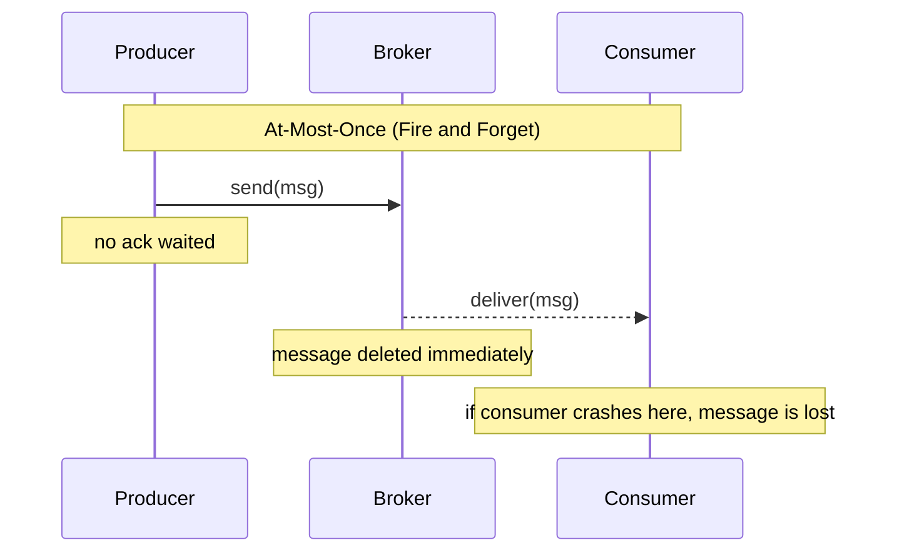
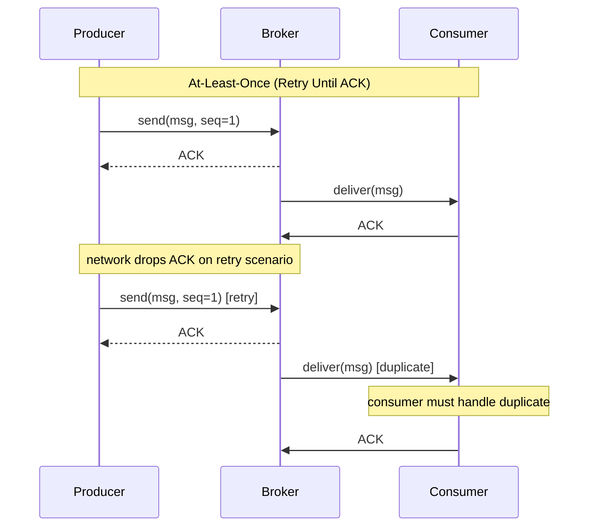
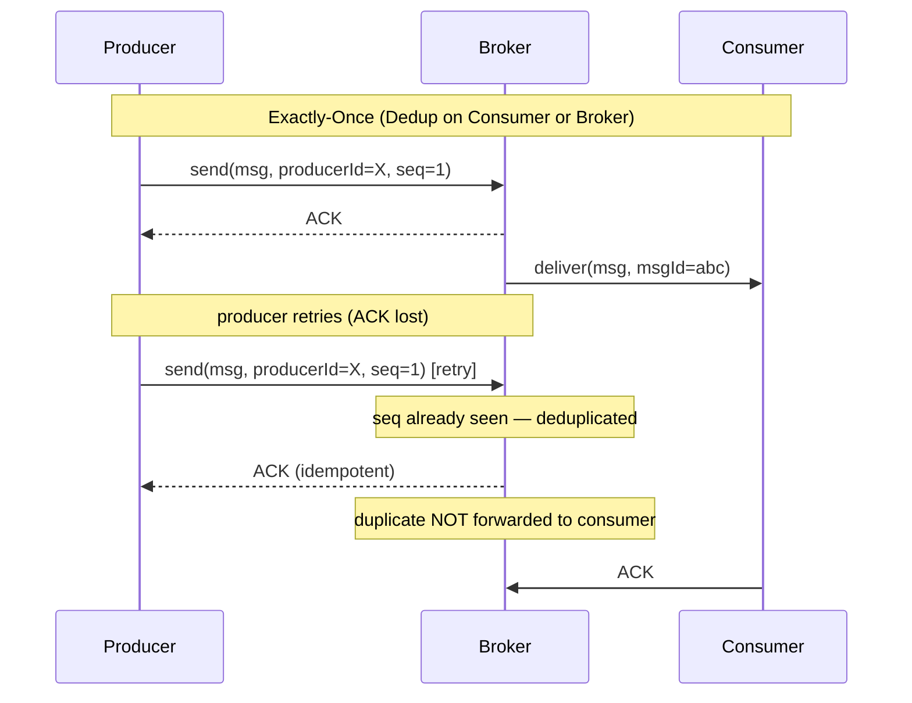

# [BEE-222] Delivery Guarantees

:::info
At-most-once, at-least-once, and exactly-once semantics — what each costs, when each is appropriate, and why "exactly-once" is more nuanced than it sounds.
:::

## Context

Every messaging system makes a promise about how many times a message will be delivered. This promise is called the **delivery guarantee**, and it is one of the most consequential design decisions in a distributed system.

The problem is fundamental: a producer sends a message, and there is always some chance that the network drops the message, the broker crashes before persisting it, or the consumer crashes after receiving it but before finishing processing. Each failure mode requires a different recovery strategy, and each recovery strategy implies a different delivery count.

Understanding delivery guarantees prevents two expensive mistakes: data loss from choosing too-weak a guarantee, and duplicate side effects from choosing too-strong a guarantee without accounting for idempotency.

**References:**
- [Message Delivery Guarantees for Apache Kafka — Confluent Documentation](https://docs.confluent.io/kafka/design/delivery-semantics.html)
- [You Cannot Have Exactly-Once Delivery — Tyler Treat, Brave New Geek](https://bravenewgeek.com/you-cannot-have-exactly-once-delivery/)
- [Exactly-once Semantics is Possible: Here's How Apache Kafka Does it — Confluent Blog](https://www.confluent.io/blog/exactly-once-semantics-are-possible-heres-how-apache-kafka-does-it/)

## Principle

**Match the delivery guarantee to the tolerance for loss and the cost of duplicates. Default to at-least-once with an idempotent consumer. Reserve exactly-once infrastructure for cases where that combination is genuinely insufficient.**

## The Three Guarantees

### At-Most-Once (Fire and Forget)

The producer sends the message and does not wait for acknowledgment. If the message is lost, it is not retried.

- **Delivery count:** 0 or 1.
- **On failure:** the message is silently dropped.
- **Cost:** lowest — no coordination, no retry state.
- **Risk:** data loss.

This is appropriate when loss is acceptable and low latency or throughput matters more than completeness. A missed metric data point rarely causes harm. A missed payment does.

### At-Least-Once (Retry Until ACK)

The producer retries until it receives a successful acknowledgment from the broker. If the acknowledgment is lost in transit (even though the broker did persist the message), the producer retries, and the broker may see the same message more than once.

- **Delivery count:** 1 or more.
- **On failure:** the message is retried until acknowledged.
- **Cost:** moderate — retry logic, deduplication at the consumer.
- **Risk:** duplicate delivery.

This is the standard choice for most systems. The consumer must be designed to handle duplicates safely — either by being idempotent by design or by explicitly deduplicating on a stable message ID (see [BEE-22](22.md)6).

### Exactly-Once (Effectively Once via Deduplication)

The system ensures that the *effect* of processing a message happens exactly once, even if the message is delivered more than once at the transport layer.

- **Delivery count:** 1 apparent effect, regardless of retries.
- **On failure:** the system deduplicates at the broker (idempotent producer) or at the consumer (idempotent processing).
- **Cost:** highest — requires either broker-level transactions (Kafka's EOS) or consumer-level deduplication state.
- **Risk:** complexity, reduced throughput, operational overhead.

This is why "exactly-once delivery" is technically controversial (see below). What Kafka calls exactly-once semantics (EOS) is more precisely *exactly-once processing within a transactional pipeline* — it does not eliminate the need for careful design, it just shifts where deduplication happens.

## Why Exactly-Once Is Controversial

Tyler Treat's foundational essay argues that **you cannot have exactly-once delivery in a distributed system in any absolute sense**. The argument is rooted in the Two Generals Problem: two parties communicating over an unreliable network cannot reach guaranteed agreement about whether a message was received.

If a producer sends a message and the network drops the acknowledgment, the producer cannot know whether the broker received the message or not. From the producer's perspective, it must either:
- **Not retry** → risk losing the message (at-most-once).
- **Retry** → risk delivering it twice (at-least-once).

There is no third option at the transport layer. What systems call "exactly-once" is always an application-level guarantee built on top of at-least-once delivery, using deduplication, idempotent writes, or distributed transactions. The broker achieves it by assigning each producer a persistent ID and tracking sequence numbers to deduplicate retries — but this is dedup, not magic.

**The practical takeaway:** at-least-once delivery + idempotent consumer = effectively-once behavior. For most use cases, this is the correct architecture. Broker-level exactly-once (Kafka EOS) is valuable for streaming pipelines where building consumer-side dedup state is impractical.

## Sequence Diagrams







## Acknowledgment Patterns

How a consumer acknowledges a message determines the delivery guarantee the system can uphold.

### Auto-ACK (Before Processing)

The broker marks the message as delivered as soon as the consumer receives it, before any processing occurs.

```
broker delivers → [auto-ack sent] → consumer processes
                                             ↑
                             crash here → message is lost
```

This is at-most-once. The consumer may crash between receipt and processing. The message will not be redelivered. Use only when loss is acceptable.

### Manual ACK (After Processing)

The consumer explicitly acknowledges the message after processing is complete.

```
broker delivers → consumer processes → [manual ack sent]
                        ↑
        crash here → broker redelivers → at-least-once
```

This is at-least-once. A crash after processing but before acking causes redelivery. The consumer must tolerate the duplicate.

### Negative ACK (NACK) / Retry to DLQ

The consumer explicitly rejects a message it cannot process. The broker either requeues it (for retry) or routes it to a Dead Letter Queue after a configurable number of retries.

This is the correct pattern for transient failures (service unavailable) versus permanent failures (malformed payload). See [BEE-10005](dead-letter-queues-and-poison-messages.md) for Dead Letter Queue design.

## Consumer Offset Management

In event streams (Kafka), the consumer is responsible for **committing its offset** — the position up to which it has processed events. Offset management directly controls the effective delivery guarantee.

### Commit Before Processing (At-Most-Once)

```
read event → commit offset → process event
                                    ↑
               crash here → event is skipped on restart
```

Offset is advanced before the work is done. On restart, the consumer resumes from after the committed position, effectively dropping the in-flight event.

### Commit After Processing (At-Least-Once)

```
read event → process event → commit offset
                    ↑
  crash here → offset not advanced → reprocessed on restart
```

This is the standard pattern. On crash, the consumer restarts from the last committed offset and reprocesses from there. The consumer must handle duplicate processing.

### Transactional Commit (Exactly-Once in Kafka)

Kafka's exactly-once semantics (available since 0.11.0) uses a transactional API that atomically commits the output writes *and* the offset within the same transaction. Either both succeed or neither does.

This is powerful but comes with costs: requires idempotent producers, transactional coordinator, and adds latency (typically tens of milliseconds per commit). Reserve for streaming pipelines where the overhead is justified.

## Delivery Guarantee vs. Processing Guarantee

These are distinct concepts that are frequently conflated.

| Concept | Scope | Example |
|---|---|---|
| Delivery guarantee | Whether the broker delivers the message to the consumer | Message arrives 0, 1, or N times |
| Processing guarantee | Whether the consumer's *effect* (DB write, email sent) happens once | Idempotent write, dedup table |

A broker can guarantee at-least-once delivery, but if the consumer crashes after writing to the database but before committing its offset, the same database write may be attempted twice on restart. **The broker's delivery guarantee does not automatically extend to the consumer's side effects.**

This is why [BEE-8005](../transactions/idempotency-and-exactly-once-semantics.md) (idempotency) and [BEE-10007](idempotent-message-processing.md) (idempotent processing) exist alongside delivery guarantees — you need both layers.

## Choosing the Right Guarantee

| Use Case | Recommended Guarantee | Reason |
|---|---|---|
| Metrics / telemetry | At-most-once | Loss of a few data points is acceptable; minimal overhead |
| Push notifications | At-most-once | A missed notification is a minor UX issue; duplicates are annoying |
| Email / SMS alerts | At-least-once + dedup | Loss is visible; duplicate sends are handled by idempotency key |
| Order processing | At-least-once + idempotent consumer | Loss unacceptable; duplicate order detection via order ID |
| Payment processing | At-least-once + idempotent consumer | Duplicate charges are severe; dedup on payment intent ID |
| Stream processing pipeline | Kafka exactly-once (EOS) | Multiple hops make consumer-side dedup complex; broker-level tx is cleaner |

## Worked Example: Notification vs. Payment

### Notification System — At-Most-Once

```
[User Action Service] ──fire-and-forget──> [topic: user.events]
                                                    │
                                         [Notification Service]
                                           auto-ack on receive
                                           sends push notification
```

If the notification service crashes between receiving and sending, the notification is not delivered. The user misses a "Your order shipped" alert.

**This is acceptable.** Users expect notifications to sometimes be delayed or missed. The cost of the guarantee (retries, dedup infrastructure) exceeds the cost of occasional loss.

### Payment Processing — At-Least-Once + Idempotent Consumer

```
[Checkout Service]
  ──publish──> [topic: payment.requests]
               msg: { paymentIntentId: "pi_abc123", amount: 99.00 }

[Payment Service]
  reads event
  checks: has "pi_abc123" been processed? (lookup in payments table)
    YES → skip (idempotent)
    NO  → charge card, write record with paymentIntentId
  commit offset
```

If the payment service crashes after charging but before committing, the event is redelivered. On retry, the `paymentIntentId` lookup finds the existing charge and skips it. The customer is charged exactly once.

**The delivery guarantee is at-least-once. The processing guarantee is exactly-once, achieved through idempotency.**

This pattern is cheaper and more reliable than broker-level exactly-once for this use case because the idempotency logic lives in the application, which already has access to the payments database.

## Common Mistakes

### 1. Choosing At-Most-Once for Critical Operations

At-most-once is fire-and-forget. Any crash, network blip, or broker restart can silently drop a message. Never use it for financial transactions, order processing, inventory updates, or any operation where silent loss would cause correctness or compliance problems.

### 2. At-Least-Once Without an Idempotent Consumer

Choosing at-least-once delivery but not designing for duplicate processing is the most common failure mode. If the consumer runs `INSERT INTO orders (id, ...) VALUES (...)` without a deduplication check, a redelivered message inserts a duplicate row. Always pair at-least-once delivery with idempotency (see [BEE-8005](../transactions/idempotency-and-exactly-once-semantics.md), [BEE-22](22.md)6).

### 3. Committing the Offset Before Processing

In Kafka, committing the offset before the processing work is complete gives you at-most-once semantics, not exactly-once. If the consumer crashes after committing but before writing to the database, the event is skipped on restart — the offset has already advanced past it. Always commit after the processing side effect is durably persisted.

### 4. Assuming the Broker Guarantees Processing

The broker guarantees **delivery** — that the message reached the consumer. It does not guarantee that the consumer's downstream actions (DB writes, external API calls, file writes) completed successfully. A consumer can receive a message, fail to write to the database, but still acknowledge the message. The broker considers delivery successful. Processing success is entirely the consumer's responsibility.

### 5. Over-Engineering for Exactly-Once When At-Least-Once + Dedup Suffices

Kafka's transactional exactly-once API is powerful but adds operational complexity, latency overhead, and requires careful configuration. For most use cases, at-least-once delivery with a deduplication key stored in the application's database achieves the same correctness guarantee with simpler infrastructure. Reserve broker-level EOS for multi-hop streaming pipelines where application-side dedup is impractical.

## Related BEPs

- [BEE-8005](../transactions/idempotency-and-exactly-once-semantics.md) — Idempotency: designing operations that are safe to repeat
- [BEE-10001](message-queues-vs-event-streams.md) — Message queues vs event streams: choosing the right model
- [BEE-10005](dead-letter-queues-and-poison-messages.md) — Dead Letter Queues and poison messages
- [BEE-10007](idempotent-message-processing.md) — Idempotent message processing: deduplication patterns in consumers
