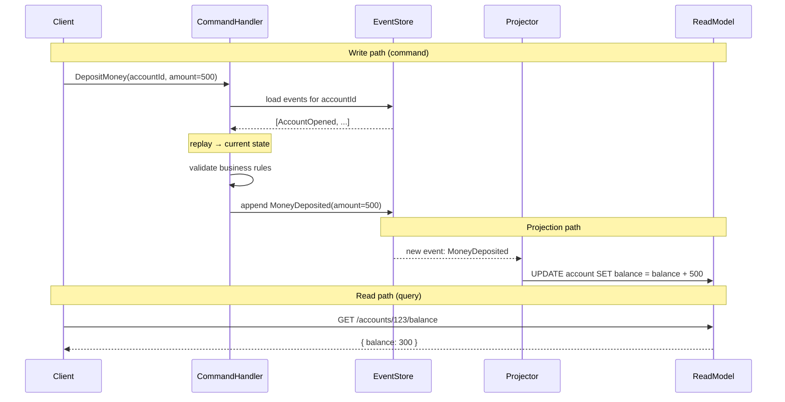
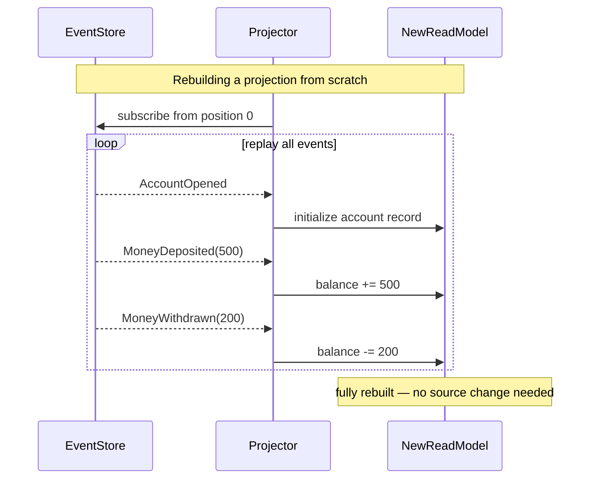

# [BEE-10004] Event Sourcing

:::info
Store state as an immutable sequence of events, reconstruct current state by replaying them, and build any number of projections without touching the event log.
:::

## Context

Most systems store the *current state* of an entity — a row in a database that is overwritten each time something changes. This is simple and effective for the majority of domains. But it destroys information: once you update a balance from 500 to 300, the history of how it became 500 is gone.

Event sourcing takes the opposite approach: **store every state change as an immutable event, and derive current state by replaying that sequence**. The event log is the source of truth. The "current state" in any read model is a derived projection that can be rebuilt from scratch at any time.

This pattern was articulated by Martin Fowler and later popularized by Greg Young alongside CQRS. It is particularly well-established in accounting, order management, and audit-heavy regulated domains where the history of changes is as important as the current value.

**References:**
- [Event Sourcing — Martin Fowler](https://martinfowler.com/eaaDev/EventSourcing.html)
- [Event Sourcing Pattern — Microsoft Azure Architecture Center](https://learn.microsoft.com/en-us/azure/architecture/patterns/event-sourcing)
- [CQRS and Event Sourcing — Greg Young / Kurrent](https://www.kurrent.io/blog/transcript-of-greg-youngs-talk-at-code-on-the-beach-2014-cqrs-and-event-sourcing)

## Principle

**Capture every state transition as an immutable, past-tense domain event. Store only events; derive all current state by replaying them. Never update or delete events.**

## Core Concepts

### Events as Facts

An event is a record of something that *already happened*. This has two important properties:

1. **Past tense naming** — `AccountOpened`, `MoneyDeposited`, `MoneyWithdrawn`, not `OpenAccount` or `DepositMoney`.
2. **Immutability** — once written, an event cannot be changed. If a mistake was made, a new corrective event is appended. The log is append-only.

Events are facts about the world. They express intent that was already realized, not a command that is about to happen.

### Reconstructing State by Replay

Current state is not stored directly. It is computed by reading all events for an entity in order and applying each one:

```
state₀ (empty)
  + AccountOpened(initial=0)       → balance: 0
  + MoneyDeposited(amount=500)     → balance: 500
  + MoneyWithdrawn(amount=200)     → balance: 300
                                   = current state: { balance: 300 }
```

The replay function is a pure reducer: given the current aggregate state and an event, it returns a new state. This makes the logic straightforward to test.

### Projections (Materialized Views)

A projection (also called a read model or materialized view) is a computed view built by consuming the event stream. Projections are optimized for reads and can take any shape without affecting the event log.

Key property: **projections are always rebuildable**. If a projection is wrong, or you need a new one, discard it and replay the full event history through new projection logic.

### Snapshots

Replaying thousands or millions of events on every read is expensive. A snapshot captures the aggregate state at a point in time, so replay only needs to process events *after* the snapshot:

```
snapshot at event #9800 → apply events #9801 … #9950 → current state
```

Snapshots are a performance optimization. They do not change the correctness model — the snapshot can be regenerated from the event log at any time. Take snapshots periodically (every N events, or on a schedule) rather than on every write.

### Event Store

The event store is an append-only log of events. Its characteristics:

- **Append-only writes** — no updates or deletes.
- **Ordered per aggregate** — events for a given entity have a monotonically increasing sequence number.
- **Optimistic concurrency** — a write can assert the expected version number to prevent lost updates.
- **Stream subscription** — consumers can subscribe to a stream or stream category and receive new events as they arrive.

Examples: EventStoreDB (purpose-built), Apache Kafka (used as event store), PostgreSQL with an `events` table, Azure Cosmos DB with change feed.

### Event Versioning

Events are long-lived. A schema defined today will need to evolve as the domain changes. Strategies:

| Strategy | Description | When to use |
|---|---|---|
| **Upcasting** | Transform old event format to new at read time | Adding optional fields |
| **Copy-and-replace** | Introduce a v2 event type alongside v1 | Breaking schema changes |
| **Weak schema** | Store events as JSON with liberal deserialization | Early-stage domains |
| **Event migration** | Rewrite old events to new format (rarely) | Only if absolutely necessary and carefully controlled |

Never silently drop or ignore unknown fields — use an upcaster that carries them forward as unknown metadata.

## Sequence Diagram





## Worked Example: Bank Account

### Traditional (Current-State) Approach

```sql
-- State at any moment is one row
INSERT INTO accounts (id, balance) VALUES ('acc-1', 0);
UPDATE accounts SET balance = 500 WHERE id = 'acc-1';  -- deposit
UPDATE accounts SET balance = 300 WHERE id = 'acc-1';  -- withdrawal

-- History is gone. You cannot answer:
--   "What was the balance on the 5th?"
--   "How many deposits happened this month?"
```

### Event Sourcing Approach

```
-- Event store (append-only)
{ stream: "account-acc-1", seq: 1, type: "AccountOpened",    data: { initialBalance: 0   } }
{ stream: "account-acc-1", seq: 2, type: "MoneyDeposited",   data: { amount: 500          } }
{ stream: "account-acc-1", seq: 3, type: "MoneyWithdrawn",   data: { amount: 200          } }

-- Replay function (pure reducer)
apply(state, AccountOpened)    → { balance: 0 }
apply(state, MoneyDeposited)   → { balance: 500 }
apply(state, MoneyWithdrawn)   → { balance: 300 }
```

Current balance is 300. Every historical state is derivable.

### Adding a New Projection Without Schema Change

Business wants a monthly statement report. In the traditional model, this might require an `ALTER TABLE` or a new tracking column. With event sourcing, it requires only a new projector:

```
-- New projector: MonthlyStatement
on MoneyDeposited  → insert into monthly_credits  (accountId, month, amount)
on MoneyWithdrawn  → insert into monthly_debits   (accountId, month, amount)

-- Run against full event history → backfill complete
-- No migration. No schema change. No downtime.
```

The event log did not change. The new projector is run from position 0, and the monthly statement table is populated from every historical event.

## When to Use Event Sourcing

**Use it when:**

- **Audit trail is a core requirement** — financial transactions, healthcare records, compliance logs. The event log is the audit trail; you do not need to build a separate one.
- **Temporal queries are needed** — "what was the account balance at noon on March 3rd?" is a first-class operation.
- **Debugging production issues matters** — you can replay the exact sequence of events that led to an incorrect state.
- **Multiple read models are needed** — different consumers need different views of the same data. Each adds a projector without touching others.
- **Used alongside CQRS (BEE-5003)** — event sourcing is the natural write-side complement to CQRS's read/write separation.
- **Business events are the primary language** — the domain speaks in events (order placed, shipment dispatched, payment received). Event sourcing makes that model explicit.

## When NOT to Use Event Sourcing

**Avoid it when:**

- **Simple CRUD is sufficient** — a user profile, a settings page, a configuration table. The complexity of event sourcing returns nothing for domains without meaningful state history.
- **The team is unfamiliar with the pattern** — event sourcing introduces a steep learning curve. Applied without understanding, it produces systems that are harder to reason about, not easier.
- **Querying current state is the primary access pattern** — if you almost never need history and always need current state, a relational row is faster and simpler.
- **The domain events are not clear** — event sourcing requires a coherent ubiquitous language with meaningful domain events. If you cannot name your events clearly in past tense, the domain model is not ready.
- **Regulatory requirements prohibit immutable storage** — right-to-erasure (GDPR Article 17) conflicts with append-only logs. This is solvable (encryption with key deletion, event tombstoning) but adds significant complexity.

## Common Mistakes

### 1. Using Event Sourcing for Everything

This is the most common misapplication. A customer address, a product description, a feature flag — most data changes are not meaningful domain events. Applying event sourcing universally adds infrastructure cost and cognitive overhead to parts of the system that gain nothing from it. Apply it selectively to the aggregates where history genuinely matters.

### 2. Mutable Events

Updating or deleting events breaks the entire model. If an event is wrong, the correct response is to append a compensating event (`PaymentReversed`, `OrderCancelled`) — not to change the original. Once an event has been written, treat it as immutable regardless of how it was stored.

### 3. No Snapshot Strategy

Replaying 10 million events to load an aggregate is a real problem. Systems that start with small event counts and skip snapshot design eventually hit a performance wall. Define a snapshotting policy early — even if you do not activate it immediately — so the infrastructure exists when the event count grows.

### 4. No Event Versioning Strategy

The first time the business adds a field to an event type, a system with no versioning strategy either breaks deserialization on old events or silently drops the new field. Choose an upcasting approach before the first production schema change, not after.

### 5. Coupling Projections to the Event Store

Projections should be independently rebuildable. If a projection's logic is embedded in the event store schema, or if the projection state is required to correctly interpret the event log, rebuilding becomes impossible without downtime or data loss. Projections are read-side concerns — keep them separate and treat them as disposable.

### 6. Confusing Commands and Events

A command (`DepositMoney`) is a request that may be rejected. An event (`MoneyDeposited`) is a fact that already happened. Storing commands in the event store muddies this distinction and makes the log harder to interpret. Only successful, validated state transitions produce events.

## Related BEPs

- [BEE-5003](../architecture-patterns/cqrs.md) — CQRS: separating read and write models; event sourcing is the natural write-side pairing
- [BEE-7005](../data-modeling/designing-for-time-series-and-audit-data.md) — Temporal data: querying state as of a point in time
- [BEE-8005](../transactions/idempotency-and-exactly-once-semantics.md) — Idempotency: projectors must be idempotent to support safe replay
- [BEE-10001](message-queues-vs-event-streams.md) — Event streams: the infrastructure layer that carries events between producers and projectors
