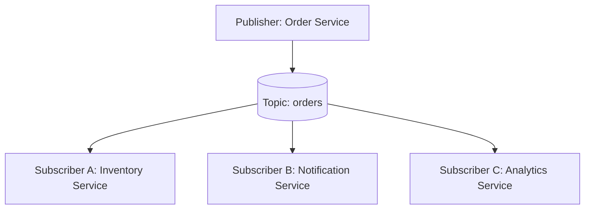

# [BEE-10002] Publish-Subscribe Pattern

:::info
Fan-out, topic-based routing, and decoupling producers from consumers — publishers send messages without knowing who, or how many, will receive them.
:::

## Context

In distributed systems, services often need to react to the same event. A naive approach wires them together directly: the order service calls the inventory service, the notification service, and the analytics service one by one. Every new consumer requires a code change in the publisher. The publisher grows aware of the entire downstream landscape — a fragile, tightly coupled design.

The **publish-subscribe (pub/sub) pattern** breaks this coupling. A publisher emits a message to a **topic** (a named logical channel) and stops there. Any number of subscribers independently consume copies of that message. The publisher has no knowledge of who subscribes, how many subscribers exist, or whether any subscriber is currently available.

This is distinct from a point-to-point queue, where a message is consumed by exactly one receiver. In pub/sub, every subscriber gets its own copy — a pattern commonly called **fan-out**.

**References:**
- [Publish-Subscribe Channel — Enterprise Integration Patterns](https://www.enterpriseintegrationpatterns.com/patterns/messaging/PublishSubscribeChannel.html)
- [Publisher-Subscriber Pattern — Azure Architecture Center](https://learn.microsoft.com/en-us/azure/architecture/patterns/publisher-subscriber)
- [Application Integration Patterns for Microservices: Fan-Out Strategies — AWS](https://aws.amazon.com/blogs/compute/application-integration-patterns-for-microservices-fan-out-strategies/)

## Principle

**A publisher emits events to a topic without knowledge of its subscribers. Subscribers declare interest and receive independent copies. Neither side is coupled to the other's existence, deployment cycle, or processing speed.**

## Fan-Out: One Message, Many Subscribers

The defining mechanical property of pub/sub is fan-out: one published message produces one delivery per active subscriber.



Each subscriber receives a full, independent copy of the message. Subscriber A processing its copy has no effect on Subscriber B's copy. A slow analytics service does not block inventory reservation. A crashed notification service does not prevent the analytics event from being recorded.

## Order Placed: A Concrete Example

An order placement event is published to the `orders` topic. Three services subscribe.

```
[Order Service]
    │
    └──publish──> topic: "orders"
                       │
          ┌────────────┼────────────┐
          │            │            │
  [Inventory]   [Notification]  [Analytics]
  reserve stock  send email     track metric
```

Each service subscribes independently and processes the same event for its own purpose:

- **Inventory Service** — decrements available stock for the ordered SKUs.
- **Notification Service** — sends an order confirmation email to the customer.
- **Analytics Service** — records the conversion event and revenue metric.

None of these services know about each other. Adding a fourth subscriber — say, a fraud detection service — requires zero changes to the publisher or to any existing subscriber.

### Durable vs Non-Durable Subscriptions

The behavior when the Notification Service is temporarily down depends on the subscription type.

| Scenario | Non-Durable Subscription | Durable Subscription |
|---|---|---|
| Notification Service is offline when the event is published | Message is lost for that subscriber | Message is persisted by the broker |
| Notification Service comes back online | Nothing to process — event was not stored | Broker delivers the buffered message |
| Customer receives email | Never | Eventually, after recovery |

**Durable subscriptions** instruct the broker to retain messages for a subscriber even when it is offline. The subscriber resumes from where it left off. This requires the broker to store messages per-subscriber, which increases storage and memory requirements.

**Non-durable subscriptions** are fire-and-forget for offline consumers. They are appropriate when missing occasional messages is acceptable — for example, live dashboard metrics where only the current value matters.

## Topic-Based vs Content-Based Routing

### Topic-Based (Most Common)

Subscribers express interest by naming a topic. All messages published to that topic are delivered to all subscribers of that topic.

```
subscribe("orders")          → receives every order event
subscribe("payments")        → receives every payment event
subscribe("orders.europe")   → receives only events published to that sub-topic
```

Topic hierarchies (e.g., `orders.europe.returns`) allow coarse-to-fine subscription control. This is the model used by Kafka, SNS, Google Cloud Pub/Sub, and most brokers.

### Content-Based

Subscribers provide a filter expression evaluated against message content (headers or payload fields). Only messages matching the filter are delivered.

```
subscribe(filter: "amount > 10000 AND currency = 'USD'")
```

Content-based filtering is more expressive but more expensive: the broker must evaluate every message against every active subscriber's filter. It is used in systems like Apache ActiveMQ (selectors), Azure Service Bus (SQL filters), and some event mesh platforms.

For most use cases, well-designed topic hierarchies achieve the required selectivity without the overhead of content-based filtering.

## Temporal Decoupling

Pub/sub introduces **temporal decoupling**: the publisher does not need to be running when a subscriber consumes the message, and the subscriber does not need to be running when the publisher emits it (with durable subscriptions).

This is a double-edged property:

- **Benefit:** Services can be deployed, restarted, and scaled independently. The publisher is never blocked waiting for subscribers.
- **Risk:** Downstream effects of an event are not immediate. If you need synchronous confirmation (e.g., "is there enough stock before I confirm the order?"), pub/sub is the wrong tool — use synchronous RPC or a request-reply pattern instead.

Pub/sub is appropriate for **informational events** ("something happened") rather than **commands** ("do this and tell me the result").

## Pub/Sub vs Point-to-Point

| Property | Pub/Sub (Topic) | Point-to-Point (Queue) |
|---|---|---|
| Number of receivers | All subscribers get a copy (fan-out) | Exactly one consumer processes each message |
| Publisher knowledge of consumers | None | None |
| Use case | Broadcast, event notification, EDA | Task distribution, work queues, commands |
| Replay | Broker-dependent; generally limited | Not supported after acknowledgment |
| Scaling | Add subscribers without touching publisher | Add consumers to share queue load |

## Pub/Sub in Microservices (Event-Driven Architecture)

Pub/sub is the backbone of event-driven architecture (EDA) in microservices. Each service publishes domain events to topics it owns. Other services subscribe and react.

Key properties that make pub/sub well-suited to microservices:

1. **Loose coupling** — services depend only on the event schema, not on each other's APIs or deployment state.
2. **Independent scaling** — each subscriber scales based on its own processing rate and backlog.
3. **Extensibility** — adding a new capability is a new subscriber, not a change to existing services.
4. **Resilience isolation** — a subscriber failure does not propagate to the publisher or sibling subscribers.

However, EDA with pub/sub also introduces **eventual consistency**: after an event is published, different subscribers converge to a consistent state at different times. Systems must be designed to tolerate this window of inconsistency.

## At-Least-Once Delivery in Pub/Sub

Most production pub/sub systems offer **at-least-once delivery**: the broker guarantees the message will be delivered at least once, but may deliver it more than once in the event of network failures, timeouts, or broker restarts.

Consequences:
- A subscriber must be **idempotent** — processing the same message twice must produce the same end state.
- Example: an inventory reservation that deducts stock on every delivery would under-count inventory if the event is delivered twice. Use a deduplication key or conditional update.

At-exactly-once delivery is possible in some brokers (Kafka transactions, Google Cloud Pub/Sub with ordering and deduplication) but adds complexity and latency. Prefer designing for at-least-once unless there is a verified requirement for exactly-once.

See [BEE-10002](publish-subscribe-pattern.md) for a full treatment of delivery guarantees.

## Ordered Delivery in Pub/Sub

Pub/sub does not inherently guarantee ordered delivery across subscribers, or even within a single subscriber, unless explicitly designed for it.

- **Within a subscriber:** If the broker uses multiple partitions or queues internally, messages may arrive out of order unless the publisher uses a consistent partition key.
- **Across subscribers:** Subscribers process at their own rate. Inventory may process order #42 before analytics processes order #41. Each subscriber sees its own delivery sequence.
- **Ordering guarantees:** Kafka guarantees per-partition order within a consumer group. SNS + SQS FIFO provides ordering within a message group.

Do not assume that because two subscribers receive the same events, they will process them in the same order or at the same time.

## Common Mistakes

### 1. Tight Coupling Through Shared Message Schemas

Pub/sub decouples at the transport layer, but if all services share a single, centrally-owned message schema, you have reintroduced coupling at the contract layer. A change to the schema requires coordinated upgrades of all subscribers — defeating the purpose.

Use schema evolution strategies: additive-only changes, versioned event types, or schema registries with compatibility checks. Publishers own their event schemas. Subscribers adapt.

### 2. Too Many Topics (One Per Event Type)

Creating a separate topic for every event type (`order.created`, `order.updated`, `order.cancelled`, ...) fragments the event space. Subscribers that care about all order lifecycle events must maintain N subscriptions. Changes to the domain require creating new topics and migrating subscribers.

Prefer **coarser topics** (e.g., `orders`) with an event type field inside the message payload. Subscribers filter by event type in their own logic, or use content-based filtering if the broker supports it.

### 3. No Dead Letter Handling for Failed Subscribers

When a subscriber fails to process a message repeatedly, the message is either dropped (non-durable) or it blocks the subscriber's queue indefinitely (durable). Without a **dead letter queue (DLQ)**, failed messages are silently lost or cause consumer stalls.

Configure a DLQ on every durable subscription. Route messages that exceed the retry limit to the DLQ for inspection, alerting, and manual replay. See [BEE-10002](publish-subscribe-pattern.md).

### 4. Ordering Assumptions Across Subscribers

Do not write business logic that depends on Subscriber A having processed an event before Subscriber B processes the same event. They operate independently and concurrently. If a downstream process requires a specific ordering (e.g., "payment must be confirmed before fulfillment starts"), model that as a sequential saga or use a coordinator, not a pub/sub assumption.

### 5. Pub/Sub Without Monitoring (Silent Subscriber Failures)

A publisher succeeds as soon as the broker accepts its message. If a subscriber is down, consuming slowly, or silently throwing exceptions, the publisher has no visibility. From the publisher's perspective, everything is fine.

Monitor:
- **Subscriber consumer lag** — how far behind is each subscriber?
- **DLQ depth** — are messages being rejected?
- **Processing error rate per subscriber**
- **End-to-end latency** — time from publish to subscriber acknowledgment

A pub/sub topology without subscriber monitoring is an unobserved system. Silent failures accumulate until a downstream business function is visibly broken.

## Related BEPs

- [BEE-10001](message-queues-vs-event-streams.md) — Message queues vs event streams: when to use each model
- [BEE-10002](publish-subscribe-pattern.md) — Delivery guarantees: at-most-once, at-least-once, exactly-once
- [BEE-10002](publish-subscribe-pattern.md) — Dead letter queues and poison message handling
- [BEE-5002](../architecture-patterns/domain-driven-design-essentials.md) — DDD domain events: what to publish and why
