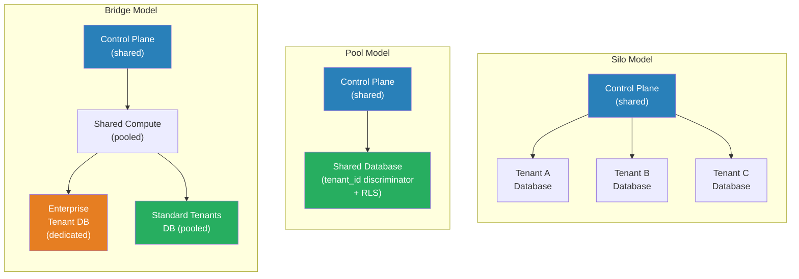

# [BEE-400] Multi-Tenancy Models

:::info
Multi-tenancy is the architectural property where a single software system serves multiple customers (tenants) using shared infrastructure — and the three fundamental models (silo, pool, bridge) represent different points on the spectrum between full isolation and full sharing.
:::

## Context

Every SaaS product is multi-tenant in the business sense: multiple customers pay for the same service. The architectural question is how deeply those customers share infrastructure. The answer determines cost structure, regulatory posture, operational complexity, and the risk of one tenant degrading the experience of another.

The concept predates the cloud era. Timesharing systems in the 1960s served multiple users on shared mainframes, and early ASP (Application Service Provider) products in the 1990s wrestled with the same trade-offs under different names. The vocabulary of silo, pool, and bridge was formalized in Amazon's SaaS Lens for the AWS Well-Architected Framework, which became the canonical reference for cloud-native multi-tenancy patterns.

The three models exist on a continuum:

**Silo model**: Each tenant receives dedicated infrastructure. In the database layer this means a separate database instance per tenant. Compute is often isolated too: separate containers, separate namespaces, or separate accounts. Tenants share only the control plane — the identity system, onboarding pipeline, billing logic, and operational tooling. The silo model maximizes isolation and is the natural fit for enterprise customers with data residency requirements, compliance mandates (HIPAA, FedRAMP), or contractual SLAs that require guaranteed resource headroom. The cost is proportional to tenant count: ten tenants mean ten database instances whether or not all ten are active.

**Pool model**: All tenants share the same infrastructure stack. A single database holds all tenant data, distinguished by a `tenant_id` discriminator column. Row-level security (RLS) — available natively in PostgreSQL, SQL Server, and others — enforces isolation at the database layer so application code cannot accidentally read another tenant's rows. The pool model achieves the highest resource utilization and is the right default for SMB-tier tenants with similar workloads. Its principal risk is the **noisy neighbor problem**: a single tenant running a bulk export or a poorly indexed query can consume enough I/O or CPU to degrade response times for all other tenants sharing the same instance.

**Bridge model**: A hybrid that applies different models to different parts of the system. A common pattern is: compute is pooled (all tenants share the same service fleet), while storage is selectively siloed (enterprise tenants get a dedicated schema or dedicated database; standard-tier tenants share a pool). Microservice architectures extend this further — a billing service might be fully pooled while a data processing service is siloed for tenants above a usage threshold. The bridge model lets a business offer differentiated tiers: a "Basic" plan on pooled everything, an "Enterprise" plan on dedicated storage, without maintaining two entirely separate codebases.

**Tiered deployment** is the operational form of the bridge model. Tenant tier (free, standard, enterprise) determines which resource pool a tenant is assigned to at onboarding. Tenants can be migrated between tiers as their usage grows. The tier boundary is a policy decision, not an architectural constraint, which makes this the most commercially flexible approach.

A critical concern across all models is **tenant context propagation**. Every request in a multi-tenant system must carry the authenticated tenant identity, and every data access must filter by that identity. Missing a filter is a data leak. Patterns to enforce this include: middleware that binds `tenant_id` to the request context; repository classes that inject `tenant_id` into every query; and database-level RLS policies that apply automatically regardless of what the application sends.

## Design Thinking

The choice of model is not primarily a technical decision — it is a business and regulatory one. The technical architecture should follow from those constraints, not lead them.

**Choose silo when:**
- Any tenant has contractual or regulatory data residency requirements
- A tenant's failure budget must be physically isolated from other tenants
- You are selling to enterprise buyers who will audit your isolation model

**Choose pool when:**
- Tenants are homogeneous (similar workloads, similar data volumes)
- Cost efficiency is a primary competitive differentiator
- Your tenant count is large and churn is high (database-per-tenant becomes unmanageable above a few hundred tenants)

**Choose bridge when:**
- You serve multiple market segments with different isolation requirements
- You want to offer tiered pricing backed by tiered infrastructure
- Some services have meaningful isolation requirements while others do not

The hardest migration is from pool to silo for a single tenant. Plan for it upfront by ensuring your data model carries `tenant_id` on every row from day one, and by building tenant extraction tooling before a customer demands it.

## Best Practices

Engineers MUST include `tenant_id` on every entity table from the initial schema, even in a silo deployment. Retrofitting tenant context onto an existing schema is one of the most expensive migrations a SaaS product can face.

Engineers MUST enforce tenant context at the infrastructure layer, not only in application logic. Use database row-level security policies or middleware that automatically injects tenant filters. Application-layer filtering is a defense-in-depth supplement, not a substitute.

Engineers MUST NOT allow inter-tenant queries — even for administrative purposes — through the same code paths used by tenant requests. Tenant admin operations should use dedicated, audited tooling that explicitly bypasses RLS with appropriate authorization, not ad-hoc queries in the application layer.

Engineers SHOULD instrument per-tenant resource consumption (CPU seconds, query count, storage bytes, API calls) from day one, even in a fully pooled deployment. Without per-tenant metrics, you cannot detect noisy neighbors, enforce fair-use policies, or enforce rate limits by tenant.

Engineers SHOULD design tenant onboarding as an automated, idempotent pipeline. In a silo model this pipeline provisions infrastructure; in a pool model it creates a tenant record and seeds configuration. Either way, manual steps in tenant provisioning become a bottleneck and a source of inconsistency as the business scales.

Engineers SHOULD implement tenant-aware rate limiting at the API gateway or application boundary to bound the blast radius of any single tenant's traffic spike. Even in a silo model, application servers may be shared, and a misconfigured client can consume all worker threads.

Engineers MAY start with a pool model and migrate high-value tenants to silo on demand, rather than building silo infrastructure speculatively. This defers complexity until a business case exists, and is the most common growth path for SaaS products.

Engineers MUST NOT assume that a silo model eliminates operational complexity. Each silo is a separate deployment target: schema migrations must run against every tenant database, configuration changes must be pushed to every tenant stack, and monitoring must aggregate across all of them. Operational tooling for silo deployments is a major investment.

## Visual



## Example

**Row-level security (PostgreSQL) for the pool model:**

```sql
-- Every tenant table has a tenant_id column
CREATE TABLE orders (
    id          UUID PRIMARY KEY DEFAULT gen_random_uuid(),
    tenant_id   UUID NOT NULL REFERENCES tenants(id),
    amount      NUMERIC(12,2) NOT NULL,
    created_at  TIMESTAMPTZ NOT NULL DEFAULT now()
);

-- Enable RLS on the table
ALTER TABLE orders ENABLE ROW LEVEL SECURITY;

-- Policy: each connection can only see rows matching its tenant context
CREATE POLICY tenant_isolation ON orders
    USING (tenant_id = current_setting('app.current_tenant_id')::UUID);

-- In application code, set the tenant context before any query:
-- SET LOCAL app.current_tenant_id = '<tenant-uuid>';
-- All subsequent queries in the transaction see only that tenant's rows.
-- No application-layer WHERE clause needed — the database enforces it.
```

**Tenant context middleware (pseudocode):**

```
// Extract and bind tenant identity on every inbound request.
// This runs before any handler and sets the context that RLS reads.

function tenantMiddleware(request, next):
    token = extractBearerToken(request.headers)
    claims = verifyJWT(token)               // validates signature + expiry

    if not claims.tenant_id:
        return 401 Unauthorized

    // Bind to request-scoped context (thread-local, goroutine context, AsyncLocalStorage, etc.)
    requestContext.set("tenant_id", claims.tenant_id)

    // For database connections: set session variable so RLS fires
    db.exec("SET LOCAL app.current_tenant_id = $1", claims.tenant_id)

    return next(request)
```

## Related BEEs

- [BEE-1001](../auth/authentication-vs-authorization.md) -- Authentication vs Authorization: tenant identity must be established before tenant context can be set
- [BEE-1004](../auth/session-management.md) -- Session Management: sessions in multi-tenant systems carry tenant identity as a first-class claim
- [BEE-6004](../data-storage/partitioning-and-sharding.md) -- Partitioning and Sharding: silo and bridge models at scale become a form of tenant-keyed sharding
- [BEE-8002](../transactions/isolation-levels-and-their-anomalies.md) -- Isolation Levels and Their Anomalies: RLS interacts with transaction isolation; understand both layers

## References

- [Silo, Pool, and Bridge Models -- AWS Well-Architected SaaS Lens](https://docs.aws.amazon.com/wellarchitected/latest/saas-lens/silo-pool-and-bridge-models.html)
- [SaaS Tenant Isolation Strategies -- AWS Whitepaper](https://docs.aws.amazon.com/whitepapers/latest/saas-tenant-isolation-strategies/pool-isolation.html)
- [Multi-Tenant SaaS Storage Strategies -- AWS Whitepaper](https://docs.aws.amazon.com/whitepapers/latest/multi-tenant-saas-storage-strategies/multitenancy-on-rds.html)
- [Row Security Policies -- PostgreSQL Documentation](https://www.postgresql.org/docs/current/ddl-rowsecurity.html)
- [Tenant isolation in SaaS: pool, silo and bridge models explained -- Just After Midnight](https://www.justaftermidnight247.com/insights/tenant-isolation-in-saas-pool-silo-and-bridge-models-explained/)
