# [BEE-18005] Schema Migrations in Multi-Tenant Systems

:::info
Schema migrations in multi-tenant systems are substantially more complex than in single-tenant systems — the deployment model determines whether a single migration affects all tenants simultaneously or must be fanned out across hundreds or thousands of isolated databases, each requiring individual tracking and rollback capability.
:::

## Context

BEE-6007 covers database migrations as a general practice. Multi-tenancy introduces a qualitatively different challenge: the scope and coordination of applying a migration depends entirely on the isolation model in use. In the pool model, one migration touches one database — familiar territory. In the silo or bridge model, one logical migration may need to execute against N tenant databases, each of which may be at a different version, may fail independently, and may require independent rollback.

The stakes are high. A failed migration in a single-tenant system affects one system. A failed migration in a silo deployment that has started applying across 500 tenant databases may have partially modified 300 of them when it fails, leaving the fleet in a mixed state. Recovery requires knowing exactly which tenants have the new schema, which have the old, and which are in an intermediate state — information that must be tracked explicitly before the migration starts.

The expand-contract pattern (also called parallel change, described by Martin Fowler) is the foundation of zero-downtime schema changes in any deployment model. Rather than applying a breaking change atomically, the pattern breaks the change into three phases:

1. **Expand**: Add the new column, table, or index alongside the existing structure. The application is updated to write to both the old and new locations. Reads still use the old location. The schema is backward-compatible with the current application version.
2. **Migrate**: Backfill data from the old structure to the new structure, or run the data transformation, while the application continues to operate normally.
3. **Contract**: Remove the old column, table, or index once all application versions in production use the new structure exclusively and data migration is complete.

In a multi-tenant silo deployment, each of these three phases must fan out across every tenant database. The expand phase alone is a coordinated fleet operation.

## Design Thinking

**The migration registry is the critical control artifact.** For a pool model with one shared database, a single migrations table tracks what has run. For a silo model, each tenant database has its own migrations table, and a central registry maps tenant ID to migration version. Before starting any migration, the system must be able to answer: which tenants are at version N? Which are below version N? Which failed mid-migration at a previous attempt? This registry must be authoritative: the migration runner reads from it to build the work queue and writes to it atomically with each successful migration.

**Fan-out concurrency is a double-edged sword.** Migrating 500 tenant databases sequentially is safe but may take hours. Migrating them all in parallel is fast but can overwhelm database infrastructure and makes failure recovery harder (if 50 fail, how do you know which 50?). The practical approach is bounded parallelism with a circuit breaker: run migrations against 5–10 tenant databases concurrently; if any fail, halt the entire fan-out and investigate before proceeding. This keeps the migration window short while containing the blast radius of a bad migration.

**Tenant schema divergence accumulates over time.** In a long-lived silo deployment, some tenants may have been skipped during a past migration (because they were suspended, behind on payment, or their database was temporarily unreachable). Over time, the fleet develops schema drift: most tenants are at version N, but some are at N-3, N-7, or worse. The migration runner must handle non-sequential catch-up: a tenant at version N-5 needs to run migrations N-4, N-3, N-2, N-1, and N in order. Running migrations out of order on a database that has been skipped is a common source of hard-to-diagnose production failures.

**New tenant onboarding and migration fan-out are related.** When a new tenant is provisioned in a silo model, their database must be initialized at the current head schema version, not the baseline version with all migrations applied in sequence. Maintaining a schema snapshot at each release that can be applied directly is more efficient than replaying the full migration history for new tenants, who would otherwise go through hundreds of historical migrations that have no relevance to their fresh database.

## Best Practices

Engineers MUST maintain a per-tenant migration version tracking table in silo and bridge deployments. The central migration registry (mapping tenant ID → current migration version) is the operational ground truth for the fleet's schema state and must be updated atomically with each successful migration execution.

Engineers MUST apply the expand-contract pattern for any migration that involves removing a column, renaming a column, or changing a constraint that the application currently depends on. Direct destructive changes cause failures in the application instances that still hold a reference to the old schema. Expand first, update the application, contract later.

Engineers MUST run migrations against a representative sample of tenant databases in a staging environment before fan-out to production. Differences in tenant data volume, data distribution, or historical schema deviations can cause a migration to succeed on a small test tenant and fail on a large production tenant.

Engineers SHOULD implement bounded parallelism with a circuit breaker for fan-out migrations. A failure rate threshold (e.g., more than 2% of tenants fail during a migration batch) should halt the fan-out automatically and alert the on-call engineer. Continue only after root cause is identified.

Engineers SHOULD ensure every migration is independently rollback-safe. When using the expand-contract pattern, the expand phase is inherently reversible: dropping a newly added column is safe if no data has been written to it yet. Document the rollback procedure for every migration as part of the migration artifact itself, not as an afterthought.

Engineers MUST NOT apply migrations during a deployment without first confirming that the application version being deployed is backward-compatible with the previous schema version. The rollout order should be: deploy expand migration → deploy new application version → (after all instances are updated) deploy contract migration. Any application version must be able to operate against both the N-1 and N schema versions simultaneously.

Engineers SHOULD maintain a schema snapshot at each release as the initialization artifact for new tenant provisioning. This avoids replaying the full migration history for new tenants and prevents new tenant initialization from touching deprecated code paths that have been cleaned up in the application layer.

Engineers MAY run low-risk additive migrations (adding nullable columns, creating indexes concurrently, inserting new enum values) with higher parallelism than destructive or structural migrations. The risk profile and concurrency limit for each migration should be a property of the migration artifact, not a global constant.

## Visual

```mermaid
flowchart TD
    subgraph "Expand-Contract Phases"
        E["1. Expand\nAdd new_col nullable\nApp writes old_col + new_col"]
        M["2. Migrate\nBackfill old_col → new_col\nVerify completeness"]
        C["3. Contract\nDrop old_col\nApp reads only new_col"]
        E --> M --> C
    end

    subgraph "Fan-Out Executor (Silo Model)"
        Registry["Central Migration Registry\ntenant_id → schema_version"]
        Queue["Work Queue\nTenants below version N"]
        Pool["Bounded Worker Pool\n5–10 concurrent migrations"]
        CB["Circuit Breaker\nHalt if failure rate > 2%"]
        Success["Update registry\nmark tenant at version N"]
        Alert["Alert on-call\nInvestigate failures"]

        Registry --> Queue --> Pool
        Pool -->|"migration OK"| Success
        Pool -->|"failure"| CB
        CB -->|"below threshold"| Pool
        CB -->|"above threshold"| Alert
    end

    style E fill:#2980b9,color:#fff
    style M fill:#e67e22,color:#fff
    style C fill:#27ae60,color:#fff
    style CB fill:#c0392b,color:#fff
    style Registry fill:#8e44ad,color:#fff
```



## Example

**Central registry tracking and fan-out runner (pseudocode):**

```
// Read migration state for the entire fleet before starting.
// Never start a migration without knowing the initial state.

function run_migration_across_fleet(migration_id, migration_fn):
    // 1. Build work queue: tenants that don't yet have this migration
    pending_tenants = registry.query(
        "SELECT tenant_id FROM tenant_migrations
         WHERE migration_id < $1 OR migration_id IS NULL
         ORDER BY tenant_size ASC",   // run smallest tenants first (test the waters)
        migration_id
    )

    log.info("Migration fan-out starting", migration=migration_id, count=len(pending_tenants))

    failures = []
    success_count = 0

    // 2. Bounded parallel execution
    with worker_pool(max_workers=8) as pool:
        for tenant in pending_tenants:
            future = pool.submit(migrate_one_tenant, tenant, migration_id, migration_fn)
            result = future.result()

            if result.ok:
                success_count += 1
            else:
                failures.append((tenant.id, result.error))

            // 3. Circuit breaker: halt if failure rate exceeds threshold
            failure_rate = len(failures) / (success_count + len(failures))
            if failure_rate > 0.02 and len(failures) >= 3:
                log.error("Circuit breaker tripped", failures=failures)
                alert_oncall("Migration halted", migration_id, failures)
                return HALTED

    if failures:
        alert_oncall("Migration completed with failures", migration_id, failures)
    return DONE


function migrate_one_tenant(tenant, migration_id, migration_fn):
    conn = get_tenant_db_connection(tenant.id)
    try:
        conn.begin()
        migration_fn(conn)                     // apply the schema change
        registry.mark_complete(tenant.id, migration_id, conn)  // atomic with migration
        conn.commit()
        return Result(ok=True)
    except Exception as e:
        conn.rollback()
        log.error("Migration failed", tenant=tenant.id, error=e)
        return Result(ok=False, error=e)
```

**Expand-contract for renaming a column:**

```sql
-- Phase 1: EXPAND — add new column, keep old column
ALTER TABLE orders ADD COLUMN customer_reference VARCHAR(255);

-- Application: write to both columns, read from old column
-- INSERT INTO orders (order_ref, customer_reference) VALUES ($1, $1)

-- Phase 2: MIGRATE — backfill data
UPDATE orders
SET customer_reference = order_ref
WHERE customer_reference IS NULL;

-- Application: deploy version that reads from new column
-- SELECT customer_reference FROM orders WHERE ...

-- Phase 3: CONTRACT — remove old column (safe once all app instances use new column)
ALTER TABLE orders DROP COLUMN order_ref;
```

## Related BEEs

- [BEE-6007](../data-storage/database-migrations.md) -- Database Migrations: general migration practices; this article extends them to multi-tenant contexts
- [BEE-18001](multi-tenancy-models.md) -- Multi-Tenancy Models: silo/pool/bridge models that determine whether fan-out is needed
- [BEE-18004](tenant-onboarding-and-provisioning-pipelines.md) -- Tenant Onboarding and Provisioning Pipelines: new tenant schema initialization using snapshots vs. full history replay
- [BEE-16002](../cicd-devops/deployment-strategies.md) -- Deployment Strategies: expand-contract requires coordinated application and schema deployment sequencing

## References

- [Parallel Change -- Martin Fowler's Catalog of Refactoring Patterns](https://martinfowler.com/bliki/ParallelChange.html)
- [Zero-Downtime Schema Migrations in PostgreSQL -- Xata](https://xata.io/blog/zero-downtime-schema-migrations-postgresql)
- [Multi-Tenant Database Architecture Patterns Explained -- Bytebase](https://www.bytebase.com/blog/multi-tenant-database-architecture-patterns-explained/)
- [Architectural Approaches for Storage and Data in Multitenant Solutions -- Azure Architecture Center](https://learn.microsoft.com/en-us/azure/architecture/guide/multitenant/approaches/storage-data)
- [Evolutionary Database Design -- Martin Fowler & Pramod Sadalage](https://martinfowler.com/articles/evodb.html)
