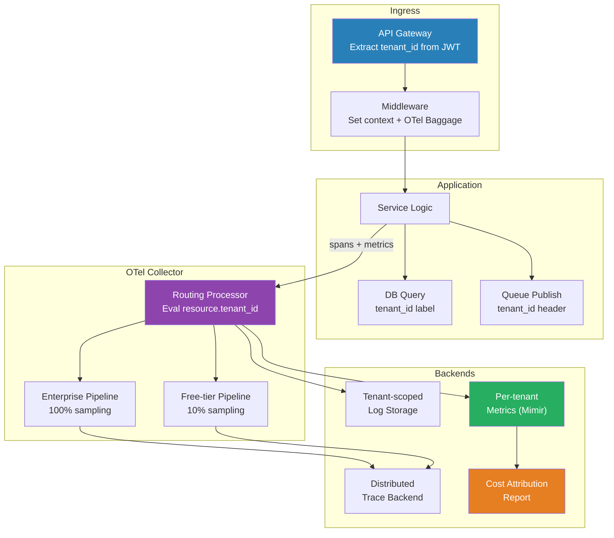

# [BEE-405] Tenant-Aware Observability

:::info
Tenant-aware observability treats the tenant identifier as a first-class dimension in every signal — logs, metrics, and traces — so that operators can isolate noisy tenants, enforce per-tenant SLOs, attribute infrastructure costs to specific customers, and meet data-residency compliance requirements without aggregating telemetry across tenant boundaries.
:::

## Context

Standard observability instruments a system as a whole. Multi-tenant systems require an additional layer: the ability to slice every signal by tenant. Without it, a single tenant consuming disproportionate resources degrades service for others invisibly, per-tenant SLO burn rates are impossible to compute, cost attribution is estimated rather than measured, and compliance requirements that prohibit cross-tenant data commingling cannot be met.

The foundational principle is to propagate the tenant identifier from the point of authentication — typically an API gateway or middleware — through every downstream operation: database queries, message queue producers and consumers, external API calls, background jobs. In synchronous paths this is straightforward: the tenant ID is injected into the request context and read wherever telemetry is emitted. In asynchronous paths (queued jobs, event-driven processing) the tenant ID must be explicitly serialized into message headers and re-extracted by the consumer, because there is no ambient request context.

**OpenTelemetry** provides the standard mechanism for context propagation across service boundaries. The W3C Baggage specification allows arbitrary key-value pairs — including `tenant_id` — to be carried in the `baggage` HTTP header alongside the W3C Trace Context `traceparent`. An OTel SDK extracts baggage at the ingress point and makes it available to all spans created within that trace. Critically, baggage is opt-in for attribute promotion: reading `tenant_id` from baggage and writing it as a span resource attribute ensures it appears in every exported record without requiring every instrumented function to be tenant-aware.

The **OTel Collector** enables per-tenant telemetry routing without modifying application code. A routing processor evaluates resource attributes (including `tenant_id`) and dispatches records to sub-pipelines: tenant-scoped backends, separate storage buckets for compliance isolation, or sampling rules calibrated by tenant tier. Enterprise tenants may receive full sampling; free-tier tenants may receive 10% head-based sampling. The collector configuration, not the application, enforces these policies.

At the metrics layer, tenant ID becomes a label on every counter, histogram, and gauge. This enables per-tenant dashboards, per-tenant alerting thresholds, and — most importantly — per-tenant error budgets. A platform may commit to 99.9% availability for enterprise customers and 99.5% for starter customers; computing burn rate against those budgets requires tenant-scoped availability metrics, which in turn require that every availability-affecting event be labeled with the tenant that experienced it.

**Cost attribution** is an operational outcome of tenant-aware telemetry. When database query duration, message queue throughput, and compute time are all labeled by tenant, the billing system or capacity planning team can allocate infrastructure costs to specific customers. This makes pricing decisions data-driven and identifies tenants whose usage profiles are unprofitable at current pricing.

## Best Practices

Engineers MUST set the tenant identifier in request context at the earliest possible point in the request lifecycle — typically an authentication middleware or API gateway — before any service call, database query, or log statement is emitted. Injecting tenant ID late means early telemetry is unlabeled and unusable for per-tenant analysis.

Engineers MUST propagate tenant context through asynchronous boundaries. When enqueuing a background job or publishing an event, serialize the tenant ID into the message header. The consumer MUST re-extract it and restore it to the processing context before any work begins. Losing tenant context at an async boundary produces unlabeled telemetry that cannot be attributed after the fact.

Engineers SHOULD emit tenant ID as both a structured log field and an OpenTelemetry span attribute on every operation. Emitting it in only one signal type forces correlation across signal types to reconstruct tenant context, which is expensive and error-prone.

Engineers MUST NOT allow tenant telemetry to commingle in backends where compliance requirements (GDPR, HIPAA, data residency) mandate isolation. The OTel Collector routing processor is the appropriate control point: route tenant-specific records to isolated backends before they reach shared storage.

Engineers SHOULD define and track per-tenant SLOs separately from system-wide SLOs. A system-level error rate of 0.1% may hide a specific tenant experiencing 5% errors. Per-tenant error budgets make this visible and actionable before SLA violations occur.

Engineers SHOULD implement adaptive sampling policies keyed on tenant tier. Sampling decisions made uniformly across tenants waste storage on free-tier traffic while potentially under-sampling enterprise tenants whose traces are most valuable for debugging. Tier-aware sampling in the collector enforces this without application changes.

Engineers SHOULD instrument tenant cardinality defensively. Metrics backends with high cardinality limits (e.g., Prometheus) can degrade when tenant count grows to thousands. Use a dedicated multi-tenant metrics backend (e.g., Thanos, Cortex, Mimir with tenant sharding) or pre-aggregate per-tenant metrics before export rather than relying on label-based cardinality in a shared backend.

Engineers MAY use tenant-scoped cost attribution data to drive automated quota enforcement: tenants consistently exceeding their provisioned resource allocation can be rate-limited or flagged for tier upgrades based on observed telemetry rather than estimated usage.

## Visual



## Example

**OpenTelemetry context propagation in middleware (Python):**

```python
from opentelemetry import baggage, context, trace
from opentelemetry.baggage.propagation import W3CBaggagePropagator

tracer = trace.get_tracer(__name__)

def tenant_middleware(request, next_handler):
    # Extract tenant from validated JWT — never from user-supplied headers directly
    tenant_id = request.auth.claims["tenant_id"]

    # Set W3C Baggage so tenant_id propagates to downstream services
    ctx = baggage.set_baggage("tenant_id", tenant_id)
    token = context.attach(ctx)

    with tracer.start_as_current_span("handle_request") as span:
        # Promote baggage to span resource attribute for backend indexing
        span.set_attribute("tenant.id", tenant_id)
        try:
            return next_handler(request)
        finally:
            context.detach(token)
```

**OTel Collector routing by tenant tier (YAML):**

```yaml
processors:
  routing:
    from_attribute: "tenant.tier"
    table:
      - value: "enterprise"
        exporters: [otlp/enterprise, prometheus/enterprise]
      - value: "starter"
        exporters: [otlp/sampled]
    default_exporters: [otlp/sampled]

  probabilistic_sampler/starter:
    sampling_percentage: 10

exporters:
  otlp/enterprise:
    endpoint: "https://traces.enterprise.internal:4317"
  otlp/sampled:
    endpoint: "https://traces.shared.internal:4317"
  prometheus/enterprise:
    endpoint: "0.0.0.0:8889"
    namespace: "tenant"
```

**Per-tenant SLO error budget query (PromQL):**

```promql
# Availability burn rate for a specific tenant over 1-hour window
1 - (
  sum(rate(http_requests_total{tenant_id="t-123",status=~"5.."}[1h]))
  /
  sum(rate(http_requests_total{tenant_id="t-123"}[1h]))
)
```

## Related BEEs

- [BEE-18001](multi-tenancy-models.md) -- Multi-Tenancy Models: silo/pool/bridge — the isolation model determines whether telemetry backends can be shared or must be per-tenant
- [BEE-18002](tenant-isolation-strategies.md) -- Tenant Isolation Strategies: data plane isolation (RLS, namespaces) and control plane isolation (this article's focus: telemetry)
- [BEE-18003](tenant-aware-rate-limiting-and-quotas.md) -- Tenant-Aware Rate Limiting: rate limit decisions should feed back into observability as quota-consumption metrics labeled by tenant
- [BEE-14001](../observability/three-pillars-logs-metrics-traces.md) -- The Three Pillars: Logs, Metrics, Traces: foundational observability concepts; this article extends them with tenant-aware dimensions
- [BEE-14005](../observability/slos-and-error-budgets.md) -- SLOs and Error Budgets: per-tenant SLOs require per-tenant error rate metrics as their input signal

## References

- [W3C Baggage Specification -- W3C](https://www.w3.org/TR/baggage/)
- [OpenTelemetry Baggage -- opentelemetry.io](https://opentelemetry.io/docs/concepts/signals/baggage/)
- [Routing Processor -- OpenTelemetry Collector Contrib](https://github.com/open-telemetry/opentelemetry-collector-contrib/tree/main/processor/routingprocessor)
- [Multi-tenant Observability with OpenTelemetry -- CNCF Blog](https://www.cncf.io/blog/2023/01/19/multi-tenant-observability-with-opentelemetry/)
- [Cortex: A Multi-Tenant, Long Term Storage for Prometheus -- Grafana Labs](https://grafana.com/oss/cortex/)
- [Implicit Feedback and User Modeling (Joachims 2005) -- Cornell](https://www.cs.cornell.edu/people/tj/publications/joachims_etal_05a.pdf)
