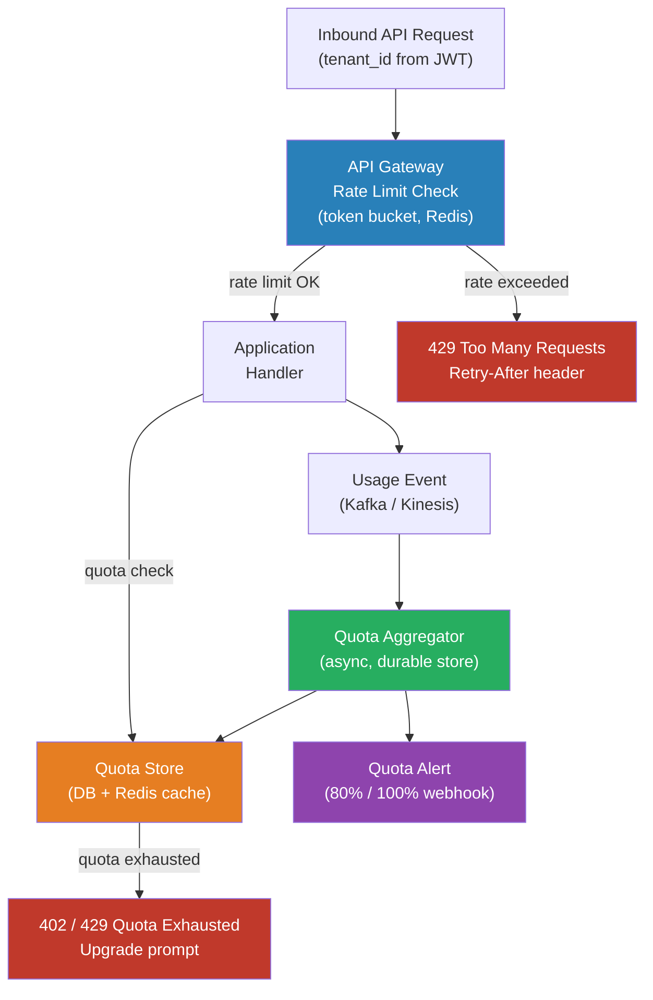

# [BEE-402] Tenant-Aware Rate Limiting and Quotas

:::info
Tenant-aware rate limiting and quotas are the mechanisms that bound how much of a shared system any single tenant can consume — protecting other tenants from noisy neighbors, enforcing commercial plan limits, and giving the system a well-defined load ceiling to design against.
:::

## Context

In a shared multi-tenant system, any tenant can become a noisy neighbor: a bulk import job, a misconfigured client making retry loops, or a suddenly viral product can consume disproportionate resources and degrade the experience of every other tenant on the same infrastructure. Uncontrolled tenant load is also unpredictable at the system level — you cannot capacity-plan or set SLOs for a service that has no ceiling on what any given request burst looks like.

Rate limiting and quotas are distinct mechanisms that operate on different time horizons. **Rate limiting** (throttling) is a short-window constraint: it bounds requests per second or per minute. A 429 Too Many Requests response tells the client it is sending too fast right now, and to back off for a short period. **Quotas** are cumulative constraints over longer periods: a tenant on the Standard plan may make up to 1,000,000 API calls per month. A 402 or 429 response after a quota is exhausted tells the client it has consumed its allocation for the period, not just that it is sending too fast.

Amazon's builders library article "Fairness in Multi-Tenant Systems" defines the goal precisely: every client in a multi-tenant system should receive a single-tenant experience. Their approach is to apply rate-based admission control that prioritizes traffic within planned usage levels and applies backpressure to spikes — returning HTTP 503 fast (load shedding) rather than queuing indefinitely, so that downstream services are not overwhelmed and Auto Scaling has time to respond.

The two most common algorithms for rate limiting are:

**Token bucket**: Each tenant has a bucket with a maximum capacity of `N` tokens. Tokens refill at a fixed rate `r`. Each request consumes one token (or more, for expensive operations). If the bucket is empty, the request is rejected (hard limit) or queued. The bucket model allows bursting up to the bucket size while maintaining a long-run throughput cap. This is the algorithm underlying most API rate limiting in practice — including the limits used by AWS API Gateway.

**Sliding window**: A log of request timestamps is maintained per tenant for the last `W` seconds. Requests in the window are counted; if the count exceeds the limit, the request is rejected. The sliding window eliminates the edge case in fixed-window counting where a tenant can send `2×limit` requests by sending `limit` at the end of one window and `limit` at the start of the next. Redis sorted sets are a common implementation substrate: timestamps as scores, with `ZRANGEBYSCORE` and `ZREMRANGEBYSCORE` to count and expire entries atomically.

## Design Thinking

**Rate limits vs. quotas require different enforcement architectures.** Rate limits (per-second, per-minute) need sub-millisecond enforcement at the request path — typically a Redis-backed counter checked in-process or at the API gateway layer. Monthly quotas can tolerate seconds of latency in enforcement updates because a one-second lag in a monthly counter does not meaningfully change the tenant's consumed allocation. Quotas are often stored in a billing database and updated asynchronously from a usage event stream.

**Soft limits vs. hard limits** is a commercial decision as much as a technical one. Hard limits block requests immediately when the quota is exhausted — appropriate for self-service plans where the user controls their own upgrade. Soft limits allow consumption to continue past the quota boundary, recording overage that is billed at a higher per-unit rate or reconciled at period end — appropriate for enterprise contracts where service interruption is unacceptable and the customer has agreed to overage terms. The limit type should be configurable per tenant, not hard-coded in enforcement logic.

**Quota dimensions** should reflect the actual cost drivers of the system, not just request counts. A system where all requests are equal in cost can use a simple requests/month quota. A system with expensive write operations, storage-backed queries, or heavy compute paths needs multi-dimensional quotas: requests/second, storage-GB, compute-seconds, egress-bytes. Tenants who are light API users but heavy storage users should hit storage quotas, not request quotas.

**Informing tenants proactively** is a usability and commercial obligation. A client that hits 429 with no prior warning will retry blindly, often making the problem worse. Expose quota usage in every API response via headers (`X-RateLimit-Limit`, `X-RateLimit-Remaining`, `X-RateLimit-Reset`). Send email or webhook notifications when tenants reach 80% and 100% of their quota, so they can upgrade or adjust their usage patterns before hard limits interrupt them.

## Best Practices

Engineers MUST apply rate limits at the tenant identity level, not at the IP address or user level alone. IP-level rate limiting punishes tenants who share egress IPs (NAT, corporate proxies) and does not prevent a single tenant from consuming disproportionate backend resources through many users. Tenant-level limits enforce the commercial allocation.

Engineers MUST return standard HTTP response codes: 429 Too Many Requests for rate limit violations, with a `Retry-After` header indicating when the client may retry. Include the quota limit, current usage, and reset time in response headers or body so client developers can implement proper backoff without guesswork.

Engineers SHOULD implement rate limiting at the API gateway or reverse proxy layer, not only in application code. Enforcement in application code still consumes a worker thread for each rejected request. Gateway-layer enforcement drops excess requests before they reach application instances, protecting the service from overload even when the rate of rejected requests is high.

Engineers MUST NOT share a single global rate limit counter across all tenants. A noisy tenant exhausting a global counter blocks all other tenants. Maintain per-tenant counters keyed by tenant ID.

Engineers SHOULD differentiate limits by tenant tier. A free-tier tenant typically has lower per-minute and per-month limits than a paid or enterprise tenant. Limits are part of the product, not just an infrastructure concern — they must be modeled alongside the pricing plan.

Engineers SHOULD use token buckets for request-rate enforcement and sliding windows for accuracy-sensitive quota tracking. Token buckets are computationally cheaper and handle bursty legitimate traffic gracefully. Sliding windows are more accurate but require maintaining per-tenant log structures.

Engineers MUST persist quota consumption durably (a database, not only in-memory cache) for any quota that affects billing or contractual obligations. In-memory quota counters are lost on pod restart, leaving tenants with incorrectly restored headroom. Cache the current quota value in Redis for low-latency enforcement, but write confirmed usage to a durable store asynchronously.

Engineers SHOULD decouple metering (counting usage events) from enforcement (blocking requests that exceed limits). A metering pipeline that writes usage events to a stream (Kafka, Kinesis) and aggregates them asynchronously is far more reliable than synchronous counter increments on the hot path. Enforcement reads from the aggregated counter, which may be a few seconds stale — an acceptable trade-off for monthly quotas, not for per-second rate limits.

Engineers MUST monitor per-tenant quota utilization as an operational metric. Tenants at 90%+ of their quota are likely to hit limits soon and either churn or need an upgrade conversation. Tenants consistently at 0% utilization are not getting value from the plan. Both are business signals.

## Visual



## Example

**Token bucket per tenant in Redis (pseudocode):**

```
// Token bucket: refill tokens at rate r/sec, max capacity N.
// Each request consumes 1 token; expensive operations may consume more.

function allow_request(tenant_id, cost=1):
    key = "ratelimit:" + tenant_id
    now = current_time_ms()

    // Lua script executed atomically on Redis to avoid race conditions
    tokens, last_refill = redis.get(key + ":tokens", key + ":last_refill")

    if tokens is None:
        tokens = BUCKET_CAPACITY     // first request: full bucket
        last_refill = now

    elapsed_ms = now - last_refill
    refilled = elapsed_ms * REFILL_RATE_PER_MS
    tokens = min(BUCKET_CAPACITY, tokens + refilled)
    last_refill = now

    if tokens >= cost:
        tokens -= cost
        redis.set(key + ":tokens", tokens)
        redis.set(key + ":last_refill", last_refill)
        return ALLOW
    else:
        retry_after_ms = ceil((cost - tokens) / REFILL_RATE_PER_MS)
        return REJECT(retry_after_ms)
```

**Quota response headers (RFC 6585 / draft-ietf-httpapi-ratelimit-headers):**

```http
HTTP/1.1 200 OK
X-RateLimit-Limit: 1000        ; requests allowed per minute
X-RateLimit-Remaining: 342     ; tokens remaining in current window
X-RateLimit-Reset: 1713225600  ; Unix timestamp when window resets
X-Quota-Limit: 1000000         ; monthly quota
X-Quota-Used: 847293           ; consumed this period
X-Quota-Reset: 2026-05-01      ; quota period reset date
```

**Sliding window using Redis sorted set:**

```
// Sliding window: count requests in the last W seconds using a sorted set.
// Score = timestamp (ms), member = unique request ID.

function sliding_window_allow(tenant_id, window_ms, limit):
    key = "sw:" + tenant_id
    now = current_time_ms()
    window_start = now - window_ms

    // Atomic pipeline:
    redis.multi():
        redis.zremrangebyscore(key, 0, window_start)   // expire old entries
        redis.zadd(key, now, uuid())                   // record this request
        count = redis.zcard(key)                       // count in window
        redis.expire(key, window_ms / 1000 + 1)       // TTL cleanup
    redis.exec()

    if count > limit:
        return REJECT
    return ALLOW
```

## Related BEEs

- [BEE-18001](multi-tenancy-models.md) -- Multi-Tenancy Models: the deployment models that this quota enforcement protects
- [BEE-18002](tenant-isolation-strategies.md) -- Tenant Isolation Strategies: data isolation; quotas are the compute and API-access complement
- [BEE-12007](../resilience/rate-limiting-and-throttling.md) -- Rate Limiting and Throttling: general rate limiting concepts and algorithms; this article applies them specifically to multi-tenant contexts
- [BEE-8005](../transactions/idempotency-and-exactly-once-semantics.md) -- Idempotency and Exactly-Once Semantics: quota counters must be incremented exactly once per request, even under retries

## References

- [Fairness in multi-tenant systems -- Amazon Builders' Library](https://aws.amazon.com/builders-library/fairness-in-multi-tenant-systems/)
- [Throttling a tiered, multi-tenant REST API at scale using API Gateway -- AWS Architecture Blog](https://aws.amazon.com/blogs/architecture/throttling-a-tiered-multi-tenant-rest-api-at-scale-using-api-gateway-part-1/)
- [RateLimit Header Fields for HTTP -- IETF Draft (draft-ietf-httpapi-ratelimit-headers)](https://datatracker.ietf.org/doc/draft-ietf-httpapi-ratelimit-headers/)
- [Token Bucket vs Leaky Bucket: Rate Limiting Algorithms -- API7.ai](https://api7.ai/blog/token-bucket-vs-leaky-best-rate-limiting-algorithm)
- [Best Practices for API Rate Limits and Quotas -- Moesif](https://www.moesif.com/blog/technical/rate-limiting/Best-Practices-for-API-Rate-Limits-and-Quotas-With-Moesif-to-Avoid-Angry-Customers/)
